&emsp;&emsp;&emsp;&emsp;&emsp;&emsp;&emsp;&emsp;&emsp;&emsp;
&emsp;&emsp;&emsp;&emsp;&emsp;&emsp;&emsp;&emsp;&emsp;
[*:arrow_left: Main Page*](../) 
&emsp;&emsp; | &emsp;&emsp;
[*II. Data Preparation :arrow_right:*](../2_data_preparation/README.md)
#

# I. Data Analysis and Missing Data

The dataset includes 10 variables that capture various factors related to fires, land use, environmental conditions, and climate. It provides a spatial resolution of 500 meters, allowing a detailed analysis of the Amazon rainforest. These variables are measured on a monthly basis, covering the entire period from 2001 to 2020, and each variable contains a substantial monthly dataset, with around 26.8 million observations per month. Cumulatively, these variables yield an extensive dataset, totaling about 6.3 billion observations across all months.

## I.1. Missing Data
Dealing with missing data is a crucial part of our project. In the context of the *Burnt Area* variable, cells with a value of (-2) represent water. However, the status of these cells can change over time to indicate "No fire" (0) or "Fire" (1) in different months. In our analysis, we treat cells with a value of (-2) as missing data.

For the covariate *Land Surface Temperature*, missing data varies across months. We observed that 26 months had more than 1 million missing data points, with three months exceeding 2 million missing data points. February 2016 had the highest with 3.3 million missing data points. To visually understand these missing data patterns, you can refer to the plots for the months with the most significant gaps.</br>
The plot below represents the four months with the most missing data:

<p align="center">
  
</p>

In contrast, other covariates like *Precipitation*, *Soil Moisture*, *Specific Humidity*, *Evapotranspiration*, *Wind Speed*, and *Air Temperature* have consistent missing data patterns across all months. These covariates have missing data values mostly at the boundary of the map, and each month's missing data count is below 133,000. We decided to exclude cells with missing data in these covariates as they consistently lacked data throughout the entire study period.

The following table represents the count of missing data for each variable across the initial 10 months:

<p align="center">
  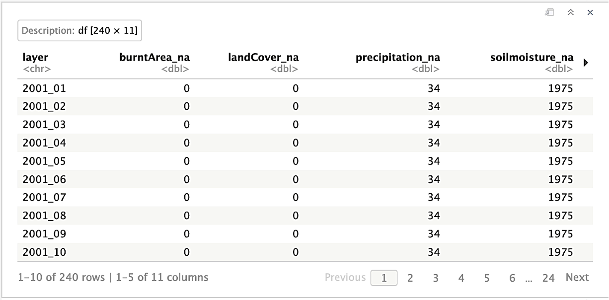
  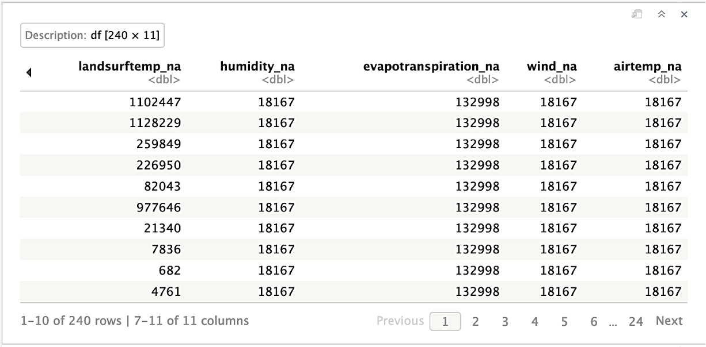
</p>

The missing data for each variable will be investigated and presented in the upcoming section [I.2. Data Analysis](./#i2-data-analysis).

## I.2. Data Analysis
Before looking for each variable, we import the Amazon shape file and initialize variables and functions to use them after for each variable:

<details>
    <summary>
      <em><code>Show/Hide code</code></em>
    </summary>

```r
#---- load libraries ----
library(tictoc)
library(tidyverse)
library(dplyr)
library(terra)
library(raster)
library(sf)
library(RColorBrewer)
library(scico)
library(tidyterra)
library(ggforce)
library(latex2exp)
library(rts)
library(doParallel)
library(parallel)
library(foreach)
library(data.table)

#---- Function to rename layers ----
renameLayers <- function(dataRast, fileStart, prefix){
  # index of file name in the path
  id.date <- unlist(gregexpr(fileStart, sources(dataRast)[[1]])) + nchar(fileStart)
  # rename layers
  names(dataRast) <- 
    substr(sources(dataRast), id.date, (id.date+50)) %>%
    gsub(".tif", "_1", .) %>%
    as.Date("%Y_%m_%d") %>%
    format(., '%Y_%m') %>%
    paste0(prefix, .)
  
  return(dataRast)
}

#---- Plot Function ----
myPlot <- function(
  rast, 
  title=NULL, 
  sub_title=NULL, 
  theme=2, 
  xy.limit = list(xmin=NULL, xmax=NULL, ymin=NULL, ymax=NULL),
  xy.zoom = list(xmin=NULL, xmax=NULL, ymin=NULL, ymax=NULL, zoom.size=NULL),
  max_cell=1e8,
  x_angle=0,
  b_size=16,
  na.color=NA,
  v_unit=c(2, 2, 2, 2) # c(t, r, b, l)
){
  p1 <- ggplot()
  p1 <- switch(
    theme,
    p1,
    p1 + theme_bw(base_size=b_size),
    p1 + theme_linedraw(base_size=b_size),
    p1 + theme_light(base_size=b_size),
    p1 + theme_minimal(base_size=b_size),
    p1 + theme_classic(base_size=b_size),
    p1 + theme_gray(base_size=b_size),
    p1 + theme_dark(base_size=b_size)
  )
  p1 <- p1  +
    geom_spatvector(data = amaz.basin.shp$geometry, fill = na.color, color = "gray40") +
    geom_spatraster(data = rast, maxcell = max_cell) +
    scale_x_continuous(limits = c(xy.limit$xmin, xy.limit$xmax), 
                       labels = function(x) format(x, scientific = T)) +
    scale_y_continuous(limits = c(xy.limit$ymin, xy.limit$ymax), 
                       labels = function(x) format(x, scientific = T)) +
    ggtitle(label=title, subtitle=sub_title) +
    coord_sf(datum = pull_crs(rast)) +
    theme(
      axis.text.x = element_text(angle = x_angle)
      , plot.margin = unit(v_unit, "pt")
    )
  
  if (!all(sapply(xy.zoom, is.null))) {
    p1 <- p1 + facet_zoom(xlim = c(xy.zoom$xmin, xy.zoom$xmax),
                          ylim = c(xy.zoom$ymin, xy.zoom$ymax), 
                          zoom.size=xy.zoom$zoom) 
  }
  
  if (theme == 1) {p1 <- p1 + theme_void(base_size=b_size)}

  return(p1)
}

#---- Initialization ----
# Create a sequence date
seq.dates <- seq(as.Date("2001-1-1"), as.Date("2020-12-1"), by = "month")
# Create name of layers
ordered.names <- format(seq.dates, '%Y_%m')
# Import shape file
amaz.basin.shp <- st_read(
  paste0(path.data,"/0. Amazon_shapefile/projected/amazon_shp_projected.shp"))
```
</details>

```
    Simple feature collection with 1 feature and 6 fields
    Geometry type: MULTIPOLYGON
    Dimension:     XY
    Bounding box:  xmin: -2156811 ymin: 1625314 xmax: 1745999 ymax: 4555427
    Projected CRS: South_America_Albers_Equal_Area_Conic
    ID     AREA PERIMETER FORMA POLYAREA     AREAPROJ                       geometry
    1  0 548.0098   241.442  <NA>  6725344 6.725344e+12 MULTIPOLYGON (((-2028457 35...
```

### I.2.1. Burnt Area

#### I.2.1.1. Data Analysis

>_Burnt Area_ Represents the extent of burned areas in the Amazon rainforest, categorized as burnt (1), unburnt (0), missing (-1), or water (-2).

##### *Import data*

<details>
    <summary>
      <em><code>Show/Hide code</code></em>
    </summary>

```r
# list of files
amaz.burntArea.list <- list.files(
  paste0(path.data,"/1. Burnt Area/03. Working Data"),
  full.names=TRUE,
  pattern = ".tif$")
# Import data with "Terra"
burntArea.rast <- rast(amaz.burntArea.list)
burntArea.rast
```
</details>

```
    class       : SpatRaster 
    dimensions  : 5860, 7806, 240  (nrow, ncol, nlyr)
    resolution  : 500, 500  (x, y)
    extent      : -2156811, 1746189, 1625314, 4555314  (xmin, xmax, ymin, ymax)
    coord. ref. : South_America_Albers_Equal_Area_Conic 
    sources     : burntarea_working_2001_1.tif  
                burntarea_working_2001_10.tif  
                burntarea_working_2001_11.tif  
                ... and 237 more source(s)
    names       : fire_~_proj, fire_~_proj, fire_~_proj, fire_~_proj, fire_~_proj, fire_~_proj, ... 
    min values  :          -2,          -2,          -2,          -2,          -2,          -2, ... 
    max values  :           1,           1,           1,           1,           1,           1, ...
```

##### *Rename layers*

<details>
    <summary>
      <em><code>Show/Hide code</code></em>
    </summary>

```r
# Rename layers
burntArea.rast <- renameLayers(burntArea.rast, 'burntarea_working_', '')
burntArea.rast
```
</details>

```
    class       : SpatRaster 
    dimensions  : 5860, 7806, 240  (nrow, ncol, nlyr)
    resolution  : 500, 500  (x, y)
    extent      : -2156811, 1746189, 1625314, 4555314  (xmin, xmax, ymin, ymax)
    coord. ref. : South_America_Albers_Equal_Area_Conic 
    sources     : burntarea_working_2001_1.tif  
                burntarea_working_2001_10.tif  
                burntarea_working_2001_11.tif  
                ... and 237 more source(s)
    names       : 2001_01, 2001_10, 2001_11, 2001_12, 2001_02, 2001_03, ... 
    min values  :      -2,      -2,      -2,      -2,      -2,      -2, ... 
    max values  :       1,       1,       1,       1,       1,       1, ... 
```

##### *Order layers*

<details>
    <summary>
      <em><code>Show/Hide code</code></em>
    </summary>

```r
# Order layers
burntArea.rast <- burntArea.rast[[ordered.names]]
burntArea.rast
```
</details>

```
    class       : SpatRaster 
    dimensions  : 5860, 7806, 240  (nrow, ncol, nlyr)
    resolution  : 500, 500  (x, y)
    extent      : -2156811, 1746189, 1625314, 4555314  (xmin, xmax, ymin, ymax)
    coord. ref. : South_America_Albers_Equal_Area_Conic 
    sources     : burntarea_working_2001_1.tif  
                burntarea_working_2001_2.tif  
                burntarea_working_2001_3.tif  
                ... and 237 more source(s)
    names       : 2001_01, 2001_02, 2001_03, 2001_04, 2001_05, 2001_06, ... 
    min values  :      -2,      -2,      -2,      -2,      -2,      -2, ... 
    max values  :       1,       1,       1,       1,       1,       1, ... 
```

##### *Verification of the values*

<details>
    <summary>
      <em><code>Show/Hide code</code></em>
    </summary>

```r
# Verification of the values
burntArea.minmax <- minmax(burntArea.rast) %>% t() %>% as.data.frame()
burntArea.minmax[which((burntArea.minmax[,1] != -2) & (burntArea.minmax[,2] != 1)),]
```
</details>


<p align="center">
  
</p>

##### *Plot of the month of October 2020*

<details>
    <summary>
      <em><code>Show/Hide code</code></em>
    </summary>

```r
# Create the `rts` object
burntArea.rts <- rts(burntArea.rast, seq.dates)
# Upplaying the mask to plot only the amazon area.
ba <- burntArea.rts[['2020-10-01']] %>% mask(mask = amaz.basin.shp)
# Change values as categorical 
levels(ba) <- data.frame(id=c(-2, 0, 1), val=c('-2', '0', '1'))
# Plot
my.colors <- c("mediumblue", "mediumseagreen", "firebrick")
p.ba <- myPlot(ba, title = "Burnt Area") +
  scale_fill_manual(
    name = NULL, 
    values = my.colors, 
    na.translate=FALSE
  ) 
p.ba
```
</details>

<p align="center">
  
</p>

<details>
    <summary>
      <em><code>Show/Hide code</code></em>
    </summary>

```r
# Convert the raster object to a datatable
ba.dt <- as.data.table(ba, cell=T, xy=T)
# Plot
ggplot(data = ba.dt, aes(x = val)) + 
  geom_bar(stat = "count", aes(fill = val), position = "dodge") + 
  labs(title="Burnt Area in October 2020", x="Burnt Area") +
  coord_flip() + 
  scale_fill_manual(name = "Burnt Area", values = my.colors) +
  stat_count(geom = "text", 
             aes(label = ..count..),
             position=position_stack(vjust=0.5),
             colour = "black", size = 3.5) + 
  theme_bw(base_size=16)
```
</details>

<p align="center">
  
</p>

##### *Percentage of fires*

<details>
    <summary>
      <em><code>Show/Hide code</code></em>
    </summary>

```r
freq.dt <- matrix(nrow = 0, ncol = 3) %>% as.data.table()
colnames(freq.dt) <- c("layer", "0", "1")
for (ras_id in amaz.burntArea.list){
  cat("\n", ras_id)
  ras <- rast(ras_id) %>%
    renameLayers(., 'burntarea_working_', '') %>%
    mask(mask = amaz.basin.shp)
 
  # Replace -2 and -1 value by `NA`
  ras[ras %in% c(-2, -1)] <- NA
  ras.freq <- freq(ras, digits=0, usenames=T) %>% as.data.table()
  tmp <- dcast(ras.freq,layer ~ value,value.var = c("count"))
  freq.dt <- rbind(freq.dt, tmp)
}
percentage.fires <- sum(freq.dt[, '1']) / sum(freq.dt[, c('0', '1')])
percentage.fires
```
</details>

```
  [1] 0.00089637
```

#### I.2.1.2. Missing Data

<details>
    <summary>
      <em><code>Show/Hide code</code></em>
    </summary>

```r
cl <- makeCluster(detectCores() - 1)
registerDoParallel(cl, cores=detectCores() - 1)

# Raster to datatable in parallel: one raster per thread
rasList <- foreach (
  ras_id=amaz.burntArea.list, 
  .packages=c('terra', 'sf', 'dplyr'), 
  .combine='c') %dopar% {
    # Read and rename raster
    ras <- rast(ras_id) %>% renameLayers(., 'burntarea_working_', '')
    # Replace negative value by `NA`
    if (names(ras) %in% c("2012_07", "2012_09")) {ras[ras == -1] <- NA}
    # Count the missing data
    ras.freq.na <- not.na(ras) %>%
      mask(amaz.basin.shp) %>%
      terra::freq(., digits=0, value=0, usenames=T)
  
    list(ras.freq.na)
  }
stopCluster(cl)

# Bind all per-raster into one dataframe
burntArea.freq.na <- rbindlist(rasList, fill=T, use.names=T)
# Order
colnames(burntArea.freq.na)[3] <- "burntArea_na"
burntArea.freq.na <- burntArea.freq.na[order(burntArea.freq.na$layer)]
burntArea.freq.na
```
</details>

<p align="center">
  
  
</p>

### I.2.2. Land Cover

#### I.2.2.1. Data Analysis

>_Land Cover_ is a categorical variable with 11 classes, providing information on different land cover types such as water, urban, forest, grassland, and more.

##### *Import data*

<details>
    <summary>
      <em><code>Show/Hide code</code></em>
    </summary>

```r
# list of files
amaz.landCover.list <- list.files(
  paste0(path.data,"/2. Land Cover/03. Working Data"),
  full.names=TRUE,
  pattern = ".tif$")
# Import data with "Terra"
landCover.rast <- rast(amaz.landCover.list)
landCover.rast
```
</details>

```
    class       : SpatRaster 
    dimensions  : 5860, 7806, 240  (nrow, ncol, nlyr)
    resolution  : 500, 500  (x, y)
    extent      : -2156811, 1746189, 1625314, 4555314  (xmin, xmax, ymin, ymax)
    coord. ref. : South_America_Albers_Equal_Area_Conic 
    sources     : landcover_working_2001_1.tif  
                landcover_working_2001_10.tif  
                landcover_working_2001_11.tif  
                ... and 237 more source(s)
    names       : lulc_~_proj, lulc_~_proj, lulc_~_proj, lulc_~_proj, lulc_~_proj, lulc_~_proj, ... 
    min values  :           0,           0,           0,           0,           0,           0, ... 
    max values  :          10,          10,          10,          10,          10,          10, ...
```

##### *Rename and order layers*

<details>
    <summary>
      <em><code>Show/Hide code</code></em>
    </summary>

```r
# Rename layers
landCover.rast <- renameLayers(landCover.rast, 'landcover_working_', '')
# Order layers
landCover.rast <- landCover.rast[[ordered.names]]
landCover.rast
```
</details>

```
    class       : SpatRaster 
    dimensions  : 5860, 7806, 240  (nrow, ncol, nlyr)
    resolution  : 500, 500  (x, y)
    extent      : -2156811, 1746189, 1625314, 4555314  (xmin, xmax, ymin, ymax)
    coord. ref. : South_America_Albers_Equal_Area_Conic 
    sources     : landcover_working_2001_1.tif  
                landcover_working_2001_2.tif  
                landcover_working_2001_3.tif  
                ... and 237 more source(s)
    names       : 2001_01, 2001_02, 2001_03, 2001_04, 2001_05, 2001_06, ... 
    min values  :       0,       0,       0,       0,       0,       0, ... 
    max values  :      10,      10,      10,      10,      10,      10, ... 
```

##### *Verification of the values*

<details>
    <summary>
      <em><code>Show/Hide code</code></em>
    </summary>

```r
# Verification of the values
landCover.minmax <- minmax(landCover.rast) %>% t() %>% as.data.frame()
landCover.minmax[
  which((!landCover.minmax[,1] %in% c(0:10)) & (!landCover.minmax[,2] %in% c(0:10))),]
```
</details>

<p align="center">
  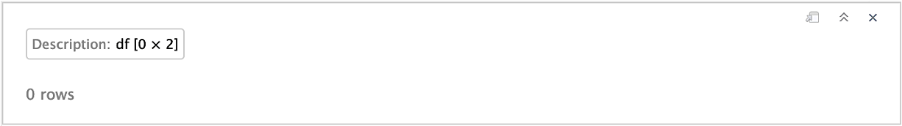
</p>

##### *Plot of the month of October 2020*

<details>
    <summary>
      <em><code>Show/Hide code</code></em>
    </summary>

```r
# Create the `rts` object
landCover.rts <- rts(landCover.rast, seq.dates)
# Applying the mask to plot only the amazon area.
lc <- landCover.rts[['2020-10-01']] %>% mask(mask = amaz.basin.shp)  
# Change values as categorical 
levels(lc) <- data.frame(id=0:10, val=as.character(c(0:10)))
# Plot
p.lc <- myPlot(lc, title = "Land Cover") + 
  scale_fill_hypso_d(
    name = NULL,
    palette = "colombia_hypso", 
    na.translate=FALSE)
p.lc
```
</details>

<p align="center">
  
</p>

#### I.2.2.2. Missing Data

<details>
    <summary>
      <em><code>Show/Hide code</code></em>
    </summary>

```r
cl <- makeCluster(detectCores() - 1)
registerDoParallel(cl, cores=detectCores() - 1)

# Raster to datatable in parallel: one raster per thread
rasList <- foreach (
  ras_id=amaz.landCover.list, 
  .packages=c('terra', 'sf', 'dplyr'), 
  .combine='c') %dopar% {
    # Read and rename raster
    ras <- rast(ras_id) %>% renameLayers(., 'landcover_working_', '')
    # Count the missing data
    ras.freq.na <- not.na(ras) %>%
      mask(amaz.basin.shp) %>%
      terra::freq(., digits=0, value=0, usenames=T)
  
    list(ras.freq.na)
  }
stopCluster(cl)

# Bind all per-raster into one dataframe
landCover.freq.na <- rbindlist(rasList, fill=T, use.names=T)
# Order
colnames(landCover.freq.na)[3] <- "landCover_na"
landCover.freq.na <- landCover.freq.na[order(landCover.freq.na$layer)]
landCover.freq.na
```
</details>

<p align="center">
  
</p>

### I.2.3. Precipitation

#### I.2.3.1. Data Analysis

>_Precipitation_ is measured in millimeters per hour, with a range between 0 and 3300.

##### *Import data*

<details>
    <summary>
      <em><code>Show/Hide code</code></em>
    </summary>

```r
# list of files
amaz.precipitation.list <- list.files(
  paste0(path.data,"/3. Precipitation/03. Working Data"),
  full.names=TRUE,
  pattern = ".tif$")
# Import data with "Terra"
precipitation.rast <- rast(amaz.precipitation.list)
precipitation.rast
```
</details>

```
    class       : SpatRaster 
    dimensions  : 5860, 7806, 240  (nrow, ncol, nlyr)
    resolution  : 500, 500  (x, y)
    extent      : -2156811, 1746189, 1625314, 4555314  (xmin, xmax, ymin, ymax)
    coord. ref. : South_America_Albers_Equal_Area_Conic 
    sources     : precipitation_working_2001_1.tif  
                precipitation_working_2001_10.tif  
                precipitation_working_2001_11.tif  
                ... and 237 more source(s)
    names       : prec_~_proj, prec_~_proj, prec_~_proj, prec_~_proj, prec_~_proj, prec_~_proj, ... 
    min values  :           0,           0,           0,           0,           0,           0, ... 
    max values  :        1461,        1735,        1828,        1934,        1433,        1390, ...
```

##### *Rename and order layers*

<details>
    <summary>
      <em><code>Show/Hide code</code></em>
    </summary>

```r
# Rename layers
precipitation.rast <- renameLayers(precipitation.rast, 'precipitation_working_', '')
# Order layers
precipitation.rast <- precipitation.rast[[ordered.names]]
precipitation.rast
```
</details>

```
    class       : SpatRaster 
    dimensions  : 5860, 7806, 240  (nrow, ncol, nlyr)
    resolution  : 500, 500  (x, y)
    extent      : -2156811, 1746189, 1625314, 4555314  (xmin, xmax, ymin, ymax)
    coord. ref. : South_America_Albers_Equal_Area_Conic 
    sources     : precipitation_working_2001_1.tif  
                precipitation_working_2001_2.tif  
                precipitation_working_2001_3.tif  
                ... and 237 more source(s)
    names       : 2001_01, 2001_02, 2001_03, 2001_04, 2001_05, 2001_06, ... 
    min values  :       0,       0,       0,       0,       0,       0, ... 
    max values  :    1461,    1433,    1390,    1096,    1678,    1706, ... 
```

##### *Verification of the values*

<details>
    <summary>
      <em><code>Show/Hide code</code></em>
    </summary>

```r
# Verification of the values
precipitation.minmax <- minmax(precipitation.rast) %>% t() %>% as.data.frame()
precipitation.minmax
```
</details>

<p align="center">
  
</p>

##### *Plot of the month of October 2020*

<details>
    <summary>
      <em><code>Show/Hide code</code></em>
    </summary>

```r
# Create a sequence date for 'rts' object
precipitation.rts <- rts(precipitation.rast, seq.dates)
# Applying the mask to plot only the amazon area.
prec <- precipitation.rts[['2020-10-01']] %>% mask(mask = amaz.basin.shp)
# Plot
p.prec <- myPlot(prec, title = "Precipitation") + 
scale_fill_scico(
    name = TeX(r"($\textit{(mm/hr)}$)"),
    palette = "lapaz", 
    direction = -1,
    trans = "pseudo_log",
    breaks = c(0,10,50,200,550),
    na.value = "transparent")
p.prec
```
</details>

<p align="center">
  
</p>

#### I.2.3.2. Missing Data

<details>
    <summary>
      <em><code>Show/Hide code</code></em>
    </summary>

```r
cl <- makeCluster(detectCores() - 1)
registerDoParallel(cl, cores=detectCores() - 1)

# Raster to datatable in parallel: one raster per thread
rasList <- foreach (
  ras_id=amaz.precipitation.list, 
  .packages=c('terra', 'sf', 'dplyr'), 
  .combine='c') %dopar% {
    # Read and rename raster
    ras <- rast(ras_id) %>% renameLayers(., 'precipitation_working_', '')
    # Count the missing data
    ras.freq.na <- not.na(ras) %>%
      mask(amaz.basin.shp) %>%
      terra::freq(., digits=0, value=0, usenames=T)
  
    list(ras.freq.na)
  }
stopCluster(cl)

# Bind all per-raster into one dataframe
precipitation.freq.na <- rbindlist(rasList, fill=T, use.names=T)
# Order
colnames(precipitation.freq.na)[3] <- "precipitation_na"
precipitation.freq.na <- precipitation.freq.na[order(precipitation.freq.na$layer)]
precipitation.freq.na
```
</details>

<p align="center">
  
</p>

##### *Plot of missing data*

<details>
    <summary>
      <em><code>Show/Hide code</code></em>
    </summary>

```r
# Applying the mask to plot only the amazon area.
prec <- precipitation.rts[['2020-10-01']] %>% mask(mask = amaz.basin.shp)
# define the zoom area
prec.xy.zoom <- list(xmin=-0.385e+06, xmax=-0.37e+06, ymin=ymin(prec), ymax=1.64e+06, zoom=0.4)
# Plot
p.prec.na <- myPlot(
  prec, title = "Precipitation", 
  max_cell=1e7,
  x_angle=90,
  b_size=12,
  na.color="black",
  xy.zoom = prec.xy.zoom
) + 
  scale_fill_scico(
    name = TeX(r"($\textit{(mm/hr)}$)"),
    palette = "lapaz", 
    direction = -1,
    trans = "pseudo_log",
    breaks = c(0,10,50,200,550),
    na.value = "transparent")
p.prec.na
```
</details>

<p align="center">
  
</p>

### I.2.4. Soil Moisture

#### I.2.4.1. Data Analysis

>_Soil Moisture_ is measured in millimeters, with missing values marked as -9.99e+08, and a range between 0 and 4291.

##### *Import data*

<details>
    <summary>
      <em><code>Show/Hide code</code></em>
    </summary>

```r
# list of files
amaz.soilMoisture.list <- list.files(
  paste0(path.data,"/4. Soil Moisture/03. Working Data"),
  full.names=TRUE,
  pattern = ".tif$")
# Import data with "Terra"
soilMoisture.rast <- rast(amaz.soilMoisture.list)
soilMoisture.rast
```
</details>


```
  class       : SpatRaster 
  dimensions  : 5860, 7806, 240  (nrow, ncol, nlyr)
  resolution  : 500, 500  (x, y)
  extent      : -2156811, 1746189, 1625314, 4555314  (xmin, xmax, ymin, ymax)
  coord. ref. : South_America_Albers_Equal_Area_Conic 
  sources     : soilmoisture_working_2001_1.tif  
                soilmoisture_working_2001_10.tif  
                soilmoisture_working_2001_11.tif  
                ... and 237 more source(s)
  names       :   soilm~_proj,   soilm~_proj,   soilm~_proj,   soilm~_proj,   soilm~_proj,   soilm~_proj, ... 
  min values  : -9.990000e+08, -9.990000e+08, -9.990000e+08, -9.990000e+08, -9.990000e+08, -9.990000e+08, ... 
  max values  :  1.076058e+03,  4.290171e+03,  7.905507e+02,  5.636223e+02,  7.509722e+02,  6.363759e+02, ... 
```

##### *Rename and order layers*

<details>
    <summary>
      <em><code>Show/Hide code</code></em>
    </summary>

```r
# Rename layers
soilMoisture.rast <- renameLayers(soilMoisture.rast, 'soilmoisture_working_', '')
# Order layers
soilMoisture.rast <- soilMoisture.rast[[ordered.names]]
soilMoisture.rast
```
</details>

```
  class       : SpatRaster 
  dimensions  : 5860, 7806, 240  (nrow, ncol, nlyr)
  resolution  : 500, 500  (x, y)
  extent      : -2156811, 1746189, 1625314, 4555314  (xmin, xmax, ymin, ymax)
  coord. ref. : South_America_Albers_Equal_Area_Conic 
  sources     : soilmoisture_working_2001_1.tif  
                soilmoisture_working_2001_2.tif  
                soilmoisture_working_2001_3.tif  
                ... and 237 more source(s)
  names       :       2001_01,       2001_02,       2001_03,       2001_04,       2001_05,       2001_06, ... 
  min values  : -9.990000e+08, -9.990000e+08, -9.990000e+08, -9.990000e+08, -9.990000e+08, -9.990000e+08, ... 
  max values  :  1.076058e+03,  7.509722e+02,  6.363759e+02,  7.215025e+02,  6.892701e+02,  5.409775e+02, ... 
```

##### *Verification of the values*

<details>
    <summary>
      <em><code>Show/Hide code</code></em>
    </summary>

```r
# Verification of the values
soilMoisture.minmax <- minmax(soilMoisture.rast) %>% t() %>% as.data.frame()
soilMoisture.minmax
```
</details>

<p align="center">
  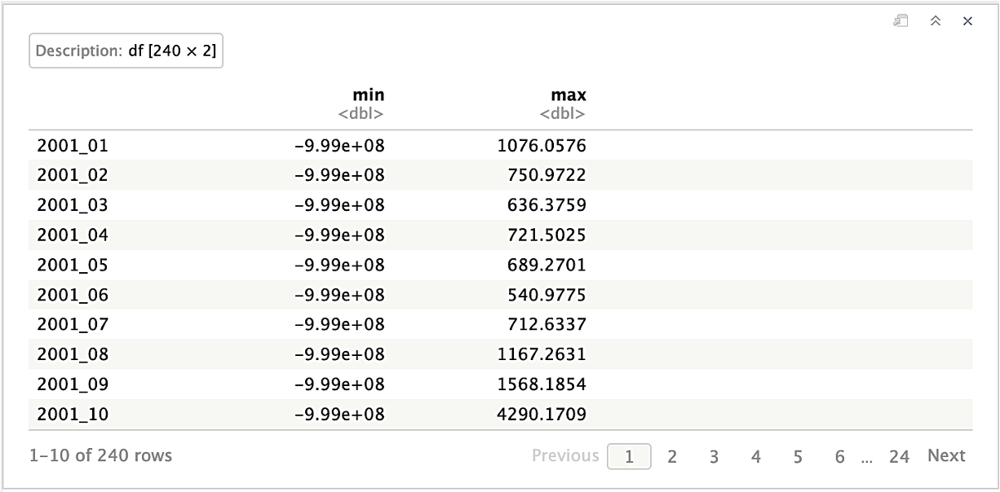
</p>

<details>
    <summary>
      <em><code>Show/Hide code</code></em>
    </summary>

```r
soilMoisture.freq <- freq(soilMoisture.rast, digits=3, usenames=T)
soilMoisture.freq[soilMoisture.freq$value < 0,]
```
</details>

<p align="center">
  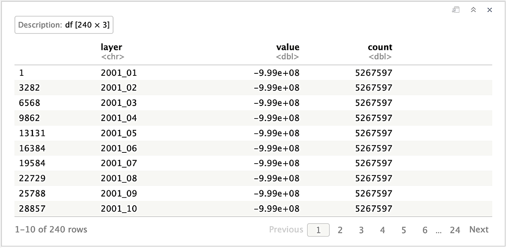
</p>

<details>
    <summary>
      <em><code>Show/Hide code</code></em>
    </summary>

```r
# Create the `rts` object
soilMoisture.rts <- rts(soilMoisture.rast, seq.dates)
# Applying the mask to plot only the amazon area.
soilm <- soilMoisture.rts[['2020-10-01']] %>% mask(mask = amaz.basin.shp)
# define the zoom area
soilm.xy.zoom <- list(xmin=0.15e+06, xmax=0.2e+06, ymin=4.35e+06, ymax=4.5e+06, zoom=0.4)
# Plot
p.soilm.na <- myPlot(
  soilm, title = "Soil Moisture", 
  max_cell=1e7,
  x_angle=90,
  b_size=12,
  xy.zoom = soilm.xy.zoom
) + 
  scale_fill_hypso_c(
    name = TeX(r"($\textit{(mm)$})"),
    palette = "wiki-schwarzwald-cont", 
    na.value = "transparent")
p.soilm.na
```
</details>

<p align="center">
  
</p>

##### *Plot of the month of October 2020*

<details>
    <summary>
      <em><code>Show/Hide code</code></em>
    </summary>

```r
# Remove negative values.
soilm[soilm < 0] <- NA
# Plot
p.soilm <- myPlot(soilm, title = "Soil Moisture") + 
  scale_fill_hypso_c(
    name = TeX(r"($\textit{(mm)$})"),
    palette = "wiki-schwarzwald-cont", 
    na.value = "transparent")
p.soilm
```
</details>

<p align="center">
  
</p>

#### I.2.4.2. Missing Data

<details>
    <summary>
      <em><code>Show/Hide code</code></em>
    </summary>

```r
cl <- makeCluster(detectCores() - 1)
registerDoParallel(cl, cores=detectCores() - 1)

# Raster to datatable in parallel: one raster per thread
rasList <- foreach (
  ras_id=amaz.soilMoisture.list, 
  .packages=c('terra', 'sf', 'dplyr'), 
  .combine='c') %dopar% {
    # Read and rename raster
    ras <- rast(ras_id) %>% renameLayers(., 'soilmoisture_working_', '')
    # Replace negative value by `NA`
    ras[ras < 0] <- NA
    # Count the missing data
    ras.freq.na <- not.na(ras) %>%
      mask(amaz.basin.shp) %>%
      terra::freq(., digits=0, value=0, usenames=T)
  
    list(ras.freq.na)
  }
stopCluster(cl)

# Bind all per-raster into one dataframe
soilmoisture.freq.na <- rbindlist(rasList, fill=T, use.names=T)
# Order
colnames(soilmoisture.freq.na)[3] <- "soilmoisture_na"
soilmoisture.freq.na <- soilmoisture.freq.na[order(soilmoisture.freq.na$layer)]
soilmoisture.freq.na
```
</details>

<p align="center">
  
</p>

##### *Plot of Missing Data*

<details>
    <summary>
      <em><code>Show/Hide code</code></em>
    </summary>

```r
# define the zoom area
soilm.xy.zoom <- list(xmin=0.15e+06, xmax=0.2e+06, ymin=4.35e+06, ymax=4.5e+06, zoom=0.4)
# Plot
p.soilm.na <- myPlot(
  soilm, title = "Soil Moisture", 
  max_cell=1e7,
  x_angle=90,
  b_size=12,
  na.color="black",
  xy.zoom = soilm.xy.zoom
) + 
  scale_fill_hypso_c(
    name = TeX(r"($\textit{(mm)$})"),
    palette = "wiki-schwarzwald-cont", 
    na.value = "transparent")
p.soilm.na
```
</details>

<p align="center">
  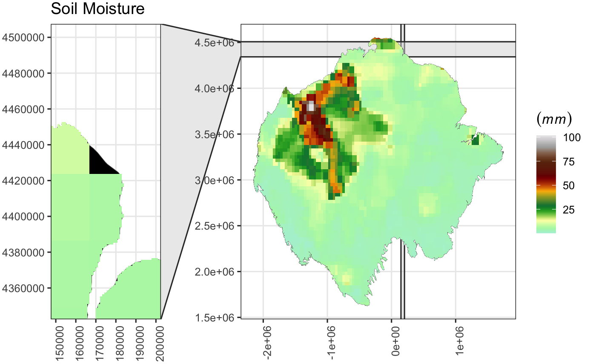
</p>

### I.2.5. Elevation

#### I.2.5.1. Data Analysis

>_Elevation_ is measured in meters, with a range between -85 and 6471.

##### *Import data*

<details>
    <summary>
      <em><code>Show/Hide code</code></em>
    </summary>

```r
# list of files
amaz.elevation.list <- list.files(
  paste0(path.data,"/5. Elevation/03. Working Data"),
  full.names=TRUE,
  pattern = ".tif$")
# Import data with "Terra"
elevation.rast <- rast(amaz.elevation.list)
elevation.rast
```
</details>

```
    class       : SpatRaster 
    dimensions  : 5860, 7806, 1  (nrow, ncol, nlyr)
    resolution  : 500, 500  (x, y)
    extent      : -2156811, 1746189, 1625314, 4555314  (xmin, xmax, ymin, ymax)
    coord. ref. : South_America_Albers_Equal_Area_Conic 
    source      : elevation_working.tif 
    name        : elevation_proj 
    min value   :          -85.5 
    max value   :         6470.5 
```

##### *Verification of the values*

<details>
    <summary>
      <em><code>Show/Hide code</code></em>
    </summary>

```r
# Verification of the values
elevation.minmax <- minmax(elevation.rast) %>% t() %>% as.data.frame()
elevation.minmax
```
</details>

<p align="center">
  
</p>

##### *Plot of the Elevation*

<details>
    <summary>
      <em><code>Show/Hide code</code></em>
    </summary>

```r
# Applying the mask to plot only the amazon area.
elev <- elevation.rast %>% mask(mask = amaz.basin.shp)
# Plot
wikicols <- hypsometric_tints_db %>% filter(pal == "wiki-2.0")
wikicols <- wikicols[wikicols$limit %between% c(-100, 6500),]
p.elev <- myPlot(elev, title = "Elevation") + 
  scale_fill_gradientn(
    name = TeX(r"($\textit{(m)}$)"),
    colors = wikicols$hex,
    values = scales::rescale(wikicols$limit),
    limit = range(wikicols$limit),
    na.value = "transparent")
p.elev
```
</details>

<p align="center">
  
</p>

#### I.2.5.2. Missing Data

<details>
    <summary>
      <em><code>Show/Hide code</code></em>
    </summary>

```r
# Count the missing data
elevation.nonNA <- not.na(elevation.rast)
elevation.nonNA.mask <- mask(elevation.nonNA, amaz.basin.shp)
elevation.freq.na <- freq(elevation.nonNA.mask, digits=0, value=0, usenames=T)
elevation.freq.na
```
</details>

<p align="center">
  
</p>

### I.2.6. Land Surface Temperature

#### I.2.6.1. Data Analysis

>_Land Surface Temperature_ is represented in Kelvin, with values adjusted by a scale factor of 0.02. Different months have varying missing data.

##### *Import data*

<details>
    <summary>
      <em><code>Show/Hide code</code></em>
    </summary>

```r
# list of files
amaz.landSurfaceTemp.list <- list.files(
  paste0(path.data,"/6. LandSurfaceTemp/03. Working Data"),
  full.names=TRUE,
  pattern = ".tif$")
# Import data with "Terra"
landSurfaceTemp.rast <- rast(amaz.landSurfaceTemp.list)
landSurfaceTemp.rast
```
</details>

```
    class       : SpatRaster 
    dimensions  : 5860, 7806, 240  (nrow, ncol, nlyr)
    resolution  : 500, 500  (x, y)
    extent      : -2156811, 1746189, 1625314, 4555314  (xmin, xmax, ymin, ymax)
    coord. ref. : South_America_Albers_Equal_Area_Conic 
    sources     : landsurftemp_working_2001_1.tif  
                landsurftemp_working_2001_10.tif  
                landsurftemp_working_2001_11.tif  
                ... and 237 more source(s)
    names       : Month~ature, Month~ature, Month~ature, Month~ature, Month~ature, Month~ature, ... 
    min values  :       13255,       13746,       13376,       13395,       12869,       13508, ... 
    max values  :       16387,       16415,       16356,       16434,       16432,       16455, ... 
```

##### *Rename and order layers*

<details>
    <summary>
      <em><code>Show/Hide code</code></em>
    </summary>

```r
# Rename layers
landSurfaceTemp.rast <- renameLayers(landSurfaceTemp.rast, 'landsurftemp_working_', '')
# Order layers
landSurfaceTemp.rast <- landSurfaceTemp.rast[[ordered.names]]
landSurfaceTemp.rast
```
</details>

```
    class       : SpatRaster 
    dimensions  : 5860, 7806, 240  (nrow, ncol, nlyr)
    resolution  : 500, 500  (x, y)
    extent      : -2156811, 1746189, 1625314, 4555314  (xmin, xmax, ymin, ymax)
    coord. ref. : South_America_Albers_Equal_Area_Conic 
    sources     : landsurftemp_working_2001_1.tif  
                landsurftemp_working_2001_2.tif  
                landsurftemp_working_2001_3.tif  
                ... and 237 more source(s)
    names       : 2001_01, 2001_02, 2001_03, 2001_04, 2001_05, 2001_06, ... 
    min values  :   13255,   12869,   13508,   13464,   13727,   13364, ... 
    max values  :   16387,   16432,   16455,   16223,   15990,   15897, ... 
```
##### *Verification of the values*

<details>
    <summary>
      <em><code>Show/Hide code</code></em>
    </summary>

```r
# Verification of the values
landSurfaceTemp.minmax <- minmax(landSurfaceTemp.rast) %>% t() %>% as.data.frame()
landSurfaceTemp.minmax
```
</details>

<p align="center">
  
</p>

##### *Plot of the month of October 2020*

<details>
    <summary>
      <em><code>Show/Hide code</code></em>
    </summary>

```r
# Create a sequence date for 'rts' object
landSurfaceTemp.rts <- rts(landSurfaceTemp.rast, seq.dates)
# Applying the mask to plot only the amazon area.
lst <- landSurfaceTemp.rts[['2020-10-01']] %>% mask(mask = amaz.basin.shp)
# Plot
p.lst <- myPlot(lst, title = "Land Surface Temperature") +
  scale_fill_whitebox_c(
    name = TeX(r"($\textit{(K)}$)"),
    palette = "muted", 
    na.value = "transparent")
p.lst
```
</details>

<p align="center">
  
</p>

#### I.2.6.2. Missing Data

<details>
    <summary>
      <em><code>Show/Hide code</code></em>
    </summary>

```r
cl <- makeCluster(detectCores() - 1)
registerDoParallel(cl, cores=detectCores() - 1)

# Raster to datatable in parallel: one raster per thread
rasList <- foreach (
  ras_id=amaz.landSurfaceTemp.list, 
  .packages=c('terra', 'sf', 'dplyr'), 
  .combine='c') %dopar% {
    # Read and rename raster
    ras <- rast(ras_id) %>% renameLayers(., 'landsurftemp_working_', '')
    # Count the missing data
    ras.freq.na <- not.na(ras) %>%
      mask(amaz.basin.shp) %>%
      terra::freq(., digits=0, value=0, usenames=T)
  
    list(ras.freq.na)
  }
stopCluster(cl)

# Bind all per-raster into one dataframe
landsurftemp.freq.na <- rbindlist(rasList, fill=T, use.names=T)
# Order
colnames(landsurftemp.freq.na)[3] <- "landsurftemp_na"
landsurftemp.freq.na <- landsurftemp.freq.na[
  order(landsurftemp.freq.na$landsurftemp_na, decreasing=TRUE)]
landsurftemp.freq.na
```
</details>

</details>

<p align="center">
  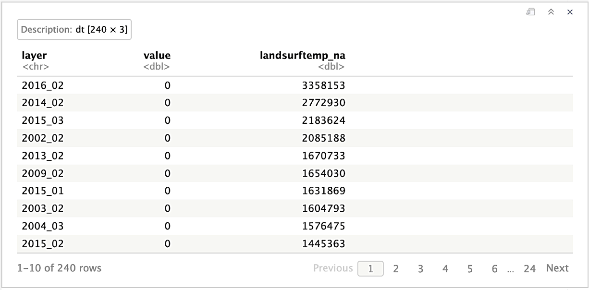
</p>

##### *Plot of Missing Data*

<details>
    <summary>
      <em><code>Show/Hide code</code></em>
    </summary>

```r
# Select the 4 months they have the most missing data
lst.4na <- landsurftemp.freq.na[1:4,]
lst.4na.month <- lst.4na$layer %>% paste0(., "_01") %>% gsub("_", "-", .)
lst.4na.rts <- subset(landSurfaceTemp.rts, lst.4na.month)
lst.4na.rast <- lst.4na.rts@raster %>% mask(mask = amaz.basin.shp) 
# Plot
p.lst.4na <- ggplot() +
  geom_spatvector(data = amaz.basin.shp$geometry, fill = "black", color = "gray40") +
  stat_spatraster(data = lst.4na.rast) +
  scale_x_continuous(labels = function(x) format(x, scientific = T, digits = 1)) +
  scale_y_continuous(labels = function(x) format(x, scientific = T, digits = 2)) + 
  ggtitle(label="Land Surface Temperature", subtitle=NULL) +
  coord_sf(datum = pull_crs(lst.4na.rast)) + 
  theme_bw(base_size=12) +
  scale_fill_whitebox_c(
    name = TeX(r"($\textit{(K)}$)"),
    palette = "muted", 
    na.value = "transparent") + 
  facet_wrap(~lyr, ncol = 2) +
  theme(axis.text.x = element_text(angle = 90))
p.lst.4na
```
</details>

<p align="center">
  
</p>

### I.2.7. Specific Humidity

#### I.2.7.1. Data Analysis

>_Specific Humidity_ is represented as kg/kg, indicating the ratio of kilograms of water (moisture) per kilogram of air. It ranges from 9.59e-04 to 2.15e-02.

##### *Import data*

<details>
    <summary>
      <em><code>Show/Hide code</code></em>
    </summary>

```r
# list of files
amaz.humidity.list <- list.files(
  paste0(path.data,"/7. Specific Humidity/03. Working Data"),
  full.names=TRUE,
  pattern = ".tif$")
# Import data with "Terra"
humidity.rast <- rast(amaz.humidity.list)
humidity.rast
```
</details>

```
    class       : SpatRaster 
    dimensions  : 5860, 7806, 240  (nrow, ncol, nlyr)
    resolution  : 500, 500  (x, y)
    extent      : -2156811, 1746189, 1625314, 4555314  (xmin, xmax, ymin, ymax)
    coord. ref. : South_America_Albers_Equal_Area_Conic 
    sources     : humidity_working_2001_1.tif  
                humidity_working_2001_10.tif  
                humidity_working_2001_11.tif  
                ... and 237 more source(s)
    names       : humid~_proj, humid~_proj, humid~_proj, humid~_proj, humid~_proj, humid~_proj, ... 
    min values  : 0.003805317, 0.002230128, 0.002613974,  0.00270508, 0.004156957, 0.004153194, ... 
    max values  : 0.018998224, 0.019306520, 0.019978305,  0.02033914, 0.018878255, 0.019174447, ...
```

##### *Rename and order layers*

<details>
    <summary>
      <em><code>Show/Hide code</code></em>
    </summary>

```r
# Rename layers
humidity.rast <- renameLayers(humidity.rast, 'humidity_working_', '')
# Order layers
humidity.rast <- humidity.rast[[ordered.names]]
humidity.rast
```
</details>

```
    class       : SpatRaster 
    dimensions  : 5860, 7806, 240  (nrow, ncol, nlyr)
    resolution  : 500, 500  (x, y)
    extent      : -2156811, 1746189, 1625314, 4555314  (xmin, xmax, ymin, ymax)
    coord. ref. : South_America_Albers_Equal_Area_Conic 
    sources     : humidity_working_2001_1.tif  
                humidity_working_2001_2.tif  
                humidity_working_2001_3.tif  
                ... and 237 more source(s)
    names       :     2001_01,     2001_02,     2001_03,     2001_04,     2001_05,     2001_06, ... 
    min values  : 0.003805317, 0.004156957, 0.004153194, 0.003362617, 0.002170095, 0.001819314, ... 
    max values  : 0.018998224, 0.018878255, 0.019174447, 0.020020029, 0.019958658, 0.019542987, ...
```

##### *Verification of the values*

<details>
    <summary>
      <em><code>Show/Hide code</code></em>
    </summary>

```r
# Verification of the values
humidity.minmax <- minmax(humidity.rast) %>% t() %>% as.data.frame()
humidity.minmax
```
</details>

<p align="center">
  
</p>

##### *Plot of the month of October 2020*

<details>
    <summary>
      <em><code>Show/Hide code</code></em>
    </summary>

```r
# Create a sequence date for 'rts' object
humidity.rts <- rts(humidity.rast, seq.dates)
# Applying the mask to plot only the amazon area.
hum <- humidity.rts[['2020-10-01']] %>% mask(mask = amaz.basin.shp)
# Plot
p.hum <- myPlot(hum, title = "Humidity") +
  scale_fill_cross_blended_c(
    name = TeX(r"($\textit{(kg_{water} / kg_{air})$})"),
    palette = "warm_humid", 
    na.value = "transparent")
p.hum
```
</details>

<p align="center">
  
</p>

#### I.2.7.2. Missing Data

<details>
    <summary>
      <em><code>Show/Hide code</code></em>
    </summary>

```r
cl <- makeCluster(detectCores() - 1)
registerDoParallel(cl, cores=detectCores() - 1)

# Raster to datatable in parallel: one raster per thread
rasList <- foreach (
  ras_id=amaz.humidity.list, 
  .packages=c('terra', 'sf', 'dplyr'), 
  .combine='c') %dopar% {
    # Read and rename raster
    ras <- rast(ras_id) %>% renameLayers(., 'humidity_working_', '')
    # Count the missing data
    ras.freq.na <- not.na(ras) %>%
      mask(amaz.basin.shp) %>%
      terra::freq(., digits=0, value=0, usenames=T)
  
    list(ras.freq.na)
  }
stopCluster(cl)

# Bind all per-raster into one dataframe
humidity.freq.na <- rbindlist(rasList, fill=T, use.names=T)
# Order
colnames(humidity.freq.na)[3] <- "humidity_na"
humidity.freq.na <- humidity.freq.na[order(humidity.freq.na$layer)]
humidity.freq.na
```
</details>

<p align="center">
  
</p>

##### *Plot of Missing Data*

<details>
    <summary>
      <em><code>Show/Hide code</code></em>
    </summary>

```r
# Applying the mask to plot only the amazon area.
hum <- humidity.rts[['2020-10-01']] %>% mask(mask = amaz.basin.shp)
# define the zoom area
hum.xy.zoom <- list(xmin=1.e+06, xmax=1.4e+06, ymin=3.4e+06, ymax=4e+06, zoom=0.4)
# Plot
p.hum.na <- myPlot(
  hum, title = "Humidity", 
  max_cell=1e7,
  x_angle=90,
  b_size=12,
  na.color="black",
  xy.zoom = hum.xy.zoom
) +
  scale_fill_cross_blended_c(
    name = TeX(r"($\textit{(kg_{water} / kg_{air})$})"),
    palette = "warm_humid", 
    na.value = "transparent")
p.hum.na
```
</details>

<p align="center">
  
</p>

### I.2.8. Evapotranspiration

#### I.2.8.1. Data Analysis

>_Evapotranspiration_ is measured in kg/m2s, with values ranging between -2.02e-07 and 9.69e-05.

##### *Import data*

<details>
    <summary>
      <em><code>Show/Hide code</code></em>
    </summary>

```r
# list of files
amaz.evapotranspiration.list <- list.files(
  paste0(path.data,"/8. Evapotranspiration/03. Working Data"),
  full.names=TRUE,
  pattern = ".tif$")
# Import data with "Terra"
evapotranspiration.rast <- rast(amaz.evapotranspiration.list)
evapotranspiration.rast
```
</details>

```
  class       : SpatRaster 
  dimensions  : 5860, 7806, 240  (nrow, ncol, nlyr)
  resolution  : 500, 500  (x, y)
  extent      : -2156811, 1746189, 1625314, 4555314  (xmin, xmax, ymin, ymax)
  coord. ref. : South_America_Albers_Equal_Area_Conic 
  sources     : evapotranspiration_working_2001_1.tif  
                evapotranspiration_working_2001_10.tif  
                evapotranspiration_working_2001_11.tif  
                ... and 237 more source(s)
  names       :  evapo~_proj,   evapo~_proj,   evapo~_proj,   evapo~_proj,   evapo~_proj,   evapo~_proj, ... 
  min values  : 0.000000e+00, -3.037881e-09, -1.953269e-08, -1.696159e-08, -3.509835e-08, -3.830653e-08, ... 
  max values  : 8.157189e-05,  8.477412e-05,  9.205872e-05,  7.918844e-05,  9.691325e-05,  8.340040e-05, ... 
```

##### *Rename and order layers*

<details>
    <summary>
      <em><code>Show/Hide code</code></em>
    </summary>

```r
# Rename layers
evapotranspiration.rast <- renameLayers(
  evapotranspiration.rast, 'evapotranspiration_working_', '')
# Order layers
evapotranspiration.rast <- evapotranspiration.rast[[ordered.names]]
evapotranspiration.rast
```
</details>

```
  class       : SpatRaster 
  dimensions  : 5860, 7806, 240  (nrow, ncol, nlyr)
  resolution  : 500, 500  (x, y)
  extent      : -2156811, 1746189, 1625314, 4555314  (xmin, xmax, ymin, ymax)
  coord. ref. : South_America_Albers_Equal_Area_Conic 
  sources     : evapotranspiration_working_2001_1.tif  
                evapotranspiration_working_2001_2.tif  
                evapotranspiration_working_2001_3.tif  
                ... and 237 more source(s)
  names       :      2001_01,       2001_02,       2001_03,       2001_04,       2001_05,       2001_06, ... 
  min values  : 0.000000e+00, -3.509835e-08, -3.830653e-08, -2.597946e-09, -1.043295e-08, -1.211072e-08, ... 
  max values  : 8.157189e-05,  9.691325e-05,  8.340040e-05,  7.563404e-05,  7.022559e-05,  8.013412e-05, ... 
```

##### *Verification of the values*

<details>
    <summary>
      <em><code>Show/Hide code</code></em>
    </summary>

```r
# Verification of the values
evapotranspiration.minmax <- minmax(evapotranspiration.rast) %>% 
  t() %>% 
  as.data.frame()
evapotranspiration.minmax
```
</details>

<p align="center">
  
</p>

##### *Plot of the month of October 2020*

<details>
    <summary>
      <em><code>Show/Hide code</code></em>
    </summary>

```r
# Create a sequence date for 'rts' object
evapotranspiration.rts <- rts(evapotranspiration.rast, seq.dates)
# Applying the mask to plot only the amazon area.
evapot <- evapotranspiration.rts[['2020-01-01']] %>% mask(mask = amaz.basin.shp)
# Plot
p.evapot <- myPlot(evapot, title = "Evapotranspiration") +
  scale_fill_whitebox_c(
    name = TeX(r"($\textit{(kg/m^2s)}$)"),
    palette = "bl_yl_rd", 
    na.value = "transparent")
p.evapot
```
</details>

<p align="center">
  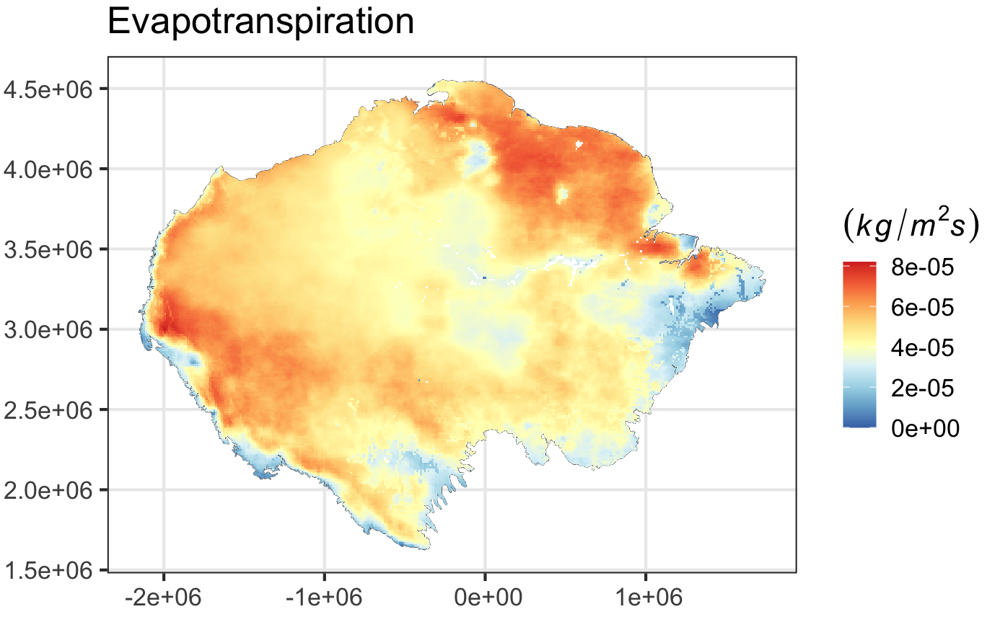
</p>

#### I.2.8.2. Missing Data

<details>
    <summary>
      <em><code>Show/Hide code</code></em>
    </summary>

```r
cl <- makeCluster(detectCores() - 1)
registerDoParallel(cl, cores=detectCores() - 1)

# Raster to datatable in parallel: one raster per thread
rasList <- foreach (
  ras_id=amaz.evapotranspiration.list, 
  .packages=c('terra', 'sf', 'dplyr'), 
  .combine='c') %dopar% {
    # Read and rename raster
    ras <- rast(ras_id) %>% renameLayers(., 'evapotranspiration_working_', '')
    # Count the missing data
    ras.freq.na <- not.na(ras) %>%
      mask(amaz.basin.shp) %>%
      terra::freq(., digits=0, value=0, usenames=T)
  
    list(ras.freq.na)
  }
stopCluster(cl)

# Bind all per-raster into one dataframe
evapotranspiration.freq.na <- rbindlist(rasList, fill=T, use.names=T)
#
colnames(evapotranspiration.freq.na)[3] <- "evapotranspiration_na"
evapotranspiration.freq.na <- 
  evapotranspiration.freq.na[order(evapotranspiration.freq.na$layer)]
evapotranspiration.freq.na
```
</details>

<p align="center">
  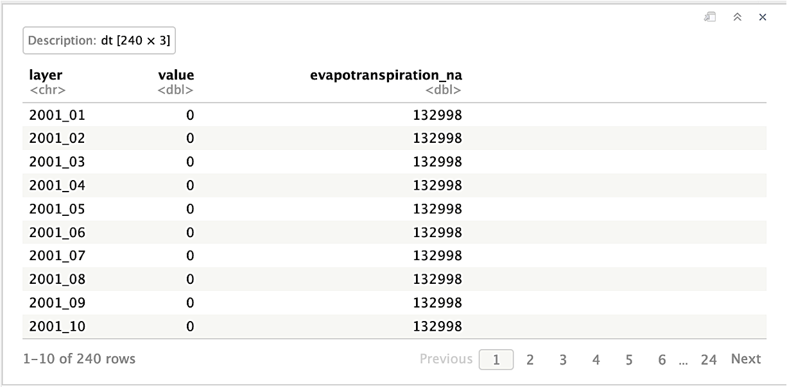
</p>

##### *Plot of Missing Data*

<details>
    <summary>
      <em><code>Show/Hide code</code></em>
    </summary>

```r
# Applying the mask to plot only the amazon area.
evapot <- evapotranspiration.rts[['2020-10-01']] %>% mask(mask = amaz.basin.shp)
# define the zoom area
evapot.xy.zoom <- list(xmin=0.9e+06, xmax=1.4e+06, ymin=3e+06, ymax=3.6e+06, zoom=0.4)
# Plot
p.evapot.na <- myPlot(
  evapot, title = "Evapotranspiration", 
  max_cell=1e7,
  x_angle=90,
  b_size=12,
  na.color="black",
  xy.zoom = evapot.xy.zoom
) +
  scale_fill_whitebox_c(
    name = TeX(r"($\textit{(kg/m^2s)}$)"),
    palette = "bl_yl_rd", 
    na.value = "transparent")
p.evapot.na
```
</details>

<p align="center">
  
</p>

### I.2.9. Wind Speed

#### I.2.9.1. Data Analysis

>_Wind Speed_ is measured in m/s, with values between 0.86 and 9.85.

##### *Import data*

<details>
    <summary>
      <em><code>Show/Hide code</code></em>
    </summary>

```r
# list of files
amaz.wind.list <- list.files(
  paste0(path.data,"/9. Wind Speed/03. Working Data"),
  full.names=TRUE,
  pattern = ".tif$")
# Import data with "Terra"
wind.rast <- rast(amaz.wind.list)
wind.rast
```
</details>

```
  class       : SpatRaster 
  dimensions  : 5860, 7806, 240  (nrow, ncol, nlyr)
  resolution  : 500, 500  (x, y)
  extent      : -2156811, 1746189, 1625314, 4555314  (xmin, xmax, ymin, ymax)
  coord. ref. : South_America_Albers_Equal_Area_Conic 
  sources     : wind_working_2001_1.tif  
                wind_working_2001_10.tif  
                wind_working_2001_11.tif  
                ... and 237 more source(s)
  names       : wind_~_proj, wind_~_proj, wind_~_proj, wind_~_proj, wind_~_proj, wind_~_proj, ... 
  min values  :    1.069407,    1.048391,    1.137132,    1.105208,    1.024364,    1.063414, ... 
  max values  :    8.202874,    7.747525,    7.947669,    8.901711,    9.390056,    8.901502, ... 
```

##### *Rename and order layers*

<details>
    <summary>
      <em><code>Show/Hide code</code></em>
    </summary>


```r
# Rename layers
wind.rast <- renameLayers(wind.rast, 'wind_working_', '')
# Order layers
wind.rast <- wind.rast[[ordered.names]]
wind.rast
```
</details>

```
  class       : SpatRaster 
  dimensions  : 5860, 7806, 240  (nrow, ncol, nlyr)
  resolution  : 500, 500  (x, y)
  extent      : -2156811, 1746189, 1625314, 4555314  (xmin, xmax, ymin, ymax)
  coord. ref. : South_America_Albers_Equal_Area_Conic 
  sources     : wind_working_2001_1.tif  
                wind_working_2001_2.tif  
                wind_working_2001_3.tif  
                ... and 237 more source(s)
  names       :  2001_01,  2001_02,  2001_03,  2001_04,  2001_05,   2001_06, ... 
  min values  : 1.069407, 1.024364, 1.063414, 1.128978, 1.000217, 0.9819801, ... 
  max values  : 8.202874, 9.390056, 8.901502, 8.614891, 7.900918, 7.8636937, ... 
```

##### *Verification of the values*

<details>
    <summary>
      <em><code>Show/Hide code</code></em>
    </summary>

```r
# Verification of the values
wind.minmax <- minmax(wind.rast) %>% t() %>% as.data.frame()
wind.minmax
```
</details>

<p align="center">
  
</p>


##### *Plot of the month of October 2020*

<details>
    <summary>
      <em><code>Show/Hide code</code></em>
    </summary>

```r
# Create a sequence date for 'rts' object
wind.rts <- rts(wind.rast, seq.dates)
# Applying the mask to plot only the amazon area.
wind <- wind.rts[['2020-10-01']] %>% mask(mask = amaz.basin.shp)
# Plot
p.wind <- myPlot(wind, title = "Wind Speed") +
  scale_fill_hypso_c(
    name = TeX(r"($\textit{(m / s)}$)"),
    palette = "gmt_globe_bathy", 
    trans = "pseudo_log",
    direction = -1,
    na.value = "transparent")
p.wind
```
</details>

<p align="center">
  
</p>

#### I.2.9.2. Missing Data

<details>
    <summary>
      <em><code>Show/Hide code</code></em>
    </summary>

```r
cl <- makeCluster(detectCores() - 1)
registerDoParallel(cl, cores=detectCores() - 1)

# Raster to datatable in parallel: one raster per thread
rasList <- foreach (
  ras_id=amaz.wind.list, 
  .packages=c('terra', 'sf', 'dplyr'), 
  .combine='c') %dopar% {
    # Read and rename raster
    ras <- rast(ras_id) %>% renameLayers(., 'wind_working_', '')
    # Count the missing data
    ras.freq.na <- not.na(ras) %>%
      mask(amaz.basin.shp) %>%
      terra::freq(., digits=0, value=0, usenames=T)
  
    list(ras.freq.na)
  }
stopCluster(cl)

# Bind all per-raster into one dataframe
wind.freq.na <- rbindlist(rasList, fill=T, use.names=T)
# Order
colnames(wind.freq.na)[3] <- "wind_na"
wind.freq.na <- wind.freq.na[order(wind.freq.na$layer)]
wind.freq.na
```
</details>

<p align="center">
  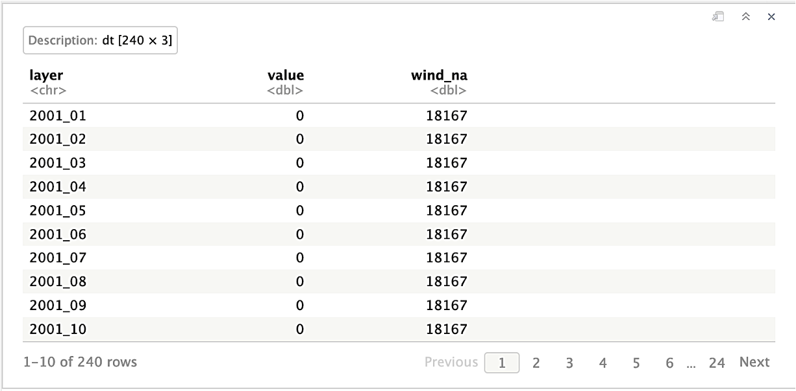
</p>

##### *Plot of Missing Data*

<details>
    <summary>
      <em><code>Show/Hide code</code></em>
    </summary>

```r
# Applying the mask to plot only the amazon area.
wind <- wind.rts[['2020-10-01']] %>% mask(mask = amaz.basin.shp)
# define the zoom area
wind.xy.zoom <- list(xmin=0.9e+06, xmax=1.4e+06, ymin=3.4e+06, ymax=4e+06, zoom=0.4)
# Plot
p.wind.na <- myPlot(
  wind, title = "Wind Speed", 
  max_cell=1e7,
  x_angle=90,
  b_size=12,
  na.color="black",
  xy.zoom = wind.xy.zoom
) +
  scale_fill_hypso_c(
    name = TeX(r"($\textit{(m / s)}$)"),
    palette = "gmt_globe_bathy", 
    trans = "pseudo_log",
    direction = -1,
    na.value = "transparent")
p.wind.na
```
</details>

<p align="center">
  
</p>

### I.2.10. Air Temperature

#### I.2.10.1. Data Analysis

>_Air Temperature_ is represented in Kelvin, with values ranging from 268 to 307.

##### *Import data*

<details>
    <summary>
      <em><code>Show/Hide code</code></em>
    </summary>

```r
# list of files
amaz.airtemp.list <- list.files(
  paste0(path.data,"/10. Air Temperature/03. Working Data"),
  full.names=TRUE,
  pattern = ".tif$")
# Import data with "Terra"
airtemp.rast <- rast(amaz.airtemp.list)
airtemp.rast
```
</details>

```
  class       : SpatRaster 
  dimensions  : 5860, 7806, 240  (nrow, ncol, nlyr)
  resolution  : 500, 500  (x, y)
  extent      : -2156811, 1746189, 1625314, 4555314  (xmin, xmax, ymin, ymax)
  coord. ref. : South_America_Albers_Equal_Area_Conic 
  sources     : airtemp_working_2001_1.tif  
                airtemp_working_2001_10.tif  
                airtemp_working_2001_11.tif  
                ... and 237 more source(s)
  names       : airte~_proj, airte~_proj, airte~_proj, airte~_proj, airte~_proj, airte~_proj, ... 
  min values  :    268.7742,    270.8836,    270.5267,    270.5608,    269.2101,    269.1326, ... 
  max values  :    303.1154,    304.1908,    304.2381,    303.4955,    304.7826,    304.7043, ... 
```

##### *Rename and order layers*

<details>
    <summary>
      <em><code>Show/Hide code</code></em>
    </summary>

```r
# Rename layers
airtemp.rast <- renameLayers(airtemp.rast, 'airtemp_working_', '')
# Order layers
airtemp.rast <- airtemp.rast[[ordered.names]]
airtemp.rast
```
</details>

```
  class       : SpatRaster 
  dimensions  : 5860, 7806, 240  (nrow, ncol, nlyr)
  resolution  : 500, 500  (x, y)
  extent      : -2156811, 1746189, 1625314, 4555314  (xmin, xmax, ymin, ymax)
  coord. ref. : South_America_Albers_Equal_Area_Conic 
  sources     : airtemp_working_2001_1.tif  
                airtemp_working_2001_2.tif  
                airtemp_working_2001_3.tif  
                ... and 237 more source(s)
  names       :  2001_01,  2001_02,  2001_03,  2001_04,  2001_05,  2001_06, ... 
  min values  : 268.7742, 269.2101, 269.1326, 270.1584, 269.9435, 269.3073, ... 
  max values  : 303.1154, 304.7826, 304.7043, 304.4511, 303.5922, 304.0975, ... 
```

##### *Verification of the values*

<details>
    <summary>
      <em><code>Show/Hide code</code></em>
    </summary>

```r
# Verification of the values
airtemp.minmax <- minmax(airtemp.rast) %>% t() %>% as.data.frame()
airtemp.minmax
```
</details>

<p align="center">
  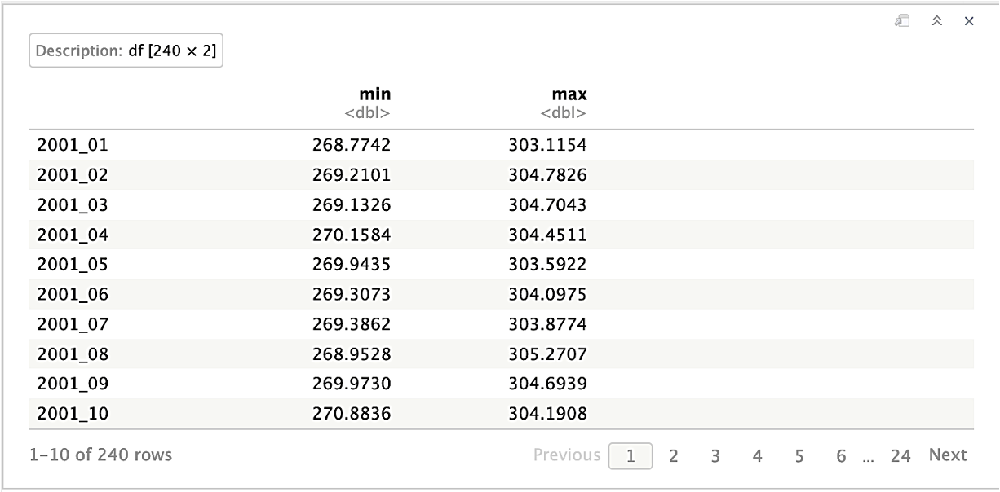
</p>

##### *Plot of the month of October 2020*

<details>
    <summary>
      <em><code>Show/Hide code</code></em>
    </summary>

```r
# Create a sequence date for 'rts' object
airtemp.rts <- rts(airtemp.rast, seq.dates)
# Applying the mask to plot only the amazon area.
airtemp <- airtemp.rts[['2020-10-01']] %>% mask(mask = amaz.basin.shp)
# Plot
p.airtemp <- myPlot(airtemp, title = "Air Temperature") +
  scale_fill_whitebox_c(
    name = TeX(r"($\textit{(K)}$)"),
    palette = "bl_yl_rd", 
    na.value = "transparent")
p.airtemp
```
</details>

<p align="center">
  
</p>

#### I.2.10.2. Missing Data

<details>
    <summary>
      <em><code>Show/Hide code</code></em>
    </summary>

```r
cl <- makeCluster(detectCores() - 1)
registerDoParallel(cl, cores=detectCores() - 1)

# Raster to datatable in parallel: one raster per thread
rasList <- foreach (
  ras_id=amaz.airtemp.list, 
  .packages=c('terra', 'sf', 'dplyr'), 
  .combine='c') %dopar% {
    # Read and rename raster
    ras <- rast(ras_id) %>% renameLayers(., 'airtemp_working_', '')
    # Count the missing data
    ras.freq.na <- not.na(ras) %>%
      mask(amaz.basin.shp) %>%
      terra::freq(., digits=0, value=0, usenames=T)
  
    list(ras.freq.na)
  }
stopCluster(cl)

# Bind all per-raster into one dataframe
airtemp.freq.na <- rbindlist(rasList, fill=T, use.names=T)
# Order
colnames(airtemp.freq.na)[3] <- "airtemp_na"
airtemp.freq.na <- airtemp.freq.na[order(airtemp.freq.na$layer)]
airtemp.freq.na
```
</details>

<p align="center">
  
</p>

##### *Plot of Missing Data*

<details>
    <summary>
      <em><code>Show/Hide code</code></em>
    </summary>

```r
# Applying the mask to plot only the amazon area.
airtemp <- airtemp.rts[['2020-10-01']] %>% mask(mask = amaz.basin.shp)
# define the zoom area
airtemp.xy.zoom <- list(xmin=0.9e+06, xmax=1.4e+06, ymin=3.4e+06, ymax=4e+06, zoom=0.4)
# Plot
p.airtemp.na <- myPlot(
  airtemp, title = "Air Temperature", 
  max_cell=1e7,
  x_angle=90,
  b_size=12,
  na.color="black",
  xy.zoom = airtemp.xy.zoom
) +
  scale_fill_whitebox_c(
    name = TeX(r"($\textit{(K)}$)"),
    palette = "bl_yl_rd", 
    na.value = "transparent")
p.airtemp.na
```
</details>

<p align="center">
  
</p>

### I.2.11. Merge all dataframes of missing values.

<details>
    <summary>
      <em><code>Show/Hide code</code></em>
    </summary>

```r
# create the dataframe
amaz.na.df <- as.data.frame(ordered.names)
colnames(amaz.na.df) <- "layer"
# Merge the dataframes
amaz.na.df <- list(amaz.na.df, 
                   burntArea.freq.na[,-2], 
                   landCover.freq.na[,-2], 
                   precipitation.freq.na[,-2],
                   soilmoisture.freq.na[,-2],
                   elevation.freq.na[,-2],
                   landsurftemp.freq.na[,-2], 
                   humidity.freq.na[,-2], 
                   evapotranspiration.freq.na[,-2],
                   wind.freq.na[,-2], 
                   airtemp.freq.na[,-2]) %>% 
  reduce(full_join, by="layer")

amaz.na.df
```
</details>

#
&emsp;&emsp;&emsp;&emsp;&emsp;&emsp;&emsp;&emsp;&emsp;&emsp;
&emsp;&emsp;&emsp;&emsp;&emsp;&emsp;&emsp;&emsp;&emsp;
[*:arrow_left: Main Page*](../) 
&emsp;&emsp; | &emsp;&emsp;
[*II. Data Preparation :arrow_right:*](../2_data_preparation/README.md)
