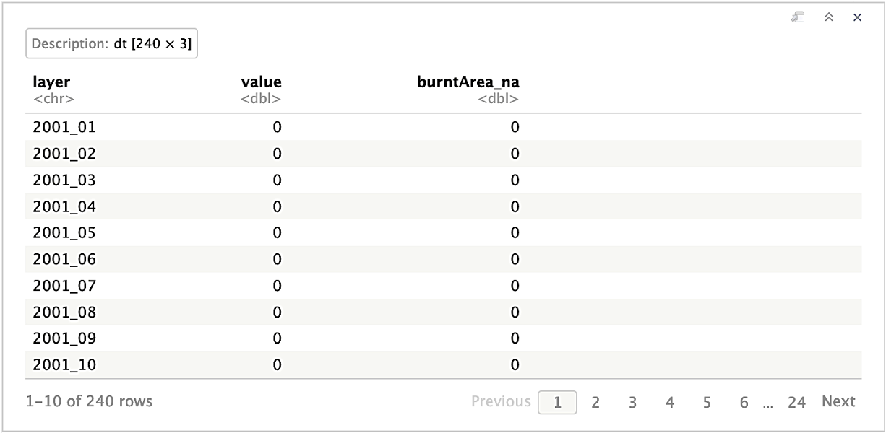

# 1. Data Analysis and Missing Data

The dataset includes 10 variables that capture various factors related to fires, land use, environmental conditions, and climate. It provides a spatial resolution of 500 meters, allowing a detailed analysis of the Amazon rainforest. These variables are measured on a monthly basis, covering the entire period from 2001 to 2020, and each variable contains a substantial monthly dataset, with around 26.8 million observations per month.

Before looking for each variable, we import the Amazon shape file:
```r
# Import shape file
amaz.basin.shp <- st_read(paste0(path.data,"/0. Amazon_shapefile/projected/amazon_shp_projected.shp"))
```
```
    Simple feature collection with 1 feature and 6 fields
    Geometry type: MULTIPOLYGON
    Dimension:     XY
    Bounding box:  xmin: -2156811 ymin: 1625314 xmax: 1745999 ymax: 4555427
    Projected CRS: South_America_Albers_Equal_Area_Conic
    ID     AREA PERIMETER FORMA POLYAREA     AREAPROJ                       geometry
    1  0 548.0098   241.442  <NA>  6725344 6.725344e+12 MULTIPOLYGON (((-2028457 35...
```

Now, let's take a closer look at each variable:

## 1.1. Burnt Area

### Data Analysis

_Burnt Area_ Represents the extent of burned areas in the Amazon rainforest, categorized as burnt (1), unburnt (0), missing (-1), or water (-2).

_**Import data**_

```r
# list of files
amaz.burntArea.list <- list.files(paste0(path.data,"/1. Burnt Area/03. Working Data"),
                                  full.names=TRUE,
                                  pattern = ".tif$")
# Import data with `Terra`
burntArea.rast <- rast(amaz.burntArea.list)
burntArea.rast
```
```
    class       : SpatRaster 
    dimensions  : 5860, 7806, 238  (nrow, ncol, nlyr)
    resolution  : 500, 500  (x, y)
    extent      : -2156811, 1746189, 1625314, 4555314  (xmin, xmax, ymin, ymax)
    coord. ref. : South_America_Albers_Equal_Area_Conic 
    sources     : burntarea_working_2001_1.tif  
                burntarea_working_2001_10.tif  
                burntarea_working_2001_11.tif  
                ... and 235 more source(s)
    names       : fire_~_proj, fire_~_proj, fire_~_proj, fire_~_proj, fire_~_proj, fire_~_proj, ... 
    min values  :          -2,          -2,          -2,          -2,          -2,          -2, ... 
    max values  :           1,           1,           1,           1,           1,           1, ... 
```

_**Rename layers**_

```r
# Rename layers
burntArea.rast <- renameLayers(burntArea.rast, 'burntarea_working_', '')
burntArea.rast
```
```
    class       : SpatRaster 
    dimensions  : 5860, 7806, 240  (nrow, ncol, nlyr)
    resolution  : 500, 500  (x, y)
    extent      : -2156811, 1746189, 1625314, 4555314  (xmin, xmax, ymin, ymax)
    coord. ref. : South_America_Albers_Equal_Area_Conic 
    sources     : burntarea_working_2001_1.tif  
                burntarea_working_2001_10.tif  
                burntarea_working_2001_11.tif  
                ... and 237 more source(s)
    names       : 2001_01, 2001_10, 2001_11, 2001_12, 2001_02, 2001_03, ... 
    min values  :      -2,      -2,      -2,      -2,      -2,      -2, ... 
    max values  :       1,       1,       1,       1,       1,       1, ... 
```

_**Order layers**_

```r
# Order layers
ordered.names <- seq(as.Date("2001-1-1"), as.Date("2020-12-1"), by = "month") %>% format(., '%Y_%m')
burntArea.rast <- burntArea.rast[[ordered.names]]
burntArea.rast
```
```
    class       : SpatRaster 
    dimensions  : 5860, 7806, 240  (nrow, ncol, nlyr)
    resolution  : 500, 500  (x, y)
    extent      : -2156811, 1746189, 1625314, 4555314  (xmin, xmax, ymin, ymax)
    coord. ref. : South_America_Albers_Equal_Area_Conic 
    sources     : burntarea_working_2001_1.tif  
                burntarea_working_2001_2.tif  
                burntarea_working_2001_3.tif  
                ... and 237 more source(s)
    names       : 2001_01, 2001_02, 2001_03, 2001_04, 2001_05, 2001_06, ... 
    min values  :      -2,      -2,      -2,      -2,      -2,      -2, ... 
    max values  :       1,       1,       1,       1,       1,       1, ... 
```

_**Verification of the values**_

```r
# Verification of the values
burntArea.minmax <- minmax(burntArea.rast) %>% t() %>% as.data.frame()
burntArea.minmax[which((burntArea.minmax[,1] != -2) & (burntArea.minmax[,2] != 1)),]
```

<p align="center">
  
</p>


_**Create Raster Time Series (`rts`) object**_

```r
# Create a sequence date
seq.dates <- seq(as.Date("2001-1-1"), as.Date("2020-12-1"), by = "month")
# Create the `rts` object
burntArea.rts <- rts(burntArea.rast, seq.dates)
```

_**Plot of the month of October 2020**_

```r
# Upplaying the mask to plot only the amazon area.
ba <- burntArea.rts[['2020-10-01']] %>% mask(mask = amaz.basin.shp)
# Change values as categorical 
levels(ba) <- data.frame(id=c(-2, 0, 1), val=c('-2', '0', '1'))
# Plot
my.colors <- c("mediumblue", "mediumseagreen", "firebrick")
p.ba <- myPlot(ba, title = "Burnt Area") +
  scale_fill_manual(
    name = NULL, 
    values = my.colors, 
    na.translate=FALSE
  ) 
p.ba
```

<p align="center">
  
</p>

```r
# Convert the raster object to a datatable
ba.dt <- as.data.table(ba, cell=T, xy=T)
# Plot
ggplot(data = ba.dt, aes(x = val)) + 
  geom_bar(stat = "count", aes(fill = val), position = "dodge") + 
  labs(title="Burnt Area in October 2020", x="Burnt Area") +
  coord_flip() + 
  scale_fill_manual(name = "Burnt Area", values = my.colors) +
  stat_count(geom = "text", 
             aes(label = ..count..),
             position=position_stack(vjust=0.5),
             colour = "black", size = 3.5) + 
  theme_bw(base_size=16)
```

<p align="center">
  
</p>

_**Percentage of fires**_

```r
freq.dt <- matrix(nrow = 0, ncol = 3) %>% as.data.table()
colnames(freq.dt) <- c("layer", "0", "1")
for (ras_id in amaz.burntArea.list){
  cat("\n", ras_id)
  ras <- rast(ras_id) %>%
    renameLayers(., 'burntarea_working_', '') %>%
    mask(mask = amaz.basin.shp)
 
  # Replace -2 and -1 value by `NA`
  ras[ras %in% c(-2, -1)] <- NA
  ras.freq <- freq(ras, digits=0, usenames=T) %>% as.data.table()
  tmp <- dcast(ras.freq,layer ~ value,value.var = c("count"))
  freq.dt <- rbind(freq.dt, tmp)
}
percentage.fires <- sum(freq.dt[, '1']) / sum(freq.dt[, c('0', '1')])
percentage.fires
```
```
    [1] 0.00089637
```

### Missing Data

```r
cl <- makeCluster(detectCores() - 1)
registerDoParallel(cl, cores=detectCores() - 1)

# Raster to datatable in parallel: one raster per thread
rasList <- foreach (ras_id=amaz.burntArea.list, .packages=c('terra', 'sf'), .combine='c') %dopar% {
    # Read all rasters into one big stack
    ras <- rast(ras_id)
    # Rename layers
    ras <- renameLayers(ras, 'burntarea_working_', '')
    # Replace negative value by `NA`
    if (names(ras) %in% c("2012_07", "2012_09")) {ras[ras == -1] <- NA}
    # Count the missing data
    ras.nonNA <- not.na(ras)
    ras.nonNA.mask <- mask(ras.nonNA, amaz.basin.shp)
    ras.freq.na <- terra::freq(ras.nonNA.mask, digits=0, value=0, usenames=T)
  
    list(ras.freq.na)
  }
stopCluster(cl)

# Bind all per-raster into one dataframe
burntArea.freq.na <- rbindlist(rasList, fill=T, use.names=T)
#
colnames(burntArea.freq.na)[3] <- "burntArea_na"
burntArea.freq.na <- burntArea.freq.na[order(burntArea.freq.na$layer)]
burntArea.freq.na
```
<p align="center">
  
</p>

## Land Cover

_Land Cover_ is a categorical variable with 11 classes, providing information on different land cover types such as water, urban, forest, grassland, and more.

## Precipitation

_Precipitation_ is measured in millimeters per hour, with a range between 0 and 3300.

## Soil Moisture

_Soil Moisture_ is measured in millimeters, with missing values marked as -9.99e+08, and a range between 0 and 4291.

## Elevation

_Elevation_ is measured in meters, with a range between -85 and 6471.

## Land Surface Temperature

_Land Surface Temperature_ is represented in Kelvin, with values adjusted by a scale factor of 0.02. Different months have varying missing data.

## Specific Humidity

_Specific Humidity_ is represented as kg/kg, indicating the ratio of kilograms of water (moisture) per kilogram of air. It ranges from 9.59e-04 to 2.15e-02.

## Evapotranspiration

_Evapotranspiration_ is measured in kg/m2s, with values ranging between -2.02e-07 and 9.69e-05.

## Wind Speed

_Wind Speed_ is measured in m/s, with values between 0.86 and 9.85.

## Air Temperature

_Air Temperature_ is represented in Kelvin, with values ranging from 268 to 307.


# Handling Missing Data and Data Preparation

## Missing Data
Dealing with missing data is a crucial part of our project. In the context of the "Burnt Area" variable, cells with a value of -2 represent water. However, the status of these cells can change over time to indicate "No fire" (0) or "Fire" (1) in different months. In our analysis, we treat cells with a value of -2 as missing data.

For the covariate "Land Surface Temperature," missing data varies across months. We observed that 26 months had more than 1 million missing data points, with three months exceeding 2 million missing data points. February 2016 had the highest with 3.3 million missing data points. To visually understand these missing data patterns, you can refer to the plots for the months with the most significant gaps.

In contrast, other covariates like "Precipitation," "Soil Moisture," "Specific Humidity," "Evapotranspiration," "Wind Speed," and "Air Temperature" have consistent missing data patterns across all months. These covariates have missing data values mostly at the boundary of the map, and each month's missing data count is below 133,000. We decided to exclude cells with missing data in these covariates as they consistently lacked data throughout the entire study period.