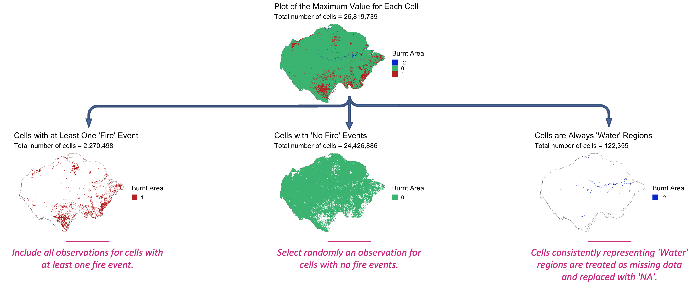
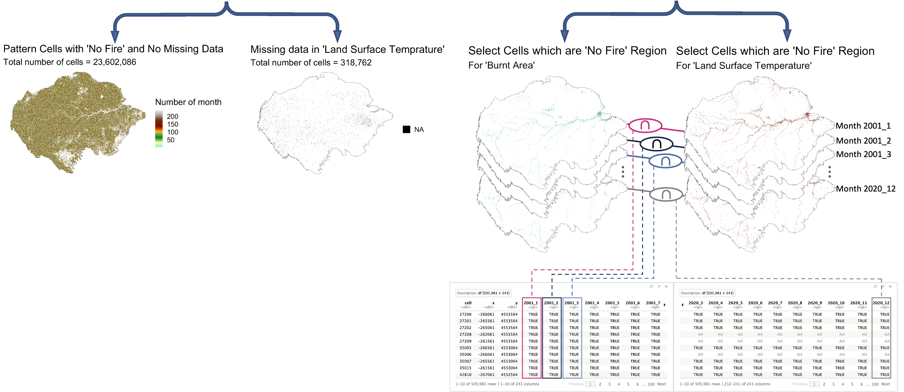

# Data Preparation (Downsampling)

## Select Data (Downsampling approach)

Our dataset features a spatial resolution of 500 meters, resulting in an extensive amount of data. To address the class imbalance in the "Burnt Area" response variable, we employed a careful data preparation strategy known as downsampling. Here's how we balanced the response variable:

1. For cells that experienced at least one fire event during the 238-month study period, we retained all observations for these cells, eliminating any missing data for the corresponding months.

2. For cells that did not experience any fire events during the study period, we randomly selected one observation from each of the 238 months. We ensured that the selected value was not missing data for the covariate "Land Surface Temperature" and was either 0 (unburnt) or 1 (burnt) for the response variable "Burnt Area."

  
  

This approach resulted in a dataset containing approximately 550 million observations, covering a substantial portion of the Amazon rainforest. To facilitate further analysis and modeling, we normalized the data and divided it into 11 zones, each with roughly 50 million observations. The zone allocation and data distribution are visualized in Figure 7.

[Insert Figure 7: Visualization of Data Zones and Distribution]

This downsampling strategy not only addresses the class imbalance but also allows for efficient modeling and analysis, providing a balanced and representative dataset for our study.

> **Note**
> This is a note

> **IMPORTANT**  
> Crucial information necessary for users to succeed.

> **WARNING**
> This is a warning

> [!NOTE]  
> Highlights information that users should take into account, even when skimming.

> [!IMPORTANT]  
> Crucial information necessary for users to succeed.

> [!WARNING]  
> Critical content demanding immediate user attention due to potential risks.

