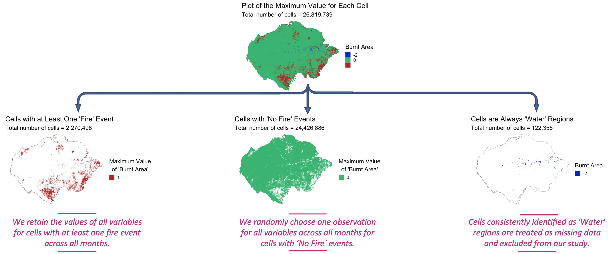
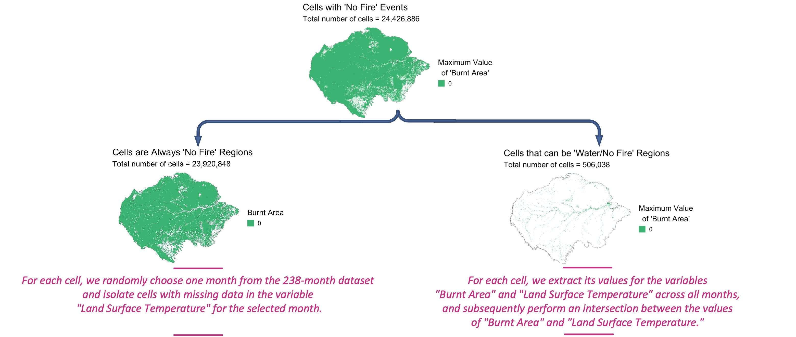
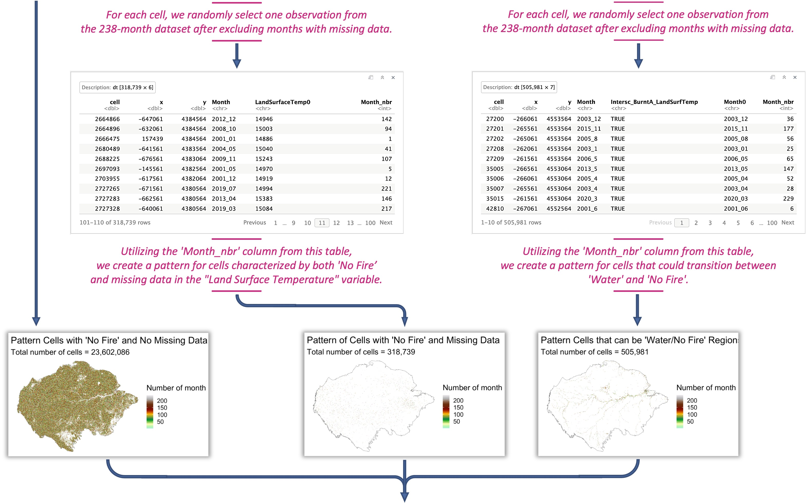
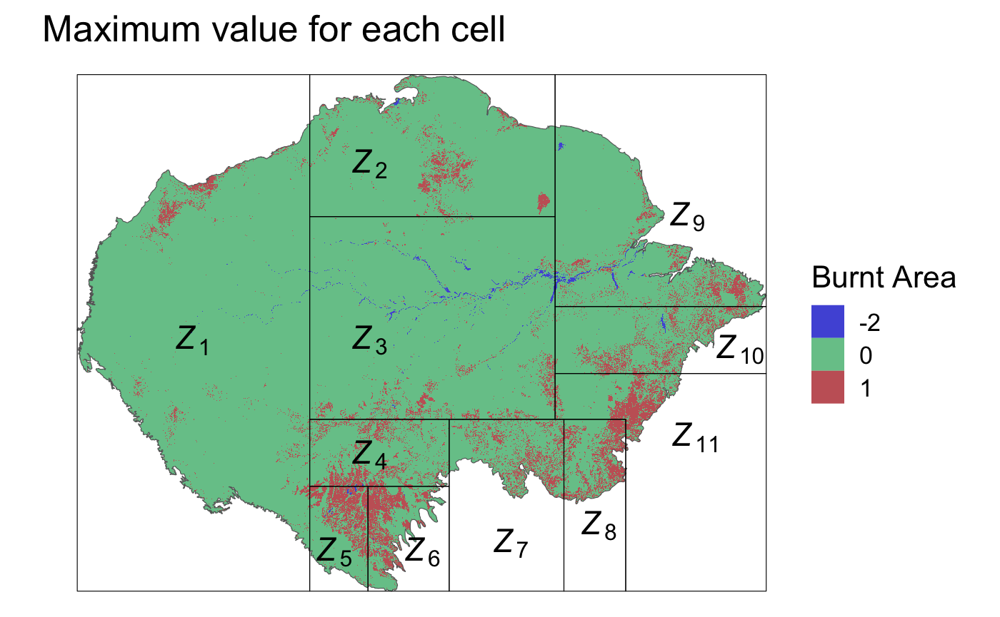

[*<< 1. Data Analysis & Missing Data*](https://github.com/abid-mohamed/Mapping_the_Spatio-Temporal_Distribution_of_Fires_in_the_Amazon/blob/main/1_data_analysis_%26_missing_data/README.md) 
| 
[*3. Model Assessment, Ensemble Model, and Results >>*](https://github.com/abid-mohamed/Mapping_the_Spatio-Temporal_Distribution_of_Fires_in_the_Amazon/blob/main/3_model_assessment_%26_ensemble_model/README.md)

# Data Preparation

## 1. Select Data (Downsampling approach)

Our dataset features a spatial resolution of 500 meters, resulting in an extensive amount of data. To address the class imbalance in the response variable *Burnt Area*, we employed a careful data preparation strategy known as downsampling. Here's how we balanced the response variable:

- For cells that experienced at least one fire event during the 238-month study period, we retained all observations for these cells, eliminating any missing data for the corresponding months.

- For cells that did not experience any fire events during the study period, we randomly selected one observation from each of the 238 months. We ensured that the selected value was not missing data for the covariate "Land Surface Temperature" and was either 0 (unburnt) or 1 (burnt) for the response variable "Burnt Area."

  

By identifying the maximum value of each cell across the 238-month dataset in the response variable *Burnt Area*, we can categorize cells into distinct groups.

  

### 1.1. Cells with at Least One 'Fire' Event 

This group includes cells that encountered at least one fire event during the 238-month study period. 
Each cell in this category is labeled as either 'Water' (-2), 'No Fire' event (0), or 'Fire' event (1) over the study duration. 
For these cells, we retain the values of all variables, excluding any cells with missing data.

 

### 1.2. Cells are Always 'Water' Regions

Cells consistently identified as 'Water' regions are treated as missing data and excluded from our study. 
Each cell in this group is exclusively labeled as 'Water' (-2) throughout the study period.

Cells consistently identified as 'Water' regions are treated as missing data and excluded from our study. 
Each cell in this group is exclusively labeled as 'Water' (-2) throughout the study period.

 

### 1.3. Cells with 'No Fire' Events

This group comprises cells that did not experience any fire events during the study period. These cells are further categorized into two subgroups:

- **Cells are Always 'No Fire' Regions:** Each cell in this subgroup remains classified as 'No Fire' (0) consistently throughout the study period.

- **Cells that can be 'Water/No Fire' Regions:** Cells in this subgroup fluctuate between 'Water' (-2) and 'No Fire' event (0) during the study period.

For these two subgroups, we proceed with the data selection, as represented in the following graph:

  

  
  
  
  

This approach resulted in a dataset comprising around 550 million observations, providing comprehensive coverage of a significant portion of the Amazon rainforest. 

## 2. Prepare Data

To enhance subsequent analysis and modeling, we normalized the data and partitioned it into 11 zones, each containing approximately 50 million observations. The allocation of zones and the distribution of data are visually represented in the following figure.

  

This downsampling strategy not only addresses the class imbalance but also allows for efficient modeling and analysis, providing a balanced and representative dataset for our study.

[*<< 1. Data Analysis & Missing Data*](https://github.com/abid-mohamed/Mapping_the_Spatio-Temporal_Distribution_of_Fires_in_the_Amazon/blob/main/1_data_analysis_%26_missing_data/README.md) 
| 
[*3. Model Assessment, Ensemble Model, and Results >>*](https://github.com/abid-mohamed/Mapping_the_Spatio-Temporal_Distribution_of_Fires_in_the_Amazon/blob/main/3_model_assessment_%26_ensemble_model/README.md)