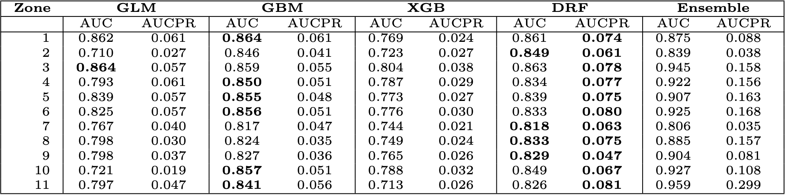

&emsp;&emsp;&emsp;&emsp;&emsp;&emsp;&emsp;&emsp;&emsp;
[*<< II. Data Preparation*](../2_data_preparation/README.md) 
&emsp;&emsp; | &emsp;&emsp;
[*IV. Maps and Time Trends of Fire Probability >>*](../README.md#iv-maps-and-time-trends-of-fire-probability)

#

# III. Models, Ensemble Model and Models Assessment

## III.1. Models

In this section, we utilize the $\texttt{h2o}$ package on the training data across all zones to deploy a diverse set of machine learning models, encompassing Distributed Random Forest (DRF), Generalized Linear Models (GLM), Gradient Boosting Machine (GBM), and eXtreme Gradient Boosting (XGB).

To optimize the performance of each method, we engage in meticulous hyperparameter tuning through a traditional (or "cartesian") grid search. This involves specifying crucial parameters for each model, enabling $\texttt{h2o}$ to systematically evaluate the 'AUC' metric by training a model for every combination of hyperparameter values.

##  III.2. Hyperparameters Tuning

For the hyperparameter tuning process, we adopt a 10-fold cross-validation approach. Given the imbalanced distribution of the response variable *Burnt Area*, maintaining a balanced proportion of cells with 'No Fire' event (0) and cells with 'Fire' event (1) within each fold is crucial. To achieve this balance, we utilize the `vfold_cv()` function from the $\texttt{rsample}$ package, employing the `strata = BurntArea` option for a stratified split.

Acknowledging the time-consuming nature of this technique, we strategically apply it in selected zones. Following fine-tuning, the carefully chosen hyperparameters for each model are uniformly applied to construct models across all zones, ensuring robust and consistent performance throughout the entire dataset.

## III.3. Models Assessment

To assess the performance of each model across all zones, we apply each trained model to the test data of its respective zone, combined with the remaining zones.

The 'AUC' metric is a standard choice for evaluating model performance in scenarios with balanced data. However, given the imbalanced nature of our data, and particularly when false positives carry higher costs than false negatives, we favor the 'AUCPR' metric. This metric proves to be the most suitable choice for evaluating model performance, thanks to its ability to effectively capture relevant positive instances.

## III.4. Ensemble Model

For each zone, we construct an ensemble model by computing a linear combination of the four individual models, assigning weights based on normalized 'AUCPR' values. The final ensemble model is derived by averaging the outputs of all individual ensemble models.

## III.5. Result of Methods Assessment

The table below presents the calculated performance metrics for various models and ensemble models across all zones:

  

#

&emsp;&emsp;&emsp;&emsp;&emsp;&emsp;&emsp;&emsp;&emsp;&emsp;
[*<< II. Data Preparation*](../2_data_preparation/README.md) 
&emsp;&emsp; | &emsp;&emsp;
[*IV. Maps and Time Trends of Fire Probability >>*](../README.md#iv-maps-and-time-trends-of-fire-probability)