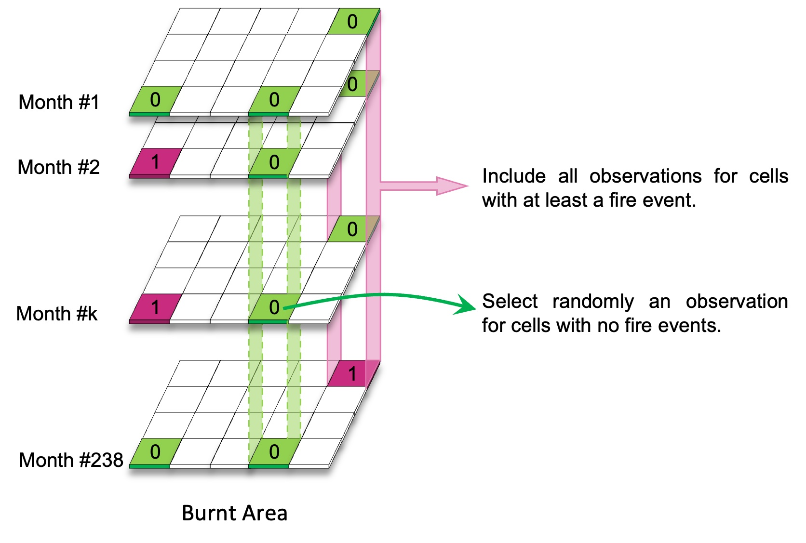
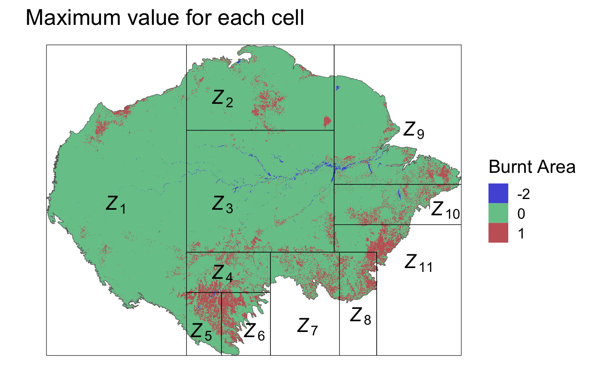
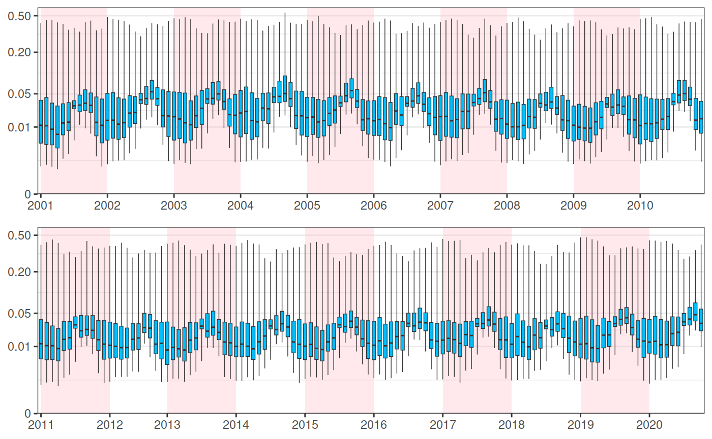

# Mapping the Spatio-Temporal Distribution of Fires in the Amazon from 2001 to 2020: An Ensemble Modeling Approach

## Overview
This project was conducted during my 6-month internship at King Abdullah University of Science and Technology (KAUST). It was supervised by Prof. Paula Moraga and Dr. Jonatan A. González.

The primary objective of this project was to develop an ensemble modeling approach to predict forest fires in the Amazon rainforest, leveraging data spanning from 2001 to 2020. By integrating various environmental and climatic factors, we aimed to create a comprehensive model that could provide valuable insights into the occurrence of forest fires in this vital ecosystem.

## Data Source
For this project, we utilized the dataset provided by Mateen Mahmood and Prof. Paula Moraga. The dataset is a raster-based resource for spatio-temporal analysis of forest fires in the Amazon rainforest from 2001 to 2020. You can find the data on Zenodo at the following DOI: [*https://doi.org/10.5281/zenodo.7215402*](https://doi.org/10.5281/zenodo.7215402).

## Tools and Packages
To implement this project, we primarily used the R programming language. The following R packages were instrumental in our data analysis, modeling, and visualization: $\texttt{terra}$, $\texttt{raster}$, $\texttt{sf}$, $\texttt{h2o}$, $\texttt{rsample}$, $\texttt{recipes}$, $\texttt{data.table}$, $\texttt{tidyverse}$, $\texttt{pROC}$, $\texttt{doParallel}$, $\texttt{doSNOW}$, $\texttt{ggplot2}$, $\texttt{tidyterra}$.  
These packages facilitated various aspects of our project

## Project Steps

This project is structured into distinct steps to facilitate understanding and organization. Each step corresponds to a specific aspect of the analysis and modeling process. You can navigate through the folders corresponding to each step for detailed code and documentation.

### 1. Data Analysis and Missing Data

#### 1.1. Data Analysis 

In this step, we perform an initial data analysis to enhance our understanding of the dataset. This involves exploring the dataset's structure, visualizing important variables, and detecting any missing or unusual data points.

The dataset comprises 10 variables that encompass essential information related to fires, land use, environmental conditions, and climate factors. Operating at a spatial resolution of 500 meters, it consists of approximately 26.8 million cells for each variable within every monthly dataset, enabling detailed analyses of the Amazon rainforest. These variables are recorded on a monthly basis, covering the extensive period from 2001 to 2020.

#### 1.2. Missing Data

We focus on addressing the significant challenge of identifying and managing missing data within our dataset. We discovered that missing data is predominantly concentrated in two areas:

- The _land surface temperature_ variable, which contains over one million missing data points across twenty-six months.

- The response variable, _burnt area_, in which we treat the value (-2) as missing data, representing water. Additionally, it's important to note that we exclude the two months, July and September 2012, from our analysis, as we do not have any data for the response variable _burnt area_ during these months.

For the remaining covariates, missing data is minimal, consistent across months, and typically located near the map's edges.

> [!NOTE]
> Additional information :point_right: [*1. Data Analysis & Missing Data*](https://github.com/abid-mohamed/Mapping_the_Spatio-Temporal_Distribution_of_Fires_in_the_Amazon/blob/main/1_data_analysis_%26_missing_data/README.md)

### 2. Data Preparation (Downsampling strategy)

In this step, we address the class imbalance issue identified in the Data Analysis step. To reduce the data imbalance, we employ a down-sampling strategy, which involves the following two key actions:

- For cells with at least one fire event over the 20-year period, we retain all available data records, excluding those with missing values.
 
- For cells without any fire events during this period, we randomly select a single observation from across all the months. It's important to note that this selection ensures that there are no missing values in the _land surface temperature_ covariate or the response variable _burnt area_.

  

As the downsampling process still results in a substantial dataset of approximately 550 million observations, we have opted to partition our data into 11 zones, with each zone containing approximately 50 million observations. This division not only reduces the computational load but also enhances the usability and manageability of the dataset.

  

> [!NOTE]
> Additional information :point_right: [*2. Data Preparation*](https://github.com/abid-mohamed/Mapping_the_Spatio-Temporal_Distribution_of_Fires_in_the_Amazon/blob/main/2_data_preparation/README.md)

### 3. Model Assessment, Ensemble Model, and Results

In the Model Assessment, Ensemble Model, and Results step, we evaluate the performance of various machine learning models, including Distributed Random Forest (DRF), Generalized Linear Models (GLM), Gradient Boosting Machine (GBM), and eXtreme Gradient Boosting (XGB). Performance assessment is based on two key metrics: AUC (Area Under the Receiver Operating Characteristic Curve) and AUCPR (Area Under the Precision-Recall Curve). These metrics are computed using the $\texttt{h2o}$ package.

Additionally, we create ensemble models for each zone, combining the four methods using a linear combination technique. The weights for each method in the ensemble are determined based on the normalized AUCPR metric. This ensemble approach optimizes predictive accuracy for each zone.

> [!NOTE]
> Additional information :point_right: [*3. Model Assessment*](https://github.com/abid-mohamed/Mapping_the_Spatio-Temporal_Distribution_of_Fires_in_the_Amazon/blob/main/3_model_assessment_&_ensemble_model/README.md)

### 4. Maps and Time Trends of Fire Probability

In the "Maps and Time Trends of Fire Probability" section, we present the results of our ensemble model's predictions for fire probabilities in the Amazon rainforest. This section includes two types of visualizations:

**Monthly Fire Probability Maps**

Explore the dynamic monthly fire probability maps through the animated GIF plot below. Each frame in the animation represents a different month across the 20-year study period. This visualization provides valuable insights into the seasonality and the spatial distribution of fire probability in the Amazon.

  

**Time Trend of Fire Probability**

The boxplots presented below depict the time trend of fire probability during the 20-year study period. These visualizations illustrate how fire risk has evolved over time, offering a comprehensive view of long-term patterns and trends in fire probability.

  

These visualizations are powerful tools for understanding the dynamics and patterns of fires in the Amazon rainforest.

---

> **Note** 
> Each folder contains detailed documentation, code, and any additional resources relevant to the corresponding step. You can follow the links to explore each aspect of the project in more detail.

| [*1. Data Analysis & Missing Data >>*](https://github.com/abid-mohamed/Mapping_the_Spatio-Temporal_Distribution_of_Fires_in_the_Amazon/blob/main/1_data_analysis_%26_missing_data/README.md)