# Load libraries

```{r, load libraries, warning=FALSE, message=FALSE}
library(tidyverse)
library(raster)
library(terra)
library(sf)
library(rts)
library(doSNOW)
library(itertools)
library(doParallel)
library(parallel)
library(foreach)
library(data.table)
library(dplyr)
library(rsample)
library(recipes)
library(RColorBrewer)
library(tidyterra)
library(scico)
library(wesanderson)
library(viridis)
library(scales)
library(latex2exp)
library(ggplot2)
```

# Functions

```{r "Functions"}
#---- Function to rename layers and save year and month of the layer ----
renameRast <- function(dataRast, fileStart, prefix){
  library(data.table)
  # index of file name in the path
  id.date <- unlist(gregexpr(fileStart, sources(dataRast)[[1]])) + nchar(fileStart)
  # rename layers
  dateRast <-
    substr(sources(dataRast), id.date, (id.date+50)) %>%
    gsub(".tif", "_1", .) %>%
    as.Date("%Y_%m_%d")
  # Rename layers
  names(dataRast) <-
    dateRast %>%
    format(., '%Y_%m') %>%
    paste0(prefix, .)
  yearRast <- data.table::year(dateRast)
  monthRast <- data.table::month(dateRast)
  # return
  return(list(dataRast, yearRast, monthRast))
}

#---- Function to plot ----
myPlot <- function(
  rast, 
  title=NULL, 
  sub_title=NULL, 
  theme=2, 
  xy.limit = list(xmin=NULL, xmax=NULL, ymin=NULL, ymax=NULL),
  xy.zoom = list(xmin=NULL, xmax=NULL, ymin=NULL, ymax=NULL, zoom.size=NULL),
  max_cell=1e8,
  x_angle=0,
  b_size=16,
  na.color=NA,
  v_unit=c(2, 2, 2, 2) # c(t, r, b, l)
){
  p1 <- ggplot()
  p1 <- switch(
    theme,
    p1,
    p1 + theme_bw(base_size=b_size),
    p1 + theme_linedraw(base_size=b_size),
    p1 + theme_light(base_size=b_size),
    p1 + theme_minimal(base_size=b_size),
    p1 + theme_classic(base_size=b_size),
    p1 + theme_gray(base_size=b_size),
    p1 + theme_dark(base_size=b_size)
  )
  p1 <- p1  +
    geom_spatvector(data = amaz.basin.shp$geometry, fill = na.color, color = "gray40") +
    geom_spatraster(data = rast, maxcell = max_cell) +
    scale_x_continuous(limits = c(xy.limit$xmin, xy.limit$xmax), 
                       labels = function(x) format(x, scientific = T)) +
    scale_y_continuous(limits = c(xy.limit$ymin, xy.limit$ymax), 
                       labels = function(x) format(x, scientific = T)) +
    ggtitle(label=title, subtitle=sub_title) +
    coord_sf(datum = pull_crs(rast)) +
    theme(
      axis.text.x = element_text(angle = x_angle)
      , plot.margin = unit(v_unit, "pt")
    )
  
  if (!all(sapply(xy.zoom, is.null))) {
    p1 <- p1 + facet_zoom(xlim = c(xy.zoom$xmin, xy.zoom$xmax),
                          ylim = c(xy.zoom$ymin, xy.zoom$ymax), 
                          zoom.size=xy.zoom$zoom) 
  }
  
  if (theme == 1) {p1 <- p1 + theme_void(base_size=b_size)}

  return(p1)
}
```

# Initialization

```{r}
my.path <- "~/Documents/"
path.data <- paste0(my.path, "/Amazon_new_data")

# path of variables
burntArea.path <- paste0(path.data,"/1. Burnt Area/03. Working Data")
landCover.path <- paste0(path.data,"/2. Land Cover/03. Working Data")
precip.path <- paste0(path.data,"/3. Precipitation/03. Working Data")
soilMoisture.path <- paste0(path.data,"/4. Soil Moisture/03. Working Data")
elevation.path <- paste0(path.data,"/5. Elevation/03. Working Data")
LandSurfaceTemp.path <- paste0(path.data,"/6. LandSurfaceTemp/03. Working Data")
humidity.path <- paste0(path.data,"/7. Specific Humidity/03. Working Data")
evapotranspiration.path <- paste0(path.data,"/8. Evapotranspiration/03. Working Data")
wind.path <- paste0(path.data,"/9. Wind Speed/03. Working Data")
airtemp.path <- paste0(path.data,"/10. Air Temperature/03. Working Data")

# Create a sequence date
seq.dates <- seq(as.Date("2001-1-1"), as.Date("2020-12-1"), by = "month")
# Create name of layers
ordered.names <- format(seq.dates, '%Y_%m') %>% setdiff(., c("2012_07", "2012_09"))
# Import shape file
amaz.basin.shp <- st_read(
  paste0(path.data,"/0. Amazon_shapefile/projected/amazon_shp_projected.shp"), quiet = TRUE)

# Number of cores to use
nbrCores <- detectCores() - 1
# nbrCores <- 50

# Color palette
my.colors <- c("mediumblue", "mediumseagreen", "firebrick")
```

#-

# Split cells to 4 categories

By identifying the maximum value of each cell across the 238-month dataset in the response variable *Burnt Area*, we can categorize cells into distinct groups.

## Create Q0 and Q1 `SpatRaster` object (minimum and maximum value for each cell)

```{r, message=FALSE}
# Import burntArea data with "Terra"
amaz.burntArea.list <- list.files(burntArea.path, full.names=TRUE, pattern = ".tif$")
burntArea.rast <- rast(amaz.burntArea.list)
burntArea.rast <- renameRast(burntArea.rast, 'burntarea_working_', '')[[1]]
burntArea.rast <- burntArea.rast[[ordered.names]]

# Compute the quartiles
q <- terra::quantile(burntArea.rast)
Q0 <- mask(q[[1]], amaz.basin.shp)
Q1 <- mask(q[[5]], amaz.basin.shp)

levels(Q0) <- data.frame(id=c(-2, 0, 1), cover=c('-2', '0', '1'))
levels(Q1) <- data.frame(id=c(-2, 0, 1), cover=c('-2', '0', '1'))
```

### Plot

```{r}
myPlot(Q0
       , "Plot of the Minimum Value for Each Cell"
       , paste0("Total number of cells = ", 
           formatC(length(cells(Q0)), format="f", big.mark=",", digits=0) )
       , theme = 1 
       , b_size=20 ) +
  scale_fill_manual(name = "Burnt Area", values = my.colors, na.translate=FALSE)
  
myPlot(Q1
       , "Plot of the Maximum Value for Each Cell"
       , paste0("Total number of cells = ",
           formatC(length(cells(Q1)), format="f", big.mark=",", digits=0) )
       , theme = 1 
       , b_size=20 ) +
  scale_fill_manual(name = "Burnt Area", values = my.colors, na.translate=FALSE)
```

<center> 
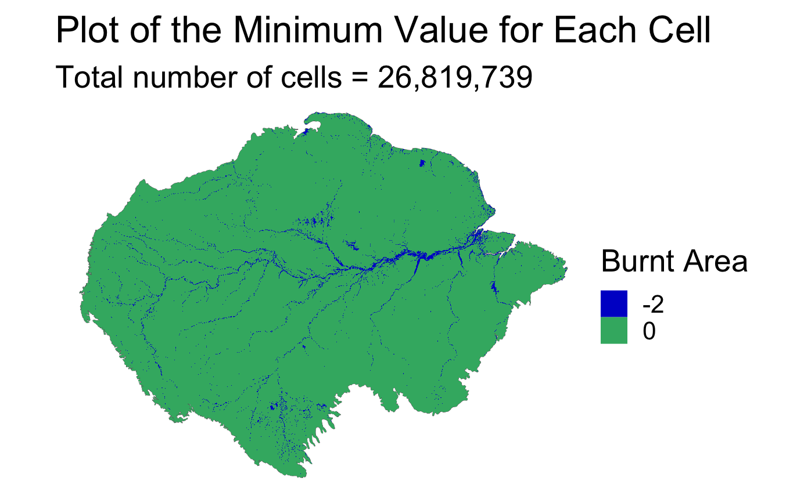{width=50%}
</center>

<center> 
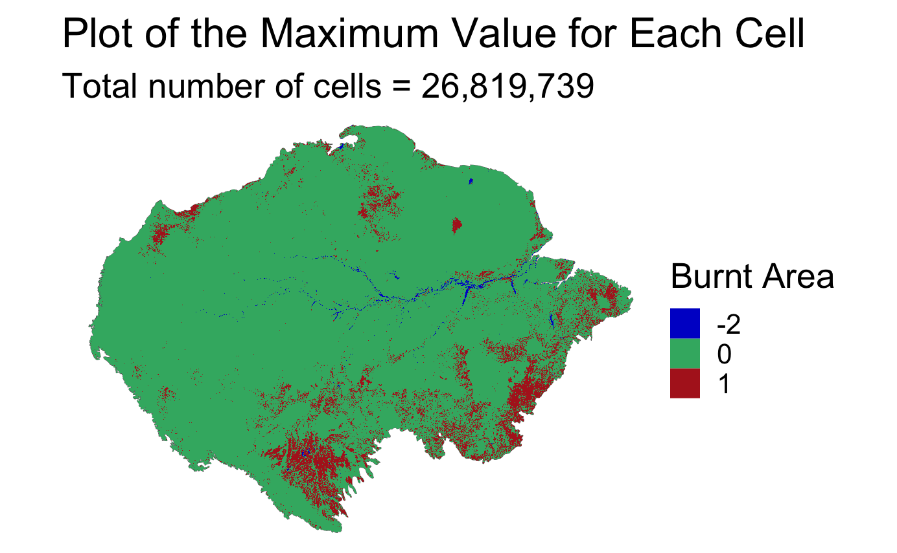{width=50%}
</center>

## Split data into 4 parts

We split data into 4 parts:

1. Cells with at Least One 'Fire' Event (`ras1`): Each cell in this category is labeled as either 'Water' (-2), 'No Fire' event (0), or 'Fire' event (1) over the study duration.

2. Cells are Always 'Water' Regions (`ras2`): Cells consistently identified as 'Water' regions are treated as missing data and excluded from our study.

3. Cells with 'No Fire' Events (`ras0`): This group comprises cells that did not experience any fire events during the study period. These cells are further categorized into two subgroups:

  - Cells are Always 'No Fire' Regions (`ras0.0`): Each cell in this subgroup remains classified as 'No Fire' (0) consistently throughout the study period.
  
  - Cells that can be 'Water/No Fire' Regions (`ras2.0`): Cells in this subgroup fluctuate between 'Water' (-2) and 'No Fire' event (0) during the study period.

```{r, message=FALSE}
ras0 <- ras1 <- ras2 <- Q1

#---- Cells with at Least One 'Fire' Event ----
# Each cell can be 'Water' (-2), 'No Fire' event (0) or 'Fire' event (1) during the period of time.
ras1[ras1 %in% c(-2, 0)] <- NA

#---- Cells are Always 'Water' Regions ----
# Each cell can be only 'Water' (-2) during the period of time.
ras2[ras2 %in% c(0, 1)] <- NA
ras2[ras2 == -2] <- 1

#---- Cells with 'No Fire' Events ----
# Each cell:
#   - are always 'No Fire' (0) during the period of time.
#   or
#   - change between 'Water' (-2) and 'No Fire' event (0) during the period of time.
ras0[ras0 %in% c(-2, 1)] <- NA
ras0[ras0 == 0] <- 1

# ---- Cells are Always 'No Fire' Regions ----
# Each cell are always 'No Fire' (0) during the period of time.
ras0.0 <- Q0
ras0.0[ras0.0 == -2] <- NA
ras0.0[ras0.0 == 0] <- 1
ras0.0 <- selectRange(ras0.0, ras0)

#---- Cells that can be 'Water/No Fire' Regions ----
# Each cell change between 'Water' (-2) and 'No Fire' event (0) during the period of time.
ras2.min <- Q0
ras2.min[ras2.min == 0] <- NA
ras2.min[ras2.min == -2] <- 1
ras2.0 <- selectRange(ras2.min, ras0)

#---- Change to categorical variable ----
levels(ras2) <- data.frame(id=1, cover=c('-2'))
levels(ras0) <- data.frame(id=1, cover=c('0'))
levels(ras1) <- data.frame(id=1, cover=c('1'))
levels(ras2.0) <- data.frame(id=1, cover=c('0'))
levels(ras0.0) <- data.frame(id=1, cover=c('0'))
```

### Plot

```{r}
#---- Plot ----
myPlot(
  ras2
  , "Cells are Always 'Water' Regions"
  , paste0("Total number of cells = ", 
           formatC(length(cells(ras2)), format="f", big.mark=",", digits=0)  )
  , theme = 1
  , b_size=20 
) +
  scale_fill_manual(name = "Burnt Area", values = my.colors[1], na.translate=FALSE)

myPlot(
  ras0
  , "Cells with 'No Fire' Events"
  , paste0("Total number of cells = ", 
           formatC(length(cells(ras0)), format="f", big.mark=",", digits=0) )
  , theme = 1
  , b_size=20 
) +
  scale_fill_manual(
    name = TeX(r"(\overset{Maximum Value}{of 'Burnt Area'})")
    , values = my.colors[2]
    , na.translate=FALSE)

myPlot(
  ras1
  , "Cells with at Least One 'Fire' Event"
  , paste0("Total number of cells = ", 
           formatC(length(cells(ras1)), format="f", big.mark=",", digits=0) )
  , theme = 1
  , b_size=20 
) +
  scale_fill_manual(
    name = TeX(r"(\overset{Maximum Value}{of 'Burnt Area'})")
    , values = my.colors[3]
    , na.translate=FALSE)

myPlot(
  ras0
  , "Cells with 'No Fire' Events"
  , paste0("Total number of cells = ", 
           formatC(length(cells(ras0)), format="f", big.mark=",", digits=0) )
  , theme = 1
  , b_size=20 
) +
  scale_fill_manual(
    name = TeX(r"(\overset{Maximum Value}{of 'Burnt Area'})")
    , values = my.colors[2]
    , na.translate=FALSE)

myPlot(
  ras0.0
  , "Cells are Always 'No Fire' Regions"
  , paste0("Total number of cells = ", 
           formatC(length(cells(ras0.0)), format="f", big.mark=",", digits=0) )
  , theme = 1
  , b_size=20 
) +
  scale_fill_manual(name = "Burnt Area", values = my.colors[2], na.translate=FALSE)

myPlot(
  ras2.0
  , "Cells that can be 'Water/No Fire' Regions"
  , paste0("Total number of cells = ",
           formatC(length(cells(ras2.0)), format="f", big.mark=",", digits=0) )
  , theme = 1
  , b_size=20
) +
  scale_fill_manual(
    name = TeX(r"(\overset{Maximum Value}{of 'Burnt Area'})")
    , values = my.colors[2]
    , na.translate=FALSE)
```

<center> 
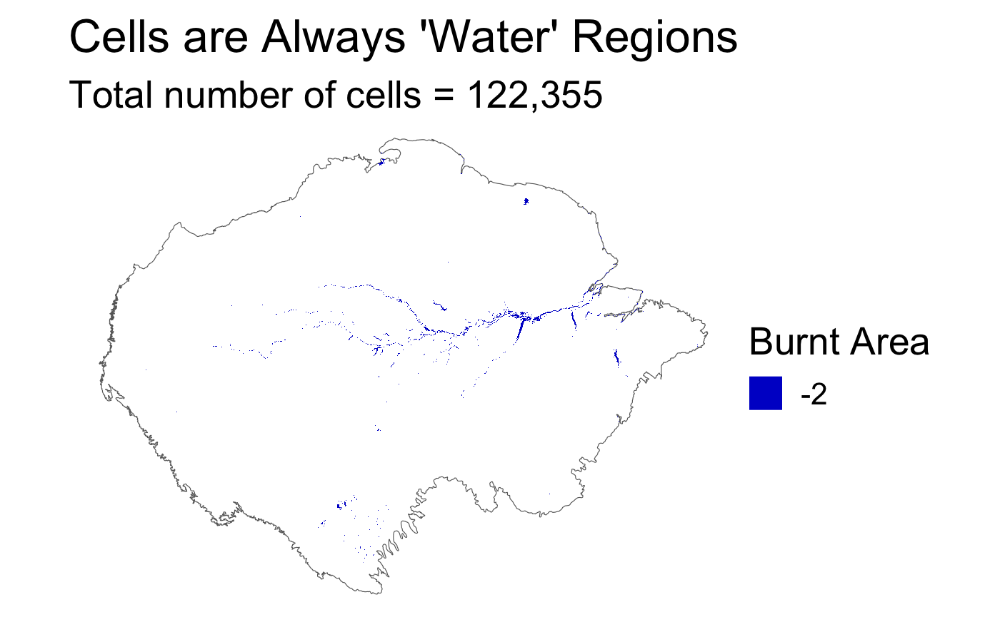{width=49%} 
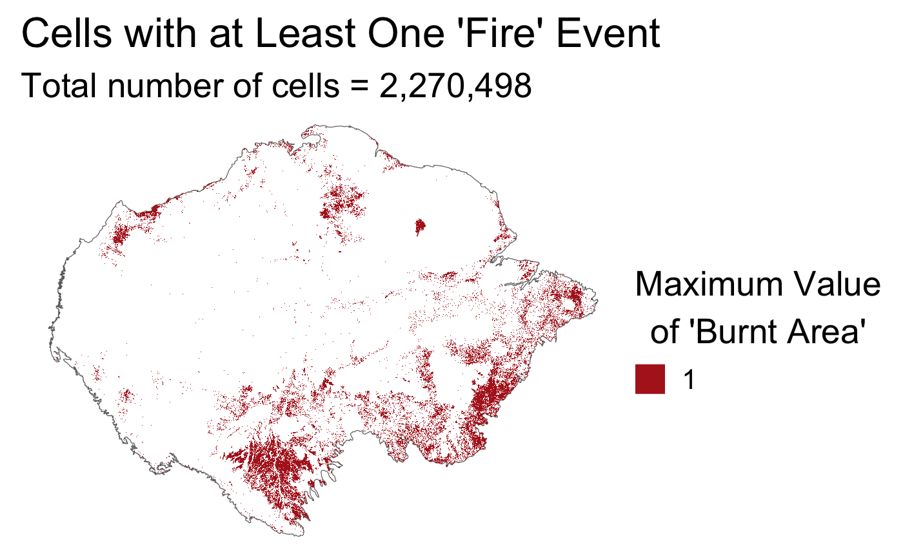{width=49%} 
</center>

<center> 
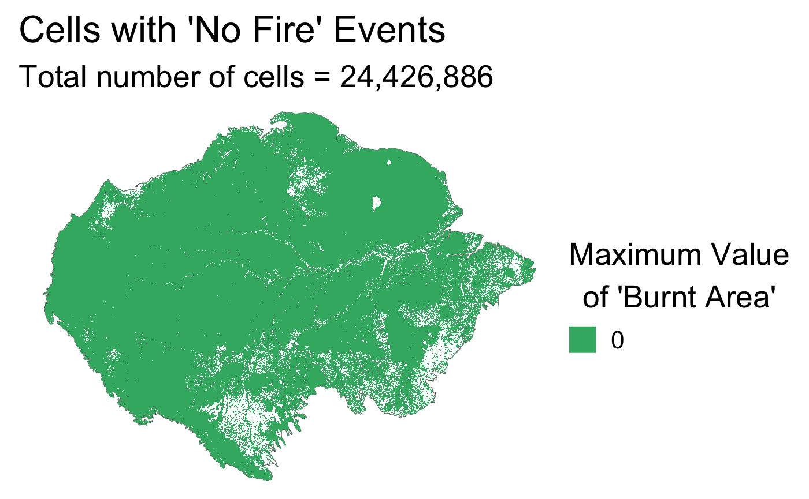{width=49%} 
</center>

<center> 
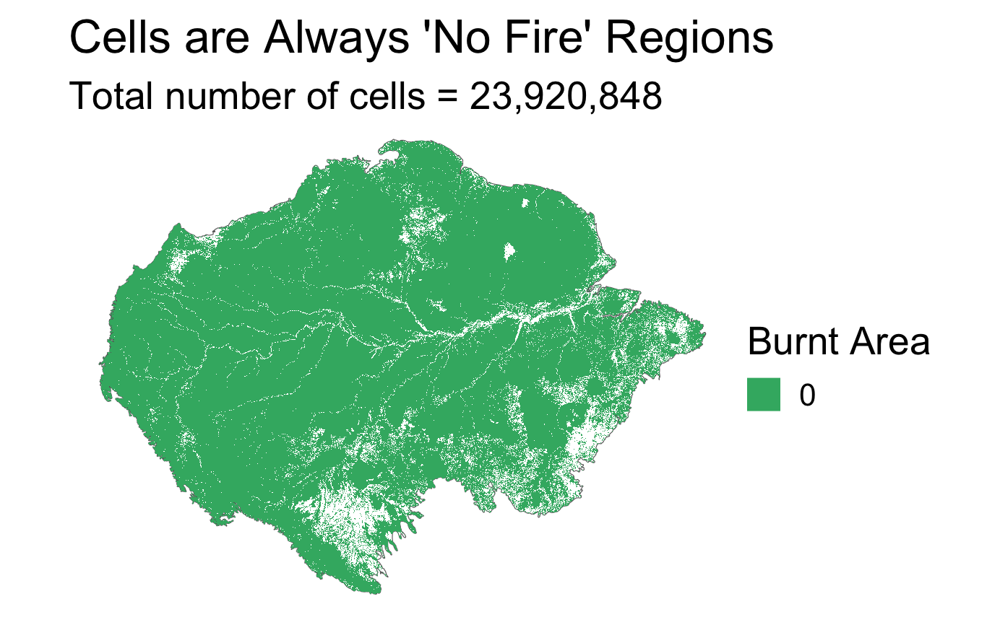{width=49%} 
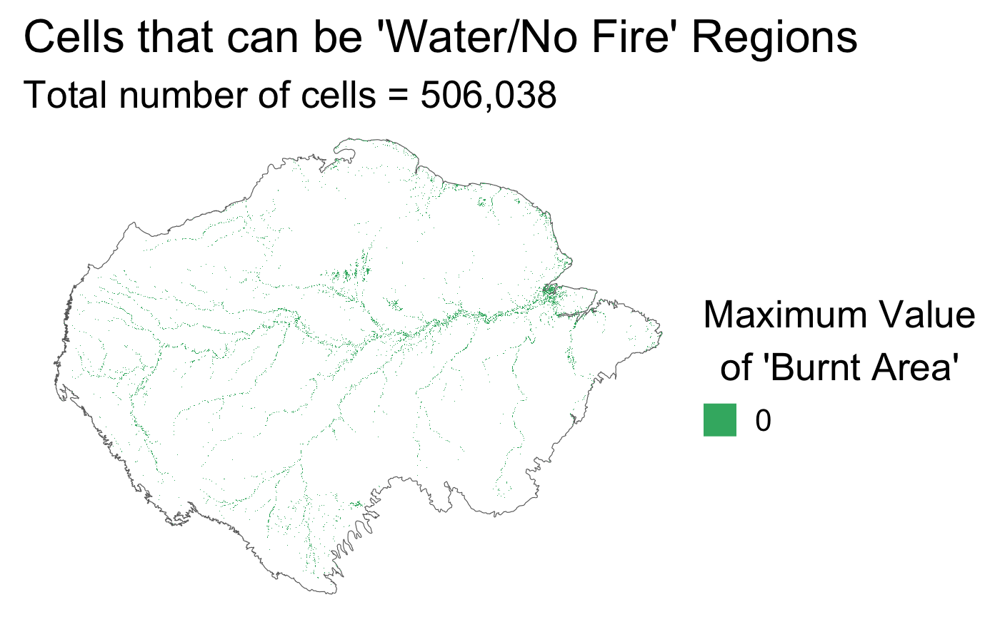{width=49%}
</center>

#-

# Create a Pattern of Cells with 'No Fire' Events

## Create a Pattern of Cells which are always 'No Fire' Regions

### Select a random month for each cell with 'No Fire' events

```{r}
#---- Select a random month for each cell ----
set.seed(1)
rand.rast0 <- ras0.0
values(rand.rast0) <- sample(1:238, ncell(rand.rast0), replace=TRUE)
rand.rast0 <- selectRange(rand.rast0, ras0.0)
names(rand.rast0) <- "Month_nbr"
```

<center> 
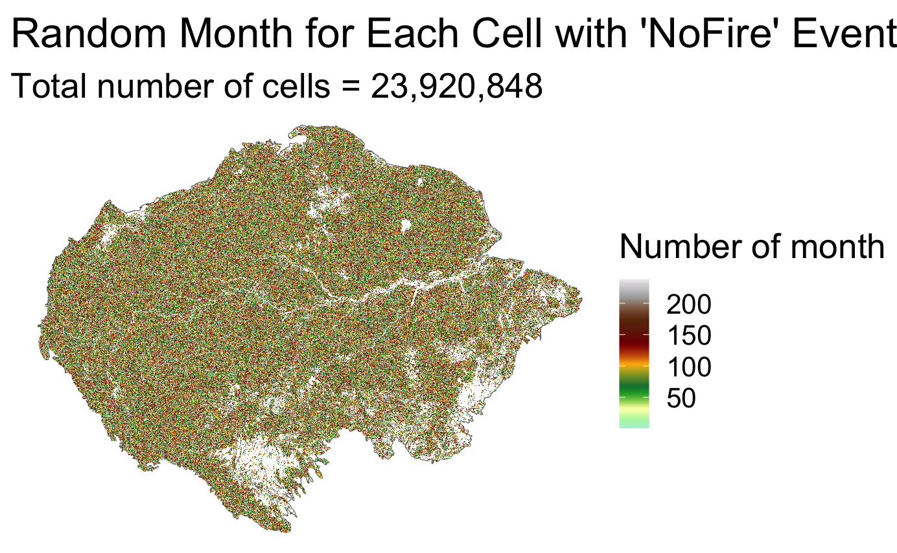{width=49%} 
</center>

- For each cell, we randomly choose one month from the 238-month dataset and isolate cells with missing data in the variable *Land Surface Temperature* for the selected month.


### Create a Pattern of Cells with 'No Fire' and No Missing Data in 'Land Surface Temperature'

```{r}
#---- Select the random values from 'Land Surface Temperature' ----
# Create a SpatRaster object for 'Land Surface Temperature' data
amaz.landSurfaceTemp.list <- list.files(LandSurfaceTemp.path, full.names=TRUE, pattern = ".tif$")
landSurfaceTemp.rast <- rast(amaz.landSurfaceTemp.list)
landSurfaceTemp.rast <- renameRast(landSurfaceTemp.rast, 'landsurftemp_working_', '')[[1]]
landSurfaceTemp.rast <- landSurfaceTemp.rast[[ordered.names]]

# Apply the 'rand.rast0' pattern on the 'Land Surface Temperature' variable.
landSurfaceTemp0.rand <- selectRange(landSurfaceTemp.rast, rand.rast0)
names(landSurfaceTemp0.rand) <- "LandSurfaceTemp"

#---- Pattern Cells with 'No Fire' and No Missing Data ----
temp <- landSurfaceTemp0.rand
# change all values to 1.
temp[!is.na(temp)] <- 1
landSurfaceTemp0.ind.rand <- selectRange(rand.rast0, temp)
```

#### Plot 

```{r}
myPlot(
  landSurfaceTemp0.ind.rand, "Pattern Cells with 'No Fire' and No Missing Data"
  , paste0("Total number of cells = ", 
           formatC(length(cells(landSurfaceTemp0.ind.rand)), format="f", big.mark=",", digits=0) )
  , theme = 1
  , b_size=20
) + 
  scale_fill_hypso_c(
    name = TeX(r"(Number of month)"),
    palette = "wiki-schwarzwald-cont", 
    na.value = "transparent")
```

<center> 
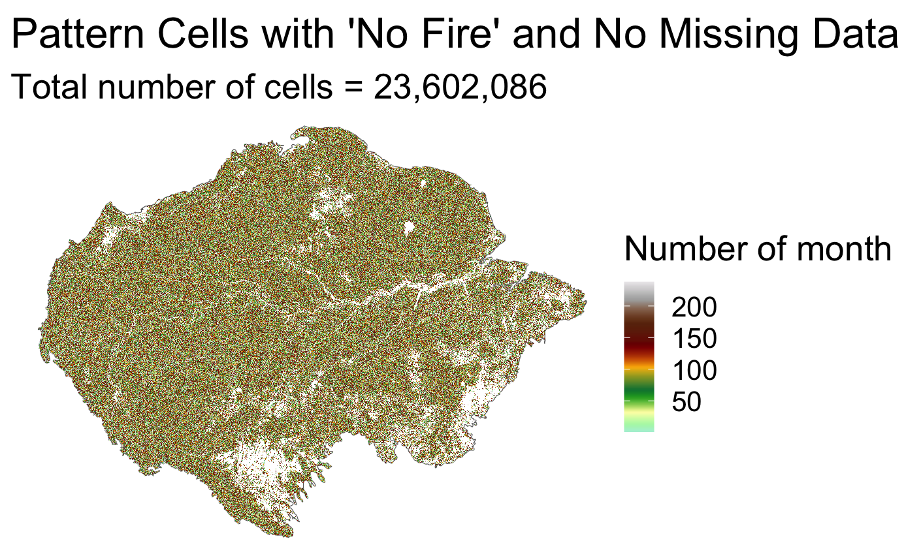{width=49%} 
</center>

### Identify Missing data in 'Land Surface Temprature' 

```{r, message=FALSE}
#---- Identify Missing data in 'Land Surface Temprature' ----
landSurfaceTemp0.rand.NA <- landSurfaceTemp0.rand
landSurfaceTemp0.rand.NA[is.na(landSurfaceTemp0.rand.NA)] <- -10
landSurfaceTemp0.rand.NA[landSurfaceTemp0.rand.NA > 0] <- NA

landSurfaceTemp0.rand.NA.mask <- mask(landSurfaceTemp0.rand.NA, amaz.basin.shp)
landSurfaceTemp0.rand.NA.mask <- intersect(landSurfaceTemp0.rand.NA.mask, ras0.0)
landSurfaceTemp0.rand.NA.mask[isFALSE(landSurfaceTemp0.rand.NA.mask)] <- NA
```

#### Plot

```{r, message=FALSE}
# Plot
levels(landSurfaceTemp0.rand.NA.mask) <- data.frame(id=1, cover=c('NA'))
myPlot(
  landSurfaceTemp0.rand.NA.mask
  , "Missing data in 'Land Surface Temprature'"
  , paste0("Total number of cells = ", 
           formatC(length(cells(landSurfaceTemp0.rand.NA.mask)), format="f", big.mark=",", digits=0) )
  , theme = 1
  , b_size=20
)  +
  scale_fill_manual(name = "", values = "black", na.translate=FALSE)
```

<center> 
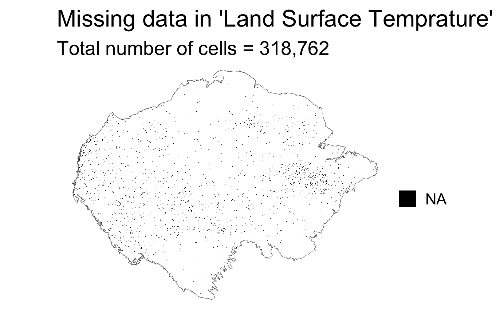{width=49%} 
</center>

- For each cell, we collect the values of the variable *Land Surface Temperature* across all months.

### Create a Pattern of Cells with 'No Fire' and With Missing Data in 'Land Surface Temperature' 

#### Create a table of the data

```{r}
cl <- parallel::makeCluster(nbrCores)
doParallel::registerDoParallel(cl)

# list of files
amaz.var.list <- list.files(LandSurfaceTemp.path, full.names=TRUE, pattern = ".tif$")

#Raster to datatable in parallel: one raster per thread
listDF <- 
  foreach (
    ras_id=amaz.var.list
    , .packages=c('terra', 'sf', 'data.table')
    , .combine='c') %dopar% {
      
      # Read and rename raster
      ras <- rast(ras_id) %>% renameRast(., 'landsurftemp_working_', '')
  
      # Crop data and convert to data.frame 
      ras <- mask(ras[[1]], mask = amaz.basin.shp)

      # Select data 
      landSurfaceTemp0.rand.NA.mask <- rast(paste0(my.path,"Amazon_new_data/6. LandSurfaceTemp/ras/landSurfaceTemp0_rand_NA_mask.tif"))
  
      ras1 <- selectRange(ras, landSurfaceTemp0.rand.NA.mask)
      
      DT <- terra::as.data.frame(ras1, xy=T, cells=T)
      
      # Modification of the data
      DT$x <- floor(DT$x)
      DT$y <- floor(DT$y)
      setcolorder(DT, c('cell', 'x', 'y'))
  
      list(DT)
    }
stopCluster(cl)

landSurfaceTemp0.NA.dt <- listDF %>% reduce(full_join, by=c('cell', 'x', 'y'))
landSurfaceTemp0.NA.dt
```

<center> 
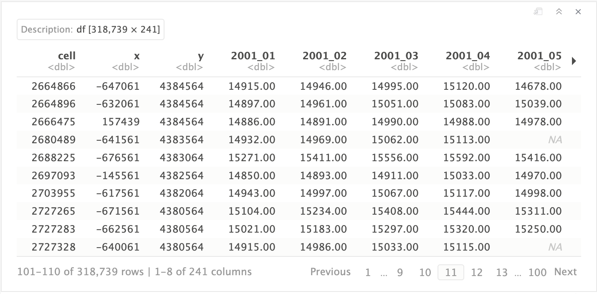{width=49%} 
</center>

- For each cell, we randomly select one observation from the 238-month dataset after excluding months with missing data.

#### Select a random value for each cell

```{r}
df <- landSurfaceTemp0.NA.dt

cl <- makeCluster(nbrCores) 
registerDoSNOW(cl)

# init the progress bar
pb <- txtProgressBar(max = 100, style = 3)
progress <- function(n) setTxtProgressBar(pb, n)
opts <- list(progress = progress)

# conduct the parallelisation
Result.list <- foreach(
  i = 1:(dim(df)[1])
  , .combine='rbind'
  , .packages=c('dplyr', 'tidyverse', 'data.table')
  , .options.snow = opts) %dopar% {
    df.i <- df[i,] %>% select_if(~ !any(is.na(.)))
    dim.df.i <- dim(df.i)[2]
    if (dim.df.i != 3) {
      # Choose randomly one month
      id.col <- sample(4:dim.df.i, 1)
      x1 <- colnames(df.i)[id.col]
      x2 <- df.i[1, id.col]
      Result.list <- c(df.i[1, 'cell'], df.i[1, 'x'], df.i[1, 'y'], x1, x2)
    }
    return(Result.list)
  }
# close progress bar
close(pb)
# stop cluster
stopCluster(cl) 

landSurfaceTemp0.NA.sample.dt <- Result.list %>% as.data.table()
colnames(landSurfaceTemp0.NA.sample.dt) <- c('cell', 'x', 'y', 'Month', 'LandSurfaceTemp0')
landSurfaceTemp0.NA.sample.dt$Month_nbr <- match(landSurfaceTemp0.NA.sample.dt$Month , ordered.names)

# Change class of certain columns
cols <- c('cell', 'x', 'y')
landSurfaceTemp0.NA.sample.dt <- landSurfaceTemp0.NA.sample.dt[ , (cols) := lapply(.SD, as.numeric), .SDcols = cols]

landSurfaceTemp0.NA.sample.dt
```

<center> 
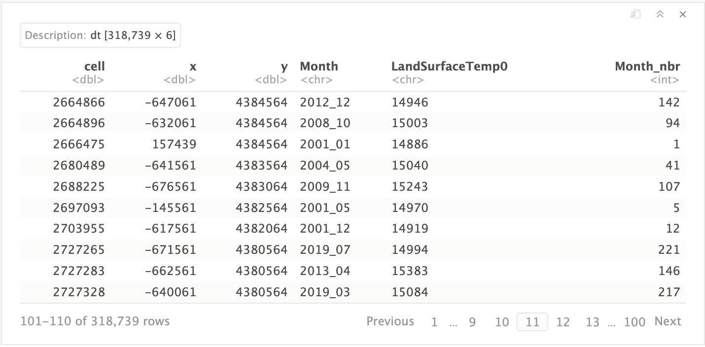{width=49%} 
</center>

Utilizing the 'Month_nbr' column from this table, we create a pattern for cells characterized by both 'No Fire’ and missing data in the *Land Surface Temperature* variable. 

#### Create a `SpatRaster` object for the Pattern of Cells with 'No Fire' and With Missing Data

```{r, message=FALSE}
landSurfaceTemp0.rand.NA.mask[is.na(landSurfaceTemp0.rand.NA.mask)] <- -1
landSurfaceTemp0.allcell.NA.dt <- terra::as.data.frame(landSurfaceTemp0.rand.NA.mask, xy=T, cells=T)
landSurfaceTemp0.allcell.NA.dt$x <- floor(landSurfaceTemp0.allcell.NA.dt$x)
landSurfaceTemp0.allcell.NA.dt$y <- floor(landSurfaceTemp0.allcell.NA.dt$y)
landSurfaceTemp0.allcell.NA.dt <- as.data.table(landSurfaceTemp0.allcell.NA.dt)

landSurfaceTemp0.allcell.NA.sample.dt <- merge(
  x=landSurfaceTemp0.allcell.NA.dt[, c('cell', 'x', 'y')], 
  y=landSurfaceTemp0.NA.sample.dt[, c('cell', 'x', 'y', 'Month_nbr')], 
  by = c('cell', 'x', 'y'), 
  all = TRUE)

values(landSurfaceTemp0.rand.NA.mask) <- landSurfaceTemp0.allcell.NA.sample.dt$Month_nbr
```

##### Plot

```{r}
myPlot(
  landSurfaceTemp0.rand.NA.mask
  , "Pattern of Cells with 'No Fire' and Missing Data"
  , paste0("Total number of cells = ", 
           formatC(length(cells(landSurfaceTemp0.rand.NA.mask)), format="f", big.mark=",", digits=0) )
  , theme = 1
  , b_size=20
) + 
  scale_fill_hypso_c(
    name = TeX(r"(Number of month)"),
    palette = "wiki-schwarzwald-cont", 
    na.value = "transparent")
```

<center> 
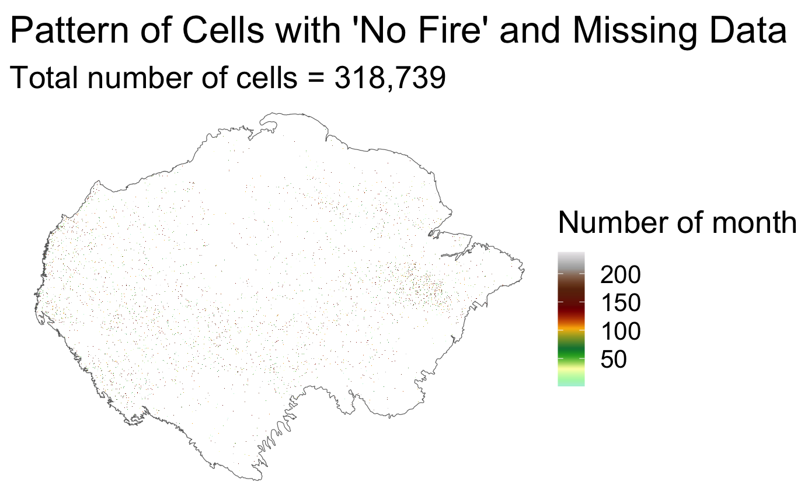{width=49%} 
</center>

### Merge Patterns of Cells With and Without missing data in 'Land Surface Temperature'

```{r, message=FALSE}
rand.p0.rast <- c(landSurfaceTemp0.ind.rand, landSurfaceTemp0.rand.NA.mask)
rand.p0.all.rast <- max(rand.p0.rast, na.rm = T)
```

#### Plot 

```{r}
# Plot
myPlot(
  rand.p0.all.rast
  , "Pattern of Cells with 'No Fire'"
  ,paste0("Total number of cells = ", 
           formatC(length(cells(rand.p0.all.rast)), format="f", big.mark=",", digits=0) )
  , theme = 1
  , b_size=20
) + 
  scale_fill_hypso_c(
    name = TeX(r"(Number of month)"),
    palette = "wiki-schwarzwald-cont", 
    na.value = "transparent")
```

<center> 
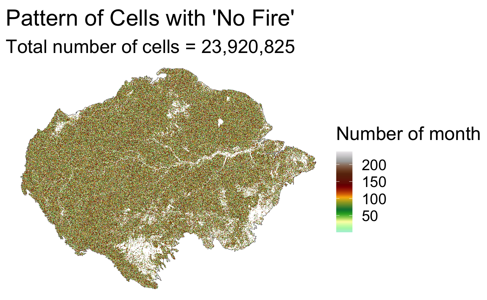{width=49%}
</center>

## Create a Pattern of Cells that can be 'Water/No Fire' Regions

For each cell, we extract its values for the variables *Burnt Area* and *Land Surface Temperature* across all months, and subsequently perform an intersection between the values of *Burnt Area* and *Land Surface Temperature*.

### Interction between *Burnt Area* and *Land Surface Temperature* 

```{r}
#Register cluster for parallel processing: Cores to use: all except 1
cl <- parallel::makeCluster(nbrCores)
doParallel::registerDoParallel(cl)

#Raster to datatable in parallel: one raster per thread
listDF <- 
  foreach (
    i=1:238,
    .packages=c('terra', 'sf', 'data.table'), 
    .combine='c') %dopar% {
      month.chr <- substr(ordered.names[i], 6, 7) %>% as.numeric() %>% as.character()
      year.chr <- substr(ordered.names[i], 1, 4) 
  
      # load data
      ras2.0 <- rast(paste0(path.data,"/1. Burnt Area/ras/ras2_0_ChangeWaterNofire.tif"))
      burntA.ras <- rast(paste0(path.data,"/1. Burnt Area/03. Working Data/burntarea_working_", year.chr, "_", month.chr, ".tif"))
      LandSurfTemp.ras <- rast(paste0(path.data,"/6. LandSurfaceTemp/03. Working Data/landsurftemp_working_", year.chr, "_", month.chr, ".tif"))
      
      # Select cells = -2
      burntA2.0.ras <- selectRange(burntA.ras, ras2.0) 
      burntA2.0.ras[burntA2.0.ras==-2] <- NA
      LandSurfTemp2.0.ras <- selectRange(LandSurfTemp.ras, ras2.0) 
      
      # Intersection of the two variables
      ras <- intersect(burntA2.0.ras, LandSurfTemp2.0.ras)
      ras[isFALSE(ras)] <- NA
      names(ras) <- paste0(year.chr, '_', month.chr)
      
      # Convert to data frame
      DT <- terra::as.data.frame(ras, xy=T, cells=T)
      
      # Modification of the data
      DT$x <- floor(DT$x)
      DT$y <- floor(DT$y)
  
      list(DT)
  }
stopCluster(cl)
intersc.burntA.LandSurfTemp.dt <- listDF %>% reduce(full_join, by=c('cell', 'x', 'y'))

intersc.burntA.LandSurfTemp.dt
```

<center> 
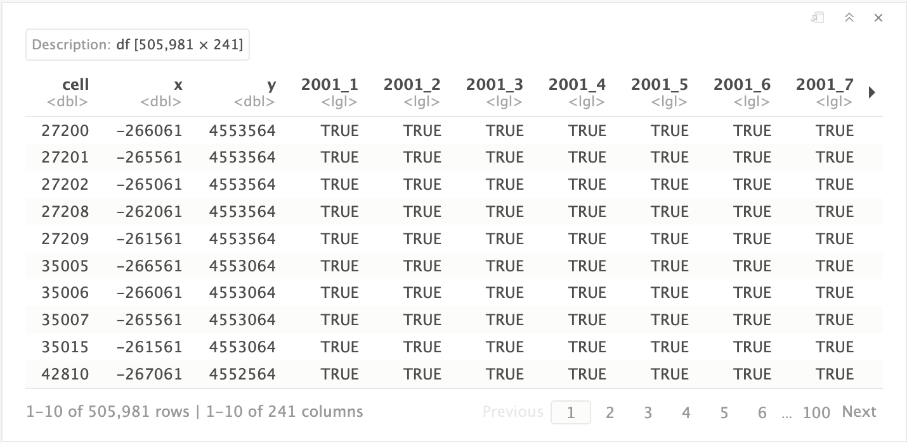{width=49%}
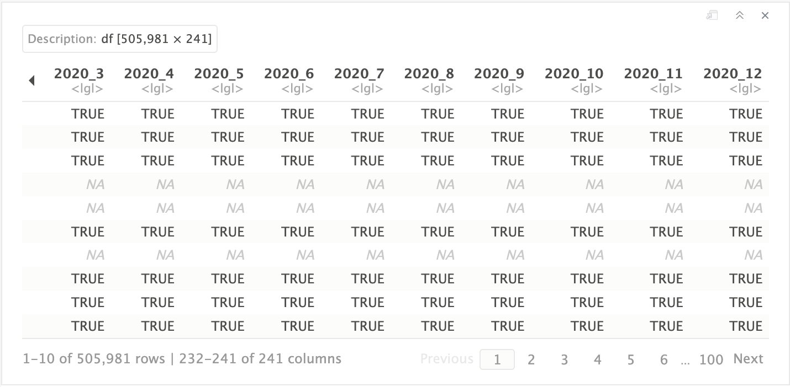{width=49%}
</center>

- For each cell, we randomly select one observation from the 238-month dataset after excluding months with missing data.

### Select a random month for each cell

```{r}
df <- intersc.burntA.LandSurfTemp.dt

cl <- makeCluster(nbrCores)
registerDoSNOW(cl)

# init the progress bar
pb <- txtProgressBar(max = 100, style = 3)
progress <- function(n) setTxtProgressBar(pb, n)
opts <- list(progress = progress)

# conduct the parallelisation
Result.list <- foreach(
  i = 1:(dim(df)[1])
  , .combine='rbind'
  , .packages=c('dplyr', 'tidyverse', 'data.table')
  , .options.snow = opts) %dopar% {
    df.i <- df[i,] %>% select_if(~ !any(is.na(.)))
    dim.df.i <- dim(df.i)[2]
    if (dim.df.i != 3) {
      id.col <- sample(4:dim.df.i, 1)
      x1 <- colnames(df.i)[id.col]
      x2 <- df.i[1, id.col]
      Result.list <- c(df.i[1, 'cell'], df.i[1, 'x'], df.i[1, 'y'], x1, x2)
      }
    return(Result.list)
  }
# close progress bar
close(pb)
# stop cluster
stopCluster(cl) 

# Add month numbers

intersc.burntA.LandSurfTemp.sample.dt <- Result.list %>% as.data.table()
colnames(intersc.burntA.LandSurfTemp.sample.dt) <- c('cell', 'x', 'y', 'Month', 'Intersc_BurntA_LandSurfTemp')
month.chr <- substr(intersc.burntA.LandSurfTemp.sample.dt$Month, 6, 7)
month.chr <- ifelse(nchar(month.chr)==1, paste0("0", month.chr), month.chr)
month.nbr <- paste0(substr(intersc.burntA.LandSurfTemp.sample.dt$Month, 1, 5), month.chr)
intersc.burntA.LandSurfTemp.sample.dt$Month0 <- month.nbr
intersc.burntA.LandSurfTemp.sample.dt$Month_nbr <- match(intersc.burntA.LandSurfTemp.sample.dt$Month0 , ordered.names)

# Change class of certain columns
cols <- c('cell', 'x', 'y')
intersc.burntA.LandSurfTemp.sample.dt <- intersc.burntA.LandSurfTemp.sample.dt[ , (cols) := lapply(.SD, as.numeric), .SDcols = cols]

intersc.burntA.LandSurfTemp.sample.dt
```

<center> 
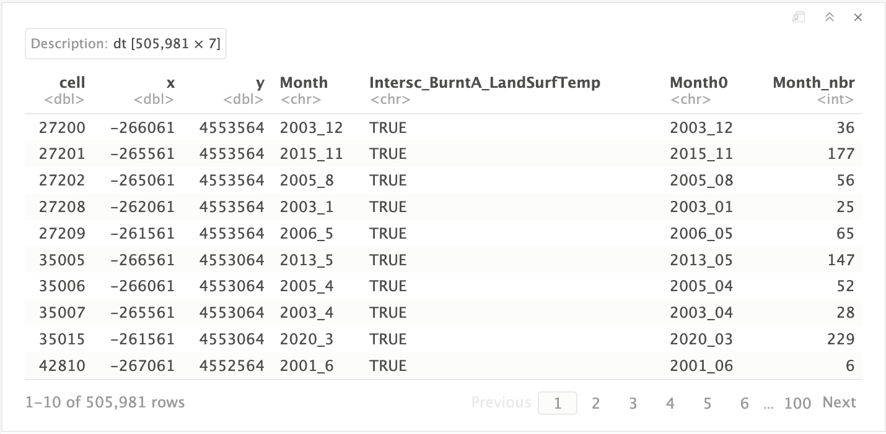{width=49%}
</center>

- Utilizing the 'Month_nbr' column from this table, we create a pattern for cells that could transition between 'Water' and 'No Fire'.

```{r, message=FALSE}
rand.p2.all.rast <- rast(paste0(my.path,"Amazon_new_data/1. Burnt Area/03. Working Data/burntarea_working_2001_1.tif"))
rand.p2.all.rast[is.na(rand.p2.all.rast)] <- -1
rand.p2.all.dt <- terra::as.data.frame(rand.p2.all.rast, xy=T, cells=T)
rand.p2.all.dt$x <- floor(rand.p2.all.dt$x); rand.p2.all.dt$y <- floor(rand.p2.all.dt$y)
rand.p2.all.dt <- as.data.table(rand.p2.all.dt)

intersc.burntA.LandSurfTemp.allcell.sample.dt <- merge(x=rand.p2.all.dt[, c('cell', 'x', 'y')], y=intersc.burntA.LandSurfTemp.sample.dt[, c('cell', 'x', 'y', 'Month_nbr')], by = c('cell', 'x', 'y'), all = TRUE)
intersc.burntA.LandSurfTemp.allcell.sample.dt

values(rand.p2.all.rast) <- intersc.burntA.LandSurfTemp.allcell.sample.dt$Month_nbr
```

#### Plot

```{r}
myPlot(
  rand.p2.all.rast
  , "Pattern Cells that can be 'Water/No Fire' Regions"
  ,paste0("Total number of cells = ", 
           formatC(length(cells(rand.p2.all.rast)), format="f", big.mark=",", digits=0) )
  , theme = 1
  , b_size=20
) + 
  scale_fill_hypso_c(
    name = TeX(r"(Number of month)"),
    palette = "wiki-schwarzwald-cont", 
    na.value = "transparent")
```

<center> 
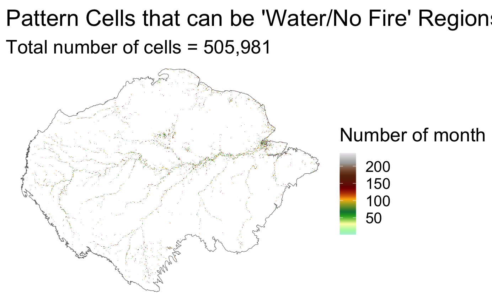{width=49%}
</center>

#-

# Merge the two pattern p0 and p2

```{r, message=FALSE}
rand.p0.p2.rast <- c(rand.p0.all.rast, rand.p2.all.rast)
rand.p0.p2.all.rast <- max(rand.p0.p2.rast, na.rm = T)

# Plot
myPlot(
  rand.p0.p2.all.rast
  , "Pattern of Cells with 'No Fire' Events"
  ,paste0("Total number of cells = ", 
           formatC(length(cells(rand.p0.p2.all.rast)), format="f", big.mark=",", digits=0) )
  , theme = 1
  , b_size=20
) + 
  scale_fill_hypso_c(
    name = TeX(r"(Number of month)"),
    palette = "wiki-schwarzwald-cont", 
    na.value = "transparent")
```

<center> 
{width=49%}
</center>

#-

- By applying this pattern to all variables, we create a data table comprising randomly chosen value for each variable within cells associated with 'No Fire' events.

# Create data for cells with 'No Fire' events and store it as a `spatRaster`.

```{r}
#--- BurntArea 0 ----

## 
names(rand.p0.p2.all.rast) <- 'Month_nbr'

## Load data and order layers
amaz.BurntArea.list <- list.files(burntArea.path, full.names=TRUE, pattern = ".tif$")
BurntArea.rast <- rast(amaz.BurntArea.list)
BurntArea.rast <- renameRast(BurntArea.rast, 'burntarea_working_', '')[[1]]
BurntArea.rast <- BurntArea.rast[[ordered.names]]
## 
BurntArea0.rast <- selectRange(BurntArea.rast, rand.p0.p2.all.rast)
names(BurntArea0.rast) <- 'BurntArea'

#--- LandCover 0 ----

## Load data and order layers
amaz.LandCover.list <- list.files(landCover.path, full.names=TRUE, pattern = ".tif$")
LandCover.rast <- rast(amaz.LandCover.list)
LandCover.rast <- renameRast(LandCover.rast, 'landcover_working_', '')[[1]]
LandCover.rast <- LandCover.rast[[ordered.names]]
## Select layer
LandCover0.rast <- selectRange(LandCover.rast, rand.p0.p2.all.rast)
names(LandCover0.rast) <- 'LandCover'

#--- Precipitation 0 ----

## Load data and order layers
amaz.Precipitation.list <- list.files(precip.path, full.names=TRUE, pattern = ".tif$")
Precipitation.rast <- rast(amaz.Precipitation.list)
Precipitation.rast <- renameRast(Precipitation.rast, 'precipitation_working_', '')[[1]]
Precipitation.rast <- Precipitation.rast[[ordered.names]]
## Select layer
Precipitation0.rast <- selectRange(Precipitation.rast, rand.p0.p2.all.rast)
names(Precipitation0.rast) <- 'Precipitation'

#--- SoilMoisture 0 ----

## Load data and order layers
amaz.SoilMoisture.list <- list.files(soilMoisture.path, full.names=TRUE, pattern = ".tif$")
SoilMoisture.rast <- rast(amaz.SoilMoisture.list)
SoilMoisture.rast <- renameRast(SoilMoisture.rast, 'soilmoisture_working_', '')[[1]]
SoilMoisture.rast <- SoilMoisture.rast[[ordered.names]]
## Select layer
SoilMoisture0.rast <- selectRange(SoilMoisture.rast, rand.p0.p2.all.rast)
names(SoilMoisture0.rast) <- 'SoilMoisture'
SoilMoisture0.rast[SoilMoisture0.rast < 0] <- NA  

#--- Elevation 0 ----

## Load data and order layers
Elevation.rast <- rast(paste0(my.path,"Amazon_new_data/5. Elevation/03. Working Data/elevation_working_2001_01.tif"))
p0.p2.all.1.rast <- rand.p0.p2.all.rast
p0.p2.all.1.rast[p0.p2.all.1.rast > 0] <- 1
## Select layer
Elevation0.rast <- selectRange(Elevation.rast, p0.p2.all.1.rast)
names(Elevation0.rast) <- 'Elevation'

#--- LandSurfaceTemp 0 ----

## Load data and order layers
amaz.LandSurfaceTemp.list <- list.files(LandSurfaceTemp.path, full.names=TRUE, pattern = ".tif$")
LandSurfaceTemp.rast <- rast(amaz.LandSurfaceTemp.list)
LandSurfaceTemp.rast <- renameRast(LandSurfaceTemp.rast, 'landsurftemp_working_', '')[[1]]
LandSurfaceTemp.rast <- LandSurfaceTemp.rast[[ordered.names]]
## Select layer
LandSurfaceTemp0.rast <- selectRange(LandSurfaceTemp.rast, rand.p0.p2.all.rast)
names(LandSurfaceTemp0.rast) <- 'LandSurfaceTemp'

#--- Specific Humidity 0 ----

## Load data and order layers
amaz.Humidity.list <- list.files(humidity.path, full.names=TRUE, pattern = ".tif$")
Humidity.rast <- rast(amaz.Humidity.list)
Humidity.rast <- renameRast(Humidity.rast, 'humidity_working_', '')[[1]]
Humidity.rast <- Humidity.rast[[ordered.names]]
## Select layer
Humidity0.rast <- selectRange(Humidity.rast, rand.p0.p2.all.rast)
names(Humidity0.rast) <- 'Humidity'

#--- Evapotranspiration 0 ----

## Load data and order layers
amaz.Evapotranspiration.list <- list.files(evapotranspiration.path, full.names=TRUE, pattern = ".tif$")
Evapotranspiration.rast <- rast(amaz.Evapotranspiration.list)
Evapotranspiration.rast <- renameRast(Evapotranspiration.rast, 'evapotranspiration_working_', '')[[1]]
Evapotranspiration.rast <- Evapotranspiration.rast[[ordered.names]]
## Select layer
Evapotranspiration0.rast <- selectRange(Evapotranspiration.rast, rand.p0.p2.all.rast)
names(Evapotranspiration0.rast) <- 'Evapotranspiration'

#--- Wind Speed 0 ----

## Load data and order layers
amaz.Wind.list <- list.files(wind.path, full.names=TRUE, pattern = ".tif$")
Wind.rast <- rast(amaz.Wind.list)
Wind.rast <- renameRast(Wind.rast, 'wind_working_', '')[[1]]
Wind.rast <- Wind.rast[[ordered.names]]
## Select layer
Wind0.rast <- selectRange(Wind.rast, rand.p0.p2.all.rast)
names(Wind0.rast) <- 'Wind'

#--- Air Temperature 0 ----

## Load data and order layers
amaz.AirTemp.list <- list.files(airtemp.path, full.names=TRUE, pattern = ".tif$")
AirTemp.rast <- rast(amaz.AirTemp.list) %>% renameRast(., 'airtemp_working_', '')[[1]]
AirTemp.rast <- AirTemp.rast[[ordered.names]]
## Select layer
AirTemp0.rast <- selectRange(AirTemp.rast, rand.p0.p2.all.rast)
names(AirTemp0.rast) <- 'AirTemp'

#--- Combine all the layers of covariates  for data 0 ----

Amazon.data0.rast <- 
  c(rand.p0.p2.all.rast,
    BurntArea0.rast, 
    LandCover0.rast, 
    Precipitation0.rast, 
    SoilMoisture0.rast, 
    Elevation0.rast,
    LandSurfaceTemp0.rast,
    Humidity0.rast,
    Evapotranspiration0.rast, 
    Wind0.rast,
    AirTemp0.rast
  )
Amazon.data0.rast
```

# Convert and save data to data.table

```{r}
#--- Convert spatRaster to DT ----
DT0 <- as.data.table(Amazon.data0.rast, cells = T, xy=T)

DT00 <- DT0 %>% 
  mutate(
    x = floor(x),
    y = floor(y),
    Year = ordered.names[Month_nbr] %>% substr(., start = 1, stop = 4) %>% as.numeric() %>% as.factor(),
    Month = ordered.names[Month_nbr] %>% substr(., start = 6, stop = 7) %>% as.numeric() %>% as.factor(),
    BurntArea = as.factor(BurntArea),
    LandCover = as.factor(LandCover),
    Month_nbr = NULL
  ) %>%
  setcolorder(., c('cell', 'x', 'y', 'Year', 'Month'))

#--- Remove the `NA` values ----
Amazon.data0.dt <- na.omit(DT00)
Amazon.data0.dt
```

<center> 
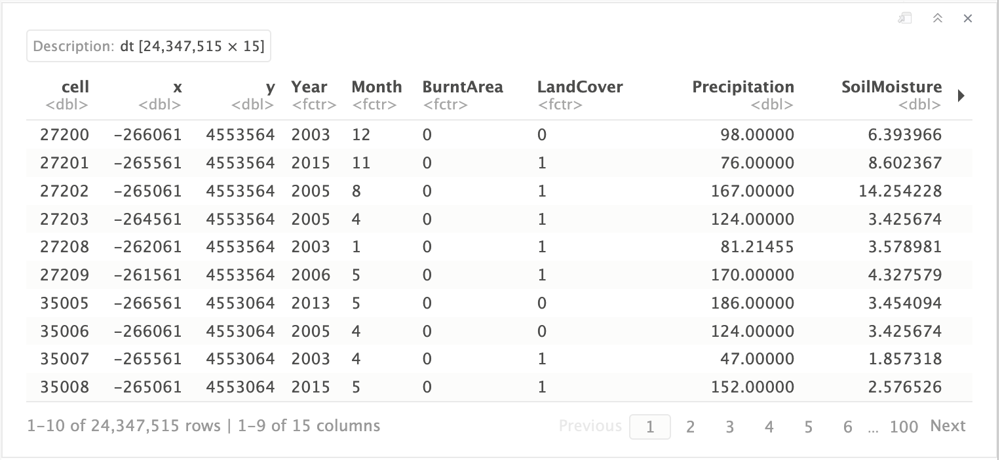{width=49%}
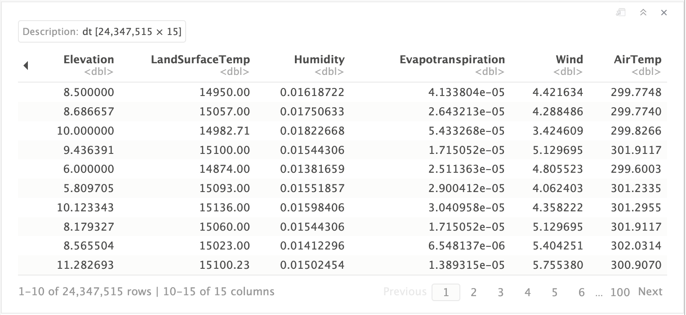{width=49%}
</center>

#-

# Create datatable for cells with at least one 'Fire' event

- For these cells, we retain the values of all variables, excluding any cells with missing data.

## Burnt Area 1

```{r}
library(doSNOW)
library(itertools)

#--- list of files
amaz.var.list <- list.files(burntArea.path, full.names=TRUE, pattern = ".tif$")

cl <- snow::makeCluster(nbrCores); registerDoSNOW(cl)

#--- init the progress bar
pb <- txtProgressBar(max = 100, style = 3)
progress <- function(n) setTxtProgressBar(pb, n)
opts <- list(progress = progress)

#--- conduct the parallelisation
BurntArea1.dt <- 
  foreach(
    ras_id=amaz.var.list,
    .combine='rbind',
    .packages=c('terra', 'sf', 'data.table', 'dplyr', 'tidyverse', 'data.table'),
    .options.snow = opts) %dopar% 
  {
    # Read and rename raster
    ras.Y.M <- rast(ras_id) %>% renameRast(., 'burntarea_working_', '')
    ras <- ras.Y.M[[1]]
    
    # select data
    ras1.fires <- rast(paste0(my.path,"Amazon_new_data/1. Burnt Area/ras/ras1_fires.tif"))
    ras_1 <- selectRange(ras, ras1.fires)
    ras_1[ras_1 < 0] <- NA
    names(ras_1) <- 'BurntArea'
    
    # convert to data table
    DT <- as.data.table(ras_1, cell=T, xy=T)
    DT <- DT %>%
      mutate(
        x = floor(x),
        y = floor(y),
        Year = rep(ras.Y.M[[2]], dim(DT)[1]) %>% as.factor(),
        Month = rep(ras.Y.M[[3]], dim(DT)[1]) %>% as.factor(),
        BurntArea = as.factor(BurntArea)
      ) %>%
      na.omit() %>%
      setcolorder(., c('cell', 'x', 'y', 'Year', 'Month'))
    return(DT)
  }

#--- close progress bar
close(pb)
# stop cluster
snow::stopCluster(cl) 

#--- Merge data
Amazon.data1.dt <- BurntArea1.dt
```

## LandCover 1

```{r}
library(doSNOW)
library(itertools)

#--- list of files
amaz.var.list <- list.files(landCover.path, full.names=TRUE, pattern = ".tif$")   

cl <- snow::makeCluster(nbrCores); registerDoSNOW(cl)

#--- init the progress bar
pb <- txtProgressBar(max = 100, style = 3)
progress <- function(n) setTxtProgressBar(pb, n)
opts <- list(progress = progress)

#--- conduct the parallelisation
LandCover1.dt <-
  foreach(
    ras_id=amaz.var.list,
    .combine='rbind',
    .packages=c('terra', 'sf', 'data.table', 'dplyr', 'tidyverse', 'data.table'),
    .options.snow = opts) %dopar% 
  {
    # Read and rename raster
    ras.Y.M <- rast(ras_id) %>% renameRast(., 'landcover_working_', '')
    ras <- ras.Y.M[[1]]
    
    # select data
    ras1.fires <- rast(paste0(my.path,"Amazon_new_data/1. Burnt Area/ras/ras1_fires.tif"))
    ras_1 <- selectRange(ras, ras1.fires)
    names(ras_1) <- 'LandCover'             
    
    # convert to data table
    DT <- as.data.table(ras_1, cell=T, xy=T)
    DT <- DT %>%
      mutate(
        x = floor(x),
        y = floor(y),
        Year = rep(ras.Y.M[[2]], dim(DT)[1]) %>% as.factor(),
        Month = rep(ras.Y.M[[3]], dim(DT)[1]) %>% as.factor(),
        LandCover = as.factor(LandCover)  
      ) %>%
      na.omit() %>%
      setcolorder(., c('cell', 'x', 'y', 'Year', 'Month'))
    return(DT)
  }

#--- close progress bar
close(pb)
# stop cluster
snow::stopCluster(cl) 

#--- Merge data
Amazon.data1.dt <- merge(x = Amazon.data1.dt, y = LandCover1.dt, by = c("cell", "x", "y", "Year", "Month"))
```

## Precipitation 1

```{r}
library(doSNOW)
library(itertools)

#--- list of files
amaz.var.list <- list.files(precip.path, full.names=TRUE, pattern = ".tif$") 

cl <- snow::makeCluster(nbrCores); registerDoSNOW(cl)

#--- init the progress bar
pb <- txtProgressBar(max = 100, style = 3)
progress <- function(n) setTxtProgressBar(pb, n)
opts <- list(progress = progress)

#--- conduct the parallelisation
Precipitation1.dt <-               
  foreach(
    ras_id=amaz.var.list,
    .combine='rbind',
    .packages=c('terra', 'sf', 'data.table', 'dplyr', 'tidyverse', 'data.table'),
    .options.snow = opts) %dopar% 
  {
    # Read and rename raster
    ras.Y.M <- rast(ras_id) %>% renameRast(., 'precipitation_working_', '')
    ras <- ras.Y.M[[1]]
    
    # select data
    ras1.fires <- rast(paste0(my.path,"Amazon_new_data/1. Burnt Area/ras/ras1_fires.tif"))
    ras_1 <- selectRange(ras, ras1.fires)
    names(ras_1) <- 'Precipitation'    
    
    # convert to data table
    DT <- as.data.table(ras_1, cell=T, xy=T)
    DT <- DT %>%
      mutate(
        x = floor(x),
        y = floor(y),
        Year = rep(ras.Y.M[[2]], dim(DT)[1]) %>% as.factor(),
        Month = rep(ras.Y.M[[3]], dim(DT)[1]) %>% as.factor(),
      ) %>%
      na.omit() %>%
      setcolorder(., c('cell', 'x', 'y', 'Year', 'Month'))
    return(DT)
  }

#--- close progress bar
close(pb)
# stop cluster
snow::stopCluster(cl) 

#--- Merge data
Amazon.data1.dt <- merge(x = Amazon.data1.dt, y = Precipitation1.dt, by = c("cell", "x", "y", "Year", "Month"))
```

## SoilMoisture 1

```{r}
library(doSNOW)
library(itertools)

#--- list of files
amaz.var.list <- list.files(soilMoisture.path, full.names=TRUE, pattern = ".tif$")  

cl <- snow::makeCluster(nbrCores); registerDoSNOW(cl)

#--- init the progress bar
pb <- txtProgressBar(max = 100, style = 3)
progress <- function(n) setTxtProgressBar(pb, n)
opts <- list(progress = progress)

#--- conduct the parallelisation
SoilMoisture1.dt <-                  
  foreach(
    ras_id=amaz.var.list, 
    .combine='rbind',
    .packages=c('terra', 'sf', 'data.table', 'dplyr', 'tidyverse', 'data.table'),
    .options.snow = opts) %dopar% 
  {
    # Read and rename raster
    ras.Y.M <- rast(ras_id) %>% renameRast(., 'soilmoisture_working_', '')
    ras <- ras.Y.M[[1]]
    
    # select data
    ras1.fires <- rast(paste0(my.path,"Amazon_new_data/1. Burnt Area/ras/ras1_fires.tif"))
    ras_1 <- selectRange(ras, ras1.fires)
    names(ras_1) <- 'SoilMoisture'             
    # Remove negative values. 
    ras_1[ras_1 < 0] <- NA
    
    # convert to data table
    DT <- as.data.table(ras_1, cell=T, xy=T)
    DT <- DT %>%
      mutate(
        x = floor(x),
        y = floor(y),
        Year = rep(ras.Y.M[[2]], dim(DT)[1]) %>% as.factor(),
        Month = rep(ras.Y.M[[3]], dim(DT)[1]) %>% as.factor(),
      ) %>%
      na.omit() %>%
      setcolorder(., c('cell', 'x', 'y', 'Year', 'Month'))
    return(DT)
  }

#--- close progress bar
close(pb)
# stop cluster
snow::stopCluster(cl) 

#--- Merge data
Amazon.data1.dt <- merge(x = Amazon.data1.dt, y = SoilMoisture1.dt, by = c("cell", "x", "y", "Year", "Month"))
```

## Elevation 1

```{r}
library(doSNOW)
library(itertools)

#--- list of files
amaz.var.list <- list.files(elevation.path, full.names=TRUE, pattern = ".tif$")  

cl <- snow::makeCluster(nbrCores); registerDoSNOW(cl)

#--- init the progress bar
pb <- txtProgressBar(max = 100, style = 3)
progress <- function(n) setTxtProgressBar(pb, n)
opts <- list(progress = progress)

#--- conduct the parallelisation
Elevation1.dt <-
  foreach(
    ras_id=amaz.var.list,
    .combine='rbind',
    .packages=c('terra', 'sf', 'data.table', 'dplyr', 'tidyverse', 'data.table'),
    .options.snow = opts) %dopar% 
  {
    # Read and rename raster
    ras.Y.M <- rast(ras_id) %>% renameRast(., 'elevation_working_', '')
    ras <- ras.Y.M[[1]]
    
    # select data
    ras1.fires <- rast(paste0(my.path,"Amazon_new_data/1. Burnt Area/ras/ras1_fires.tif"))
    ras_1 <- selectRange(ras, ras1.fires)
    names(ras_1) <- 'Elevation'
    
    # convert to data table
    DT <- as.data.table(ras_1, cell=T, xy=T)
    DT <- DT %>%
      mutate(
        x = floor(x),
        y = floor(y),
        Year = rep(ras.Y.M[[2]], dim(DT)[1]) %>% as.factor(),
        Month = rep(ras.Y.M[[3]], dim(DT)[1]) %>% as.factor(),
      ) %>%
      na.omit() %>%
      setcolorder(., c('cell', 'x', 'y', 'Year', 'Month'))
    return(DT)
  }

# close progress bar
close(pb)
#--- stop cluster
snow::stopCluster(cl) 

#--- Merge data
Amazon.data1.dt <- merge(x = Amazon.data1.dt, y = Elevation1.dt, by = c("cell", "x", "y", "Year", "Month"))
```

## LandSurfaceTemp 1

```{r}
library(doSNOW)
library(itertools)

#--- list of files
amaz.var.list <- list.files(LandSurfaceTemp.path, full.names=TRUE, pattern = ".tif$")   

cl <- snow::makeCluster(nbrCores); registerDoSNOW(cl)

#--- init the progress bar
pb <- txtProgressBar(max = 100, style = 3)
progress <- function(n) setTxtProgressBar(pb, n)
opts <- list(progress = progress)

#--- conduct the parallelisation
LandSurfaceTemp1.dt <-
  foreach(
    ras_id=amaz.var.list, 
    .combine='rbind',
    .packages=c('terra', 'sf', 'data.table', 'dplyr', 'tidyverse', 'data.table'),
    .options.snow = opts) %dopar% 
  {
    # Read and rename raster
    ras.Y.M <- rast(ras_id) %>% renameRast(., 'landsurftemp_working_', '')
    ras <- ras.Y.M[[1]]
    
    # select data
    ras1.fires <- rast(paste0(my.path,"Amazon_new_data/1. Burnt Area/ras/ras1_fires.tif"))
    ras_1 <- selectRange(ras, ras1.fires)
    names(ras_1) <- 'LandSurfaceTemp'
    
    # convert to data table
    DT <- as.data.table(ras_1, cell=T, xy=T)
    DT <- DT %>%
      mutate(
        x = floor(x),
        y = floor(y),
        Year = rep(ras.Y.M[[2]], dim(DT)[1]) %>% as.factor(),
        Month = rep(ras.Y.M[[3]], dim(DT)[1]) %>% as.factor(),
      ) %>%
      na.omit() %>%
      setcolorder(., c('cell', 'x', 'y', 'Year', 'Month'))
    return(DT)
  }

#--- close progress bar
close(pb)
# stop cluster
snow::stopCluster(cl) 

#--- Merge data
Amazon.data1.dt <- merge(x = Amazon.data1.dt, y = LandSurfaceTemp1.dt, by = c("cell", "x", "y", "Year", "Month"))
```

## Specific Humidity 1

```{r}
library(doSNOW)
library(itertools)

#--- list of files
amaz.var.list <- list.files(humidity.path, full.names=TRUE, pattern = ".tif$")

cl <- snow::makeCluster(nbrCores); registerDoSNOW(cl)

#--- init the progress bar
pb <- txtProgressBar(max = 100, style = 3)
progress <- function(n) setTxtProgressBar(pb, n)
opts <- list(progress = progress)

#--- conduct the parallelisation
Humidity1.dt <-
  foreach(
    ras_id=amaz.var.list, 
    .combine='rbind',
    .packages=c('terra', 'sf', 'data.table', 'dplyr', 'tidyverse', 'data.table'),
    .options.snow = opts) %dopar% 
  {
    # Read and rename raster
    ras.Y.M <- rast(ras_id) %>% renameRast(., 'humidity_working_', '')
    ras <- ras.Y.M[[1]]
    
    # select data
    ras1.fires <- rast(paste0(my.path,"Amazon_new_data/1. Burnt Area/ras/ras1_fires.tif"))
    ras_1 <- selectRange(ras, ras1.fires)
    names(ras_1) <- 'Humidity'
    
    # convert to data table
    DT <- as.data.table(ras_1, cell=T, xy=T)
    DT <- DT %>%
      mutate(
        x = floor(x),
        y = floor(y),
        Year = rep(ras.Y.M[[2]], dim(DT)[1]) %>% as.factor(),
        Month = rep(ras.Y.M[[3]], dim(DT)[1]) %>% as.factor(),
      ) %>%
      na.omit() %>%
      setcolorder(., c('cell', 'x', 'y', 'Year', 'Month'))
    return(DT)
  }

#--- close progress bar
close(pb)
# stop cluster
snow::stopCluster(cl) 

#--- Merge data
Amazon.data1.dt <- merge(x = Amazon.data1.dt, y = Humidity1.dt, by = c("cell", "x", "y", "Year", "Month"))

```

## Evapotranspiration 1

```{r}
library(doSNOW)
library(itertools)

#--- list of files
amaz.var.list <- list.files(evapotranspiration.path, full.names=TRUE, pattern = ".tif$")

cl <- snow::makeCluster(nbrCores); registerDoSNOW(cl)

#--- init the progress bar
pb <- txtProgressBar(max = 100, style = 3)
progress <- function(n) setTxtProgressBar(pb, n)
opts <- list(progress = progress)

#--- conduct the parallelisation
Evapotranspiration1.dt <-
  foreach(
    ras_id=amaz.var.list, 
    .combine='rbind',
    .packages=c('terra', 'sf', 'data.table', 'dplyr', 'tidyverse', 'data.table'),
    .options.snow = opts) %dopar% 
  {
    # Read and rename raster
    ras.Y.M <- rast(ras_id) %>% renameRast(., 'evapotranspiration_working_', '')
    ras <- ras.Y.M[[1]]
    
    # select data
    ras1.fires <- rast(paste0(my.path,"Amazon_new_data/1. Burnt Area/ras/ras1_fires.tif"))
    ras_1 <- selectRange(ras, ras1.fires)
    names(ras_1) <- 'Evapotranspiration'
    
    # convert to data table
    DT <- as.data.table(ras_1, cell=T, xy=T)
    DT <- DT %>%
      mutate(
        x = floor(x),
        y = floor(y),
        Year = rep(ras.Y.M[[2]], dim(DT)[1]) %>% as.factor(),
        Month = rep(ras.Y.M[[3]], dim(DT)[1]) %>% as.factor(),
      ) %>%
      na.omit() %>%
      setcolorder(., c('cell', 'x', 'y', 'Year', 'Month'))
    return(DT)
  }

#--- close progress bar
close(pb)
# stop cluster
snow::stopCluster(cl) 

#--- Merge data
Amazon.data1.dt <- merge(x = Amazon.data1.dt, y = Evapotranspiration1.dt, by = c("cell", "x", "y", "Year", "Month"))
```

## Wind Speed 1

```{r}
library(doSNOW)
library(itertools)

#--- list of files
amaz.var.list <- list.files(wind.path, full.names=TRUE, pattern = ".tif$")  

cl <- snow::makeCluster(nbrCores); registerDoSNOW(cl)

#--- init the progress bar
pb <- txtProgressBar(max = 100, style = 3)
progress <- function(n) setTxtProgressBar(pb, n)
opts <- list(progress = progress)

#--- conduct the parallelisation
Wind1.dt <-
  foreach(
    ras_id=amaz.var.list,
    .combine='rbind',
    .packages=c('terra', 'sf', 'data.table', 'dplyr', 'tidyverse', 'data.table'),
    .options.snow = opts) %dopar% 
  {
    # Read and rename raster
    ras.Y.M <- rast(ras_id) %>% renameRast(., 'wind_working_', '')
    ras <- ras.Y.M[[1]]
    
    # select data
    ras1.fires <- rast(paste0(my.path,"Amazon_new_data/1. Burnt Area/ras/ras1_fires.tif"))
    ras_1 <- selectRange(ras, ras1.fires)
    names(ras_1) <- 'Wind'
    
    # convert to data table
    DT <- as.data.table(ras_1, cell=T, xy=T)
    DT <- DT %>%
      mutate(
        x = floor(x),
        y = floor(y),
        Year = rep(ras.Y.M[[2]], dim(DT)[1]) %>% as.factor(),
        Month = rep(ras.Y.M[[3]], dim(DT)[1]) %>% as.factor(),
      ) %>%
      na.omit() %>%
      setcolorder(., c('cell', 'x', 'y', 'Year', 'Month'))
    return(DT)
  }

#--- close progress bar
close(pb)
# stop cluster
snow::stopCluster(cl) 

#--- Merge data
Amazon.data1.dt <- merge(x = Amazon.data1.dt, y = Wind1.dt, by = c("cell", "x", "y", "Year", "Month"))
```

## Air Temperature 1

```{r}
library(doSNOW)
library(itertools)

#--- list of files
amaz.var.list <- list.files(airtemp.path, full.names=TRUE, pattern = ".tif$") 

cl <- snow::makeCluster(nbrCores); registerDoSNOW(cl)

#--- init the progress bar
pb <- txtProgressBar(max = 100, style = 3)
progress <- function(n) setTxtProgressBar(pb, n)
opts <- list(progress = progress)

#--- conduct the parallelisation
AirTemp1.dt <-
  foreach(
    ras_id=amaz.var.list, 
    .combine='rbind',
    .packages=c('terra', 'sf', 'data.table', 'dplyr', 'tidyverse', 'data.table'),
    .options.snow = opts) %dopar% 
  {
    # Read and rename raster
    ras.Y.M <- rast(ras_id) %>% renameRast(., 'airtemp_working_', '')
    ras <- ras.Y.M[[1]]
    
    # select data
    ras1.fires <- rast(paste0(my.path,"Amazon_new_data/1. Burnt Area/ras/ras1_fires.tif"))
    ras_1 <- selectRange(ras, ras1.fires)
    names(ras_1) <- 'AirTemp'
    
    # convert to data table
    DT <- as.data.table(ras_1, cell=T, xy=T)
    DT <- DT %>%
      mutate(
        x = floor(x),
        y = floor(y),
        Year = rep(ras.Y.M[[2]], dim(DT)[1]) %>% as.factor(),
        Month = rep(ras.Y.M[[3]], dim(DT)[1]) %>% as.factor(),
      ) %>%
      na.omit() %>%
      setcolorder(., c('cell', 'x', 'y', 'Year', 'Month'))
    return(DT)
  }

#--- close progress bar
close(pb)
# stop cluster
snow::stopCluster(cl) 

#--- Merge data
Amazon.data1.dt <- merge(x = Amazon.data1.dt, y = AirTemp1.dt, by = c("cell", "x", "y", "Year", "Month"))
```

# Save datatable 1

```{r}
#--- Save data 1
# save(Amazon.data1.dt, file = paste0(my.path,"Amazon_selected_data/Amazon_data1_dt.Rdata"))
load(paste0(my.path,"Amazon_selected_data/Amazon_data1_dt.Rdata"))
Amazon.data1.dt

#--- Remove unused DT
rm(BurntArea1.dt, LandCover1.dt, Precipitation1.dt, SoilMoisture1.dt, Elevation1.dt, LandSurfaceTemp1.dt, Humidity1.dt, Evapotranspiration1.dt, Wind1.dt, AirTemp1.dt)
gc()
```

#-

# Merging the data from "Cells with at Least One 'Fire' Event" and "Cells with 'No Fire' Events"

```{r}
Amazon.data.dt <- rbind(Amazon.data0.dt, Amazon.data1.dt)
```

#-

# Prepare Data

## Defining zones and partitioning data based on these zones.

```{r}
v <- ext(amaz.basin.shp)
x.min <- v$xmin[[1]] - 1; x.max <- v$xmax[[1]] + 1; 
y.min <- v$ymin[[1]] - 1; y.max <- v$ymax[[1]] + 1; 

# Defining zones
XY <- list(
  c(    x.min, -0.84e+06,    y.min,    y.max),  # z1
  c(-0.84e+06, +0.55e+06, 3.75e+06,    y.max),  # z2
  c(-0.84e+06, +0.55e+06, 2.60e+06, 3.75e+06),  # z3
  c(-0.84e+06, -0.05e+06, 2.22e+06, 2.60e+06),  # z4
  c(-0.84e+06, -0.51e+06,    y.min, 2.22e+06),  # z5
  c(-0.51e+06, -0.05e+06,    y.min, 2.22e+06),  # z6
  c(-0.05e+06,  0.60e+06,    y.min, 2.60e+06),  # z7
  c( 0.60e+06,  0.95e+06,    y.min, 2.60e+06),  # z8
  c(+0.55e+06,     x.max, 3.24e+06,    y.max),  # z9
  c(+0.55e+06,     x.max, 2.86e+06, 3.24e+06),  # z10
  c(+0.55e+06,  0.95e+06,    x.max,     y.min, 2.60e+06, 2.86e+06)  # z11
)

# number of zones
nz <- length(XY)
# Create column 'Zones'
Amazon.data.dt[, Zones := 0.0]
Amazon.data.dt %>% setcolorder(., c('cell', 'x', 'y', 'Zones', 'Year', 'Month'))

# Assigning zone numbers to cells 
for (i in 1:nz){
  cat("Zone", i, "/", nz, " - ")
  if (i == nz){
    Amazon.data.dt[((x > XY[[i]][2] & x <= XY[[i]][3]) & (y > XY[[i]][4] & y <= XY[[i]][5])) | 
                     ((x > XY[[i]][1] & x <= XY[[i]][3]) & (y > XY[[i]][5] & y <= XY[[i]][6])), Zones := i]
  }else{
    Amazon.data.dt[(x > XY[[i]][1] & x <= XY[[i]][2]) & (y > XY[[i]][3] & y <= XY[[i]][4]), Zones := i]
  }
}
# Convert the column 'Zones' as factor
Amazon.data.dt$Zones <- as.factor(Amazon.data.dt$Zones)

# Save data with zones
save(Amazon.data.dt, file = paste0(path.data,"Amazon_selected_data/Amazon_zones_dt.Rdata"))
```

## Normalize data

```{r}
# Remove the column 'cell'
Amazon.data.dt <- Amazon.data.dt[, c('cell'):=NULL]
# recipe
AZ_recipe <- recipe( BurntArea ~ ., data = Amazon.data.dt) %>% step_normalize(all_numeric(), -c(x, y))
# Normalize data
AZ.norm <- AZ_recipe %>% prep() %>% bake(new_data = NULL) %>% setcolorder(., c('Zones', 'x', 'y', 'Year', 'Month', 'BurntArea'))
# Clean
rm(AZ_recipe); gc()
```

## Split data to training and testing data by zone

Recognizing the imbalanced distribution of the response variable *Burnt Area*, it is imperative to maintain a comparable proportion of cells with 'No Fire' event (0) and cells with 'Fire' event (1) in both the training and testing datasets, particularly within each zone. 

To achieve this balance, I employed the `initial_split()` function from the $\texttt{rsample}$ package, setting the split ratio to 75% for training data and 25% for testing data. Specifically, I leveraged the `strata = BurntArea` option to ensure a stratified split, guaranteeing an equitable representation of the response variable in both the training and testing datasets across all zones.

```{r}
# Number of zones
nz <- AZ.norm$Zones %>% levels() %>% length() 
# Split data
for  (zone in 1:nz){
  cat(" - Zone", zone)
  AZ.nz <- AZ.norm[AZ.norm$Zones == zone,]
  # Split data
  split <- initial_split(AZ.nz, prop = 0.75, strata = BurntArea)
  AZ.trn <- training(split)
  AZ.tst <- testing(split)
  # Save data
  save(AZ.nz, AZ.trn, AZ.tst, file = paste0(path.data,"/Amazon_selected_data/data_by_zones/AZ", zone, "_data_train_test.Rdata"))
  rm(AZ.nz, AZ.trn, AZ.tst)
}
```


