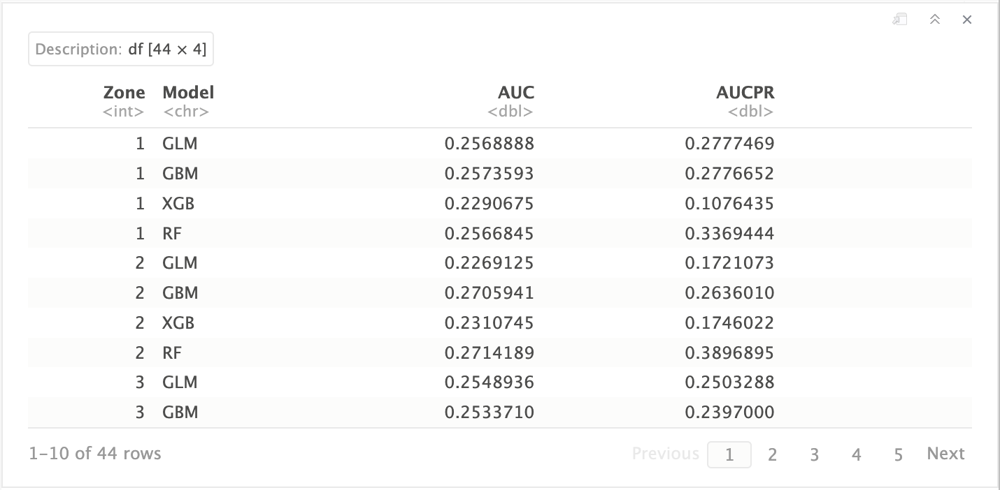

# Load libraries

```{r warning=FALSE, message=FALSE}
library(terra)
library(sf)
library(tidyverse)
library(data.table)
# library(dplyr)
# library(gdata)
library(pROC)
# Parallel
library(foreach)
library(doSNOW)
library(parallel)
library(itertools)
# Cross Validation
library(rsample)
library(recipes)
# # Plot
# library(RColorBrewer)
# library(tidyterra)
# library(scico)
# library(wesanderson)
# library(viridis)
# library(scales)
# library(ggforce)
# library(lubridate)
# library(timetk)
# # library(latex2exp)
# library(ggplot2)
# library(plotly)
# # Time
# library(tictoc)
# library(gdata)
```

# Function

```{r}
#---- 'splitAmaZones' Function ----
splitAmaZones <- function(Amazon.data.dt, amaz.basin.shp){
  v <- ext(amaz.basin.shp)
  x.min <- v$xmin[[1]] - 1; x.max <- v$xmax[[1]] + 1; 
  y.min <- v$ymin[[1]] - 1; y.max <- v$ymax[[1]] + 1; 
  
  # Defining zones
  XY <- list(
    c(x.min, -0.84e+06, y.min, y.max),                       #  z1
    c(-0.84e+06, +0.55e+06, 3.75e+06, y.max),                #  z2
    c(-0.84e+06, +0.55e+06, 2.6e+06, 3.75e+06),              #  z3
    c(-0.84e+06, -0.05e+06, 2.22e+06, 2.6e+06),              #  z4
    c(-0.84e+06, -0.51e+06, y.min, 2.22e+06),                #  z5
    c(-0.51e+06, -0.05e+06, y.min, 2.22e+06),                #  z6
    c(-0.05e+06, 0.6e+06, y.min, 2.6e+06),                   #  z7
    c(0.6e+06, 0.95e+06, y.min, 2.6e+06),                    #  z8
    c(+0.55e+06, x.max, 3.24e+06, y.max),                    #  z9
    c(+0.55e+06, x.max, 2.86e+06, 3.24e+06),                 # z10
    c(+0.55e+06, 0.95e+06, x.max, y.min, 2.6e+06, 2.86e+06)  # z11
  )
  
  # number of zones
  nz <- length(XY)
  # Create column 'Zones'
  Amazon.data.dt[, Zones := 0.0]
  Amazon.data.dt %>% setcolorder(., c('cell', 'x', 'y', 'Zones', 'Year', 'Month'))
  
  # Assigning zone numbers to cells 
  for (i in 1:nz){
    cat("Zone", i, "/", nz, " - ")
    if (i == nz){
      Amazon.data.dt[((x > XY[[i]][2] & x <= XY[[i]][3]) & (y > XY[[i]][4] & y <= XY[[i]][5])) | 
                       ((x > XY[[i]][1] & x <= XY[[i]][3]) & (y > XY[[i]][5] & y <= XY[[i]][6])), Zones := i]
    }else{
      Amazon.data.dt[(x > XY[[i]][1] & x <= XY[[i]][2]) & (y > XY[[i]][3] & y <= XY[[i]][4]), Zones := i]
    }
  }
  # Convert the column 'Zones' as factor
  Amazon.data.dt$Zones <- as.factor(Amazon.data.dt$Zones)
  return(Amazon.data.dt)
}
```

# Initialization

```{r}
# my.path <- "~/Documents/"
my.path <- "/Users/abid.med/Documents/Data_ScienceTech_Institute/00.Intership/Project/Code_official_data"
path.data <- paste0(my.path, "/Amazon_new_data")

# path of variables
burntArea.path <- paste0(path.data,"/1. Burnt Area/03. Working Data")
landCover.path <- paste0(path.data,"/2. Land Cover/03. Working Data")
precip.path <- paste0(path.data,"/3. Precipitation/03. Working Data")
soilMoisture.path <- paste0(path.data,"/4. Soil Moisture/03. Working Data")
elevation.path <- paste0(path.data,"/5. Elevation/03. Working Data")
LandSurfaceTemp.path <- paste0(path.data,"/6. LandSurfaceTemp/03. Working Data")
humidity.path <- paste0(path.data,"/7. Specific Humidity/03. Working Data")
evapotranspiration.path <- paste0(path.data,"/8. Evapotranspiration/03. Working Data")
wind.path <- paste0(path.data,"/9. Wind Speed/03. Working Data")
airtemp.path <- paste0(path.data,"/10. Air Temperature/03. Working Data")

# Create a sequence date
seq.dates <- seq(as.Date("2001-1-1"), as.Date("2020-12-1"), by = "month")

# Create name of layers
ordered.names <- format(seq.dates, '%Y_%m') %>% setdiff(., c("2012_07", "2012_09"))
seq.dates.238 <- paste0(ordered.names, '_01') %>% 
  gsub("_", "-", .) %>%
  as.Date()
# Import shape file
amaz.basin.shp <- st_read(
  paste0(path.data,"/0. Amazon_shapefile/projected/amazon_shp_projected.shp"), quiet = TRUE)

# Number of cores to use
nbrCores <- detectCores() - 1
# nbrCores <- 50

# Color palette
my.colors <- c("mediumblue", "mediumseagreen", "firebrick")
```

```{r}
# Import shape file
amaz.basin.shp <- st_read("~/Documents/Amazon_new_data/0. Amazon_shapefile/projected/amazon_shp_projected.shp", quiet = TRUE)

# path of variables
my.path <- "~/Documents"
path0 <- "/home/abidm/Documents"
burntArea.path <- "~/Documents/Amazon_new_data/1. Burnt Area/03. Working Data"
landCover.path <- "~/Documents/Amazon_new_data/2. Land Cover/03. Working Data"
precip.path <- "~/Documents/Amazon_new_data/3. Precipitation/03. Working Data"
soilMoisture.path <- "~/Documents/Amazon_new_data/4. Soil Moisture/03. Working Data"
elevation.path <- "~/Documents/Amazon_new_data/5. Elevation/03. Working Data"
LandSurfaceTemp.path <- "~/Documents/Amazon_new_data/6. LandSurfaceTemp/03. Working Data"
humidity.path <- "~/Documents/Amazon_new_data/7. Specific Humidity/03. Working Data"
evapotranspiration.path <- "~/Documents/Amazon_new_data/8. Evapotranspiration/03. Working Data"
wind.path <- "~/Documents/Amazon_new_data/9. Wind Speed/03. Working Data"
airtemp.path <- "~/Documents/Amazon_new_data/10. Air Temperature/03. Working Data"

# Color palette
my.colors <- c("mediumblue", "mediumseagreen", "firebrick")
pal <- colorRampPalette(c("mediumblue", "mediumseagreen", "firebrick"))

# Create a sequence of dates
sq.date <- seq(as.Date("2001-1-1"), as.Date("2020-12-1"), by = "month") %>% 
  format(., '%Y_%m') %>% 
  setdiff(., c("2012_07", "2012_09"))
```

# Initialize and Connect to `h2o` 

```{r}
#---- Install & load packages ----
# Models are built with h2o 3.38.0.1
# To install this version from cran :
# require(devtools)
# install_version("h2o", version = "3.38.0.1", repos = "http://cran.us.r-project.org", INSTALL_opts = '--no-lock')
#---

options(java.parameters = "-Xmx650g")
Sys.setenv("OPENBLAS_MAIN_FREE"=1)

library(h2o)
h2o.init(ip = 'localhost', port = 50001, nthreads = 50, max_mem_size = '650g')
h2o.no_progress()
```

# Models

## Gradient Boosting Machine (GBM)

```{r}
for (zone in 1:nz){
  cat('- zone', zone)
  #---- Load data ----
  load(paste0(my.path,"/Amazon_selected_data/data_by_zones/AZ", zone, "_data_train_test.Rdata"))
  # convert data to H2O object
  train.h2o <- as.h2o(AZ.trn)
  # 
  var.names <- colnames(AZ.trn.folds)
  Y <- "BurntArea"
  covt.names <- setdiff(var.names, c("BurntArea", "Zones"))
  
  #---- fit the model ----
  n.trees = 1000; m.tries = 0.6
  gbm.az <- h2o.gbm(
    model_id = paste0("GBM_AZ", zone),
    x = covt.names, 
    y = Y, 
    training_frame = train.h2o,
    ntrees = n.trees, 
    col_sample_rate = m.tries,
    score_each_iteration = TRUE
  )

  #---- Save the model ----
  gbm.az.path <- h2o.saveModel(
    object = gbm.az,
    path = paste0(my.path, "/Models/GBM"),
    force = FALSE,
    export_cross_validation_predictions = TRUE,
    filename = paste0("GBM_AZ", zone, "_model")
  )
  
  #---- Remove variables ----
  rm(gbm.az, AZ.trn, AZ.tst); gc()
  h2o.removeAll()
  h2o:::.h2o.garbageCollect(); Sys.sleep(10)
  h2o:::.h2o.garbageCollect(); Sys.sleep(10)
  h2o:::.h2o.garbageCollect(); Sys.sleep(10)
}
```

## Distributed Random Forest (DRF)

```{r}
for (zone in 1:nz){
  cat('- zone', zone)
  #---- Load data ----
  load(paste0(my.path,"/Amazon_selected_data/data_by_zones/AZ", zone, "_data_train_test.Rdata"))
  # convert data to H2O object
  train.h2o <- as.h2o(AZ.trn)
  # 
  var.names <- colnames(AZ.trn)
  Y <- "BurntArea"
  covt.names <- setdiff(var.names, c("BurntArea", "Zones"))
  
  #---- fit the model ----
  n.trees = 1000; m.tries = 7
  rf.az <- h2o.randomForest(
    model_id = paste0("RF_AZ", zone),
    x = covt.names, 
    y = Y, 
    training_frame = train.h2o,
    ntrees = n.trees, 
    mtries = m.tries,
    score_each_iteration = TRUE
  )

  #---- Save the model ----
  rf.az.path <- h2o.saveModel(
    object = rf.az,
    path = paste0(my.path, "/Models/RF"),
    force = FALSE,
    export_cross_validation_predictions = TRUE,
    filename = paste0("RF_AZ", zone, "_model")
  )
  
  #---- Remove variables ----
  rm(rf.az, AZ.trn, AZ.tst); gc()
  h2o.removeAll()
  h2o:::.h2o.garbageCollect(); Sys.sleep(10)
  h2o:::.h2o.garbageCollect(); Sys.sleep(10)
  h2o:::.h2o.garbageCollect(); Sys.sleep(10)
}
```

## XGBoost 

```{r}
for (zone in 1:nz){
  cat('- zone', zone)
  #---- Load data ----
  load(paste0(my.path,"/Amazon_selected_data/data_by_zones/AZ", zone, "_data_train_test.Rdata"))
  # convert data to H2O object
  train.h2o <- as.h2o(AZ.trn)
  # 
  var.names <- colnames(AZ.trn)
  Y <- "BurntArea"
  covt.names <- setdiff(var.names, c("BurntArea", "Zones"))
  
  #---- fit the model ----
  n.trees = 1000; m.tries = 0.6
  xgb.az <- h2o.xgboost(
    model_id = paste0("XGB_AZ", zone),
    x = covt.names, 
    y = Y, 
    training_frame = train.h2o,
    ntrees = n.trees, 
    col_sample_rate = m.tries,
    score_each_iteration = TRUE
  )
  
  #---- Remove variables ----
  rm(xgb.az, AZ.trn, AZ.tst); gc()
  h2o.removeAll()
  h2o:::.h2o.garbageCollect(); Sys.sleep(10)
  h2o:::.h2o.garbageCollect(); Sys.sleep(10)
  h2o:::.h2o.garbageCollect(); Sys.sleep(10)
}
```

## GLM 

```{r}
for (zone in 1:nz){
  cat('- zone', zone)
  #---- Load data ----
  load(paste0(my.path,"/Amazon_selected_data/data_by_zones/AZ", zone, "_data_train_test.Rdata"))
  # convert data to H2O object
  train.h2o <- as.h2o(AZ.trn)
  # 
  var.names <- colnames(AZ.trn)
  Y <- "BurntArea"
  covt.names <- setdiff(var.names, c("BurntArea", "Zones"))
  
  #---- fit the model ----
  glm.az <- h2o.glm(
    model_id = paste0("GLM_AZ", zone),
    x = covt.names, 
    y = Y, 
    training_frame = train.h2o,
    family="binomial",
    standardize=F,
    lambda = 0,
    score_each_iteration = TRUE
  )

  #---- Save the model ----
  glm.az.path <- h2o.saveModel(
    object = glm.az,
    path = paste0(my.path, "/Models/GLM"),
    force = FALSE,
    export_cross_validation_predictions = TRUE,
    filename = paste0("GLM_AZ", zone, "_model")
  )
  
  #---- Remove variables ----
  rm(glm.az, AZ.trn, AZ.tst); gc()
  h2o.removeAll()
  h2o:::.h2o.garbageCollect(); Sys.sleep(10)
  h2o:::.h2o.garbageCollect(); Sys.sleep(10)
  h2o:::.h2o.garbageCollect(); Sys.sleep(10)
}
```

## Methods Assessment

```{r}
#---- Initialization ----
Models <- c('GLM', 'GBM', 'XGB', 'RF')
Metrics <- c('AUC', 'AUCPR')
nbr.metr <- length(Metrics)
nbr.m <- length(Models)
nz <- 11
# Initialize 'Perf.df' dataframe
perf.df <- data.frame(matrix(ncol = nbr.metr+2, nrow = nbr.m*nz))
colnames(perf.df) <- c('Zone', 'Model', Metrics)
perf.df$Zone <- rep(1:nz, each=nbr.m)
perf.df$Model <- rep(Models, nz)

#---- Load Amazon data ----
options("h2o.use.data.table" = TRUE)
load(paste0(my.path,"/Amazon_selected_data/AZ_norm.Rdata"))
setDT(AZ.norm)
AZ.h2o <- as.h2o(AZ.norm)
rm(AZ.norm); gc()

#---- Compute performance ----
for (zone in c(1:nz)){ 
  #---- Prepare data ----
  mask <- as.numeric(AZ.h2o["Zones"]) != zone
  AZ.bar.h2o <- AZ.h2o[mask, ]
  Sys.sleep(10)
  
  # Load test data
  load(paste0(my.path,"/Amazon_selected_data/data_by_zones/AZ", zone, "_data_train_test.Rdata"))
  setDT(AZ.tst)
  AZ.tst.h2o <- as.h2o(AZ.tst)
  AZ.bar.h2o <- h2o.rbind(AZ.tst.h2o, AZ.bar.h2o)
  Sys.sleep(10)
  h2o.rm(AZ.tst.h2o); h2o:::.h2o.garbageCollect()
  
  for (m in Models){ 
    zone.name <- paste0(m, zone)
    tic(zone.name)
    #---- Load the model ----
    cat("\nZone", zone, ", Model", m, ": Load the model and data - ")
    model.az <- h2o.upload_model(paste0(my.path, "/Models/", m, "/", m, "_AZ", zone, "_model"))
    #---- Compute the performance ----
    cat("Performance - ")
    az.perf <- h2o.performance(model.az, AZ.bar.h2o)
    #---- Collect the results ----
    cat("Save - ")
    Values <- c(
      az.perf@metrics$AUC,
      az.perf@metrics$pr_auc
    )
    perf.df[(perf.df$Zone==zone)&(perf.df$Model==m), Metrics] <- Values
  }
  #---- Remove data ----
  h2o.rm(AZ.bar.h2o); h2o:::.h2o.garbageCollect()
  rm(AZ.tst); gc()
}
save(perf.df, file = paste0(my.path, "/Models_ens/Ens2_new/Ens2_performance_vi.Rdata"))
```

# Ensemble Model and Methods Assessment

## Compute beta

```{r}
# Load performance
load(paste0(my.path, "/Models_ens/Ens2_new/Ens2_performance_vi.Rdata"))
# Compute beta
nz <- 11 # number of zones
Metrics <- c('AUC', 'AUCPR')
beta.df <- perf.df
for (zone in 1:nz){
  for (mtrc in Metrics){
    beta.zone <- beta.df[beta.df$Zone == zone, mtrc]
    beta.df[beta.df$Zone == zone, mtrc] <- beta.zone/sum(beta.zone)
  }
}
```

<center> 
{width=50%}
</center>

## Ensemble Model

```{r}
#---- Prepare Test data ----
nz <- 11
AZ.test.lst <- list()
for (zone in 1:nz){
  cat(paste0(" - Zone ", zone))
  load(paste0(my.path,"/Amazon_selected_data/data_by_zones/AZ", zone, "_data_train_test.Rdata"))
  AZ.test.lst[[zone]] <- setDT(AZ.tst)
  rm(AZ.nz, AZ.trn, AZ.tst); gc()
}
AZ.test <- rbindlist(AZ.test.lst, use.names = T, fill = T)

#---- Performance of the ensemble ----
Models <- c('GLM', 'GBM', 'XGB', 'RF')
mtrc <- 'AUCPR'
# Convert Data to 'h2o'
var.h2o <- as.h2o(AZ.test)
p1.ens.h2o <- p1.models.h2o <- var.h2o[, c('x', 'y')]

for (zone in c(1:nz)){
  # Prepare data
  col.name.p1 <- paste0('p1_z', zone,'_', mtrc)
  p1.models.h2o[, col.name.p1] <- 0

  # Prediction
  for (m in Models){
    bta <- beta.df[(beta.df$Zone == zone)&(beta.df$Model==m), mtrc]
    cat("\n Model", m)
    # Load model
    cat(" - Load model")
    model.az <- h2o.upload_model(paste0(path0, "/Models/", m, "/", m, "_AZ", zone, "_model"))
    # Prediction
    cat(" - Prediction")
    pred.az <- h2o.predict(model.az, newdata=var.h2o)
    # Probability
    cat(" - Probability")
    p1.models.h2o[, col.name.p1] <- p1.models.h2o[, col.name.p1] + (pred.az$p1 * bta)
    # Clean
    h2o.rm(model.az, pred.az)
    h2o:::.h2o.garbageCollect()
  }
  cat("\n"); 
}

#---- Mean of ensembles ----
p1.ens.h2o[, 'p1_mean'] <- h2o.sum(p1.models.h2o[, c(3:13)], axis=1, return_frame = T)/nz
p1.mean.ens.dt <- as.data.table(p1.ens.h2o[, c('x', 'y', 'p1_mean')])
```

## Ensemble Assessment

```{r}
testFunct <- function(df1, df2){
  # This function is designed to confirm the equality of the 'x' columns in the 'df1' and 'df2' tables, as well as the 'y' columns, returning 0 when the values match.
  x <- (df1$x - df2$x) %>% abs() %>% sum()
  y <- (df1$y - df2$y) %>% abs() %>% sum()
  return(x+y)
}

# Initialization
aucpr.auc.vals <- matrix(nrow = nz, ncol = 2) 
rownames(aucpr.auc.vals) <- paste0("Zone", as.character(rep(1:11)))
colnames(aucpr.auc.vals) <- c("AUCPR", "AUC")

AZ.test.num <- AZ.test[, c("Zones", "x", "y", "BurntArea")] %>%
  mutate(
    x = as.integer(x),
    y = as.integer(y),
    BurntArea = as.numeric(as.character(BurntArea))
  )
# Compute *AUC* and *AUCPR* for each zone.
for (zone in 1:nz){
  cat(paste0(" - Zone ", as.character(zone)))
  idx <- which(AZ.test.num$Zones == zone)
  setkey(AZ.test.num, Zones)
  df1 <- AZ.test.num[idx,]
  df2 <- p1.mean.ens.dt[idx,]
  
  if (testFunct(df1, df2) == 0){
    predicted.rocr <- ROCR::prediction(df2$p1_mean, df1$BurntArea)
    aucpr.perf <- ROCR::performance(predicted.rocr, "aucpr")
    auc.perf <- ROCR::performance(predicted.rocr, "auc")
    aucpr.auc.vals[zone, "AUCPR"] <- aucpr.perf@y.values[[1]]
    aucpr.auc.vals[zone, "AUC"] <- auc.perf@y.values[[1]]
  }
}
aucpr.auc.vals
```

            AUCPR       AUC
Zone1  0.08882860 0.8755054
Zone2  0.03869273 0.8393833
Zone3  0.15804285 0.9457521
Zone4  0.15676270 0.9226609
Zone5  0.16304809 0.9072631
Zone6  0.16885492 0.9251834
Zone7  0.03562361 0.8065207
Zone8  0.15706451 0.8850442
Zone9  0.08186088 0.9049003
Zone10 0.10826509 0.9274360
Zone11 0.29922686 0.9595762

# Clear `h2o`

```{r}
h2o.removeAll()
h2o:::.h2o.garbageCollect(); Sys.sleep(10)
h2o:::.h2o.garbageCollect(); Sys.sleep(10)
h2o:::.h2o.garbageCollect(); Sys.sleep(10)
```

