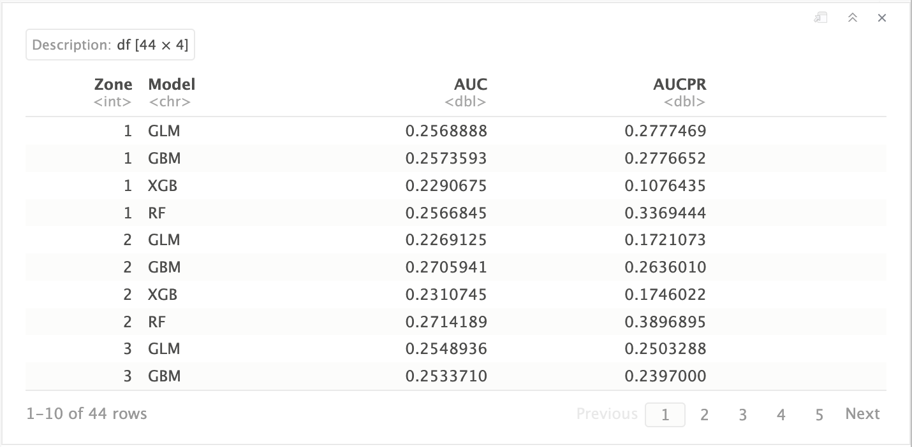

# Load libraries

```{r warning=FALSE, message=FALSE}
library(terra)
library(sf)
library(tidyverse)
library(data.table)
# library(dplyr)
# library(gdata)
library(pROC)
# Parallel
library(foreach)
library(doSNOW)
library(parallel)
library(itertools)
# Cross Validation
library(rsample)
library(recipes)
# # Plot
# library(RColorBrewer)
# library(tidyterra)
# library(scico)
# library(wesanderson)
# library(viridis)
# library(scales)
# library(ggforce)
# library(lubridate)
# library(timetk)
# # library(latex2exp)
# library(ggplot2)
# library(plotly)
# # Time
# library(tictoc)
# library(gdata)
```

# Function

```{r}
#---- 'splitAmaZones' Function ----
splitAmaZones <- function(Amazon.data.dt, amaz.basin.shp){
  v <- ext(amaz.basin.shp)
  x.min <- v$xmin[[1]] - 1; x.max <- v$xmax[[1]] + 1; 
  y.min <- v$ymin[[1]] - 1; y.max <- v$ymax[[1]] + 1; 
  
  # Defining zones
  XY <- list(
    c(x.min, -0.84e+06, y.min, y.max),                       #  z1
    c(-0.84e+06, +0.55e+06, 3.75e+06, y.max),                #  z2
    c(-0.84e+06, +0.55e+06, 2.6e+06, 3.75e+06),              #  z3
    c(-0.84e+06, -0.05e+06, 2.22e+06, 2.6e+06),              #  z4
    c(-0.84e+06, -0.51e+06, y.min, 2.22e+06),                #  z5
    c(-0.51e+06, -0.05e+06, y.min, 2.22e+06),                #  z6
    c(-0.05e+06, 0.6e+06, y.min, 2.6e+06),                   #  z7
    c(0.6e+06, 0.95e+06, y.min, 2.6e+06),                    #  z8
    c(+0.55e+06, x.max, 3.24e+06, y.max),                    #  z9
    c(+0.55e+06, x.max, 2.86e+06, 3.24e+06),                 # z10
    c(+0.55e+06, 0.95e+06, x.max, y.min, 2.6e+06, 2.86e+06)  # z11
  )
  
  # number of zones
  nz <- length(XY)
  # Create column 'Zones'
  Amazon.data.dt[, Zones := 0.0]
  Amazon.data.dt %>% setcolorder(., c('cell', 'x', 'y', 'Zones', 'Year', 'Month'))
  
  # Assigning zone numbers to cells 
  for (i in 1:nz){
    cat("Zone", i, "/", nz, " - ")
    if (i == nz){
      Amazon.data.dt[((x > XY[[i]][2] & x <= XY[[i]][3]) & (y > XY[[i]][4] & y <= XY[[i]][5])) | 
                       ((x > XY[[i]][1] & x <= XY[[i]][3]) & (y > XY[[i]][5] & y <= XY[[i]][6])), Zones := i]
    }else{
      Amazon.data.dt[(x > XY[[i]][1] & x <= XY[[i]][2]) & (y > XY[[i]][3] & y <= XY[[i]][4]), Zones := i]
    }
  }
  # Convert the column 'Zones' as factor
  Amazon.data.dt$Zones <- as.factor(Amazon.data.dt$Zones)
  return(Amazon.data.dt)
}
```

# Initialization

```{r}
# my.path <- "~/Documents/"
my.path <- "/Users/abid.med/Documents/Data_ScienceTech_Institute/00.Intership/Project/Code_official_data"
path.data <- paste0(my.path, "/Amazon_new_data")

# path of variables
burntArea.path <- paste0(path.data,"/1. Burnt Area/03. Working Data")
landCover.path <- paste0(path.data,"/2. Land Cover/03. Working Data")
precip.path <- paste0(path.data,"/3. Precipitation/03. Working Data")
soilMoisture.path <- paste0(path.data,"/4. Soil Moisture/03. Working Data")
elevation.path <- paste0(path.data,"/5. Elevation/03. Working Data")
LandSurfaceTemp.path <- paste0(path.data,"/6. LandSurfaceTemp/03. Working Data")
humidity.path <- paste0(path.data,"/7. Specific Humidity/03. Working Data")
evapotranspiration.path <- paste0(path.data,"/8. Evapotranspiration/03. Working Data")
wind.path <- paste0(path.data,"/9. Wind Speed/03. Working Data")
airtemp.path <- paste0(path.data,"/10. Air Temperature/03. Working Data")

# Create a sequence date
seq.dates <- seq(as.Date("2001-1-1"), as.Date("2020-12-1"), by = "month")

# Create name of layers
ordered.names <- format(seq.dates, '%Y_%m') %>% setdiff(., c("2012_07", "2012_09"))
seq.dates.238 <- paste0(ordered.names, '_01') %>% 
  gsub("_", "-", .) %>%
  as.Date()
# Import shape file
amaz.basin.shp <- st_read(
  paste0(path.data,"/0. Amazon_shapefile/projected/amazon_shp_projected.shp"), quiet = TRUE)

# Number of cores to use
nbrCores <- detectCores() - 1
# nbrCores <- 50

# Color palette
my.colors <- c("mediumblue", "mediumseagreen", "firebrick")
```

```{r}
# Import shape file
amaz.basin.shp <- st_read("~/Documents/Amazon_new_data/0. Amazon_shapefile/projected/amazon_shp_projected.shp", quiet = TRUE)

# path of variables
my.path <- "~/Documents"
path0 <- "/home/abidm/Documents"
burntArea.path <- "~/Documents/Amazon_new_data/1. Burnt Area/03. Working Data"
landCover.path <- "~/Documents/Amazon_new_data/2. Land Cover/03. Working Data"
precip.path <- "~/Documents/Amazon_new_data/3. Precipitation/03. Working Data"
soilMoisture.path <- "~/Documents/Amazon_new_data/4. Soil Moisture/03. Working Data"
elevation.path <- "~/Documents/Amazon_new_data/5. Elevation/03. Working Data"
LandSurfaceTemp.path <- "~/Documents/Amazon_new_data/6. LandSurfaceTemp/03. Working Data"
humidity.path <- "~/Documents/Amazon_new_data/7. Specific Humidity/03. Working Data"
evapotranspiration.path <- "~/Documents/Amazon_new_data/8. Evapotranspiration/03. Working Data"
wind.path <- "~/Documents/Amazon_new_data/9. Wind Speed/03. Working Data"
airtemp.path <- "~/Documents/Amazon_new_data/10. Air Temperature/03. Working Data"

# Color palette
my.colors <- c("mediumblue", "mediumseagreen", "firebrick")
pal <- colorRampPalette(c("mediumblue", "mediumseagreen", "firebrick"))

# Create a sequence of dates
sq.date <- seq(as.Date("2001-1-1"), as.Date("2020-12-1"), by = "month") %>% 
  format(., '%Y_%m') %>% 
  setdiff(., c("2012_07", "2012_09"))
```

# Initialize and Connect to `h2o` 

```{r}
#---- Install & load packages ----
# Models are built with h2o 3.38.0.1
# To install this version from cran :
# require(devtools)
# install_version("h2o", version = "3.38.0.1", repos = "http://cran.us.r-project.org", INSTALL_opts = '--no-lock')
#---

options(java.parameters = "-Xmx650g")
Sys.setenv("OPENBLAS_MAIN_FREE"=1)

library(h2o)
h2o.init(ip = 'localhost', port = 50001, nthreads = 50, max_mem_size = '650g')
h2o.no_progress()
```

# Models

## Gradient Boosting Machine (GBM)

```{r}
for (zone in 1:nz){
  cat('- zone', zone)
  #---- Load data ----
  load(paste0(my.path,"/Amazon_selected_data/data_by_zones/AZ", zone, "_data_train_test.Rdata"))
  # convert data to H2O object
  train.h2o <- as.h2o(AZ.trn)
  # 
  var.names <- colnames(AZ.trn.folds)
  Y <- "BurntArea"
  covt.names <- setdiff(var.names, c("BurntArea", "Zones"))
  
  #---- fit the model ----
  n.trees = 1000; m.tries = 0.6
  gbm.az <- h2o.gbm(
    model_id = paste0("GBM_AZ", zone),
    x = covt.names, 
    y = Y, 
    training_frame = train.h2o,
    ntrees = n.trees, 
    col_sample_rate = m.tries,
    score_each_iteration = TRUE
  )

  #---- Save the model ----
  gbm.az.path <- h2o.saveModel(
    object = gbm.az,
    path = paste0(my.path, "/Models/GBM"),
    force = FALSE,
    export_cross_validation_predictions = TRUE,
    filename = paste0("GBM_AZ", zone, "_model")
  )
  
  #---- Remove variables ----
  rm(gbm.az, AZ.trn, AZ.tst); gc()
  h2o.removeAll()
  h2o:::.h2o.garbageCollect(); Sys.sleep(10)
  h2o:::.h2o.garbageCollect(); Sys.sleep(10)
  h2o:::.h2o.garbageCollect(); Sys.sleep(10)
}
```

## Distributed Random Forest (DRF)

```{r}
for (zone in 1:nz){
  cat('- zone', zone)
  #---- Load data ----
  load(paste0(my.path,"/Amazon_selected_data/data_by_zones/AZ", zone, "_data_train_test.Rdata"))
  # convert data to H2O object
  train.h2o <- as.h2o(AZ.trn)
  # 
  var.names <- colnames(AZ.trn)
  Y <- "BurntArea"
  covt.names <- setdiff(var.names, c("BurntArea", "Zones"))
  
  #---- fit the model ----
  n.trees = 1000; m.tries = 7
  rf.az <- h2o.randomForest(
    model_id = paste0("RF_AZ", zone),
    x = covt.names, 
    y = Y, 
    training_frame = train.h2o,
    ntrees = n.trees, 
    mtries = m.tries,
    score_each_iteration = TRUE
  )

  #---- Save the model ----
  rf.az.path <- h2o.saveModel(
    object = rf.az,
    path = paste0(my.path, "/Models/RF"),
    force = FALSE,
    export_cross_validation_predictions = TRUE,
    filename = paste0("RF_AZ", zone, "_model")
  )
  
  #---- Remove variables ----
  rm(rf.az, AZ.trn, AZ.tst); gc()
  h2o.removeAll()
  h2o:::.h2o.garbageCollect(); Sys.sleep(10)
  h2o:::.h2o.garbageCollect(); Sys.sleep(10)
  h2o:::.h2o.garbageCollect(); Sys.sleep(10)
}
```

## XGBoost 

```{r}
for (zone in 1:nz){
  cat('- zone', zone)
  #---- Load data ----
  load(paste0(my.path,"/Amazon_selected_data/data_by_zones/AZ", zone, "_data_train_test.Rdata"))
  # convert data to H2O object
  train.h2o <- as.h2o(AZ.trn)
  # 
  var.names <- colnames(AZ.trn)
  Y <- "BurntArea"
  covt.names <- setdiff(var.names, c("BurntArea", "Zones"))
  
  #---- fit the model ----
  n.trees = 1000; m.tries = 0.6
  xgb.az <- h2o.xgboost(
    model_id = paste0("XGB_AZ", zone),
    x = covt.names, 
    y = Y, 
    training_frame = train.h2o,
    ntrees = n.trees, 
    col_sample_rate = m.tries,
    score_each_iteration = TRUE
  )
  
  #---- Remove variables ----
  rm(xgb.az, AZ.trn, AZ.tst); gc()
  h2o.removeAll()
  h2o:::.h2o.garbageCollect(); Sys.sleep(10)
  h2o:::.h2o.garbageCollect(); Sys.sleep(10)
  h2o:::.h2o.garbageCollect(); Sys.sleep(10)
}
```

## GLM 

```{r}
for (zone in 1:nz){
  cat('- zone', zone)
  #---- Load data ----
  load(paste0(my.path,"/Amazon_selected_data/data_by_zones/AZ", zone, "_data_train_test.Rdata"))
  # convert data to H2O object
  train.h2o <- as.h2o(AZ.trn)
  # 
  var.names <- colnames(AZ.trn)
  Y <- "BurntArea"
  covt.names <- setdiff(var.names, c("BurntArea", "Zones"))
  
  #---- fit the model ----
  glm.az <- h2o.glm(
    model_id = paste0("GLM_AZ", zone),
    x = covt.names, 
    y = Y, 
    training_frame = train.h2o,
    family="binomial",
    standardize=F,
    lambda = 0,
    score_each_iteration = TRUE
  )

  #---- Save the model ----
  glm.az.path <- h2o.saveModel(
    object = glm.az,
    path = paste0(my.path, "/Models/GLM"),
    force = FALSE,
    export_cross_validation_predictions = TRUE,
    filename = paste0("GLM_AZ", zone, "_model")
  )
  
  #---- Remove variables ----
  rm(glm.az, AZ.trn, AZ.tst); gc()
  h2o.removeAll()
  h2o:::.h2o.garbageCollect(); Sys.sleep(10)
  h2o:::.h2o.garbageCollect(); Sys.sleep(10)
  h2o:::.h2o.garbageCollect(); Sys.sleep(10)
}
```

## Methods Assessment

```{r}
#---- Initialization ----
Models <- c('GLM', 'GBM', 'XGB', 'RF')
Metrics <- c('AUC', 'AUCPR')
nbr.metr <- length(Metrics)
nbr.m <- length(Models)
nz <- 11
# Initialize 'Perf.df' dataframe
perf.df <- data.frame(matrix(ncol = nbr.metr+2, nrow = nbr.m*nz))
colnames(perf.df) <- c('Zone', 'Model', Metrics)
perf.df$Zone <- rep(1:nz, each=nbr.m)
perf.df$Model <- rep(Models, nz)

#---- Load Amazon data ----
options("h2o.use.data.table" = TRUE)
load(paste0(my.path,"/Amazon_selected_data/AZ_norm.Rdata"))
setDT(AZ.norm)
AZ.h2o <- as.h2o(AZ.norm)
rm(AZ.norm); gc()

#---- Compute performance ----
for (zone in c(1:nz)){ 
  #---- Prepare data ----
  mask <- as.numeric(AZ.h2o["Zones"]) != zone
  AZ.bar.h2o <- AZ.h2o[mask, ]
  Sys.sleep(10)
  
  # Load test data
  load(paste0(my.path,"/Amazon_selected_data/data_by_zones/AZ", zone, "_data_train_test.Rdata"))
  setDT(AZ.tst)
  AZ.tst.h2o <- as.h2o(AZ.tst)
  AZ.bar.h2o <- h2o.rbind(AZ.tst.h2o, AZ.bar.h2o)
  Sys.sleep(10)
  h2o.rm(AZ.tst.h2o); h2o:::.h2o.garbageCollect()
  
  for (m in Models){ 
    zone.name <- paste0(m, zone)
    tic(zone.name)
    #---- Load the model ----
    cat("\nZone", zone, ", Model", m, ": Load the model and data - ")
    model.az <- h2o.upload_model(paste0(my.path, "/Models/", m, "/", m, "_AZ", zone, "_model"))
    #---- Compute the performance ----
    cat("Performance - ")
    az.perf <- h2o.performance(model.az, AZ.bar.h2o)
    #---- Collect the results ----
    cat("Save - ")
    Values <- c(
      az.perf@metrics$AUC,
      az.perf@metrics$pr_auc
    )
    perf.df[(perf.df$Zone==zone)&(perf.df$Model==m), Metrics] <- Values
  }
  #---- Remove data ----
  h2o.rm(AZ.bar.h2o); h2o:::.h2o.garbageCollect()
  rm(AZ.tst); gc()
}
save(perf.df, file = paste0(my.path, "/Models_ens/Ens2_new/Ens2_performance_vi.Rdata"))
```

# Ensemble Model and Methods Assessment

## Compute beta

```{r}
# Load performance
load(paste0(my.path, "/Models_ens/Ens2_new/Ens2_performance_vi.Rdata"))
# Compute beta
nz <- 11 # number of zones
Metrics <- c('AUC', 'AUCPR')
beta.df <- perf.df
for (zone in 1:nz){
  for (mtrc in Metrics){
    beta.zone <- beta.df[beta.df$Zone == zone, mtrc]
    beta.df[beta.df$Zone == zone, mtrc] <- beta.zone/sum(beta.zone)
  }
}
```

<center> 
{width=50%}
</center>

## Ensemble Model

```{r}
#---- Prepare Test data ----
nz <- 11
AZ.test.lst <- list()
for (zone in 1:nz){
  cat(paste0(" - Zone ", zone))
  load(paste0(my.path,"/Amazon_selected_data/data_by_zones/AZ", zone, "_data_train_test.Rdata"))
  AZ.test.lst[[zone]] <- setDT(AZ.tst)
  rm(AZ.nz, AZ.trn, AZ.tst); gc()
}
AZ.test <- rbindlist(AZ.test.lst, use.names = T, fill = T)

#---- Performance of the ensemble ----
Models <- c('GLM', 'GBM', 'XGB', 'RF')
mtrc <- 'AUCPR'
# Convert Data to 'h2o'
var.h2o <- as.h2o(AZ.test)
p1.ens.h2o <- p1.models.h2o <- var.h2o[, c('x', 'y')]

for (zone in c(1:nz)){
  # Prepare data
  col.name.p1 <- paste0('p1_z', zone,'_', mtrc)
  p1.models.h2o[, col.name.p1] <- 0

  # Prediction
  for (m in Models){
    bta <- beta.df[(beta.df$Zone == zone)&(beta.df$Model==m), mtrc]
    cat("\n Model", m)
    # Load model
    cat(" - Load model")
    model.az <- h2o.upload_model(paste0(path0, "/Models/", m, "/", m, "_AZ", zone, "_model"))
    # Prediction
    cat(" - Prediction")
    pred.az <- h2o.predict(model.az, newdata=var.h2o)
    # Probability
    cat(" - Probability")
    p1.models.h2o[, col.name.p1] <- p1.models.h2o[, col.name.p1] + (pred.az$p1 * bta)
    # Clean
    h2o.rm(model.az, pred.az)
    h2o:::.h2o.garbageCollect()
  }
  cat("\n"); 
}

#---- Mean of ensembles ----
p1.ens.h2o[, 'p1_mean'] <- h2o.sum(p1.models.h2o[, c(3:13)], axis=1, return_frame = T)/nz
p1.mean.ens.dt <- as.data.table(p1.ens.h2o[, c('x', 'y', 'p1_mean')])
```

## Ensemble Assessment

```{r}
testFunct <- function(df1, df2){
  # This function is designed to confirm the equality of the 'x' columns in the 'df1' and 'df2' tables, as well as the 'y' columns, returning 0 when the values match.
  x <- (df1$x - df2$x) %>% abs() %>% sum()
  y <- (df1$y - df2$y) %>% abs() %>% sum()
  return(x+y)
}

# Initialization
aucpr.auc.vals <- matrix(nrow = nz, ncol = 2) 
rownames(aucpr.auc.vals) <- paste0("Zone", as.character(rep(1:11)))
colnames(aucpr.auc.vals) <- c("AUCPR", "AUC")

AZ.test.num <- AZ.test[, c("Zones", "x", "y", "BurntArea")] %>%
  mutate(
    x = as.integer(x),
    y = as.integer(y),
    BurntArea = as.numeric(as.character(BurntArea))
  )
# Compute *AUC* and *AUCPR* for each zone.
for (zone in 1:nz){
  cat(paste0(" - Zone ", as.character(zone)))
  idx <- which(AZ.test.num$Zones == zone)
  setkey(AZ.test.num, Zones)
  df1 <- AZ.test.num[idx,]
  df2 <- p1.mean.ens.dt[idx,]
  
  if (testFunct(df1, df2) == 0){
    predicted.rocr <- ROCR::prediction(df2$p1_mean, df1$BurntArea)
    aucpr.perf <- ROCR::performance(predicted.rocr, "aucpr")
    auc.perf <- ROCR::performance(predicted.rocr, "auc")
    aucpr.auc.vals[zone, "AUCPR"] <- aucpr.perf@y.values[[1]]
    aucpr.auc.vals[zone, "AUC"] <- auc.perf@y.values[[1]]
  }
}
aucpr.auc.vals
```

         Zone1     Zone2     Zone3     Zone4     Zone5     Zone6     Zone7     Zone8     Zone9   Zone10    Zone11
[1,] 0.8755054 0.8393833 0.9457521 0.9226609 0.9072631 0.9251834 0.8065207 0.8850442 0.9049003 0.927436 0.9595762

             AUC
Zone1  0.8755054
Zone2  0.8393833
Zone3  0.9457521
Zone4  0.9226609
Zone5  0.9072631
Zone6  0.9251834
Zone7  0.8065207
Zone8  0.8850442
Zone9  0.9049003
Zone10 0.9274360
Zone11 0.9595762

            AUCPR       AUC
Zone1  0.08882860 0.8755054
Zone2  0.03869273 0.8393833
Zone3  0.15804285 0.9457521
Zone4  0.15676270 0.9226609
Zone5  0.16304809 0.9072631
Zone6  0.16885492 0.9251834
Zone7  0.03562361 0.8065207
Zone8  0.15706451 0.8850442
Zone9  0.08186088 0.9049003
Zone10 0.10826509 0.9274360
Zone11 0.29922686 0.9595762

# Clear `h2o`

```{r}
h2o.removeAll()
h2o:::.h2o.garbageCollect(); Sys.sleep(10)
h2o:::.h2o.garbageCollect(); Sys.sleep(10)
h2o:::.h2o.garbageCollect(); Sys.sleep(10)
```

#---

# Ensemble E2

## Prepare data

```{r}
nz <- 11
#---- Load Amazon data ----
system.time( load(paste0(my.path,"/Amazon_selected_data/AZ_norm.Rdata")) ) # 147.719 sec
setDT(AZ.norm)
#
for (zone in 1:nz){ 
  AZ.bar <- AZ.norm[AZ.norm$Zones != zone, ]
  #---- Load test data ----
  load(paste0(my.path,"/Amazon_selected_data/data_by_zones/AZ", zone, "_data_train_test.Rdata")) # AZ.nz, AZ.trn, AZ.tst
  AZ.bar <- rbind(AZ.tst, AZ.bar)
  #---- Save data ----
  save(AZ.bar, file = paste0(my.path,"/Amazon_selected_data/data_by_zones/AZ", zone, "_bar.Rdata"))
  rm(AZ.nz, AZ.trn, AZ.tst, AZ.bar)
}
```

## Model Ensemble

```{r}
#---- Libraries and paths ----
library(matrixStats)
library(data.table)
library(dplyr)
library(sf)
library(terra)
library(recipes)
library(h2o)
library(tictoc)

#---- 'prepareMonthDT' Function ----

prepareMonthDT <- function(n.month, var00.dt){
  # n.month <- n.month + 1 # n.month <- 222
  y_m <- c()             # y_m <- c('2019', '8') 
  y_m[1] <- sub("_.*", "", n.month)
  y_m[2] <- sub(".*_", "", n.month)
  if(y_m[2] != '10') { y_m[2] <- sub(".*0", "", y_m[2]) }

  amaz.var.list <- c(
    paste0(burntArea.path, '/burntarea_working_', y_m[1], '_', y_m[2], '.tif')
    , paste0(landCover.path, '/landcover_working_', y_m[1], '_', y_m[2], '.tif')
    , paste0(precip.path, '/precipitation_working_', y_m[1], '_', y_m[2], '.tif')
    , paste0(soilMoisture.path, '/soilmoisture_working_', y_m[1], '_', y_m[2], '.tif')
    , paste0(elevation.path, '/elevation_working_2019_08.tif')
    , paste0(LandSurfaceTemp.path, '/landsurftemp_working_', y_m[1], '_', y_m[2], '.tif')
    , paste0(humidity.path, '/humidity_working_', y_m[1], '_', y_m[2], '.tif')
    , paste0(evapotranspiration.path, '/evapotranspiration_working_', y_m[1], '_', y_m[2], '.tif')
    , paste0(wind.path, '/wind_working_', y_m[1], '_', y_m[2], '.tif')
    , paste0(airtemp.path, '/airtemp_working_', y_m[1], '_', y_m[2], '.tif')
  )
  amaz.basin.shp <- st_read("/home/abidm/Documents/Amazon_new_data/0. Amazon_shapefile/projected/amazon_shp_projected.shp", quiet = TRUE)
  
  #---- Prepare data
  
  tic("Prepare data") 
  nz <- 11 # number of zones
  # Create 'SpatRaster' object
  var.ras <- rast(amaz.var.list) %>% mask(mask = amaz.basin.shp)
  names(var.ras) <- c('BurntArea', 'LandCover', 'Precipitation', 'SoilMoisture', 'Elevation', 'LandSurfaceTemp', 'Humidity', 'Evapotranspiration', 'Wind', 'AirTemp')
  var.ras[[c('BurntArea', 'SoilMoisture')]][var.ras[[c('BurntArea', 'SoilMoisture')]] < 0] <- NA
  # Prepare data table
  var0.dt <- terra:::as.matrix(var.ras, cell=T, xy=T) %>% as.data.table()
  var0.dt[, c('cell', 'x', 'y') := var00.dt[, 1:3]]
  
  var.dt <- var0.dt %>%
    mutate(
      x = floor(x),
      y = floor(y),
      Year = rep(y_m[1], dim(var0.dt)[1]) %>% as.factor(),
      Month = rep(y_m[2], dim(var0.dt)[1]) %>% as.factor(),
      BurntArea = as.factor(BurntArea),
      LandCover = as.factor(LandCover)
    ) %>%
    na.omit() %>%
    setcolorder(., c('cell', 'x', 'y', 'Year', 'Month'))
  var.zones.dt <- splitAmaZones(var.dt)
  toc() # Prepare data: 155.852 sec elapsed
  
  
  #---- Normalize data & convert to h2o
  tic("Normalize data") 
  AZ_recipe <- recipe( BurntArea ~ ., data = var.zones.dt) %>% 
    step_normalize(all_numeric(), -c(cell, x, y))
  
  var.norm <- AZ_recipe %>% 
    prep() %>% 
    bake(new_data = NULL) %>% 
    setcolorder(., c('Zones', 'cell', 'x', 'y', 'Year', 'Month', 'BurntArea')) %>% 
    as.data.table()
  toc() # Normalize data: 14.198 sec elapsed
  # save(var.norm, file = paste0(my.path, "/Amazon_new_data/DT/amazon_dt_", sq.date[n.month], ".Rdata")) # 40.669 sec
  return(var.norm)
}

#

# tic("Total")
path0 <- "/home/abidm/Documents"
burntArea.path <- paste0(path0, "/Amazon_new_data/1. Burnt Area/03. Working Data")
landCover.path <- paste0(path0, "/Amazon_new_data/2. Land Cover/03. Working Data")
precip.path <- paste0(path0, "/Amazon_new_data/3. Precipitation/03. Working Data")
soilMoisture.path <- paste0(path0, "/Amazon_new_data/4. Soil Moisture/03. Working Data")
elevation.path <- paste0(path0, "/Amazon_new_data/5. Elevation/03. Working Data")
LandSurfaceTemp.path <- paste0(path0, "/Amazon_new_data/6. LandSurfaceTemp/03. Working Data")
humidity.path <- paste0(path0, "/Amazon_new_data/7. Specific Humidity/03. Working Data")
evapotranspiration.path <- paste0(path0, "/Amazon_new_data/8. Evapotranspiration/03. Working Data")
wind.path <- paste0(path0, "/Amazon_new_data/9. Wind Speed/03. Working Data")
airtemp.path <- paste0(path0, "/Amazon_new_data/10. Air Temperature/03. Working Data")


#---- Load data ----

sq.date <- seq(as.Date("2001-1-1"), as.Date("2020-12-1"), by = "month") %>% 
  format(., '%Y_%m') %>% 
  setdiff(., c("2012_07", "2012_09"))
#
path.ras0 <- paste0(path0, "/Amazon_new_data/1. Burnt Area/03. Working Data/burntarea_working_2001_1.tif")
var0.ras <- rast(path.ras0) %>% mask(mask = amaz.basin.shp)
values(var0.ras) <- -1
var00.dt <- as.data.table(var0.ras, cell=T, xy=T)
rm(var0.ras); gc()
#

#---- Model ----
#==============#

# Initialization  
sq.date <- seq(as.Date("2001-1-1"), as.Date("2020-12-1"), by = "month") %>% 
  format(., '%Y_%m') %>% 
  setdiff(., c("2012_07", "2012_09"))


# Load performance
load(paste0(my.path, "/Models_ens/Ens2_new/Ens2_performance_vi.Rdata"))
# Compute beta
nz <- 11 # number of zones
Metrics <- c('AUC', 'AUCPR')
beta.df <- perf.df
for (zone in 1:nz){
  for (mtrc in Metrics){
    beta.zone <- beta.df[beta.df$Zone == zone, mtrc]
    beta.df[beta.df$Zone == zone, mtrc] <- beta.zone/sum(beta.zone)
  }
}

Models <- c('GLM', 'GBM', 'XGB', 'RF')
# nbr.m <- length(Models)

#
amaz0.ras <- rast(paste0(burntArea.path, '/burntarea_working_2001_1.tif'))
values(amaz0.ras) <- -1
tmp <- as.data.table(amaz0.ras, cell=T, xy=T)

sq.date <- c(
  # "2001_03", "2002_03", "2003_03", "2004_03", "2005_03", "2006_03", "2007_03", "2008_03", "2009_03", "2010_03",  
  # "2011_03", "2012_03", "2013_03", "2014_03", "2015_03", "2016_03", "2017_03", "2018_03", "2019_03", "2020_03",
  # 
  # "2001_09", "2002_09", "2003_09", "2004_09", "2005_09", "2006_09", "2007_09", "2008_09", "2009_09", "2010_09",
  # "2011_09", # "2012_09", 
  # "2013_09", "2014_09", "2015_09", "2016_09", "2017_09", "2018_09", "2019_09", "2020_09",
  # 
  # "2001_02", "2002_02", "2003_02", "2004_02", "2005_02", "2006_02", # "2007_02", 
  # "2008_02", "2009_02", "2010_02",  "2011_02", "2012_02", "2013_02", "2014_02", "2015_02", "2016_02", "2017_02", 
  # "2018_02", "2019_02", "2020_02"
)

for(n.month in sq.date) {
  # n.month <- "2013_01"
  cat(n.month, '\n')
  tic("Model") 
  
  #---- Prepare data ----
  # load(paste0(path0, "/Amazon_new_data/DT/amazon_dt_", n.month, ".Rdata"))
  system.time(var.norm <- prepareMonthDT(n.month, var00.dt))
  v0.dt <- var.norm[, c('Zones', 'cell', 'x', 'y')]
  # var.nz <- var.norm
  var.h2o <- as.h2o(var.norm)
  p1.ens.h2o <- var.h2o[, 'cell']
  p1.models.h2o <- var.h2o[, 'cell']
  mtrc <- 'AUCPR'
  
  zone.lst <- c(1:11)
  for (zone in zone.lst){ # zone <- 1
    tic(paste0("Zone ", zone))
    #---- Prepare data ----
    col.name.p1 <- paste0('p1_z', zone,'_', mtrc)
    
    p1.models.h2o[, col.name.p1] <- 0
    # colnames(prob.az) = Models
    
    #---- Prediction ----
    for (m in Models){ # m <- 'GLM'
      bta <- beta.df[(beta.df$Zone == zone)&(beta.df$Model==m), mtrc]
      cat("\n Model", m)
      # Load model
      cat(" - Load model")
      model.az <- h2o.upload_model(paste0(path0, "/Models/", m, "/", m, "_AZ", zone, "_model"))
      # Prediction
      cat(" - Prediction")
      pred.az <- h2o.predict(model.az, newdata=var.h2o)
      # Probability
      cat(" - Probability")
      p1.models.h2o[, col.name.p1] <- p1.models.h2o[, col.name.p1] + (pred.az$p1 * bta)
      # Clean
      h2o.rm(model.az, pred.az); h2o:::.h2o.garbageCollect()
    }
    cat("\n"); toc() # Zone 
  # Zone 1: 836.315 sec elapsed
  # Zone 2: 816.727  sec elapsed
  # Zone 3: 781.717  sec elapsed
  # Zone 4: 821.109  sec elapsed
  # Zone 5: 847.212  sec elapsed
  # Zone 6: 857.585  sec elapsed
  # Zone 7: 820.02  sec elapsed
  # Zone 8: 851.454  sec elapsed
  # Zone 9: 790.031  sec elapsed
  # Zone 10: 845.547  sec elapsed
  # Zone 11: 826.562  sec elapsed
  } # Total:  ~ 2.5 h

  #---- Mean of ensembles ----
  p1.ens.h2o[, 'p1_mean'] <- h2o.sum(p1.models.h2o[, c(2:12)], axis=1, return_frame = T)/nz
  
  p1.mean.ens.dt <- as.data.table(p1.ens.h2o[, c('cell', 'p1_mean')]) # 64.986 sec
  
  #---- Save as data table ----
  save(p1.mean.ens.dt, file = paste0(path0, "/Models_ens/Ens2_new/Predictions/dt/p1_mean_ens_dt_", n.month, ".Rdata"))
  
  #---- Save SpatRaster ----
  p1.mean.ras <- amaz0.ras
  names(p1.mean.ras) <- n.month
  p1.mean.dt <- merge(x = p1.mean.ens.dt, y = tmp[, 'cell'], by = "cell", all = TRUE)
  values(p1.mean.ras) <- p1.mean.dt$p1_mean
  writeRaster(p1.mean.ras, paste0(path0,"/Models_ens/Ens2_new/Predictions/ras/p1_mean_ens_ras_", n.month, ".tif"), overwrite=TRUE)
  toc()
  rm(p1.mean.ens.dt, p1.mean.ras); gc()
  h2o.removeAll()
  h2o:::.h2o.garbageCollect()
  h2o:::.h2o.garbageCollect()
  h2o:::.h2o.garbageCollect()
}
```

## Plot

```{r}
# load(paste0(path0, "/Models_ens/Ens3/ENS3_pred.Rdata"))
#---- Plot ----
#=============#
# amaz0.ras <- rast(paste0(burntArea.path, '/burntarea_working_2001_1.tif'))
# values(amaz0.ras) <- -1
# tmp <- as.data.table(amaz0.ras, cell=T, xy=T)
tic()
p1.mean.ras <- amaz0.ras
names(p1.mean.ras) <- sq.date[n.month]


p1.mean.dt <- merge(x = p1.mean.ens.dt, y = tmp[, 'cell'], by = "cell", all = TRUE)
values(p1.mean.ras) <- p1.mean.dt$p1_mean
writeRaster(p1.mean.ras, paste0(path0,"/Models_ens/Ens2_new/Predictions/ras/p1_mean_ens_ras_", sq.date[n.month], ".tif"), overwrite=TRUE)

values(pred.mean.ras) <- prob.mean.aucpr.amaz$AUCPR_mean
values(pred.median.ras) <- prob.median.aucpr.amaz$AUCPR_median
values(pred.max.ras) <- prob.max.aucpr.amaz$AUCPR_max

# writeRaster(pred.mean.ras, paste0(path0, "/Models_ens/Ens3/ENS3_pred_mean_2019_08.tif"), overwrite=F)
# writeRaster(pred.median.ras, paste0(path0, "/Models_ens/Ens3/ENS3_pred_median_2019_08.tif"), overwrite=F)
# writeRaster(pred.max.ras, paste0(path0, "/Models_ens/Ens3/ENS3_pred_max_2019_08.tif"), overwrite=F)

pred.mean.ras <- rast(paste0(path0, "/Models_ens/Ens3/ENS3_pred_mean_2019_08.tif"))
plot(p1.mean.ras)
amaz.e2.2019.08.ras %>% mask(mask = amaz.basin.shp) %>% plot()
```

# Ensemble E2 - Performance \\

```{r}
#---- Prepare data ----
nz <- 11

AZ.test.lst <- list()
tic()
for (zone in 1:nz){ # zone <- 1
  cat(paste0(" - Zone ", zone))
  load(paste0(path0,"/Amazon_selected_data/data_by_zones/AZ", zone, "_data_train_test.Rdata")) # AZ.nz, AZ.trn, AZ.tst
  AZ.test.lst[[zone]] <- setDT(AZ.tst)
  rm(AZ.nz, AZ.trn, AZ.tst); gc()
}
AZ.test <- rbindlist(AZ.test.lst, use.names = T, fill = T)
toc() # 643.848 sec elapsed

#--- Save data ---- 
# save(AZ.test, file = paste0(path0,"/Amazon_selected_data/AZ_test.Rdata"))
system.time(load(paste0(path0,"/Amazon_selected_data/AZ_test.Rdata"))) # AZ.test
#---- Performance of the ensemble ----

# Load performance of models
load(paste0(path0, "/Models_ens/Ens2_new/Ens2_performance_vi.Rdata")) # perf.df, confusion.mtrx.lst, max.metrics.lst, vi.lst
# Compute beta
Metrics <- c('MSE', 'RMSE', 'LogLoss', 'Mean Per-Class Error', 'AUC', 'AUCPR', 'Gini', 'R^2')
nbr.mtrc <- length(Metrics)
beta.df <- perf.df
for (zone in 1:nz){
  for (mtrc in Metrics){ # mtrc <- Metrics[1]
    beta.metric <- switch(
      mtrc
      , 'MSE'     = 1/beta.df[beta.df$Zone == zone, mtrc]
      , 'RMSE'    = 1/beta.df[beta.df$Zone == zone, mtrc]
      , 'LogLoss' = 1/beta.df[beta.df$Zone == zone, mtrc]
      , 'Mean Per-Class Error' = 1/beta.df[beta.df$Zone == zone, mtrc]
      # , 'AUC'     = beta.df[beta.df$Zone == zone, mtrc]
      # , 'AUCPR'   = beta.df[beta.df$Zone == zone, mtrc]
      # , 'Gini'    = beta.df[beta.df$Zone == zone, mtrc]
      # , 'R^2'     = beta.df[beta.df$Zone == zone, mtrc]
    )
    beta.metric <- beta.df[beta.df$Zone == zone, mtrc]
    beta.df[beta.df$Zone == zone, mtrc] <- beta.metric/sum(beta.metric)
  }
}
Models <- c('GLM', 'GBM', 'XGB', 'RF')
# nbr.m <- length(Models)
#
# amaz0.ras <- rast(paste0(burntArea.path, '/burntarea_working_2001_1.tif'))
# values(amaz0.ras) <- -1
# tmp <- as.data.table(amaz0.ras, cell=T, xy=T)

#---- Prepare data ----
# v0.dt <- var.norm[, c('Zones', 'cell', 'x', 'y')]
# var.nz <- var.norm
var.h2o <- as.h2o(AZ.test)
p1.ens.h2o <- p1.models.h2o <- var.h2o[, c('x', 'y')]
mtrc <- 'AUCPR'

for (zone in c(1:11)){ 
  #---- Prepare data ----
  col.name.p1 <- paste0('p1_z', zone,'_', mtrc)
  
  p1.models.h2o[, col.name.p1] <- 0
  # colnames(prob.az) = Models
  
  #---- Prediction ----
  for (m in Models){ # m <- 'GLM'
    bta <- beta.df[(beta.df$Zone == zone)&(beta.df$Model==m), mtrc]
    cat("\n Model", m)
    # Load model
    cat(" - Load model")
    model.az <- h2o.upload_model(paste0(path0, "/Models/", m, "/", m, "_AZ", zone, "_model"))
    # Prediction
    cat(" - Prediction")
    pred.az <- h2o.predict(model.az, newdata=var.h2o)
    # Probability
    cat(" - Probability")
    p1.models.h2o[, col.name.p1] <- p1.models.h2o[, col.name.p1] + (pred.az$p1 * bta)
    # Clean
    h2o.rm(model.az, pred.az); h2o:::.h2o.garbageCollect()
  }
  cat("\n"); 
}

#---- Mean of ensembles ----

p1.ens.h2o[, 'p1_mean'] <- h2o.sum(p1.models.h2o[, c(3:13)], axis=1, return_frame = T)/nz

p1.mean.ens.dt <- as.data.table(p1.ens.h2o[, c('x', 'y', 'p1_mean')]) # 542.006 sec elapsed

p1.ens.dt <- as.data.table(p1.models.h2o) # 542.006 sec elapsed

save(p1.ens.dt, file = paste0(path0,"/Models_ens/Ens2_new/Predictions/Ens2_p1_models_test_data.Rdata"))

#--- Save data
save(p1.mean.ens.dt, file = paste0(path0,"/Models_ens/Ens2_new/Predictions/Ens2_p1_mean_test_data.Rdata"))
system.time(load(paste0(path0,"/Models_ens/Ens2_new/Predictions/Ens2_p1_mean_test_data.Rdata"))) # p1.mean.ens.dt

#---- AUC ----
predicted.rocr <- ROCR::prediction(p1.mean.ens.dt$p1_mean, as.numeric(AZ.test$BurntArea))
tpr.fpr.perf <- ROCR::performance(predicted.rocr, "tpr", "fpr")
auc.perf <- ROCR::performance(predicted.rocr, "auc")
plot(tpr.fpr.perf)
auc.perf@y.values

#---- F1 ----
f1.perf <- ROCR::performance(predicted.rocr, "f")
plot(f1.perf)
```

```{r}
library(pROC)
rocobj <- roc(AZ.test$BurntArea, p1.mean.ens.dt$p1_mean)
auc <- round(auc(AZ.test$BurntArea, p1.mean.ens.dt$p1_mean),4)

#create ROC plot
ggroc(rocobj, colour = 'steelblue', size = 1) +
  ggtitle(paste0('ROC Curve ', '(AUC = ', auc, ')')) +
  
```

Zone 2: 4777.092 sec elapsed
Zone 3: 4790.897 sec elapsed
Zone 4: 5127.547 sec elapsed
Zone 5: 5246.285 sec elapsed
Zone 6: 5232.335 sec elapsed
Zone 7: 5106.113 sec elapsed
Zone 8: 4902.762 sec elapsed
Zone 9: 4611.512 sec elapsed
Zone 10: 4779.022 sec elapsed
Zone 11: 4540.814 sec elapsed

## Ensemble E2 - AUC for each zone

```{r}
testFunct <- function(df1, df2){
  x <- (df.x$x - df.y$x) %>% abs() %>% sum()
  y <- (df.x$y - df.y$y) %>% abs() %>% sum()
  return(x+y)
}
AZ.test.num <- AZ.test[, c("Zones", "x", "y", "BurntArea")] %>%
  mutate(
    x = as.integer(x),
    y = as.integer(y),
    BurntArea = as.numeric(as.character(BurntArea))
  )

# setDT(AZ.test.num, key = "Zones")[J(c("1"))]

# Test
testFunct(AZ.test.num, p1.mean.ens.dt)

aucpr.auc.vals <- matrix(nrow = 11, ncol = 2) 
rownames(aucpr.auc.vals) <- paste0("Zone", as.character(rep(1:11)))
colnames(aucpr.auc.vals) <- c("AUCPR", "AUC")

for (zone in 1:11){
  cat(paste0(" - Zone ", as.character(zone)))
  idx <- which(AZ.test.num$Zones == zone)
  setkey(AZ.test.num, Zones)
  df.x <- AZ.test.num[idx,]
  df.y <- p1.mean.ens.dt[idx,]
  
  if (testFunct(df.x, df.y) == 0){
    predicted.rocr <- ROCR::prediction(df.y$p1_mean, df.x$BurntArea)
    tpr.fpr.perf <- ROCR::performance(predicted.rocr, "tpr", "fpr")
    aucpr.perf <- ROCR::performance(predicted.rocr, "aucpr")
    auc.perf <- ROCR::performance(predicted.rocr, "auc")
    aucpr.auc.vals[zone, "AUCPR"] <- aucpr.perf@y.values[[1]]
    aucpr.auc.vals[zone, "AUC"] <- auc.perf@y.values[[1]]
  }
}
aucpr.auc.vals
```

         Zone1     Zone2     Zone3     Zone4     Zone5     Zone6     Zone7     Zone8     Zone9   Zone10    Zone11
[1,] 0.8755054 0.8393833 0.9457521 0.9226609 0.9072631 0.9251834 0.8065207 0.8850442 0.9049003 0.927436 0.9595762

             AUC
Zone1  0.8755054
Zone2  0.8393833
Zone3  0.9457521
Zone4  0.9226609
Zone5  0.9072631
Zone6  0.9251834
Zone7  0.8065207
Zone8  0.8850442
Zone9  0.9049003
Zone10 0.9274360
Zone11 0.9595762

            AUCPR       AUC
Zone1  0.08882860 0.8755054
Zone2  0.03869273 0.8393833
Zone3  0.15804285 0.9457521
Zone4  0.15676270 0.9226609
Zone5  0.16304809 0.9072631
Zone6  0.16885492 0.9251834
Zone7  0.03562361 0.8065207
Zone8  0.15706451 0.8850442
Zone9  0.08186088 0.9049003
Zone10 0.10826509 0.9274360
Zone11 0.29922686 0.9595762


```{r}
df.x
df.x <- AZ.test[, c("Zones", "x", "y", "BurntArea")] 
table(df.x$BurntArea)
```


## --- E2 - Model Parallel 1 --------

```{r}
library(doSNOW)
library(itertools)
# library(stringr)

sq.date <- seq(as.Date("2001-1-1"), as.Date("2020-12-1"), by = "month") %>% 
  format(., '%Y_%m') %>% 
  setdiff(., c("2012_07", "2012_09"))

nbr.z <- 11 # number of zones
# Load performance
load(paste0(path0, "/Models_ens/Ens2_new/Ens2_performance_vi.Rdata"))# perf.df, confusion.mtrx.lst, max.metrics.lst, vi.lst
# Compute beta
Metrics <- c('MSE', 'RMSE', 'LogLoss', 'Mean Per-Class Error', 'AUC', 'AUCPR', 'Gini', 'R^2')
nbr.mtrc <- length(Metrics)
beta.df <- perf.df
for (zone in 1:nbr.z){
  for (mtrc in Metrics){ # mtrc <- Metrics[1]
    beta.metric <- switch(
      mtrc
      , 'MSE'     = 1/beta.df[beta.df$Zone == zone, mtrc]
      , 'RMSE'    = 1/beta.df[beta.df$Zone == zone, mtrc]
      , 'LogLoss' = 1/beta.df[beta.df$Zone == zone, mtrc]
      , 'Mean Per-Class Error' = 1/beta.df[beta.df$Zone == zone, mtrc]
      # , 'AUC'     = beta.df[beta.df$Zone == zone, mtrc]
      # , 'AUCPR'   = beta.df[beta.df$Zone == zone, mtrc]
      # , 'Gini'    = beta.df[beta.df$Zone == zone, mtrc]
      # , 'R^2'     = beta.df[beta.df$Zone == zone, mtrc]
    )
    beta.metric <- beta.df[beta.df$Zone == zone, mtrc]
    beta.df[beta.df$Zone == zone, mtrc] <- beta.metric/sum(beta.metric)
  }
}
Models <- c('GLM', 'GBM', 'XGB', 'RF')
nbr.m <- length(Models)

library(h2o)

NumberOfCluster <- 5
cl <- makeCluster(NumberOfCluster) 
registerDoSNOW(cl)

# init the progress bar
pb <- txtProgressBar(max = 100, style = 3)
progress <- function(n) setTxtProgressBar(pb, n)
opts <- list(progress = progress)

clusterEvalQ(cl, sink(paste0("/home/abidm/Documents/Models_ens/Ens2_new/Predictions/output", Sys.getpid(), ".txt")))

tic() # 2082.204 sec elapsed

# conduct the parallelisation
Result.list <- foreach(
  n.month = 1:5, # n.month <- 1
  # .combine='rbind',
  .packages=c('dplyr', 'terra', 'data.table', 'h2o'),
  .options.snow = opts) %dopar% {
  
    #---- Initialize H2O ----
    options(java.parameters = "-Xmx120g")
    Sys.setenv("OPENBLAS_MAIN_FREE"=1)
    h2o.init(ip = 'localhost', port = 50001+3*n.month, nthreads = 5, max_mem_size = '120g')
    # h2o.no_progress()
    
    #---- Prepare data ----
    load(paste0(path0, "/Amazon_new_data/DT/amazon_dt_", sq.date[n.month], ".Rdata"))
    v0.dt <- var.norm[, c('Zones', 'cell', 'x', 'y')]
    var.nz <- var.norm
    var.h2o <- as.h2o(var.norm)
    p1.ens.h2o <- var.h2o[, 'cell']
    mtrc <- 'AUCPR'
    zone.lst <- c(1:11)
    tic("Prediction:", sq.date[n.month])
    for (zone in zone.lst){ # zone <- 1
      tic(paste0("Zone ", zone))
      #---- Prepare data ----
      p1.models.h2o <- var.h2o[, 'cell']
  
      #---- Prediction ----
      for (m in Models){ # m <- 'GLM'
        bta <- beta.df[(beta.df$Zone == zone)&(beta.df$Model==m), mtrc]
        cat("\n Model", m)
        # Load model
        cat(" - Load model")
        model.az <- h2o.upload_model(paste0(path0, "/Models/", m, "/", m, "_AZ", zone, "_model"))
        # Prediction
        cat(" - Prediction")
        pred.az <- h2o.predict(model.az, newdata=var.h2o)
        # Probability
        cat(" - Probability")
        p1.models.h2o[, paste0('p1_', m, '_z', zone)] <- pred.az$p1 * bta
        # Clean
        h2o.rm(model.az, pred.az); h2o:::.h2o.garbageCollect()
        # rm(model.az, pred.az)
      }
      
      #---- Compute the probability P(X=1) ----
      col.name <- paste0('p1_z', zone,'_', mtrc)
      p1.ens.h2o[, col.name] <- h2o.sum(p1.models.h2o[, -1], axis=1, return_frame = T)
    
      cat("\n"); toc()
    } # Total:  ~ 2.2 h
  
    #---- Mean / Median / Max of ensembles ----
    p1.ens.h2o[, 'p1_mean'] <- h2o.sum(p1.ens.h2o[, c(2:12)], axis=1, return_frame = T)/nbr.z
    
    p1.mean.ens.dt <- as.data.table(p1.ens.h2o[, c('cell', 'p1_mean')]) # 64.986 sec
    toc() # Prediction: 
    
    #---- Save as data table ----
    save(p1.mean.ens.dt, file = paste0(path0, "/Models_ens/Ens2_new/Predictions/dt/p1_mean_ens_dt_", sq.date[n.month], ".Rdata"))
    
    #---- Save SpatRaster ----
    # amaz0.ras <- rast(paste0(burntArea.path, '/burntarea_working_2001_1.tif'))
    # values(amaz0.ras) <- -1
    # tmp <- as.data.table(amaz0.ras, cell=T, xy=T)
    p1.mean.ras <- amaz0.ras
    names(p1.mean.ras) <- sq.date[n.month]
    p1.mean.dt <- merge(x = p1.mean.ens.dt, y = tmp[, 'cell'], by = "cell", all = TRUE)
    values(p1.mean.ras) <- p1.mean.dt$p1_mean
    writeRaster(p1.mean.ras, paste0(path0,"/Models_ens/Ens2_new/Predictions/ras/p1_mean_ens_ras_", sq.date[n.month], ".tif"), overwrite=TRUE)
    toc()
    
    return()
    }
# close progress bar
close(pb)
# stop cluster
stopCluster(cl) 
toc()


while(n.month <= 238) {
  n.month <- n.month + 1 # n.month <- 1
  nbr.z <- 11 # number of zones
  tic("Model") 
  
  # Load performance
  load(paste0(path0, "/Models_ens/Ens2_new/Ens2_performance_vi.Rdata"))# perf.df, confusion.mtrx.lst, max.metrics.lst, vi.lst
  # Compute beta
  Metrics <- c('MSE', 'RMSE', 'LogLoss', 'Mean Per-Class Error', 'AUC', 'AUCPR', 'Gini', 'R^2')
  nbr.mtrc <- length(Metrics)
  beta.df <- perf.df
  for (zone in 1:nbr.z){
    for (mtrc in Metrics){ # mtrc <- Metrics[1]
      beta.metric <- switch(
        mtrc
        , 'MSE'     = 1/beta.df[beta.df$Zone == zone, mtrc]
        , 'RMSE'    = 1/beta.df[beta.df$Zone == zone, mtrc]
        , 'LogLoss' = 1/beta.df[beta.df$Zone == zone, mtrc]
        , 'Mean Per-Class Error' = 1/beta.df[beta.df$Zone == zone, mtrc]
        # , 'AUC'     = beta.df[beta.df$Zone == zone, mtrc]
        # , 'AUCPR'   = beta.df[beta.df$Zone == zone, mtrc]
        # , 'Gini'    = beta.df[beta.df$Zone == zone, mtrc]
        # , 'R^2'     = beta.df[beta.df$Zone == zone, mtrc]
      )
      beta.metric <- beta.df[beta.df$Zone == zone, mtrc]
      beta.df[beta.df$Zone == zone, mtrc] <- beta.metric/sum(beta.metric)
    }
  }
  Models <- c('GLM', 'GBM', 'XGB', 'RF')
  nbr.m <- length(Models)
  # p1.lst <- vector(mode='list', length=nbr.z); names(p1.lst) <- paste0('zone', 1:nbr.z)
  # prob.ens <- data.frame(matrix(ncol = 4, nrow = 0)); colnames(prob.ens) <- c('Zones', 'cell', 'x', 'y')
  
  #---- Prepare data ----
  load(paste0(path0, "/Amazon_new_data/DT/amazon_dt_", sq.date[n.month], ".Rdata"))
  v0.dt <- var.norm[, c('Zones', 'cell', 'x', 'y')]
  var.nz <- var.norm
  var.h2o <- as.h2o(var.norm)
  p1.ens.h2o <- var.h2o[, 'cell']
  mtrc <- 'AUCPR'
  zone.lst <- c(1:11)
  tic("Prediction:", sq.date[n.month])
  for (zone in zone.lst){ # zone <- 1
    tic(paste0("Zone ", zone))
    #---- Prepare data ----
    p1.models.h2o <- var.h2o[, 'cell']

    #---- Prediction ----
    for (m in Models){ # m <- 'GLM'
      bta <- beta.df[(beta.df$Zone == zone)&(beta.df$Model==m), mtrc]
      cat("\n Model", m)
      # Load model
      cat(" - Load model")
      model.az <- h2o.upload_model(paste0(path0, "/Models/", m, "/", m, "_AZ", zone, "_model"))
      # Prediction
      cat(" - Prediction")
      pred.az <- h2o.predict(model.az, newdata=var.h2o)
      # Probability
      cat(" - Probability")
      p1.models.h2o[, paste0('p1_', m, '_z', zone)] <- pred.az$p1 * bta
      # Clean
      h2o.rm(model.az, pred.az); h2o:::.h2o.garbageCollect()
      # rm(model.az, pred.az)
    }
    
    #---- Compute the probability P(X=1) ----
    col.name <- paste0('p1_z', zone,'_', mtrc)
    p1.ens.h2o[, col.name] <- h2o.sum(p1.models.h2o[, -1], axis=1, return_frame = T)
  
    cat("\n"); toc()
  } # Total:  ~ 2.2 h

  #---- Mean / Median / Max of ensembles ----
  p1.ens.h2o[, 'p1_mean'] <- h2o.sum(p1.ens.h2o[, c(2:12)], axis=1, return_frame = T)/nbr.z
  
  p1.mean.ens.dt <- as.data.table(p1.ens.h2o[, c('cell', 'p1_mean')]) # 64.986 sec
  toc() # Prediction: 
  
  #---- Save as data table ----
  save(p1.mean.ens.dt, file = paste0(path0, "/Models_ens/Ens2_new/Predictions/dt/p1_mean_ens_dt_", sq.date[n.month], ".Rdata"))
  
  #---- Save SpatRaster ----
  # amaz0.ras <- rast(paste0(burntArea.path, '/burntarea_working_2001_1.tif'))
  # values(amaz0.ras) <- -1
  # tmp <- as.data.table(amaz0.ras, cell=T, xy=T)
  p1.mean.ras <- amaz0.ras
  names(p1.mean.ras) <- sq.date[n.month]
  p1.mean.dt <- merge(x = p1.mean.ens.dt, y = tmp[, 'cell'], by = "cell", all = TRUE)
  values(p1.mean.ras) <- p1.mean.dt$p1_mean
  writeRaster(p1.mean.ras, paste0(path0,"/Models_ens/Ens2_new/Predictions/ras/p1_mean_ens_ras_", sq.date[n.month], ".tif"), overwrite=TRUE)
  toc()
}
```

7814.091 sec elapsed

## --- E2 - Model Parallel 2 --------

```{r}
library(doSNOW)
library(itertools)
# library(stringr)

sq.date <- seq(as.Date("2001-1-1"), as.Date("2020-12-1"), by = "month") %>% 
  format(., '%Y_%m') %>% 
  setdiff(., c("2012_07", "2012_09"))

nbr.z <- 11 # number of zones
# Load performance
load(paste0(path0, "/Models_ens/Ens2_new/Ens2_performance_vi.Rdata"))# perf.df, confusion.mtrx.lst, max.metrics.lst, vi.lst
# Compute beta
Metrics <- c('MSE', 'RMSE', 'LogLoss', 'Mean Per-Class Error', 'AUC', 'AUCPR', 'Gini', 'R^2')
nbr.mtrc <- length(Metrics)
beta.df <- perf.df
for (zone in 1:nbr.z){
  for (mtrc in Metrics){ # mtrc <- Metrics[1]
    beta.metric <- switch(
      mtrc
      , 'MSE'     = 1/beta.df[beta.df$Zone == zone, mtrc]
      , 'RMSE'    = 1/beta.df[beta.df$Zone == zone, mtrc]
      , 'LogLoss' = 1/beta.df[beta.df$Zone == zone, mtrc]
      , 'Mean Per-Class Error' = 1/beta.df[beta.df$Zone == zone, mtrc]
      # , 'AUC'     = beta.df[beta.df$Zone == zone, mtrc]
      # , 'AUCPR'   = beta.df[beta.df$Zone == zone, mtrc]
      # , 'Gini'    = beta.df[beta.df$Zone == zone, mtrc]
      # , 'R^2'     = beta.df[beta.df$Zone == zone, mtrc]
    )
    beta.metric <- beta.df[beta.df$Zone == zone, mtrc]
    beta.df[beta.df$Zone == zone, mtrc] <- beta.metric/sum(beta.metric)
  }
}
Models <- c('GLM', 'GBM', 'XGB', 'RF')
nbr.m <- length(Models)
nbr.z <- 11 # number of zones
#
amaz0.ras <- rast(paste0(burntArea.path, '/burntarea_working_2001_1.tif'))
values(amaz0.ras) <- -1
tmp <- as.data.table(amaz0.ras, cell=T, xy=T)

while(n.month <= 238) {
  n.month <- n.month + 1 # n.month <- 13
  nbr.z <- 11 # number of zones
  tic("Mois:") 
  
  #---- Prepare data ----
  load(paste0(path0, "/Amazon_new_data/DT/amazon_dt_", sq.date[n.month], ".Rdata"))
  p1.mean.ens.dt <- var.norm[, 'cell']
  mtrc <- 'AUCPR'
  tic("Prediction:", sq.date[n.month])
  
  # ---- Parallel ----
  NumberOfCluster <- 11
  cl <- makeCluster(NumberOfCluster) 
  registerDoSNOW(cl)
  
  #---- init the progress bar
  pb <- txtProgressBar(max = 100, style = 3)
  progress <- function(n) setTxtProgressBar(pb, n)
  opts <- list(progress = progress)
  
  clusterEvalQ(cl, sink(paste0("/home/abidm/Documents/Models_ens/Ens2_new/Predictions/output3_1_", Sys.getpid(), ".txt")))
  
  tic("Parallel")
  #---- conduct the parallelisation
  Result.list <- foreach(
    zone = 1:11, # zone <- 1
    .combine='cbind',
    .packages=c('dplyr', 'terra', 'data.table', 'h2o', 'tictoc'),
    .options.snow = opts) %dopar% {

      #---- Initialize H2O ----
      options(java.parameters = "-Xmx60g")
      Sys.setenv("OPENBLAS_MAIN_FREE"=1)
      h2o.init(ip = 'localhost', port = 50001+3*zone, nthreads = 4, max_mem_size = '60g')
      h2o.no_progress()
        
      tic(paste0("Zone ", zone))
      #---- Prepare data ----
      col.name.p1 <- paste0('p1_z', zone,'_', mtrc)
      var.h2o <- as.h2o(var.norm)
      p1.models.h2o <- var.h2o[, 'cell']
      p1.models.h2o[, col.name.p1] <- 0
  
      #---- Prediction ----
      for (m in Models){ # m <- 'GLM'
        bta <- beta.df[(beta.df$Zone == zone)&(beta.df$Model==m), mtrc]
        cat("\n Model", m)
        #---- Load model
        cat(" - Load model")
        model.az <- h2o.upload_model(paste0(path0, "/Models/", m, "/", m, "_AZ", zone, "_model"))
        #---- Prediction
        cat(" - Prediction")
        pred.az <- h2o.predict(model.az, newdata=var.h2o)
        #---- Compute the probability P(X=1)
        cat(" - Probability")
        p1.models.h2o[, col.name.p1] <- p1.models.h2o[, col.name.p1] + (pred.az$p1 * bta)
        # p1.models.h2o[, paste0('p1_', m, '_z', zone)] <- pred.az$p1 * bta
        
        #---- Clean
        h2o.rm(model.az, pred.az); h2o:::.h2o.garbageCollect()
        # rm(model.az, pred.az)
      }
      p1.ens.dt <- as.data.table(p1.models.h2o[, col.name.p1])
      # #---- Compute the probability P(X=1) ----
      # col.name <- paste0('p1_z', zone,'_', mtrc)
      # p1.ens.h2o[, col.name] <- h2o.sum(p1.models.h2o[, -1], axis=1, return_frame = T)
    
      cat("\n"); toc()
      
      h2o.removeAll()
      h2o:::.h2o.garbageCollect()
      return(p1.ens.dt)
  } # Total:  
  # close progress bar
  close(pb)
  # stop cluster
  stopCluster(cl) 
  toc() # Parallel: 9579.791 sec elapsed

  #---- Mean / Median / Max of ensembles ----
  p1.mean.ens.dt[, 'p1_mean'] <- rowMeans(Result.list, dims =1)
  # p1.ens.h2o[, 'p1_mean'] <- h2o.sum(p1.ens.h2o[, c(2:12)], axis=1, return_frame = T)/nbr.z
  
  # p1.mean.ens.dt <- as.data.table(p1.ens.h2o[, c('cell', 'p1_mean')]) # 64.986 sec
  toc() # Prediction: 
  
  #---- Save as data table ----
  save(p1.mean.ens.dt, file = paste0(path0, "/Models_ens/Ens2_new/Predictions/dt/p1_mean_ens_dt_", sq.date[n.month], ".Rdata"))
  
  #---- Save SpatRaster ----
  p1.mean.ras <- amaz0.ras
  names(p1.mean.ras) <- sq.date[n.month]
  p1.mean.dt <- merge(x = p1.mean.ens.dt, y = tmp[, 'cell'], by = "cell", all = TRUE)
  values(p1.mean.ras) <- p1.mean.dt$p1_mean
  writeRaster(p1.mean.ras, paste0(path0,"/Models_ens/Ens2_new/Predictions/ras/p1_mean_ens_ras_", sq.date[n.month], ".tif"), overwrite=F)
  toc()
}

# NumberOfCluster <- 6
# h2o.init(ip = 'localhost', port = 50001+3*zone, nthreads = 8, max_mem_size = '110g')
# Parallel: 9579.791 sec elapsed ~ 2.6 h

# NumberOfCluster <- 11
# h2o.init(ip = 'localhost', port = 50001+3*zone, nthreads = 4, max_mem_size = '60g')
# Mois: 9834.103 sec elapsed

# ras <- rast(paste0(burntArea.path, '/burntarea_working_2002_1.tif')) %>% mask(mask = amaz.basin.shp)
# plot(ras)
# plot(p1.mean.ras)

# 3:20
```


# Ensemble E2_0

```{r}
#---- Load data ----
# load(paste0(path0,"/Amazon_selected_data/AZ_norm.Rdata")) # AZ.norm
# tic(); amaz.h2o <- as.h2o(AZ.norm); toc() # 360.907 sec elapsed ~ 6 min
# rm(AZ.norm); gc()
#
# library(ROCR)
Models <- c('GLM', 'GBM', 'XGB', 'RF')
Metrics <- c('MSE', 'RMSE', 'LogLoss', 'Mean Per-Class Error', 'AUC', 'AUCPR', 'Gini', 'R^2')
nbr.metr <- length(Metrics)
nbr.m <- length(Models)
nbr.z <- 11

#---- Initialization ----
# perf.df <- data.frame(matrix(ncol = 10, nrow = nbr.m*nbr.z)); colnames(perf.df) <- c('Zone', 'Model', Metrics)
# perf.df$Zone <- rep(1:11, each=nbr.m); perf.df$Model <- rep(Models, nbr.z)
# 
# confusion.mtrx.lst <- max.metrics.lst <- vector(mode='list', length=nbr.z*nbr.m)
# names(confusion.mtrx.lst) <- names(max.metrics.lst) <- c(outer(Models, as.character(1:nbr.z), paste0))

#---- Compute performance ----
for (zone in 1:1){
  # zone <- 3
  for (m in Models){
    zone.name <- paste0(m, zone)
    cat("\nZone", zone, ", Model", m, ": ")
    #---- Load the model ----
    cat("Load the model - ")
    model.az <- h2o.upload_model(paste0(path0, "/Models/", m, "/", m, "_AZ", zone, "_model"))
    #---- Performance ----
    cat("Performance - ")
    # 364.984 sec elapsed ~ 6 min
    tic(paste0(m, zone))
    az.perf <- h2o.performance(model.az, amaz.h2o)
    toc()
    #
    Values <- c(
      az.perf@metrics$MSE,
      az.perf@metrics$RMSE,
      az.perf@metrics$logloss,
      az.perf@metrics$mean_per_class_error,
      az.perf@metrics$AUC,
      az.perf@metrics$pr_auc,
      az.perf@metrics$Gini,
      az.perf@metrics$r2
    )
    perf.df[(perf.df$Zone==zone)&(perf.df$Model==m), Metrics] <- Values
    confusion.mtrx.lst[[zone.name]] <- az.perf@metrics$cm$table
    max.metrics.lst[[zone.name]] <- az.perf@metrics$max_criteria_and_metric_scores
  }
}

perf.E2.df <- perf.df


save(perf.df, confusion.mtrx.lst, max.metrics.lst, file = paste0(path0, "/Models_ens/Ens2/performance_Ens2_z1_z3_7.Rdata"))
# load(paste0(path0, "/Models_ens/Ens2/performance_Ens2_z3_z7.Rdata"))

```

Zone 1 , Model GLM : Load the model - Performance - GLM1: 19.889 sec elapsed

Zone 1 , Model GBM : Load the model - Performance - GBM1: 3177.117 sec elapsed

Zone 1 , Model XGB : Load the model - Performance - XGB1: 1207.451 sec elapsed

Zone 1 , Model RF : Load the model - Performance - RF1: 13297.411 sec elapsed


Zone 3 , Model GLM : Load the model - Performance - GLM3: 22.751 sec elapsed

Zone 3 , Model GBM : Load the model - Performance - GBM3: 3687.114 sec elapsed

Zone 3 , Model XGB : Load the model - Performance - XGB3: 5272.036 sec elapsed

Zone 3 , Model RF : Load the model - Performance - RF3: 22873.024 sec elapsed

Zone 4 , Model GLM : Load the model - Performance - GLM4: 17.702 sec elapsed

Zone 4 , Model GBM : Load the model - Performance - GBM4: 3644.219 sec elapsed

Zone 4 , Model XGB : Load the model - Performance - XGB4: 1471.996 sec elapsed

Zone 4 , Model RF : Load the model - Performance - RF4: 14249.341 sec elapsed

Zone 5 , Model GLM : Load the model - Performance - GLM5: 21.203 sec elapsed

Zone 5 , Model GBM : Load the model - Performance - GBM5: 3608.377 sec elapsed

Zone 5 , Model XGB : Load the model - Performance - XGB5: 1496.27 sec elapsed

Zone 5 , Model RF : Load the model - Performance - RF5: 14685.002 sec elapsed

Zone 6 , Model GLM : Load the model - Performance - GLM6: 20.834 sec elapsed

Zone 6 , Model GBM : Load the model - Performance - GBM6: 3948.791 sec elapsed

Zone 6 , Model XGB : Load the model - Performance - XGB6: 1322.378 sec elapsed

Zone 6 , Model RF : Load the model - Performance - RF6: 14565.841 sec elapsed

Zone 7 , Model GLM : Load the model - Performance - GLM7: 17.788 sec elapsed

Zone 7 , Model GBM : Load the model - Performance - GBM7: 3809.725 sec elapsed

Zone 7 , Model XGB : Load the model - Performance - XGB7: 1259.946 sec elapsed

Zone 7 , Model RF : Load the model - Performance - RF7: 14084.106 sec elapsed

## Model

```{r}
#---- Install & load packages ----
# Models are built with h2o 3.38.0.1
# To install this version from cran :
# require(devtools)
# install_version("h2o", version = "3.38.0.1", repos = "http://cran.us.r-project.org", INSTALL_opts = '--no-lock')
#---

#---- Libraries and paths ----
library(data.table)
library(dplyr)
library(sf)
library(terra)
library(recipes)
library(h2o)
library(tictoc)

#---- Initialize H2O ----
options(java.parameters = "-Xmx500g")
Sys.setenv("OPENBLAS_MAIN_FREE"=1)
h2o.init(ip = 'localhost', port = 50001, nthreads = 50, max_mem_size = '500g')
h2o.no_progress()

#---- Function ----
splitAmaZones <- function(Amazon.data.dt, amaz.basin){
  #---- Initialization of zones ----
  amaz.basin.shp <- st_read("/home/abidm/Documents/Amazon_new_data/0. Amazon_shapefile/projected/amazon_shp_projected.shp", quiet = TRUE)
  v <- ext(amaz.basin.shp)
  x.min <- v$xmin[[1]] - 1; x.max <- v$xmax[[1]] + 1; 
  y.min <- v$ymin[[1]] - 1; y.max <- v$ymax[[1]] + 1; 
  #
  XY <- list(
    c(x.min, -0.84e+06, y.min, y.max),                                    # z1
    c(-0.84e+06, +0.55e+06,  3.75e+06,     y.max),                        # z2
    c(-0.84e+06, +0.55e+06,  2.60e+06,  3.75e+06),                        # z3
    c(-0.84e+06, -0.05e+06,  2.22e+06,  2.60e+06),                        # z4
    c(-0.84e+06, -0.51e+06,     y.min,  2.22e+06),                        # z5
    c(-0.51e+06, -0.05e+06,     y.min,  2.22e+06),                        # z6
    c(-0.05e+06,  0.60e+06,     y.min,  2.60e+06),                        # z7
    c( 0.60e+06,  0.95e+06,     y.min,  2.60e+06),                        # z8
    c(+0.55e+06,     x.max,  3.24e+06,     y.max),                        # z9
    c(+0.55e+06,     x.max,  2.86e+06,  3.24e+06),                        # z10
    c(+0.55e+06,  0.95e+06,     x.max,      y.min,  2.60e+06,  2.86e+06)  # z11
  )
  #---- Create column `Zones` ----
  Amazon.data.dt[, Zones := 0.0]
  Amazon.data.dt %>% setcolorder(., c('cell', 'x', 'y', 'Zones', 'Year', 'Month')) %>% as.data.table()
  nz <- length (XY)
  #---- Split the data ----
  for (i in 1:nz){
    # cat("Zone", i, "/", nz, " - ")
    if (i == nz){
      # Polygon
      Amazon.data.dt[((x > XY[[i]][2] & x <= XY[[i]][3]) & (y > XY[[i]][4] & y <= XY[[i]][5])) | 
                       ((x > XY[[i]][1] & x <= XY[[i]][3]) & (y > XY[[i]][5] & y <= XY[[i]][6])), Zones := i]
    }else{
      # Rectangle
      Amazon.data.dt[(x > XY[[i]][1] & x <= XY[[i]][2]) & (y > XY[[i]][3] & y <= XY[[i]][4]), Zones := i]
    }
  }
  #---- Compute the number of cells in each zone ----
  dim.zones <- Amazon.data.dt[, .N, by=.(Zones)]
  dim.zones[order(Zones)]
  return(Amazon.data.dt)
}

#
tic("Total")
path0 <- "/home/abidm/Documents"
burntArea.path <- paste0(path0, "/Amazon_new_data/1. Burnt Area/03. Working Data")
landCover.path <- paste0(path0, "/Amazon_new_data/2. Land Cover/03. Working Data")
precip.path <- paste0(path0, "/Amazon_new_data/3. Precipitation/03. Working Data")
soilMoisture.path <- paste0(path0, "/Amazon_new_data/4. Soil Moisture/03. Working Data")
elevation.path <- paste0(path0, "/Amazon_new_data/5. Elevation/03. Working Data")
LandSurfaceTemp.path <- paste0(path0, "/Amazon_new_data/6. LandSurfaceTemp/03. Working Data")
humidity.path <- paste0(path0, "/Amazon_new_data/7. Specific Humidity/03. Working Data")
evapotranspiration.path <- paste0(path0, "/Amazon_new_data/8. Evapotranspiration/03. Working Data")
wind.path <- paste0(path0, "/Amazon_new_data/9. Wind Speed/03. Working Data")
airtemp.path <- paste0(path0, "/Amazon_new_data/10. Air Temperature/03. Working Data")

#---- Load data ----
y_m <- c('2019', '8') 
amaz.var.list <- c(
  paste0(burntArea.path, '/burntarea_working_', y_m[1], '_', y_m[2], '.tif')
  , paste0(landCover.path, '/landcover_working_', y_m[1], '_', y_m[2], '.tif')
  , paste0(precip.path, '/precipitation_working_', y_m[1], '_', y_m[2], '.tif')
  , paste0(soilMoisture.path, '/soilmoisture_working_', y_m[1], '_', y_m[2], '.tif')
  , paste0(elevation.path, '/elevation_working_2019_08.tif')
  , paste0(LandSurfaceTemp.path, '/landsurftemp_working_', y_m[1], '_', y_m[2], '.tif')
  , paste0(humidity.path, '/humidity_working_', y_m[1], '_', y_m[2], '.tif')
  , paste0(evapotranspiration.path, '/evapotranspiration_working_', y_m[1], '_', y_m[2], '.tif')
  , paste0(wind.path, '/wind_working_', y_m[1], '_', y_m[2], '.tif')
  , paste0(airtemp.path, '/airtemp_working_', y_m[1], '_', y_m[2], '.tif')
)
amaz.basin.shp <- st_read("/home/abidm/Documents/Amazon_new_data/0. Amazon_shapefile/projected/amazon_shp_projected.shp", quiet = TRUE)

#---- Prepare data ---- 
tic("Prepare data") 
nbr.z <- 11 # number of zones
# Create 'SpatRaster' object
var.ras <- rast(amaz.var.list) %>% mask(mask = amaz.basin.shp)
names(var.ras) <- c('BurntArea', 'LandCover', 'Precipitation', 'SoilMoisture', 'Elevation', 'LandSurfaceTemp', 'Humidity', 'Evapotranspiration', 'Wind', 'AirTemp')
var.ras[[c('BurntArea', 'SoilMoisture')]][var.ras[[c('BurntArea', 'SoilMoisture')]] < 0] <- NA
# Prepare data table
var0.dt <- as.data.table(var.ras, cell=T, xy=T)
var0.cells.dt <- var0.dt[, c('cell', 'x', 'y')] # to add final prediction
var.dt <- var0.dt %>%
  mutate(
    x = floor(x),
    y = floor(y),
    Year = rep(y_m[1], dim(var0.dt)[1]) %>% as.factor(),
    Month = rep(y_m[2], dim(var0.dt)[1]) %>% as.factor(),
    BurntArea = as.factor(BurntArea),
    LandCover = as.factor(LandCover)
  ) %>%
  na.omit() %>%
  setcolorder(., c('cell', 'x', 'y', 'Year', 'Month'))
var.zones.dt <- splitAmaZones(var.dt)
var.zones.dt$Zones <- as.factor(var.zones.dt$Zones)
toc() # Prepare data: 155.852 sec elapsed

#---- Normalize data & convert to h2o ----
tic("Normalize data") 
AZ_recipe <- recipe( BurntArea ~ ., data = var.zones.dt) %>% 
  step_normalize(all_numeric(), -c(cell, x, y))

var.norm <- AZ_recipe %>% 
  prep() %>% 
  bake(new_data = NULL) %>% 
  setcolorder(., c('Zones', 'cell', 'x', 'y', 'Year', 'Month', 'BurntArea')) %>% 
  as.data.table()
toc() # Normalize data: 14.198 sec elapsed

#---- Model ----
#==============#

tic("Model") 

# Load performance
load(paste0(path0, "/Models_ens/Ens2/performance_Ens2_z1_z3_7.Rdata")) # perf.df, confusion.mtrx.lst, max.metrics.lst
# Compute beta
Metrics <- c('MSE', 'RMSE', 'LogLoss', 'Mean Per-Class Error', 'AUC', 'AUCPR', 'Gini', 'R^2')
nbr.mtrc <- length(Metrics)
beta.df <- perf.df
for (zone in 1:nbr.z){
  for (mtrc in Metrics){ # mtrc <- Metrics[1]
    beta.metric <- switch(
      mtrc
      , 'MSE'     = 1/beta.df[beta.df$Zone == zone, mtrc]
      , 'RMSE'    = 1/beta.df[beta.df$Zone == zone, mtrc]
      , 'LogLoss' = 1/beta.df[beta.df$Zone == zone, mtrc]
      , 'Mean Per-Class Error' = 1/beta.df[beta.df$Zone == zone, mtrc]
      # , 'AUC'     = beta.df[beta.df$Zone == zone, mtrc]
      # , 'AUCPR'   = beta.df[beta.df$Zone == zone, mtrc]
      # , 'Gini'    = beta.df[beta.df$Zone == zone, mtrc]
      # , 'R^2'     = beta.df[beta.df$Zone == zone, mtrc]
    )
    beta.metric <- beta.df[beta.df$Zone == zone, mtrc]
    beta.df[beta.df$Zone == zone, mtrc] <- beta.metric/sum(beta.metric)
  }
}
# # Load beta
# load(paste0(path0, "/Models_ens/Ens1_err/ENS1_beta.Rdata"))
# beta.m <- beta.auc
#
Models <- c('GLM', 'GBM', 'XGB', 'RF')
nbr.m <- length(Models)
p1.lst <- vector(mode='list', length=nbr.z); names(p1.lst) <- paste0('zone', 1:nbr.z)
prob.ens <- data.frame(matrix(ncol = 4, nrow = 0)); colnames(prob.ens) <- c('Zones', 'cell', 'x', 'y')
#---- Prepare data ----
# var.nz <- var.norm[var.norm$Zones %in% 3:7,]
# var.h2o <- as.h2o(var.nz[,-1])
#
var.nz <- var.norm
var.h2o <- as.h2o(var.norm[,-1])
zone.lst <- c(3:7)
for (zone in zone.lst){ # nbr.z
  tic(paste0("Zone ", zone))
  zone.name <- paste0('zone', zone)
  # Initilization
  nbr.row <- dim(var.nz)[1]
  prob.az = data.frame(matrix(0, nrow = nbr.row, ncol = nbr.m))
  colnames(prob.az) = Models
  #---- Prediction ----
  for (m in Models){ # m <- 'GLM'
    cat("\nZone", zone, "- Model", m)
    # Load model
    cat(": Load model")
    model.az <- h2o.upload_model(paste0(path0, "/Models/", m, "/", m, "_AZ", zone, "_model"))
    # Prediction
    cat(" - Prediction")
    pred.az <- h2o.predict(model.az, newdata=var.h2o)
    # Probability
    cat(" - Probability")
    prob.az[, paste0(m)] <- as.data.frame(pred.az)$p1
    # Clean
    rm(model.az, pred.az)
  }
  
  #---- Compute the probability P(X=1) ----
  p1.lst[[zone]] <- rbind(prob.ens, data.frame(var.nz[,1:4]))
  for (mtrc in Metrics){ # mtrc <- 'AUCPR'
    p1.mtrc <- Map(`*`, prob.az, beta.df[beta.df$Zone == zone, mtrc]) %>% as.data.frame() %>% rowSums() %>% as.data.frame()
    colnames(p1.mtrc) <- paste0('p1_', mtrc)
    p1.lst[[zone]] <- cbind(p1.lst[[zone]], p1.mtrc)
    rm(p1.mtrc)
  }
  cat("\n"); toc() 
  # Zone1: 1277.369 sec elapsed ~ 22 min
  # Zone2: __ sec elapsed
  # Zone3: 1185.622 sec elapsed
  # Zone4: 1278.812 sec elapsed
  # Zone5: 1289.562 sec elapsed
  # Zone6: 1299.812 sec elapsed   ~ 7 min
  # Zone7: 1243.399 sec elapsed
  # Zone8: __ sec elapsed
  # Zone9: __ sec elapsed
  # Zone10: __ sec elapsed
  # Zone11: __ sec elapsed
}
# p1.lst.b <- p1.lst
#---- Mean / Max of ensembles ----
tic("Mean / Max ensemble :")
p1.lst[['Mean']] <-  p1.lst[['Max']] <-  rbind(prob.ens, data.frame(var.nz[,1:4]))
for (mtrc in Metrics){
  p1.mtrc <- data.frame(var.nz[, 2])
  for (zone in zone.lst){ # nbr.z
    cat("\nMetric", mtrc, "zone", zone)
    p1.z.mtrc <- p1.lst[[zone]][, paste0('p1_', mtrc)] %>% data.frame()
    colnames(p1.z.mtrc) <- paste0('p1_z', zone, '_', mtrc)
    p1.mtrc <- cbind(p1.mtrc,p1.z.mtrc)
  }
  # Compute mean
  mtrc.mean <- rowMeans(p1.mtrc[, -1], na.rm=T) %>% as.data.frame()
  colnames(mtrc.mean) <- paste0(mtrc, '_mean')
  p1.lst[['Mean']] <- cbind(p1.lst[['Mean']], mtrc.mean)
  # Compute max
  mtrc.max <- apply(p1.mtrc[, -1], 1, max) %>% as.data.frame()
  colnames(mtrc.max) <- paste0(mtrc, '_max')
  p1.lst[['Max']] <- cbind(p1.lst[['Max']], mtrc.max)
}
toc() # Mean / Max ensemble : 621.066 sec elapsed
toc() # Model: __ sec elapsed ~ __ min
toc() # Total: __ sec elapsed ~ __ min

#---- Save ----
# save(prob.ens, beta.df, file = paste0(path0, "/Models_ens/Ens2/ENS2_pred_z3_z7_2019_08.Rdata"))
save(p1.lst, beta.df, file = paste0(path0, "/Models_ens/Ens2/ENS2_pred_z1_z3_7_2019_08.Rdata"))
# load(paste0(path0, "/Models_ens/Ens2/ENS2_pred_z3_z7_2019_08_tmp.Rdata"))
#---- Plot ----
#=============#
amaz.e2.2019.08.ras <- rast(paste0(burntArea.path, '/burntarea_working_', y_m[1], '_', y_m[2], '.tif'))
pred.mean.ras <- pred.max.ras <- amaz.e2.2019.08.ras
values(pred.mean.ras) <- values(pred.max.ras) <- -1

tmp <- as.data.table(pred.mean.ras, cell=T, xy=T)
prob.mean.auc.amaz <- merge(x = as.data.table(p1.lst[['Mean']])[, c('cell', 'AUCPR_mean')], y = tmp[, 'cell'], by = "cell", all = TRUE)
prob.max.auc.amaz <- merge(x = as.data.table(p1.lst[['Max']])[, c('cell', 'AUCPR_max')], y = tmp[, 'cell'], by = "cell", all = TRUE)


values(pred.mean.ras) <- prob.mean.auc.amaz$AUCPR_mean
values(pred.max.ras) <- prob.max.auc.amaz$AUCPR_max
# writeRaster(pred.ras, paste0(path0, "/Models_ens/Ens1_err/ENS1_pred_2019_08.tif"), overwrite=F)

plot(pred.mean.ras)
amaz.e2.2019.08.ras %>% mask(mask = amaz.basin.shp) %>% plot()


AUC.ras <- pred.ras; names(AUC.ras) <- 'AUC'
AUCPR.ras <- pred.ras; names(AUCPR.ras) <- 'AUCPR'
Mean_PCE.ras <- pred.ras; names(Mean_PCE.ras) <- 'Mean_PCE'
E2.ras <- c(AUC.ras, AUCPR.ras, Mean_PCE.ras)

tmp <- as.data.table(E2.ras, cell=T, xy=T)


p1.ens <- data.frame(matrix(ncol = 4, nrow = 0)); colnames(p1.ens) <- c('Zones', 'cell', 'x', 'y')


# Prepare the value of each cell
prob.auc.amaz <- merge(x = as.data.table(p1.lst$zone3)[, c('cell', 'p1_AUCPR')], y = tmp[, 'cell'], by = "cell", all = TRUE)
prob.auc.amaz <- merge(x = as.data.table(p1.lst$zone4)[, c('cell', 'p1_AUCPR')], y = prob.auc.amaz, by = "cell", all = TRUE)
prob.auc.amaz <- merge(x = as.data.table(p1.lst$zone5)[, c('cell', 'p1_AUCPR')], y = prob.auc.amaz, by = "cell", all = TRUE)
prob.auc.amaz <- merge(x = as.data.table(p1.lst$zone6)[, c('cell', 'p1_AUCPR')], y = prob.auc.amaz, by = "cell", all = TRUE)
prob.auc.amaz <- merge(x = as.data.table(p1.lst$zone7)[, c('cell', 'p1_AUCPR')], y = prob.auc.amaz, by = "cell", all = TRUE)

values(pred.ras) <- prob.auc.amaz$p1_AUCPR
# writeRaster(pred.ras, paste0(path0, "/Models_ens/Ens1_err/ENS1_pred_2019_08.tif"), overwrite=F)


plot(pred.ras)
amaz.e2.2019.08.ras %>% mask(mask = amaz.basin.shp) %>% plot()

```

```{r}
plot(pred.mean.ras)
amaz.e2.2019.08.ras %>% mask(mask = amaz.basin.shp) %>% plot()
```

```{r}
plot(pred.max.ras)
amaz.e2.2019.08.ras %>% mask(mask = amaz.basin.shp) %>% plot()
```


```{r}
plot(pred.mean.ras)
amaz.e2.2019.08.ras %>% mask(mask = amaz.basin.shp) %>% plot()
```

```{r}
plot(pred.max.ras)
amaz.e2.2019.08.ras %>% mask(mask = amaz.basin.shp) %>% plot()
```


# Ensemble E3

## Prepare data

```{r}
library(gdata) # mv()
nbr.z <- 11
#---- Load Amazon data ----
load(paste0(path0,"/Amazon_selected_data/AZ_norm.Rdata")) # AZ.norm
#
for (zone in 1:nbr.z){ # zone <- 1
  tic(paste0("AZ", zone, "_bar "))
  neighbors <- switch(
    zone
    , '1'  = c(2, 3, 4, 5)
    , '2'  = c(1, 3, 9)
    , '3'  = c(1, 2, 4, 7, 8, 9, 10, 11)
    , '4'  = c(1, 3, 5, 6, 7)
    , '5'  = c(1, 4, 6)
    , '6'  = c(4, 5, 7)
    , '7'  = c(3, 4, 8, 11)
    , '8'  = c(3, 7, 11)
    , '9'  = c(2, 3, 10)
    , '10' = c(3, 9, 11)
    , '11' = c(3, 7, 8, 10)
  )
  AZ.bar <- AZ.norm[AZ.norm$Zones %in% neighbors, ]
  #---- Load test data ----
  load(paste0(path0,"/Amazon_selected_data/data_by_zones/AZ", zone, "_data_train_test.Rdata")) # AZ.nz, AZ.trn, AZ.tst
  AZ.bar <- rbind(AZ.tst, AZ.bar)
  #---- Save data ----
  save(AZ.bar, file = paste0(path0,"/Amazon_selected_data/data_by_zones/AZ", zone, "_bar_neighbors.Rdata"))
  rm(AZ.nz, AZ.trn, AZ.tst, AZ.bar)
  toc()
  # AZ1_bar : 165.834 sec elapsed
  # AZ2_bar : 129.301 sec elapsed
  # AZ3_bar : 414.281 sec elapsed
  # AZ4_bar : 452.251 sec elapsed
  # AZ5_bar : 321.71 sec elapsed
  # AZ6_bar : 258.252 sec elapsed
  # AZ7_bar : 172.638 sec elapsed
  # AZ8_bar : 125.062 sec elapsed
  # AZ9_bar : 130.45 sec elapsed
  # AZ10_bar : 133.177 sec elapsed
  # AZ11_bar : 160.532 sec elapsed
}
```

## Data verification

```{r}
load(paste0(path0,"/Amazon_selected_data/data_by_zones/AZ11_bar.Rdata")) # AZ.bar
table(AZ.bar$Zones)
```

Zone1 ----
       1        2        3        4        5        6        7        8        9       10       11 
12558143 50631102 52012840 52031445 50770156        0        0        0        0        0        0 

Zone2 ----
       1        2        3        4        5        6        7        8        9       10       11 
50232572 12657776 52012840        0        0        0        0        0 50646202        0        0 

Zone3 ----
       1        2        3        4        5        6        7        8        9       10       11 
50232572 50631102 13003210 52031445        0        0 46968488 48960257 50646202 50670696 49377768 

Zone4 ----
       1        2        3        4        5        6        7        8        9       10       11 
50232572        0 52012840 13007862 50770156 53983326 46968488        0        0        0        0 

Zone10 ----
       1        2        3        4        5        6        7        8        9       10       11 
       0        0 52012840        0        0        0        0        0 50646202 12667674 49377768 

Zone11 ----
       1        2        3        4        5        6        7        8        9       10       11 
       0        0 52012840        0        0        0 46968488 48960257        0 50670696 12344442 


## Performance of models

```{r}
Models <- c('GLM', 'GBM', 'XGB', 'RF')
Metrics <- c('MSE', 'RMSE', 'LogLoss', 'Mean Per-Class Error', 'AUC', 'AUCPR', 'Gini', 'R^2')
nbr.metr <- length(Metrics)
nbr.m <- length(Models)
nbr.z <- 11

#---- Initialization ----
perf.df <- data.frame(matrix(ncol = 10, nrow = nbr.m*nbr.z)); colnames(perf.df) <- c('Zone', 'Model', Metrics)
perf.df$Zone <- rep(1:11, each=nbr.m); perf.df$Model <- rep(Models, nbr.z)

confusion.mtrx.lst <- max.metrics.lst <- vector(mode='list', length=nbr.z*nbr.m)
names(confusion.mtrx.lst) <- names(max.metrics.lst) <- c(outer(Models, as.character(1:nbr.z), paste0))

#---- Compute performance ----
for (zone in 3:nbr.z){ # zone <- 2
  # zone <- 3
  #---- load data ----
  load(paste0(path0,"/Amazon_selected_data/data_by_zones/AZ", zone, "_bar_neighbors.Rdata")) # AZ.bar
  AZ.bar.h2o <- as.h2o(AZ.bar)
  for (m in Models){
    tic(paste0(m, zone))
    zone.name <- paste0(m, zone)
    #---- Load the model ----
    cat("\nZone", zone, ", Model", m, ": Load the model and data - ")
    model.az <- h2o.upload_model(paste0(path0, "/Models/", m, "/", m, "_AZ", zone, "_model"))
    #---- Compute the performance ----
    cat("Performance - ")
    az.perf <- h2o.performance(model.az, AZ.bar.h2o)
    #
    cat("Save - ")
    Values <- c(
      az.perf@metrics$MSE,
      az.perf@metrics$RMSE,
      az.perf@metrics$logloss,
      az.perf@metrics$mean_per_class_error,
      az.perf@metrics$AUC,
      az.perf@metrics$pr_auc,
      az.perf@metrics$Gini,
      az.perf@metrics$r2
    )
    perf.df[(perf.df$Zone==zone)&(perf.df$Model==m), Metrics] <- Values
    confusion.mtrx.lst[[zone.name]] <- az.perf@metrics$cm$table
    max.metrics.lst[[zone.name]] <- az.perf@metrics$max_criteria_and_metric_scores
    toc()
  }
  #---- Remove data ----
  h2o.rm(AZ.bar.h2o); h2o:::.h2o.garbageCollect()
  rm(AZ.bar); gc()
}
save(perf.df, confusion.mtrx.lst, max.metrics.lst, file = paste0(path0, "/Models_ens/Ens3/performance_Ens3.Rdata"))
# load(paste0(path0, "/Models_ens/Ens3/performance_Ens3.Rdata")) # perf.df, confusion.mtrx.lst, max.metrics.lst
```

Zone 1 , Model GLM : Load the model and data - Performance - Save - GLM1: 188.651 sec elapsed
Zone 1 , Model GBM : Load the model and data - Performance - Save - GBM1: 1372.49 sec elapsed
Zone 1 , Model XGB : Load the model and data - Performance - Save - XGB1: 646.878 sec elapsed
Zone 1 , Model RF : Load the model and data - Performance - Save - RF1: 5636.396 sec elapsed

Zone 2 , Model GLM : Load the model and data - Performance - Save - GLM2: 6.861 sec elapsed
Zone 2 , Model GBM : Load the model and data - Performance - Save - GBM2: 1054.363 sec elapsed
Zone 2 , Model XGB : Load the model and data - Performance - Save - XGB2: 420.828 sec elapsed
Zone 2 , Model RF : Load the model and data - Performance - Save - RF2: 3943.025 sec elapsed

Zone 3 , Model GLM : Load the model and data - Performance - Save - GLM3: 15.157 sec elapsed
Zone 3 , Model GBM : Load the model and data - Performance - Save - GBM3: 2631.549 sec elapsed
Zone 3 , Model XGB : Load the model and data - Performance - Save - XGB3: 1108.481 sec elapsed
Zone 3 , Model RF : Load the model and data - Performance - Save - RF3: 9742.585 sec elapsed

Zone 4 , Model GLM : Load the model and data - Performance - Save - GLM4: 7.859 sec elapsed
Zone 4 , Model GBM : Load the model and data - Performance - Save - GBM4: 1736.647 sec elapsed
Zone 4 , Model XGB : Load the model and data - Performance - Save - XGB4: 624.832 sec elapsed
Zone 4 , Model RF : Load the model and data - Performance - Save - RF4: 6910.984 sec elapsed

Zone 5 , Model GLM : Load the model and data - Performance - Save - GLM5: 5.823 sec elapsed
Zone 5 , Model GBM : Load the model and data - Performance - Save - GBM5: 1065.12 sec elapsed
Zone 5 , Model XGB : Load the model and data - Performance - Save - XGB5: 391.406 sec elapsed
Zone 5 , Model RF : Load the model and data - Performance - Save - RF5: 4517.66 sec elapsed

Zone 6 , Model GLM : Load the model and data - Performance - Save - GLM6: 5.255 sec elapsed
Zone 6 , Model GBM : Load the model and data - Performance - Save - GBM6: 1088.298 sec elapsed
Zone 6 , Model XGB : Load the model and data - Performance - Save - XGB6: 386.3 sec elapsed
Zone 6 , Model RF : Load the model and data - Performance - Save - RF6: 4407.611 sec elapsed

Zone 7 , Model GLM : Load the model and data - Performance - Save - GLM7: 5.974 sec elapsed
Zone 7 , Model GBM : Load the model and data - Performance - Save - GBM7: 1338.125 sec elapsed
Zone 7 , Model XGB : Load the model and data - Performance - Save - XGB7: 518.365 sec elapsed
Zone 7 , Model RF : Load the model and data - Performance - Save - RF7: 5589.196 sec elapsed

Zone 8 , Model GLM : Load the model and data - Performance - Save - GLM8: 5.518 sec elapsed
Zone 8 , Model GBM : Load the model and data - Performance - Save - GBM8: 1003.288 sec elapsed
Zone 8 , Model XGB : Load the model and data - Performance - Save - XGB8: 370.074 sec elapsed
Zone 8 , Model RF : Load the model and data - Performance - Save - RF8: 4106.161 sec elapsed

Zone 9 , Model GLM : Load the model and data - Performance - Save - GLM9: 5.758 sec elapsed
Zone 9 , Model GBM : Load the model and data - Performance - Save - GBM9: 1102.87 sec elapsed
Zone 9 , Model XGB : Load the model and data - Performance - Save - XGB9: 372.814 sec elapsed
Zone 9 , Model RF : Load the model and data - Performance - Save - RF9: 3889.898 sec elapsed

Zone 10 , Model GLM : Load the model and data - Performance - Save - GLM10: 6.203 sec elapsed
Zone 10 , Model GBM : Load the model and data - Performance - Save - GBM10: 1013.305 sec elapsed
Zone 10 , Model XGB : Load the model and data - Performance - Save - XGB10: 374.485 sec elapsed
Zone 10 , Model RF : Load the model and data - Performance - Save - RF10: 4050.056 sec elapsed

Zone 11 , Model GLM : Load the model and data - Performance - Save - GLM11: 7.022 sec elapsed
Zone 11 , Model GBM : Load the model and data - Performance - Save - GBM11: 1408.549 sec elapsed
Zone 11 , Model XGB : Load the model and data - Performance - Save - XGB11: 456.492 sec elapsed
Zone 11 , Model RF : Load the model and data - Performance - Save - RF11: 4750.654 sec elapsed

## Model

```{r}
#---- Install & load packages ----
# Models are built with h2o 3.38.0.1
# To install this version from cran :
# require(devtools)
# install_version("h2o", version = "3.38.0.1", repos = "http://cran.us.r-project.org", INSTALL_opts = '--no-lock')
#---

#---- Libraries and paths ----
library(matrixStats)
library(data.table)
library(dplyr)
library(sf)
library(terra)
library(recipes)
library(h2o)
library(tictoc)

#---- Initialize H2O ----
options(java.parameters = "-Xmx500g")
Sys.setenv("OPENBLAS_MAIN_FREE"=1)
h2o.init(ip = 'localhost', port = 50001, nthreads = 50, max_mem_size = '500g')
h2o.no_progress()

#---- Function ----
splitAmaZones <- function(Amazon.data.dt, amaz.basin){
  #---- Initialization of zones ----
  amaz.basin.shp <- st_read("/home/abidm/Documents/Amazon_new_data/0. Amazon_shapefile/projected/amazon_shp_projected.shp", quiet = TRUE)
  v <- ext(amaz.basin.shp)
  x.min <- v$xmin[[1]] - 1; x.max <- v$xmax[[1]] + 1; 
  y.min <- v$ymin[[1]] - 1; y.max <- v$ymax[[1]] + 1; 
  #
  XY <- list(
    c(x.min, -0.84e+06, y.min, y.max),                                    # z1
    c(-0.84e+06, +0.55e+06,  3.75e+06,     y.max),                        # z2
    c(-0.84e+06, +0.55e+06,  2.60e+06,  3.75e+06),                        # z3
    c(-0.84e+06, -0.05e+06,  2.22e+06,  2.60e+06),                        # z4
    c(-0.84e+06, -0.51e+06,     y.min,  2.22e+06),                        # z5
    c(-0.51e+06, -0.05e+06,     y.min,  2.22e+06),                        # z6
    c(-0.05e+06,  0.60e+06,     y.min,  2.60e+06),                        # z7
    c( 0.60e+06,  0.95e+06,     y.min,  2.60e+06),                        # z8
    c(+0.55e+06,     x.max,  3.24e+06,     y.max),                        # z9
    c(+0.55e+06,     x.max,  2.86e+06,  3.24e+06),                        # z10
    c(+0.55e+06,  0.95e+06,     x.max,      y.min,  2.60e+06,  2.86e+06)  # z11
  )
  #---- Create column `Zones` ----
  Amazon.data.dt[, Zones := 0.0]
  Amazon.data.dt %>% setcolorder(., c('cell', 'x', 'y', 'Zones', 'Year', 'Month')) %>% as.data.table()
  nz <- length (XY)
  #---- Split the data ----
  for (i in 1:nz){
    # cat("Zone", i, "/", nz, " - ")
    if (i == nz){
      # Polygon
      Amazon.data.dt[((x > XY[[i]][2] & x <= XY[[i]][3]) & (y > XY[[i]][4] & y <= XY[[i]][5])) | 
                       ((x > XY[[i]][1] & x <= XY[[i]][3]) & (y > XY[[i]][5] & y <= XY[[i]][6])), Zones := i]
    }else{
      # Rectangle
      Amazon.data.dt[(x > XY[[i]][1] & x <= XY[[i]][2]) & (y > XY[[i]][3] & y <= XY[[i]][4]), Zones := i]
    }
  }
  #---- Compute the number of cells in each zone ----
  dim.zones <- Amazon.data.dt[, .N, by=.(Zones)]
  dim.zones[order(Zones)]
  return(Amazon.data.dt)
}

#
# tic("Total")
path0 <- "/home/abidm/Documents"
burntArea.path <- paste0(path0, "/Amazon_new_data/1. Burnt Area/03. Working Data")
landCover.path <- paste0(path0, "/Amazon_new_data/2. Land Cover/03. Working Data")
precip.path <- paste0(path0, "/Amazon_new_data/3. Precipitation/03. Working Data")
soilMoisture.path <- paste0(path0, "/Amazon_new_data/4. Soil Moisture/03. Working Data")
elevation.path <- paste0(path0, "/Amazon_new_data/5. Elevation/03. Working Data")
LandSurfaceTemp.path <- paste0(path0, "/Amazon_new_data/6. LandSurfaceTemp/03. Working Data")
humidity.path <- paste0(path0, "/Amazon_new_data/7. Specific Humidity/03. Working Data")
evapotranspiration.path <- paste0(path0, "/Amazon_new_data/8. Evapotranspiration/03. Working Data")
wind.path <- paste0(path0, "/Amazon_new_data/9. Wind Speed/03. Working Data")
airtemp.path <- paste0(path0, "/Amazon_new_data/10. Air Temperature/03. Working Data")

#---- Load data ----
y_m <- c('2019', '8') 
amaz.var.list <- c(
  paste0(burntArea.path, '/burntarea_working_', y_m[1], '_', y_m[2], '.tif')
  , paste0(landCover.path, '/landcover_working_', y_m[1], '_', y_m[2], '.tif')
  , paste0(precip.path, '/precipitation_working_', y_m[1], '_', y_m[2], '.tif')
  , paste0(soilMoisture.path, '/soilmoisture_working_', y_m[1], '_', y_m[2], '.tif')
  , paste0(elevation.path, '/elevation_working_2019_08.tif')
  , paste0(LandSurfaceTemp.path, '/landsurftemp_working_', y_m[1], '_', y_m[2], '.tif')
  , paste0(humidity.path, '/humidity_working_', y_m[1], '_', y_m[2], '.tif')
  , paste0(evapotranspiration.path, '/evapotranspiration_working_', y_m[1], '_', y_m[2], '.tif')
  , paste0(wind.path, '/wind_working_', y_m[1], '_', y_m[2], '.tif')
  , paste0(airtemp.path, '/airtemp_working_', y_m[1], '_', y_m[2], '.tif')
)
amaz.basin.shp <- st_read("/home/abidm/Documents/Amazon_new_data/0. Amazon_shapefile/projected/amazon_shp_projected.shp", quiet = TRUE)

#---- Prepare data ---- 
tic("Prepare data") 
nbr.z <- 11 # number of zones
# Create 'SpatRaster' object
var.ras <- rast(amaz.var.list) %>% mask(mask = amaz.basin.shp)
names(var.ras) <- c('BurntArea', 'LandCover', 'Precipitation', 'SoilMoisture', 'Elevation', 'LandSurfaceTemp', 'Humidity', 'Evapotranspiration', 'Wind', 'AirTemp')
var.ras[[c('BurntArea', 'SoilMoisture')]][var.ras[[c('BurntArea', 'SoilMoisture')]] < 0] <- NA
# Prepare data table
var0.dt <- as.data.table(var.ras, cell=T, xy=T)
var0.cells.dt <- var0.dt[, c('cell', 'x', 'y')] # to add final prediction
var.dt <- var0.dt %>%
  mutate(
    x = floor(x),
    y = floor(y),
    Year = rep(y_m[1], dim(var0.dt)[1]) %>% as.factor(),
    Month = rep(y_m[2], dim(var0.dt)[1]) %>% as.factor(),
    BurntArea = as.factor(BurntArea),
    LandCover = as.factor(LandCover)
  ) %>%
  na.omit() %>%
  setcolorder(., c('cell', 'x', 'y', 'Year', 'Month'))
var.zones.dt <- splitAmaZones(var.dt)
var.zones.dt$Zones <- as.factor(var.zones.dt$Zones)
toc() # Prepare data: 155.852 sec elapsed

#---- Normalize data & convert to h2o ----
tic("Normalize data") 
AZ_recipe <- recipe( BurntArea ~ ., data = var.zones.dt) %>% 
  step_normalize(all_numeric(), -c(cell, x, y))

var.norm <- AZ_recipe %>% 
  prep() %>% 
  bake(new_data = NULL) %>% 
  setcolorder(., c('Zones', 'cell', 'x', 'y', 'Year', 'Month', 'BurntArea')) %>% 
  as.data.table()
toc() # Normalize data: 14.198 sec elapsed

#---- Model ----
#==============#

tic("Model") 

# Load performance
load(paste0(path0, "/Models_ens/Ens3/performance_Ens3.Rdata")) # perf.df, confusion.mtrx.lst, max.metrics.lst
# Compute beta
Metrics <- c('MSE', 'RMSE', 'LogLoss', 'Mean Per-Class Error', 'AUC', 'AUCPR', 'Gini', 'R^2')
nbr.mtrc <- length(Metrics)
beta.df <- perf.df
for (zone in 1:nbr.z){
  for (mtrc in Metrics){ # mtrc <- Metrics[1]
    beta.metric <- switch(
      mtrc
      , 'MSE'     = 1/beta.df[beta.df$Zone == zone, mtrc]
      , 'RMSE'    = 1/beta.df[beta.df$Zone == zone, mtrc]
      , 'LogLoss' = 1/beta.df[beta.df$Zone == zone, mtrc]
      , 'Mean Per-Class Error' = 1/beta.df[beta.df$Zone == zone, mtrc]
      # , 'AUC'     = beta.df[beta.df$Zone == zone, mtrc]
      # , 'AUCPR'   = beta.df[beta.df$Zone == zone, mtrc]
      # , 'Gini'    = beta.df[beta.df$Zone == zone, mtrc]
      # , 'R^2'     = beta.df[beta.df$Zone == zone, mtrc]
    )
    beta.metric <- beta.df[beta.df$Zone == zone, mtrc]
    beta.df[beta.df$Zone == zone, mtrc] <- beta.metric/sum(beta.metric)
  }
}
# # Load beta
# load(paste0(path0, "/Models_ens/Ens1_err/ENS1_beta.Rdata"))
# beta.m <- beta.auc
#
Models <- c('GLM', 'GBM', 'XGB', 'RF')
nbr.m <- length(Models)
p1.lst <- vector(mode='list', length=nbr.z); names(p1.lst) <- paste0('zone', 1:nbr.z)
prob.ens <- data.frame(matrix(ncol = 4, nrow = 0)); colnames(prob.ens) <- c('Zones', 'cell', 'x', 'y')
v0.dt <- var.norm[, c('Zones', 'cell', 'x', 'y')]

#---- Prepare data ----
# var.nz <- var.norm[var.norm$Zones %in% 3:7,]
# var.h2o <- as.h2o(var.nz[,-1])
#
# var.nz <- var.norm 
# var.h2o <- as.h2o(var.norm)

zone.lst <- c(1:11)
for (zone in zone.lst){ # zone <- 1
  cat("\n Load data Zone", zone)
  tic(paste0("Zone ", zone))
  zone.name <- paste0('zone', zone)
  
  #---- Prepare data ----
  neighbors2 <- switch(
    zone
    , '1'  = c(1,  2, 3,  4, 5)
    , '2'  = c(2,  1, 3,  9)
    , '3'  = c(3,  1, 2,  4, 7, 8, 9, 10, 11)
    , '4'  = c(4,  1, 3,  5, 6, 7)
    , '5'  = c(5,  1, 4,  6)
    , '6'  = c(6,  4, 5,  7)
    , '7'  = c(7,  3, 4,  8, 11)
    , '8'  = c(8,  3, 7, 11)
    , '9'  = c(9,  2, 3, 10)
    , '10' = c(10, 3, 9, 11)
    , '11' = c(11, 3, 7,  8, 10)
  )
  var.nz <- var.norm[var.norm$Zones %in% neighbors2, ]
  var.h2o <- as.h2o(var.nz)
  
  nbr.row <- dim(var.nz)[1]
  prob.az = data.frame(matrix(0, nrow = nbr.row, ncol = nbr.m))
  colnames(prob.az) = Models
  
  #---- Prediction ----
  for (m in Models){ # m <- 'GLM'
    cat("\n Model", m)
    # Load model
    cat(" - Load model")
    model.az <- h2o.upload_model(paste0(path0, "/Models/", m, "/", m, "_AZ", zone, "_model"))
    # Prediction
    cat(" - Prediction")
    pred.az <- h2o.predict(model.az, newdata=var.h2o)
    # Probability
    cat(" - Probability")
    prob.az[, paste0(m)] <- as.data.table(pred.az)$p1
    # Clean
    h2o.rm(model.az, pred.az); h2o:::.h2o.garbageCollect()
    # rm(model.az, pred.az)
  }

  #---- Compute the probability P(X=1) ----
  cat(" - beta")
  p1.lst[[zone]] <- v0.dt
  for (mtrc in Metrics){ # mtrc <- 'AUCPR'
    p1.mtrc <- Map(`*`, prob.az, beta.df[beta.df$Zone == zone, mtrc]) %>% as.data.frame() %>% rowSums() %>% as.data.table()
    colnames(p1.mtrc) <- paste0('p1_z', zone,'_', mtrc)
    p1.mtrc[, colnames(var.nz[, 1:4]) := var.nz[, 1:4]]
    p1.lst[[zone]] <- merge.data.table(
      x = p1.lst[[zone]]
      , y = p1.mtrc
      , by = c('Zones', 'cell', 'x', 'y')
      , all = TRUE
    )
    rm(p1.mtrc)
  }
  cat("\n"); toc() 
  # Zone1: 1046.236 sec elapsed
  # Zone2: 1032.611 sec elapsed
  # Zone3: 1218.157 sec elapsed
  # Zone4: 914.38 sec elapsed
  # Zone5: 574.383 sec elapsed
  # Zone6: 209.042 sec elapsed
  # Zone7: 534.735 sec elapsed
  # Zone8: 455.821 sec elapsed
  # Zone9: 737.361 sec elapsed
  # Zone10: 595.125 sec elapsed
  # Zone11: 534.601 sec elapsed
  h2o.rm(var.h2o); h2o:::.h2o.garbageCollect()
} # Toral:  ~ 2.2 h
# save(p1.lst, beta.df, file = paste0(path0, "/Models_ens/Ens3/ENS3_pred.Rdata"))

#---- Mean / Median / Max of ensembles ----
tic(); load(paste0(path0, "/Models_ens/Ens3/ENS3_pred.Rdata")); toc() # 35.381 sec elapsed
tic()
col.cell <- p1.lst[[1]][, 'cell']
p1.mtrc.lst <- list()
for (i.mtrc in 1:nbr.mtrc){ # i.mtrc <- 6
  p1.mtrc <- sapply( p1.lst, `[[`, i.mtrc+dim(v0.dt)[2] ) # 2.583 sec elapsed
  Mean <- rowMeans2(p1.mtrc, na.rm=T) # 0.665 sec elapsed
  Median <- rowMedians(p1.mtrc, na.rm=T) # 1.201 sec elapsed
  Max <- rowMaxs(p1.mtrc, na.rm=T) # 0.925 sec elapsed
  p1.mtrc <- cbind(p1.mtrc, Mean, Median, Max) # 1.868 sec elapsed
  colnames(p1.mtrc) <- paste0(Metrics[i.mtrc], "_", colnames(p1.mtrc))
  p1.mtrc.lst[[Metrics[i.mtrc]]] <- as.data.table(p1.mtrc) # 3.043 sec elapsed
  rm(Mean, Median, Max, p1.mtrc)
}

p1.mean <- sapply( p1.mtrc.lst, `[[`, nbr.z+1 ) %>% as.data.table() # 3.598 sec elapsed
colnames(p1.mean) <- paste0(colnames(p1.mean), "_mean")
p1.mean[, 'cell' := col.cell]
p1.median <- sapply( p1.mtrc.lst, `[[`, nbr.z+2 ) %>% as.data.table()
colnames(p1.median) <- paste0(colnames(p1.median), "_median")
p1.median[, 'cell' := col.cell]
p1.max <- sapply( p1.mtrc.lst, `[[`, nbr.z+3 ) %>% as.data.table()
colnames(p1.max) <- paste0(colnames(p1.max), "_max")
p1.max[, 'cell' := col.cell]
toc() # 101.544 sec elapsed
save(p1.mean, p1.median, p1.max, file = paste0(path0, "/Models_ens/Ens3/ENS3_metrics_mean_median_max.Rdata"))


toc() # Model: __ sec elapsed ~ __ min
toc() # Total: __ sec elapsed ~ __ min

#---- Save ----
save(p1.lst, beta.df, file = paste0(path0, "/Models_ens/Ens3/ENS3_pred.Rdata"))
# load(paste0(path0, "/Models_ens/Ens3/ENS3_pred.Rdata"))
#---- Plot ----
#=============#
amaz.e2.2019.08.ras <- rast(paste0(burntArea.path, '/burntarea_working_', y_m[1], '_', y_m[2], '.tif'))
pred.mean.ras <- pred.median.ras <- pred.max.ras <- amaz.e2.2019.08.ras
values(pred.mean.ras) <- values(pred.median.ras) <- values(pred.max.ras) <- -1

tmp <- as.data.table(pred.mean.ras, cell=T, xy=T)

prob.mean.aucpr.amaz <- merge(x = p1.mean[, c('cell', 'AUCPR_mean')], y = tmp[, 'cell'], by = "cell", all = TRUE)
prob.median.aucpr.amaz <- merge(x = p1.median[, c('cell', 'AUCPR_median')], y = tmp[, 'cell'], by = "cell", all = TRUE)
prob.max.aucpr.amaz <- merge(x = p1.max[, c('cell', 'AUCPR_max')], y = tmp[, 'cell'], by = "cell", all = TRUE)


values(pred.mean.ras) <- prob.mean.aucpr.amaz$AUCPR_mean
values(pred.median.ras) <- prob.median.aucpr.amaz$AUCPR_median
values(pred.max.ras) <- prob.max.aucpr.amaz$AUCPR_max

# writeRaster(pred.mean.ras, paste0(path0, "/Models_ens/Ens3/ENS3_pred_mean_2019_08.tif"), overwrite=F)
# writeRaster(pred.median.ras, paste0(path0, "/Models_ens/Ens3/ENS3_pred_median_2019_08.tif"), overwrite=F)
# writeRaster(pred.max.ras, paste0(path0, "/Models_ens/Ens3/ENS3_pred_max_2019_08.tif"), overwrite=F)

pred.mean.ras <- rast(paste0(path0, "/Models_ens/Ens3/ENS3_pred_mean_2019_08.tif"))
plot(pred.mean.ras)
amaz.e2.2019.08.ras %>% mask(mask = amaz.basin.shp) %>% plot()


```

```{r}
p1.lst
```

# Box plot 

```{r}
pred.rast.path <- paste0(path0,"/Models_ens/Ens2_new/Predictions/ras/")
pred.dt.path <- paste0(path0,"/Models_ens/Ens2_new/Predictions/dt")
sq.date <- seq(as.Date("2001-1-1"), as.Date("2020-12-1"), by = "month") %>% 
  format(., '%Y_%m') %>% 
  setdiff(., c("2012_07", "2012_09"))
seq2.date <- seq(as.Date("2001-1-1"), as.Date("2020-12-1"), by = "month") %>% 
  format(., '%Y-%m-%d') %>%
  setdiff(., c("2012-07-01", "2012-09-01")) 
```

## Box plot DT

### Prepare data

```{r}
columns = c("cell","p1","Date") 
pred.dt = data.frame(matrix(nrow = 0, ncol = length(columns))) 
colnames(pred.dt) = columns

pred.list.dt <- list.files(pred.dt.path, full.names=TRUE, pattern = ".Rdata$")

for (i in 1:(12*5)){ # length(pred.list.dt)
  cat(i, "-")
  load(pred.list.dt[i])
  d <- gsub('.*20','20',pred.list.dt[i]) %>% gsub('_','-', .) %>% gsub('.Rdata','-01', .)
  p1.mean.ens.dt$Date <- as.Date(d, "%Y-%m-%d")
  colnames(p1.mean.ens.dt) = columns
  pred.dt <- rbind(pred.dt, p1.mean.ens.dt)
}
save(pred.dt, file = paste0(path0, "/Models_ens/Ens2_new/Predictions/pred_2001_2005.dt.Rdata"))
```

1 -2 -3 -4 -5 -6 -7 -8 -9 -10 -11 -12 -13 -14 -15 -16 -17 -18 -19 -20 -21 -22 -23 -24 -25 -26 -27 -28 -29 -30 -31 -32 -33 -34 -35 -36 -37 -38 -39 -40 -41 -42 -43 -44 -45 -46 -47 -48 -49 -50 -51 -52 -53 -54 -55 -56 -57 -58 -59 -60 -61 -62 -63 -64 -65 -66 -67 -68 -69 -70 -71 -72 -73 -74 -75 -76 -77 -78 -79 -80 -81 -82 -
 Error in rbindlist(l, use.names, fill, idcol) :  Total rows in the list is 2147720778 which is larger than the maximum number of rows, currently 2147483647
 
 
```{r}
pred.df <- as.data.frame(pred.df)
pred.xts <- as.xts(pred.df)
tic()
pred.df %>%
  plot_time_series_boxplot(
        .value = p1, 
        .date_var = Date,
        .period = "1 month",
        .interactive = FALSE)
toc()
```

 
```{r}
tail(pred.dt)
p1.mean.ens.dt
```


### Box Plot

```{r}
pred.df <- as.data.frame(pred.df)
pred.df %>%
  plot_time_series_boxplot(
        .value = p1, 
        .date_var = Date,
        .period = "1 month",
        .interactive = FALSE)
```

```{r}
# pred.df <- as.data.frame(pred.df)
tic() # 164.834 sec elapsed
pred.df %>%
  plot_time_series_boxplot(
        .value = p1, 
        .date_var = Date,
        .period = "1 month",
        .interactive = FALSE)
toc()
```


## Box plot spatRaster

```{r}
#---- Load data ----
pred.rast.path <- paste0(path0,"/Models_ens/Ens2_new/Predictions/ras/")
pred.rast <- 
  list.files(pred.rast.path, full.names=TRUE, pattern = ".tif$") %>%
  rast()
names(pred.rast) <- seq2.date
pred.rast

#---- Quantile ----
tic() # 431.826 sec elapsed
qr <- global(pred.rast, quantile, na.rm=T)
toc( )

qr$Date <- row.names(qr) %>% factor()
```

### Boxplot with all years

```{r}
x.labels <- c(
  "2001", rep("", 11), "2002", rep("", 11), "2003", rep("", 11), "2004", rep("", 11), "2005", rep("", 11), 
  "2006", rep("", 11), "2007", rep("", 11), "2008", rep("", 11), "2009", rep("", 11), "2010", rep("", 11), 
  "2011", rep("", 11), "2012", rep("", 9), "2013", rep("", 11), "2014", rep("", 11), "2015", rep("", 11), 
  "2016", rep("", 11), "2017", rep("", 11), "2018", rep("", 11), "2019", rep("", 11), "2020", rep("", 11)
)
x.breaks <- c(
  "2001-01-01", rep("", 11), "2002-01-01", rep("", 11), "2003-01-01", rep("", 11), "2004-01-01", rep("", 11), "2005-01-01", rep("", 11), 
  "2006-01-01", rep("", 11), "2007-01-01", rep("", 11), "2008-01-01", rep("", 11), "2009-01-01", rep("", 11), "2010-01-01", rep("", 11), 
  "2011-01-01", rep("", 11), "2012-01-01", rep("", 9), "2013-01-01", rep("", 11), "2014-01-01", rep("", 11), "2015-01-01", rep("", 11), 
  "2016-01-01", rep("", 11), "2017-01-01", rep("", 11), "2018-01-01", rep("", 11), "2019-01-01", rep("", 11), "2020-01-01", rep("", 11)
)
  

b1 <- ggplot(qr, aes(x = Date, ymin = X0., lower = X25., middle = X50., upper = X75., ymax = X100.)) 
b1 + 
  # theme_light() + 
  theme_bw() +
  geom_boxplot(
    stat = "identity", 
    fill = "deepskyblue",
    lwd=0.25
  ) +
  theme(axis.text.x = element_text(angle = 90))+ 
  theme(
    # axis.text.x=element_blank(),
    # axis.ticks.x=element_blank(),
    panel.grid.major.x = element_blank(),
    panel.grid.minor.x = element_blank()
  ) + 
scale_x_discrete(
  name = NULL,
  labels = x.labels, 
  breaks = x.breaks
) 
```

### Boxplot per 7 years

```{r}
qr1 <- qr[1:(7*12), ]

x.labels <- c(
  "2001", rep("", 11), "2002", rep("", 11), "2003", rep("", 11), "2004", rep("", 11), "2005", rep("", 11), "2006", rep("", 11), "2007", rep("", 11)
  # , "2008", rep("", 11), "2009", rep("", 11), "2010", rep("", 11), "2011", rep("", 11), "2012", rep("", 9), "2013", rep("", 11), "2014", rep("", 11)
  # , "2015", rep("", 11), "2016", rep("", 11), "2017", rep("", 11), "2018", rep("", 11), "2019", rep("", 11), "2020", rep("", 11)
)
x.breaks <- c(
  "2001-01-01", rep("", 11), "2002-01-01", rep("", 11), "2003-01-01", rep("", 11), "2004-01-01", rep("", 11), "2005-01-01", rep("", 11)
  , "2006-01-01", rep("", 11), "2007-01-01", rep("", 11)
  # , "2008-01-01", rep("", 11), "2009-01-01", rep("", 11), "2010-01-01", rep("", 11), "2011-01-01", rep("", 11), "2012-01-01", rep("", 9)
  # , "2013-01-01", rep("", 11), "2014-01-01", rep("", 11), 
  # "2015-01-01", rep("", 11), "2016-01-01", rep("", 11), "2017-01-01", rep("", 11), "2018-01-01", rep("", 11), "2019-01-01", rep("", 11)
  # , "2020-01-01", rep("", 11)
)
  

b.7y.1 <- ggplot(qr1, aes(x = Date, ymin = X0., lower = X25., middle = X50., upper = X75., ymax = X100.)) 
b.7y.1 <- b.7y.1 + 
  # theme_light() + 
  theme_bw() +
  geom_boxplot(
    stat = "identity", 
    fill = "deepskyblue",
    lwd=0.25
  ) +
  theme(axis.text.x = element_text(angle = 90))+ 
  theme(
    # axis.text.x=element_blank(),
    # axis.ticks.x=element_blank(),
    panel.grid.major.x = element_blank(),
    panel.grid.minor.x = element_blank()
  ) + 
scale_x_discrete(
  name = NULL,
  labels = x.labels, 
  breaks = x.breaks
) 
b.7y.1
```


### Boxplot per x years

```{r}
seq2.date <- seq(as.Date("2001-1-1"), as.Date("2020-12-1"), by = "month") %>% 
  format(., '%Y-%m-%d') %>%
  setdiff(., c("2012-07-01", "2012-09-01")) 

S_sqrt <- function(x){x^(1/4)}
IS_sqrt <- function(x){x^4}
S_sqrt_trans <- function() trans_new("S_sqrt",S_sqrt,IS_sqrt)

nbr.year <- 7
nbr.part <- ceiling(20/nbr.year)

for (i0 in 1:nbr.part) {
  x.labels <- NULL
  x.breaks <- NULL
  month.min <- (i0-1)*nbr.year
  month.max <- i0*nbr.year
  year.min <- 2001+month.min
  year.max <- min(2000+month.max, 2020)
  # 
  x.min <- list(); x.min[[i0]] <- paste0(year.min, "-01-01")
  x.max <- list(); x.max[[i0]] <- paste0(year.min+1, "-01-01")
  
  for (i1 in seq(year.min+2, year.max, by=2)) {
    x.min[[i0]] <- append(x.min[[i0]], paste0(i1, "-01-01")) 
    x.max[[i0]] <- append(x.max[[i0]], paste0(i1+1, "-01-01")) 
  }
    
  if (2012 %in% c(year.min:year.max)){
    for (i in year.min:2011) {
      x.l <- c( as.character(i), rep("", 11) )
      x.labels <- c(x.labels, x.l)
      x.b <- c( paste0(as.character(i), "-01-01"), rep("", 11) )
      x.breaks <- c(x.breaks, x.b)
    }
    #
    x.l <- c( "2012", rep("", 9) )
    x.labels <- c(x.labels, x.l)
    x.b <- c( "2012-01-01", rep("", 9) )
    x.breaks <- c(x.breaks, x.b)
    #
    for (i in 2013:year.max) {
      x.l <- c( as.character(i), rep("", 11) )
      x.labels <- c(x.labels, x.l)
      x.b <- c( paste0(as.character(i), "-01-01"), rep("", 11) )
      x.breaks <- c(x.breaks, x.b)
    }
    qr1 <- qr[ (month.min*12+1) : (min((month.max*12), 238)-2), ]

  }else{
    for (i in year.min:year.max) {
      x.l <- c( as.character(i), rep("", 11) )
      x.labels <- c(x.labels, x.l)
      x.b <- c( paste0(as.character(i), "-01-01"), rep("", 11) )
      x.breaks <- c(x.breaks, x.b)
    }
    if (year.min > 2012){
      qr1 <- qr[ ((month.min*12+1)-2) : min((month.max*12), 238), ]
    }else{
      qr1 <- qr[ (month.min*12+1) : min((month.max*12), 238), ]
    }
  }
  

  #---- Plot ----
  b <- ggplot(qr1, aes(x = Date, ymin = X0., lower = X25., middle = X50., upper = X75., ymax = X100.)) 
  b <- b + 
    annotate(
      "rect"
      , xmin = x.min[[i0]]
      , xmax = x.max[[i0]]
      , ymin = 0, ymax = 0.6
      , alpha = 0.3
      , fill = "lightpink"  # RColorBrewer::brewer.pal(8, "Pastel2")[6]
    ) +
    theme_bw() +
    geom_boxplot(
      stat = "identity"
      , fill = "deepskyblue"
      , lwd=0.25
      , width=0.6
    ) +
    theme(
      axis.text.x = element_text(angle = 0),
      # axis.text.x=element_blank(),
      # axis.ticks.x=element_blank(),
      panel.grid.major.x = element_blank(),
      panel.grid.minor.x = element_blank()
    ) + 
    scale_x_discrete(
      name = NULL,
      labels = x.labels, 
      breaks = x.breaks
    ) + 
    scale_y_continuous(
      trans = "S_sqrt"
      , labels = c("0", "0.01", "0.05", "0.20", "0.50")
      , breaks = c(0, 0.01, 0.05, 0.20, 0.50)
      , limits = c(0, 0.6)
      , expand = c(0, 0)
    )  

  # trans = "sqrt"
  assign(paste0("b",i0), b)
}
ggarrange(
  b1
  , b2
  , b3
  # , b4
  , ncol = 1
)
```

### Quantile

```{r}
tic() # 431.826 sec elapsed
qr <- global(pred.rast, quantile, na.rm=T)
toc( )
qr <- setcolorder(qr, c('X25.', 'X100.', 'X0.', 'X75.'))
qr.xts <- as.xts(qr[,1:4])
dygraph(qr.xts) %>%
  dyCandlestick()
```

### ggplot2

```{r}
library(dplyr)
library(lubridate)
library(timetk)
# qr <- global(pred.rast, quantile, na.rm=T) # 431.826 sec elapsed ~ 7 min
qr$Date <- row.names(qr) %>% as.Date()

plot_time_series_boxplot(
        qr[1:12, ], Date,
        .period      = "3 month",
        .interactive = FALSE)

plot_time_series_boxplot(
      .value = p1, 
      .date_var = Date,
      .period = "1 month",
      .interactive = FALSE)

qr$Date <- factor(qr$Date)
b <- ggplot(qr[1:(12*5), ], aes(x = Date, ymin = X0., lower = X25., middle = X50., upper = X75., ymax = X100.)) 
b + geom_boxplot(stat = "identity") 

x.labels <- c(
  "2001-01", rep("", 11), "2002-01", rep("", 11), "2003-01", rep("", 11), "2004-01", rep("", 11), "2005-01", rep("", 11), 
  "2006-01", rep("", 11), "2007-01", rep("", 11), "2008-01", rep("", 11), "2009-01", rep("", 11), "2010-01", rep("", 11), 
  "2011-01", rep("", 11), "2012-01", rep("", 9), "2013-01", rep("", 11), "2014-01", rep("", 11), "2015-01", rep("", 11), 
  "2016-01", rep("", 11), "2017-01", rep("", 11), "2018-01", rep("", 11), "2019-01", rep("", 11), "2020-01", rep("", 11)
)
x.breaks <- c(
  "2001-01-01", rep("", 11), "2002-01-01", rep("", 11), "2003-01-01", rep("", 11), "2004-01-01", rep("", 11), "2005-01-01", rep("", 11), 
  "2006-01-01", rep("", 11), "2007-01-01", rep("", 11), "2008-01-01", rep("", 11), "2009-01-01", rep("", 11), "2010-01-01", rep("", 11), 
  "2011-01-01", rep("", 11), "2012-01-01", rep("", 9), "2013-01-01", rep("", 11), "2014-01-01", rep("", 11), "2015-01-01", rep("", 11), 
  "2016-01-01", rep("", 11), "2017-01-01", rep("", 11), "2018-01-01", rep("", 11), "2019-01-01", rep("", 11), "2020-01-01", rep("", 11)
)
  

b1 <- ggplot(qr, aes(x = Date, ymin = X0., lower = X25., middle = X50., upper = X75., ymax = X100.)) 
b1 + 
  theme_light() + 
  geom_boxplot(stat = "identity", fill = "deepskyblue") +
  theme(axis.text.x = element_text(angle = 90))+ 
  theme(
    # axis.text.x=element_blank(),
    # axis.ticks.x=element_blank(),
    panel.grid.major.x = element_blank(),
    panel.grid.minor.x = element_blank()
  ) + 
scale_x_discrete(
  name = NULL,
  labels = x.text, 
  breaks = x.breaks
) 

n.breaks=20

+ 
  scale_x_date(breaks = date_breaks("years"))


theme(axis.title.x=element_blank(),
        axis.text.x=element_blank(),
        axis.ticks.x=element_blank())


two_digit_years <- c("15", "15", "16", "17")
str_glue("20{two_digit_years}")
```


```{r}
ggplot(mtcars) + geom_bar(aes(factor(cyl))) +
  scale_x_discrete(name = "Number of Cylinders",
    labels = c("Four",  "Six",  "Eight"),
    breaks = c("4", "", "8"), position = "bottom")
```


```{r}
library(xts)
library(dygraphs)
data(sample_matrix)
m <- tail(sample_matrix, n = 32)
dygraph(m) %>%
  dyCandlestick()
```


```{r}
boxplot(p1.mtrc$zone2, range=0)
```

```{r}
# list of files
amaz.precipitation.list <- list.files(precip.path, full.names=TRUE, pattern = ".tif$")
# Import data with "Terra"
precipitation.rast <- rast(amaz.precipitation.list)
precipitation.rast <- renameLayers(precipitation.rast, 'precipitation_working_', '')
precipitation.rast <- mask(precipitation.rast, mask = amaz.basin.shp)
precipitation.rast <- precipitation.rast[[sq.date]]
system.time( bx <- terra::boxplot(precipitation.rast[[1:10]], outline=FALSE) )
```

```{r}
library(rasterVis)
tic() 
  bwplot(precipitation.rast[[1:10]]
         # , maxpixels
         , violin = F
         # , par.settings = bwTheme()
       ) 
toc()
```


```{r, warning=FALSE}
tic()
terra::boxplot(pred.rast[[1:50]]
               , outline=F
               , xaxt = "n"
               , srt = 30
             )
axis(side = 1, labels = FALSE)
text(
  x = 1:dim(pred.rast[[1:10]])[3],
  # ## Move labels to just below bottom of chart.
  # y = par("usr")[3] - 0.45,
  ## Use names from the data list.
  labels = names(pred.rast[[1:10]]),
  ## Change the clipping region.
  xpd = NA,
  ## Rotate the labels by 35 degrees.
  srt = 90,
  ## Adjust the labels to almost 100% right-justified.
  adj = 1.5,
  ## Increase label size.
  cex = 0.8
)
toc()
```


### Terra::Boxplot

```{r}
# bxp(
#   b
terra::boxplot(pred.rast[[1:10]]
  # , main = ""
  # , xlab = ""
  # , ylab = ""
  , outline=T
  , xaxt = "n"  # , border = "brown"
  , col = "yellow" # col = rgb(0, 0.5, 1, alpha = 0.5)
  # , horizontal = T
  # , notch = T
  # , lty = 2 # Box line type
  #---- Box customization ----
  , boxwex = 0.4 # Box width
  # , boxlty = 1   # Box line type
  # , boxlwd = 3.  # Box line width
  # , boxcol = 2   # Box border color
  # , boxfill = 4. # Box fill color
  #---- Median line customization ----
  # , medlty = 2  # Line type of the median
  # , medlwd = 2  # Line width of the median
  # , medpch = 21 # pch symbol of the point
  # , medcex = 2  # Size of the point
  # , medcol = 2  # Color of the line
  # , medbg = 4   # Color of the pch (21 to 25)
  #---- Whiskers and staple customization ----
  , whisklty = 1       # Line type of the whiskers
  # , whisklwd = 2       # Line width of the whiskers
  # , whiskcol = "red"   # Color of the whiskers
  # , staplelty = 3      # Line type of the staples
  # , staplelwd = 2      # Line width of the staples
  # , staplecol = "blue" # Color of the staples
  #---- Outliers customization ----
  # , outlty = 0  # Line type
  # , outlwd = 1  # Line width
  # , outpch = 23 # Pch for the outliers
  # , outcex = 2  # Size of the outliers
  # , outcol = 1  # Color
  # , outbg = 4   # bg color (pch 21 to 25)
)
axis(side = 1, labels = FALSE)
text(
  x = 1:dim(pred.rast[[1:10]])[3],
  # ## Move labels to just below bottom of chart.
  # y = par("usr")[3] - 0.45,
  ## Use names from the data list.
  labels = names(pred.rast[[1:10]]),
  ## Change the clipping region.
  xpd = NA,
  ## Rotate the labels by 35 degrees.
  srt = 90,
  # ## Adjust the labels to almost 100% right-justified.
  # adj = 1.5,
  # ## Increase label size.
  # cex = 0.8
)
# grid(
#   nx = NA
#   , ny = NULL
#   , lty = 2      # Grid line type
#   , col = "gray" # Grid line color
#   , lwd = .7     # Grid line width
# )      
abline(h = seq(0, 1, 0.2),
       lty = 2, col = "gray")
```

```{r}
precipitation.rast
```


```{r}
precp.dt <- terra:::as.matrix(precipitation.rast[[1:3]], cell=T, xy=T) %>% as.data.table() 

```

```{r}
# Import the required library
library(rgrass)

execGRASS(
  "r.boxplot", 
  flags="o", 
  input="precipitation.rast[[1:3]]",
  # zones="ProtectedAreas", 
  bx_sort="ascending",
  raster_statistics=c("median", "IQR")
)


# Set the region and MASK
execGRASS("g.region", flags="a", vector="TALregion",
          raster="LAI300_20140920")
execGRASS("r.mask", vector="TALregion")
```


# AUC / AUCPR

```{r}
load(paste0(path0, "/Models_ens/Ens2_new/Ens2_performance_vi.Rdata")) # perf.df, confusion.mtrx.lst, max.metrics.lst, vi.lst
auc.dt <- perf.df[, c('Zone', 'Model', 'AUCPR', 'AUC')] %>% as.data.table()
```

```{r}
auc_mtrc <- dcast(auc.dt, Zone~Model, value.var = c("AUC", "AUCPR"))
auc_zone <- dcast(auc.dt, Model~ Zone, value.var = c("AUC", "AUCPR")) %>%
  setcolorder(c('Model', 'AUC_1', 'AUCPR_1', 'AUC_2', 'AUCPR_2', 'AUC_3', 'AUCPR_3', 'AUC_4', 'AUCPR_4', 
              'AUC_5', 'AUCPR_5', 'AUC_6', 'AUCPR_6', 'AUC_7', 'AUCPR_7', 'AUC_8', 'AUCPR_8', 
              'AUC_9', 'AUCPR_9', 'AUC_10', 'AUCPR_10', 'AUC_11', 'AUCPR_11'))


col.name <- colnames(auc_mtrc)[-1]

mtrc <- sub("_.*", "", col.name)
modl <- sub(".*_", "", col.name)

col.name <- c(colnames(auc_mtrc)[1], paste0(modl, "_", mtrc))
colnames(auc_mtrc) <- col.name

melt(auc_mtrc, id.vars = c("Zone"), measure.vars = patterns("^GLM", "^GBM", "^XGB", "^RF"), variable.name = "Metric", value.name = c("GLM", "GBM", "XGB", "RF"))
```


```{r}
Models <- c(rep('GLM', 11), rep('GBM', 11), rep('XGB', 11), rep('RF', 11))
nbr.models <- length(Models)/11
Zones <- rep(c(1:11), nbr.models) %>% as.factor()
AUC <- rep(0, 11*nbr.models)
df.AUC <- data.frame(Zones, Models, AUC)
for (m in Models){
  for (zone in 1:11) {
    load(file = paste0(path0, "/Models/", m, "/", m, "_AZ", zone, "_perf.Rdata"))
    df.AUC[(Zones==zone) & (Models==m), 'AUC'] <- perf.df[perf.df$metrics=='AUC',]$values
  }
}
plot_ly(
  df.AUC
  , x = ~Zones
  , y = ~Models
  , z = ~AUC
  , intensity = ~AUC, type = 'mesh3d'
  # ,  colors = colorRamp(c("blue", "lightblue", "chartreuse3", "yellow", "red"))
  ,  colors = colorRamps::matlab.like(4000)
  # ,  colors = colorRamps::blue2red(4)
  # ,  colors = grDevices::rainbow(4)
)
```

```{r}
# Load data from models
Models <- c(rep('GLM', 11), rep('GBM', 11), rep('XGB', 11), rep('RF', 11))
nbr.models <- length(Models)/11
Zones <- rep(c(1:11), nbr.models) %>% as.factor()
AUC <- rep(0, 11*nbr.models)
AUC.df <- data.frame(Zones, Models, AUC)
for (m in Models){
  for (zone in 1:11) {
    load(file = paste0(path0, "/Models/", m, "/", m, "_AZ", zone, "_perf.Rdata"))
    AUC.df[(Zones==zone) & (Models==m), 'AUC'] <- perf.df[perf.df$metrics=='AUC',]$values
  }
}
# Load data Ensembles
# load(paste0(path0, "/Models_ens/Ens1_err/ENS1_perf_pred.Rdata"))
Ens1.df <- data.frame(as.factor(1:11), rep('Ens1', 11), as.vector(auc.m))
colnames(Ens1.df) <- c('Zones', 'Models', 'AUC')
# Concatenate data
AUC.df <- rbind(AUC.df, Ens1.df)
AUC.dt <- dcast(as.data.table(AUC.df), Zones ~ Models, values.var = c('AUC')) %>% setcolorder(., c('Zones', 'Ens1', 'RF', 'XGB', 'GBM', 'GLM'))

print(AUC.dt)
# Plot
plot_ly(
  AUC.df
  , x = ~Zones
  , y = ~Models
  , z = ~AUC
  , intensity = ~AUC, type = 'mesh3d'
  # ,  colors = colorRamp(c("blue", "lightblue", "chartreuse3", "yellow", "red"))
  ,  colors = colorRamps::matlab.like(4000)
  # ,  colors = colorRamps::blue2red(4)
  # ,  colors = grDevices::rainbow(4)
)
```

# Variable Importance

```{r}
#---- Prepare models ----
Models <- c('GLM', 'GBM', 'XGB', 'RF')
# Models <- c('GLM', 'GBM', 'XGB')
nbr.m <- length(Models)
nbr.z <- 11
zone.lst <- c(1:nbr.z)
models.lst <- list()

for (m in Models){ # m <- 'GLM'
  for (zone in zone.lst){ # zone <- 1
    zone.name <- paste0(m, zone)
    #---- Load the model ----
    cat("\nZone", zone, ", Model", m, ": Load the model and data - ")
    model.az <- h2o.upload_model(paste0(path0, "/Models/", m, "/", m, "_AZ", zone, "_model")) # 0.855 s
    mv(from = "model.az", to = paste0("model.", m, zone))
    models.lst <- append(models.lst, get(paste0("model.", m, zone)))
  }
}
```

```{r}
#---- Plot ----
x_GLM_labels <- c("GLM_AZ1", "GLM_AZ2", "GLM_AZ3", "GLM_AZ4", "GLM_AZ5", "GLM_AZ6", "GLM_AZ7", "GLM_AZ8", "GLM_AZ9", "GLM_AZ10", "GLM_AZ11")
x_GBM_labels <- c("GBM_AZ1", "GBM_AZ2", "GBM_AZ3", "GBM_AZ4", "GBM_AZ5", "GBM_AZ6", "GBM_AZ7", "GBM_AZ8", "GBM_AZ9", "GBM_AZ10", "GBM_AZ11")
x_XGB_labels <- c("XGB_AZ1", "XGB_AZ2", "XGB_AZ3", "XGB_AZ4", "XGB_AZ5", "XGB_AZ6", "XGB_AZ7", "XGB_AZ8", "XGB_AZ9", "XGB_AZ10", "XGB_AZ11")
x_rf_labels <- c("RF_AZ1", "RF_AZ2", "RF_AZ3", "RF_AZ4", "RF_AZ5", "RF_AZ6", "RF_AZ7", "RF_AZ8", "RF_AZ9", "RF_AZ10", "RF_AZ11")

my_labels <- rep(c(paste0("Z", 1:11)), nbr.m)
my_labels <- c(
  bquote(Z[1]),bquote(Z[2]),bquote(Z[3]),bquote(Z[4]),bquote(Z[5]),bquote(Z[6]),bquote(Z[7]),bquote(Z[8]),bquote(Z[9]),bquote(Z[10]),bquote(Z[11]),
  bquote(Z[1]),bquote(Z[2]),bquote(Z[3]),bquote(Z[4]),bquote(Z[5]),bquote(Z[6]),bquote(Z[7]),bquote(Z[8]),bquote(Z[9]),bquote(Z[10]),bquote(Z[11]),
  bquote(Z[1]),bquote(Z[2]),bquote(Z[3]),bquote(Z[4]),bquote(Z[5]),bquote(Z[6]),bquote(Z[7]),bquote(Z[8]),bquote(Z[9]),bquote(Z[10]),bquote(Z[11])
)

vi.lst <- h2o.varimp_heatmap(models.lst)  + 
  # scale_x_discrete(limits = c(x_GLM_labels, x_GBM_labels, x_XGB_labels), labels = my_labels) + 
  geom_vline(xintercept = c(11.5, 22.5), col='gray30', lwd=0.5) +
  theme(axis.text.x = element_text(angle=80)) + 
  labs(x = NULL, y = NULL, title  = NULL) 

vi.lst <- h2o.varimp_heatmap(models.lst)
p_vi <- vi.lst[[1]]

p_vi+
  # scale_x_discrete(limits = c(x_GLM_labels, x_GBM_labels, x_XGB_labels), labels = my_labels) +
  geom_vline(xintercept = c(11.5, 22.5, 33.5), col='gray30', lwd=0.5) +
  theme(axis.text.x = element_text(angle=80)) + 
  labs(x = NULL, y = NULL, title  = NULL)

p_vi+
  # scale_x_discrete(limits = c(x_GLM_labels, x_GBM_labels, x_XGB_labels), labels = my_labels) +
  geom_vline(xintercept = c(11.5, 22.5, 33.5), col='gray30', lwd=0.5) +
  theme(axis.text.x = element_text(angle=80)) + 
  labs(x = NULL, y = NULL, title  = NULL)+
  scale_fill_viridis(option = "A", direction = -1)

p_vi+
  # scale_x_discrete(limits = c(x_GLM_labels, x_GBM_labels, x_XGB_labels), labels = my_labels) +
  geom_vline(xintercept = c(11.5, 22.5, 33.5), col='gray30', lwd=0.5) +
  theme(axis.text.x = element_text(angle=80)) + 
  labs(x = NULL, y = NULL, title  = NULL) +
  scale_fill_viridis(option = "D", direction = -1)

p_vi+
  # scale_x_discrete(limits = c(x_GLM_labels, x_GBM_labels, x_XGB_labels), labels = my_labels) +
  geom_vline(xintercept = c(11.5, 22.5, 33.5), col='gray30', lwd=0.5) +
  theme(axis.text.x = element_text(angle=80)) + 
  labs(x = NULL, y = NULL, title  = NULL) +
  scale_fill_viridis(option = "F", direction = -1)

p_vi+
  # scale_x_discrete(limits = c(x_GLM_labels, x_GBM_labels, x_XGB_labels), labels = my_labels) +
  geom_vline(xintercept = c(11.5, 22.5, 33.5), col='gray30', lwd=0.5) +
  theme(axis.text.x = element_text(angle=80)) + 
  labs(x = NULL, y = NULL, title  = NULL) +
  scale_fill_viridis(option = "G", direction = -1)

      
```

```{r}
y_ordered <- c("SoilMoisture", "AirTemp", "Evapotranspiration", "Elevation", "Wind", "x", "y", 
                 "Humidity", "LandSurfaceTemp", "Precipitation", "Year", "Month", "LandCover")
vi.lst <- h2o.varimp_heatmap(models.lst)
p_vi <- vi.lst[[1]]
library(colorspace)
p_vi+
  # scale_x_discrete(limits = c(x_GLM_labels, x_GBM_labels, x_XGB_labels), labels = my_labels) +
  geom_vline(xintercept = c(11.5, 22.5, 33.5), col='gray30', lwd=0.5) +
  theme(axis.text.x = element_text(angle=80)) + 
  labs(x = NULL, y = NULL, title  = NULL) + 
  ggplot2::scale_y_discrete(limits = y_ordered) +
  scale_fill_continuous_sequential(
    palette = "Blues3"
    , begin = 0.05
  )

  # scale_fill_distiller(direction = 1)
```


```{r}
vi.t <- vi.lst[[2]]
vi.t[vi.t[, "model"] == "RF"] <- "DRF"
```


```{r}
trace(h2o.varimp_heatmap, edit=TRUE)
object <- models.lst

library(ggh4x)

my_function <- 
  function (object, top_n = 20, num_of_features = 20) 
{
    .check_for_ggplot2()
    .data <- NULL
    results <- .varimp_matrix(object, top_n = top_n, num_of_features = num_of_features)
    ordered <- row.names(results)
    y_ordered <- make.names(names(results))
    if (length(ordered) > 2) {
        ordered <- ordered[stats::hclust(stats::dist(results))$order]
    }
    if (length(y_ordered) > 2) {
        y_ordered <- y_ordered[stats::hclust(stats::dist(t(results)))$order]
    }
    model_ids <- row.names(results)
    results[["model_id"]] <- model_ids
    results <- stats::reshape(results, direction = "long", varying = Filter(function(col) col != 
        "model_id", names(results)), times = Filter(function(col) col != 
        "model_id", names(results)), v.names = "value", timevar = "feature")
    results$text <- paste0("Model Id: ", results$model_id, "\n", 
        "Feature: ", results$feature, "\n", "Feature Importance: ", 
        results$value)
    results$model <- sub("_.*", "", results$model_id)
    
    results$model <- sub("RF", "DRF", results$model)
    
    z <- sub(".*_AZ", "", results$model_id)
    results$zone <- ifelse(as.numeric(z) < 10, paste0(" Z ", z), paste0(" Z", z))
    margin <- ggplot2::margin(5.5, 5.5, 5.5, 5.5, "pt")
    if (max(nchar(.shorten_model_ids(model_ids))) > 30) 
        margin <- ggplot2::margin(1, 1, 1, 7, "lines")
    p <- ggplot2::ggplot(
      ggplot2::aes(
        x = interaction(.data$zone, .data$model, sep = "!"), 
        y = .data$feature, 
        fill = .data$value, 
        text = .data$text
      ), 
      data = results) + 
      ggplot2::geom_tile() + 
      ggplot2::labs(fill = "Variable Importance", x = "Model Id", y = "Feature", title = "Variable Importance") + 
      ggplot2::scale_x_discrete(guide = ggh4x::guide_axis_nested(delim = "!")) + 
      ggplot2::scale_y_discrete(limits = y_ordered) + 
      ggplot2::scale_fill_distiller(palette = "RdYlBu") +
      # ggplot2::scale_fill_viridis_c (palette = "RdYlBu") + 
      ggplot2::theme_bw() + 
      ggplot2::theme(
        axis.text.x = ggplot2::element_text(angle = 45, hjust = 1), 
        plot.margin = margin, 
        legend.title = ggplot2::element_blank(), 
        plot.title = ggplot2::element_text(hjust = 0.5))
    my_result <- list(p, results)
    return(my_result)
}

```

```{r}
Models <- c('GLM', 'GBM', 'XGB', 'RF')
Metrics <- c('MSE', 'RMSE', 'LogLoss', 'Mean Per-Class Error', 'AUC', 'AUCPR', 'Gini', 'R^2')
nbr.metr <- length(Metrics)
nbr.m <- length(Models)
nbr.z <- 11
zone.lst <- c(1:nbr.z)

for (m in Models){ # m <- 'GLM'
  models.lst <- list()
  for (zone in zone.lst){ # zone <- 1
    zone.name <- paste0(m, zone)
    #---- Load the model ----
    cat("\nZone", zone, ", Model", m, ": Load the model and data")
    model.az <- h2o.upload_model(paste0(path0, "/Models/", m, "/", m, "_AZ", zone, "_model")) # 0.855 s
    mv(from = "model.az", to = paste0("model.", m, zone))
    models.lst <- append(models.lst, get(paste0("model.", m, zone)))
  }
  assign(paste0("p_", m), h2o.varimp_heatmap(models.lst)) 
}
p_GLM
p_GBM
p_XGB
p_RF
```

```{r}
x_rf_labels <- c("RF_AZ1", "RF_AZ2", "RF_AZ3", "RF_AZ4", "RF_AZ5", "RF_AZ6", "RF_AZ7", "RF_AZ8", "RF_AZ9", "RF_AZ10", "RF_AZ11")
p_RF  + 
  labs(title="Variable Importance for Random Forest models") +
  scale_x_discrete(limits = x_rf_labels)
```

```{r}
ggplot_build(p_RF)$layout$panel_params[[1]]$x$get_labels()
```

## Variable importance for each model

### Compute

```{r}
Models <- c('GLM', 'GBM', 'XGB', 'RF')
# Models <- c('GLM', 'GBM', 'XGB')
nbr.m <- length(Models)
nbr.z <- 11
zone.lst <- c(1:nbr.z)
models.lst <- list()

vi.landCover.df <- matrix(ncol = 7) %>% as.data.frame()
colnames(vi.landCover.df) <- c("variable", "relative_importance", "scaled_importance", "percentage", "percentage_std", "model", "zone")

for (m in Models){ # m <- 'GLM'
  for (zone in zone.lst){ # zone <- 1
    # zone.name <- paste0(m, zone)
    #---- Load the model ----
    cat("\nZone", zone, ", Model", m)
    model.az <- h2o.upload_model(paste0(path0, "/Models/", m, "/", m, "_AZ", zone, "_model")) # 0.855 s
    # mv(from = "model.az", to = paste0("model.", m, zone))
    # models.lst <- append(models.lst, get(paste0("model.", m, zone)))
    vi.landCover.az.df <- h2o.varimp(model.az) %>% 
      as.data.frame() %>%
      dplyr::filter(., grepl('LandCover', variable))
    
    total_value <- sum(vi.landCover.az.df$percentage, na.rm = TRUE)
    if (total_value != 1)
      vi.landCover.az.df$percentage_std <- vi.landCover.az.df$percentage / total_value
    
    vi.landCover.az.df$model <- m
    vi.landCover.az.df$zone <- zone
    vi.landCover.df <- rbind(vi.landCover.df, vi.landCover.az.df)
  }
}
vi.landCover.df <- na.omit(vi.landCover.df)
vi.landCover.df$zone <- ifelse(as.numeric(vi.landCover.df$zone) < 10, paste0(" Z ", vi.landCover.df$zone), paste0(" Z", vi.landCover.df$zone))
```

### Plot 

```{r}
# Plot
margin <- ggplot2::margin(5.5, 5.5, 5.5, 5.5, "pt")

vi.landCover.glm.df <- vi.landCover.df[vi.landCover.df$model=="GLM",]
vi.landCover.xgb.df <- vi.landCover.df[vi.landCover.df$model=="XGB",]


p.vi.glm <- ggplot2::ggplot(
  ggplot2::aes(
    x = interaction(.data$zone, .data$model, sep = "!"), 
    y = .data$variable, 
    fill = .data$percentage #, 
    # fill = .data$percentage_std #, 
    # text = .data$text
  ), 
  data = vi.landCover.glm.df) + 
  ggplot2::geom_tile() + 
  ggplot2::labs(fill = "Variable Importance", x = "Model Id", y = "Feature", title = "Variable Importance") + 
  ggplot2::scale_x_discrete(guide = ggh4x::guide_axis_nested(delim = "!")) + 
  # ggplot2::scale_y_discrete(limits = y_ordered) + 
  # ggplot2::scale_fill_distiller(palette = "RdYlBu") +
  scale_fill_continuous_sequential(
    palette = "Blues3"
    , begin = 0.15
  ) +
  # ggplot2::scale_fill_viridis_c (palette = "RdYlBu") + 
  
  ggplot2::theme_bw() + 
  ggplot2::theme(
    axis.text.x = ggplot2::element_text(angle = 80, hjust = 1)
    , plot.margin = margin
    , legend.title = ggplot2::element_blank()
    , plot.title = ggplot2::element_text(hjust = 0.5)
    # , panel.grid = element_blank()
  )


p.vi.xgb <- ggplot2::ggplot(
  ggplot2::aes(
    x = interaction(.data$zone, .data$model, sep = "!"), 
    y = .data$variable, 
    fill = .data$percentage #, 
    # fill = .data$percentage_std #, 
    # text = .data$text
  ), 
  data = vi.landCover.xgb.df) + 
  ggplot2::geom_tile() + 
  ggplot2::labs(fill = "Variable Importance", x = "Model Id", y = "Feature", title = "Variable Importance") + 
  ggplot2::scale_x_discrete(guide = ggh4x::guide_axis_nested(delim = "!")) + 
  # ggplot2::scale_y_discrete(limits = y_ordered) + 
  # ggplot2::scale_fill_distiller(palette = "RdYlBu") +
  scale_fill_continuous_sequential(
    palette = "Blues3"
    , begin = 0.15
  ) +
  # ggplot2::scale_fill_viridis_c (palette = "RdYlBu") + 
  
  ggplot2::theme_bw() + 
  ggplot2::theme(
    axis.text.x = ggplot2::element_text(angle = 80, hjust = 1) 
    , plot.margin = margin
    , legend.title = ggplot2::element_blank()
    , plot.title = ggplot2::element_text(hjust = 0.5)
    # , panel.grid = element_blank()
  )

ggarrange(p.vi.glm, p.vi.xgb, ncol = 2)
```

## Details of Variable Importance

```{r}
########################################### UTILS ##################################################

#' Works like match.arg but ignores case
#' @param arg argument to match that should be declared as a character vector containing possible values
#' @param choices argument to choose from (OPTIONAL)
#' @return matched arg
case_insensitive_match_arg <- function(arg, choices) {
  var_name <- as.character(substitute(arg))
  if (missing(choices))
    choices <- eval(formals(sys.function(-1))[[var_name]])
  orig_choices <- choices

  if (identical(arg, eval(formals(sys.function(-1))[[var_name]])))
    arg <- choices[[1]]

  choices <- tolower(choices)

  if (length(arg) != 1)
    stop(sprintf("'%s' must be of length 1", var_name), call. = FALSE)

  arg <- tolower(arg)

  i <- pmatch(arg, choices, nomatch = 0L, duplicates.ok = FALSE)
  if (all(i == 0L) || length(i) != 1)
    stop(sprintf("'%s' should be one of %s", var_name, paste(dQuote(orig_choices), collapse = ", ")), call. = FALSE)
  return(orig_choices[[i]])
}

#' Stop with a user friendly message if a user is missing the ggplot2 package or has an old version of it.
#'
#' @param version minimal required ggplot2 version
.check_for_ggplot2 <- function(version = "3.0.0") {
  if (!use.package("ggplot2", version, TRUE)) {
    function_name <- as.character(sys.call(-1)[[1]])
    stop("Function \"", function_name, "\" requires ggplot2 version ", version, " or higher.", call. = FALSE)
  }
}

#' Get the algoritm used by the model_or_model_id
#'
#' @param model_or_model_id Model object or a string containing model id
#' @param treat_xrt_as_algorithm Try to find out if a model is XRT and if so report it as xrt
#' @return algorithm name
.get_algorithm <- function(model_or_model_id, treat_xrt_as_algorithm = FALSE) {
  known_algos <- c("anovaglm", "deeplearning", "drf", "glm", "gam", "modelselection", "gbm", "naivebayes", "stackedensemble",
                   "rulefit", "xgboost", "xrt")
  if (is.character(model_or_model_id)) {
    algorithm <- sub("^(DeepLearning|DRF|GAM|GBM|GLM|NaiveBayes|ModelSelection|StackedEnsemble|RuleFit|XGBoost|XRT)_.*",
                     "\\L\\1", model_or_model_id, perl = TRUE)
    if (algorithm == "xrt" && !treat_xrt_as_algorithm)
      algorithm <- "drf"
    if (algorithm %in% known_algos) {
      return(algorithm)
    }
    model_or_model_id <- h2o.getModel(model_or_model_id)
  }
  if (treat_xrt_as_algorithm && model_or_model_id@algorithm == "drf") {
    if (model_or_model_id@parameters$histogram_type == "Random")
      return("xrt")
  }
  return(model_or_model_id@algorithm)
}

#' Get first of family models
#'
#' @param models models or model ids
#' @param all_stackedensembles if TRUE, select all stacked ensembles
.get_first_of_family <- function(models, all_stackedensembles = FALSE) {
  selected_models <- character()
  included_families <- character()
  for (model in models) {
    family <- .get_algorithm(model, treat_xrt_as_algorithm = TRUE)
    if (!family %in% included_families || ("stackedensemble" == family && all_stackedensembles)) {
      included_families <- c(included_families, family)
      selected_models <- c(selected_models, model)
    }
  }
  return(selected_models)
}

#' Is the \code{model} an H2O model?
#'
#' @param model Either H2O model/model id => TRUE, or something else => FALSE
#'
#' @return boolean
.is_h2o_model <- function(model) {
  classes <- class(model)
  return(any(startsWith(classes, "H2O") & endsWith(classes, "Model")))
}

#' Is the \code{model} a Tree-based H2O Model?
#'
#' @param model Either tree-based H2O model/model id => TRUE, or something else => FALSE
#'
#' @return boolean
.is_h2o_tree_model <- function(model) {
  return(.get_algorithm(model) %in% c("drf", "gbm", "xgboost"))
}

#' Has the \code{model} coefficients?
#'
#' @param model Either a linear model with coefficients => TRUE, or something else => FALSE
#'
#' @return boolean
.has_model_coefficients <- function(model) {
    return(.get_algorithm(model) %in% c("glm"))
}

#' Is the model considered to be interpretable, i.e., simple enough.
#'
#' @param model model or a string containing model id
#' @return boolean
.interpretable <- function(model) {
  return(.get_algorithm(model) %in% c("gam", "glm", "rulefit"))
}

#' Get feature count sorted by the count descending.
#'
#' @param column H2OFrame column
#' @return named vector with feature counts
.get_feature_count <- function(column) {
  desc <- Count <- NULL  # To keep R check as CRAN quiet
  tbl <- h2o.arrange(h2o.table(column), desc(Count))
  return(unlist(stats::setNames(as.list(tbl[, 2]), as.list(tbl[, 1]))))
}

#' Get Model Ids
#'
#' When provided with list of models it will extract model ids.
#' When provided with model ids it won't change anything.
#' Works for mixed list as well.
#'
#' @param models list or vector of models/model_ids
#'
#' @return a vector of \code{model_id}s
.model_ids <- function(models) {
  sapply(models, function(model) {
    if (!is.character(model) && .is_h2o_model(model)) {
      model@model_id
    } else if (is.character(model)) {
      model
    } else {
      stop("Expected either model or model_id")
    }
  })
}

#' Has the model variable importance?
#' @param model model or a string containing model id
#' @return boolean
.has_varimp <- function(model) {
  if (is.character(model))
    return(!.get_algorithm(model) %in% c("stackedensemble", "naivebayes"))
  else {
    return(!is.null(model@model$variable_importances))
  }
}

#' Get a mapping between columns and their domains
#' @param model an h2o model
#' @return list containing a mapping from column to its domains (levels)
.get_domain_mapping <- function(model) {
  domains <- model@model$domains
  names(domains) <- model@model$names
  return(domains)
}


#' Shortens model ids if possible (iff there will be same amount of unique model_ids as before)
#' @param model_ids character vector
#' @return character vector
.shorten_model_ids <- function(model_ids) {
  shortened_model_ids <- gsub("(.*)_AutoML_[\\d_]+(_.*)?$", "\\1\\2", model_ids, perl=TRUE)
  shortened_model_ids <- gsub("(Grid_[^_]*)_.*?(_model_\\d+)?$", "\\1\\2", shortened_model_ids, perl=TRUE)
  if (length(unique(shortened_model_ids)) == length(unique(model_ids))) {
    return(shortened_model_ids)
  }
  return(model_ids)
}


#' Needed to be able to memoise the models
.model_cache <- setRefClass(
  "model_cache",
        fields = "models",
        methods = list(
        init = function(){
          models <<- list()
        },
        get_model = function(model_id) {
            if (model_id %in% names(models)) {
              return(models[[model_id]])
            } else {
              mdl <- h2o.getModel(model_id)
              models[[model_id]] <<- mdl
              return(mdl)
            }
        },
        add_model = function(model) {
          models[[model@model_id]] <<- model
        })
  )

.models_info <- setRefClass(
  "models_info",
  fields = c("is_automl",
             "leaderboard",
             "model_ids",
             "is_classification",
             "is_multinomial_classification",
             "x",
             "y",
             "model",
             "memoised_models"),
  methods = list(
    initialize = function(newdata, is_automl, leaderboard, model_ids, models = NULL) {
      if (!missing(newdata) && !missing(is_automl) && !missing(leaderboard) && !missing(model_ids)) {
        memoised_models <<- .model_cache$new()
        memoised_models$init()
        is_automl <<- is_automl
        leaderboard <<- leaderboard
        model_ids <<- model_ids
        model <<- model_ids[[1]]
        if (is.null(models) || length(models) == 0) {
          single_model <- .self$get_model(model_ids[[1]])
        } else {
          single_model <- models[[1]]
          for (m in models)
            memoised_models$add_model(m)
        }
        x <<- single_model@allparameters$x
        y <<- single_model@allparameters$y
        if (is.null(newdata)) {
          is_classification <<- NA
          is_multinomial_classification <<- NA
        } else {
          y_col <- newdata[[.self$y]]
          is_classification <<- is.factor(y_col)
          is_multinomial_classification <<- is.factor(y_col) && h2o.nlevels(y_col) > 2
        }
      }
      .self
    },
    get_model = function(model_id) {
      return(memoised_models$get_model(model_id))
    }
  )
)


#' Do basic validation and transform \code{object} to a "standardized" list containing models, and
#' their properties such as \code{x}, \code{y}, whether it is a (multinomial) clasification or not etc.
#'
#' @param object Can be a single model/model_id, vector of model_id, list of models, H2OAutoML object
#' @param newdata An H2OFrame with the same format as training frame
#' @param require_single_model If true, make sure we were provided only one model
#' @param require_multiple_models If true, make sure we were provided at least two models
#' @param top_n_from_AutoML If set, don't return more than top_n models (applies only for AutoML object)
#' @param only_with_varimp If TRUE, return only models that have variable importance
#' @param best_of_family If TRUE, return only the best of family models; if FALSE return all models in \code{object}
#' @param require_newdata If TRUE, require newdata to be specified; otherwise allow NULL instead, this can be used when
#'                        there is no need to know if the problem is (multinomial) classification.
#' @param check_x_y_consistency If TRUE, make sure that when given a list of models all models have the same X and y. Defaults to TRUE.
#' @return a list with the following names \code{leader}, \code{is_automl}, \code{models},
#'   \code{is_classification}, \code{is_multinomial_classification}, \code{x}, \code{y}, \code{model}
.process_models_or_automl <- function(object, newdata,
                                      require_single_model = FALSE,
                                      require_multiple_models = FALSE,
                                      top_n_from_AutoML = NA,
                                      only_with_varimp = FALSE,
                                      best_of_family = FALSE,
                                      require_newdata = TRUE,
                                      check_x_y_consistency = TRUE) {
  if (missing(object))
    stop("object must be specified!")
  if (missing(newdata))
    stop("newdata must be specified!")

  newdata_name <- deparse(substitute(newdata, environment()))
  if (!inherits(newdata, "H2OFrame") && require_newdata) {
    stop(paste(newdata_name, "must be an H2OFrame!"))
  }

  make_models_info <- function(newdata, is_automl, leaderboard, model_ids, models = NULL) {
    return(.models_info$new(
      newdata = newdata,
      is_automl = is_automl,
      leaderboard = leaderboard,
      model_ids = model_ids,
      models = models
    ))
  }

  .get_MSE <- function(model) {
    if (!is.null(model@model$validation_metrics@metrics$MSE)) {
      model@model$validation_metrics@metrics$MSE
    } else {
      model@model$training_metrics@metrics$MSE
    }
  }

  if (inherits(object, "models_info")) {
    object <- object$copy(shallow = TRUE)
    if (best_of_family) {
      object$model_ids <- .get_first_of_family(object$model_ids)
    }

    if (only_with_varimp) {
      object$model_ids <- Filter(.has_varimp, object$model_ids)
    }

    if (!is.na(top_n_from_AutoML)) {
      if (object$is_automl) {
        object$model_ids <- head(object$model_ids, n = min(top_n_from_AutoML, length(object$model_ids)))
      }
    }

    return(object)
  }


  if (inherits(object, "H2OAutoML") ||
      ((inherits(object, "H2OFrame") || inherits(object, "data.frame")) &&
      "model_id" %in% names(object))) {
    leaderboard <- if (inherits(object, "H2OAutoML")) object@leaderboard else object
    if (require_single_model && nrow(leaderboard) > 1) {
      stop("Only one model is allowed!")
    }
    if (require_multiple_models && nrow(leaderboard) <= 1) {
      stop("More than one model is needed!")
    }
    model_ids <- unlist(as.list(leaderboard$model_id))
    if (only_with_varimp) {
      model_ids <- Filter(.has_varimp, model_ids)
      if (length(model_ids) == 0) stop("No models with Variable Importance.")
    }
    if (best_of_family) {
      model_ids <- .get_first_of_family(model_ids)
    }
    if (is.na(top_n_from_AutoML)) {
      top_n_from_AutoML <- length(model_ids)
    } else {
      top_n_from_AutoML <- min(top_n_from_AutoML, length(model_ids))
    }
    return(make_models_info(
      newdata = newdata,
      is_automl = TRUE,
      leaderboard = as.data.frame(if (inherits(object, "H2OAutoML")) h2o.get_leaderboard(object, extra_columns = "ALL")
                                  else leaderboard),
      model_ids = head(model_ids, top_n_from_AutoML)
    ))
  } else {
    if (inherits(object, "H2OGrid"))
      object <- unlist(object@model_ids)
    if (length(object) == 1) {
      if (require_multiple_models) {
        stop("More than one model is needed!")
      }
      if (inherits(object, "list")) {
        object <- object[[1]]
      }
      if (!is.character(object)) {
        model <- object
        model_id <- object@model_id
      } else {
        model_id <- object
        model <- h2o.getModel(model_id)
      }

      if (only_with_varimp && !.has_varimp(model)) {
        stop(model_id, " doesn't have variable importance!")
      }

      mi <- make_models_info(
          newdata = newdata,
          is_automl = FALSE,
          leaderboard = NULL,
          model_ids = model_id,
          models = list(model)
      )
      return(mi)
    } else {
      if (require_single_model) {
        stop("Only one model is allowed!")
      }

      if (only_with_varimp) {
        object <- Filter(.has_varimp, object)
        if (length(object) == 0) stop("No models with Variable Importance.")
      }

      memoised_models <- list()
      object <- sapply(object, function(m) {
        if (is.character(m)) {
          m
        } else {
          memoised_models[[m@model_id]] <- m
          m@model_id
        }
      })

      if (best_of_family) {
        object <- object[order(sapply(sapply(object, function(m_id) {
          if (m_id %in% memoised_models) {
            return(memoised_models[[m_id]])
          } else {
            m <- h2o.getModel(m_id)
            memoised_models[[m_id]] <- m
            return(m)
          }
        }), .get_MSE))]
        object <- .get_first_of_family(object)
      }

      mi <- make_models_info(
        newdata = newdata,
        is_automl = FALSE,
        model_ids = .model_ids(object),
        leaderboard = NULL,
        models = memoised_models
      )
      x <- mi$x
      y <- mi$y
      if (check_x_y_consistency) {
        for (model in object) {
          model <- mi$get_model(model)
          if (any(sort(model@allparameters$x) != sort(x))) {
            stop(sprintf(
              "Model \"%s\" has different x from model\"%s\"! (%s != %s)",
              model@model_id,
              object[[1]]@model_id,
              paste(model@allparameters$x, collapse = ", "),
              paste(x, collapse = ", ")
            ))
          }
          if (any(sort(model@allparameters$y) != sort(y))) {
            stop(sprintf(
              "Model \"y\" has different x from model\"%s\"! (%s != %s)", model@model_id,
              object[[1]]@model_id,
              paste(model@allparameters$y, collapse = ", "),
              paste(y, collapse = ", ")
            ))
          }
        }
      }
      return(mi)
    }
  }
}

#' A helper function that makes it easier to override/add params in a function call.
#'
#' @param fun Function to be called
#' @param ... Parameters that can't be overridden
#' @param overridable_defaults List of parameters and values that can be overridden
#' @param overrides Parameters to add/override.
#'
#' @return result of \code{fun}
.customized_call <- function(fun, ..., overridable_defaults = NULL, overrides = NULL) {
  unchangeable_params <- list(...)
  if (any(names(overrides) %in% names(unchangeable_params))) {
    stop(sprintf(
      "Parameter %s cannot be overridden!",
      paste(names(overrides)[
              names(overrides) %in% names(unchangeable_params)
            ], collapse = ", ")
    ))
  }
  if (is.null(overrides)) {
    overrides <- list()
  }
  if (is.null(overridable_defaults)) {
    overridable_defaults <- list()
  }
  args <- utils::modifyList(
    utils::modifyList(overridable_defaults, overrides),
    unchangeable_params
  )
  result <- do.call(fun, args)
  return(result)
}

#' Tries to match a \code{fuzzy_col_name} with a column name that exists in \code{cols}.
#'
#' @param fuzzy_col_name a name to be decoded
#' @param cols vector of columns that contain all possible column names, i.e., decode
#'             fuzzy_col_name must be in cols
#'
#' @return a correct column name
.find_appropriate_column_name <- function(fuzzy_col_name, cols) {
  if (!fuzzy_col_name %in% cols) {
    if (tolower(fuzzy_col_name) %in% tolower(make.names(cols))) {
      return(cols[tolower(fuzzy_col_name) == tolower(make.names(cols))])
    }
    if (tolower(fuzzy_col_name) %in% tolower(gsub(" ", "", cols))) {
      return(cols[tolower(fuzzy_col_name) == tolower(gsub(" ", "", cols))])
    }
    stop(paste("Can't find", fuzzy_col_name, "in", paste(cols, collapse = ", "), traceback(300)))
  }
  return(fuzzy_col_name)
}

#' Create a leaderboard like data frame for \code{models}
#'
#' @param models_info H2OAutoML object or list of models
#' @param leaderboard_frame when provided with list of models, use this frame to calculate metrics
#' @param top_n create leaderboard with just top_n models
#' @return a data.frame
.create_leaderboard <- function(models_info, leaderboard_frame, top_n = 20) {
  if (models_info$is_automl) {
    leaderboard <- models_info$leaderboard
    return(head(leaderboard, n = min(top_n, nrow(leaderboard))))
  }
  leaderboard <- h2o.make_leaderboard(models_info$model_ids, leaderboard_frame, extra_columns = if(!is.null(leaderboard_frame)) "ALL" else NULL)
  return(head(leaderboard, n = min(top_n, nrow(leaderboard))))
}

#' Consolidate variable importances
#'
#' Consolidation works in the following way:
#' 1. if varimp variable is in x => add it to consolidated_varimps
#' 2. for all remaining varimp variables:
#'    1. find the longest prefix of varimp variable that is in x and add it to the consolidated varimp
#'    2. if there was no match, throw an error
#' 3. normalize the consolidated_varimps so they sum up to 1
#'
#' @param model H2OModel
#' @return sorted named vector
.consolidate_varimps <- function(model) {
  varimps_hdf <- h2o.varimp(model)
  varimps <- stats::setNames(varimps_hdf$percentage, varimps_hdf$variable)
  x <- model@allparameters$x

  consolidated_varimps <- varimps[names(varimps) %in% x]
  to_process <- varimps[!names(varimps) %in% x]

  for (col in x) {
    if (!col %in% names(consolidated_varimps)) {
      consolidated_varimps[[col]] <- 0
    }
  }

  domains <- .get_domain_mapping(model)
  col_domain_mapping <- list()
  for (col in names(domains)) {
    if (!is.null(domains[[col]])) {
      for (domain in c("missing(NA)", domains[[col]])) {
        tmp <- list()
        tmp[[paste0(col, ".", domain)]] <- col
        col_domain_mapping <- append(col_domain_mapping, tmp)
      }
    }
  }

  if (anyDuplicated(names(col_domain_mapping))) {
    dups <- duplicated(names(col_domain_mapping)) | duplicated(names(col_domain_mapping), fromLast = TRUE)
    warning("Ambiguous encoding of the column x category pairs: ", col_domain_mapping[dups])
  }

  for (feature in names(to_process)) {
    if (feature %in% names(col_domain_mapping)) {
      orig_col <- col_domain_mapping[[feature]]
      consolidated_varimps[[orig_col]] <- consolidated_varimps[[orig_col]] + varimps[[feature]]
    } else {
      stop(feature, " was not found in x!")
    }
  }

  total_value <- sum(consolidated_varimps, na.rm = TRUE)
  if (total_value != 1)
    consolidated_varimps <- consolidated_varimps / total_value

  names(consolidated_varimps) <- make.names(names(consolidated_varimps))
  return(sort(consolidated_varimps))
}

#' Get variable importance in a standardized way.
#'
#' @param model H2OModel
#'
#' @return A named vector
.varimp <- function(model) {
  if (!.has_varimp(model)) {
    stop("Can't get variable importance from: ", model@model_id)
  } else {
    varimp <- h2o.varimp(model)
    if (is.null(varimp)) {
      res <- rep_len(0, length(model@allparameters$x))
      names(res) <- make.names(model@allparameters$x)
      return(res)
    }
    return(sort(.consolidate_varimps(model)))
  }
}

#' Plot variable importances with ggplot2
#'
#' @param model H2OModel
#' @param top_n Plot just top_n features
#' @return list of variable importance, groupped variable importance, and variable importance plot
.plot_varimp <- function(model, top_n = 10) {
  .check_for_ggplot2()
  # Used by tidy evaluation in ggplot2, since rlang is not required #' @importFrom rlang hack can't be used
  .data <- NULL
  h2o.no_progress({
    suppressWarnings({
      varimp <- h2o.varimp(model)
    })
    if (is.null(varimp)) {
      return(NULL)
    } else {
      varimp <- as.data.frame(varimp)
      varimp <- head(varimp, n = min(top_n, nrow(varimp)))
      p <- ggplot2::ggplot(ggplot2::aes(.data$variable, .data$scaled_importance), data = varimp) +
        ggplot2::geom_col(fill = "#1F77B4") +
        ggplot2::scale_x_discrete("Variable", limits = rev(varimp$variable)) +
        ggplot2::labs(y = "Variable Importance", title = sprintf("Variable importance\nfor \"%s\"", model@model_id)) +
        ggplot2::coord_flip() +
        ggplot2::theme_bw() +
        ggplot2::theme(plot.title = ggplot2::element_text(hjust = 0.5))
      return(list(varimp = varimp, grouped_varimp = .varimp(model), plot = p))
    }
  })
}

#' Enhance leaderboard with per-model predictions.
#'
#' @param models_info models_info object
#' @param newdata H2OFrame
#' @param row_index index of the inspected row
#' @param top_n leaderboard will contain top_n models
#'
#' @return H2OFrame
.leaderboard_for_row <- function(models_info, newdata, row_index, top_n = 20) {
  leaderboard <- .create_leaderboard(models_info, newdata)
  top_n <- min(top_n, nrow(leaderboard))
  indices <- which(!duplicated(substr(leaderboard$model_id, 1, 3)))
  indices <- c(seq_len(top_n), indices[indices > top_n])
  leaderboard <- leaderboard[indices,]
  h2o.no_progress({
    leaderboard <-
      cbind(leaderboard,
            do.call(
              rbind,
              lapply(
                leaderboard[["model_id"]],
                function(model_id) {
                  as.data.frame(stats::predict(models_info$get_model(model_id), newdata[row_index,]))
                }
              )
            )
      )
  })
  row.names(leaderboard) <- seq_len(nrow(leaderboard))
  return(leaderboard)
}

#' Min-max normalization.
#' @param col numeric vector
#' @return normalized numeric vector
.min_max <- function(col) {
  rng <- range(col, na.rm = TRUE)
  if (rng[[2]] == rng[[1]]) {
    return(0.5)
  }
  return((col - rng[[1]]) / (rng[[2]] - rng[[1]]))
}

#' Convert to quantiles when provided with numeric vector.
#' When col is a factor vector assign uniformly value between 0 and 1 to each level.
#'
#' @param col vector
#' @return vector with values between 0 and 1
.uniformize <- function(col) {
  if (is.factor(col)) {
    return(.min_max(as.numeric(col) / nlevels(col)))
  }
  if (is.character(col) || all(is.na(col))) {
    if (is.character(col) && !all(is.na(col))) {
      fct <- as.factor(col)
      return(.min_max(as.numeric(fct) / nlevels(fct)))
    }
    return(rep_len(0, length(col)))
  }
  res <- stats::ecdf(col)(col)
  res[is.na(res)] <- 0
  return(res)
}

.is_datetime <- function(column) {
  if (!is.null(ncol(column)) && ncol(column) > 1) {
    stop("Only one column should be provided!")
  }
  return(inherits(column, "POSIXct") ||
           (!is.null(attr(column, "types")) && attr(column, "types") == "time"))
}

.to_datetime <- function(col) {
  stopifnot("Already a date" = !inherits(col, "POSIXct"))
  col <- col / 1000
  class(col) <- "POSIXct"
  col
}

.is_continuous <- function(column) {
  if (!is.null(ncol(column)) && ncol(column) > 1) {
    stop("Only one column should be provided!")
  }
  return(is.numeric(column) || .is_datetime(column))
}

.render_df_to_html <- function(df) {
  if (requireNamespace("DT", quietly = TRUE)) {
    DT::datatable(df, width = "940px", options = list(scrollX = TRUE))
  } else {
    stop("Can't render a table. Please install DT.")
  }
}

.render_df_to_jupyter <- function(df) {
  IRdisplay::display(as.data.frame(df))
}

.render_df_to_md <- function(df) {
  cat("\n")
  cat("| ", names(df), sep = " | ")
  cat("\n")
  cat("", rep(":---:", ncol(df) + 1), "", sep = "|")
  cat("\n")
  for (row in seq_len(nrow(df))) {
    cat("| **", row.names(df)[row], "** |", sep = "")
    cat(unlist(df[row,]), "", sep = " | ")
    cat("\n")
  }
}

.plotlyfy <- function(gg) {
  gp <- plotly::ggplotly(gg, width = 940, height = 700, tooltip = "text")

  # Hack to fix plotly legend - without this hack some legends are shown in
  # a format of "(actual legend, 1)"
  for (i in seq_len(length(gp$x$data))) {
    if (!is.null(gp$x$data[[i]]$name))
      gp$x$data[[i]]$name <- gsub("^\\((.*)\\s*,\\s*\\d+(?:,\\s*NA\\s*)?\\)$",
                                  "\\1", gp$x$data[[i]]$name)
  }
  return(gp)
}

.render <- function(object, render) {
  if (all(inherits(object, "H2OExplanation") | inherits(object, "list"))) {
    return(lapply(object, .render, render = render))
  } else {
    if (render == "interactive" && any(inherits(object, "gg"))) {
      on.exit({
        input <- readline("Hit <Return> to continue, to quit press \"q\": ")
        if (tolower(input) == "q") stop("Aborted by user.")
      })
    }
    if (render == "html") {
      switch(
        class(object)[[1]],
        data.frame = .render_df_to_html(object),
        H2OFrame = .render_df_to_html(as.data.frame(object)),
        H2OTable = .render_df_to_html(as.data.frame(object)),
        H2OExplanationHeader = htmltools::tags$h1(object),
        H2OExplanationSubsection = htmltools::tags$h2(object),
        H2OExplanationDescription = htmltools::tags$blockquote(object),
        gg = .plotlyfy(object),
        character = cat(object, "\n")
      )
    } else if (render == "markdown") {
      switch(
        class(object)[[1]],
        data.frame = .render_df_to_md(object),
        H2OFrame = .render_df_to_md(as.data.frame(object)),
        H2OTable = .render_df_to_md(as.data.frame(object)),
        H2OExplanationHeader = cat("\n\n", object, "\n", strrep("=", nchar(object)), "\n", sep = ""),
        H2OExplanationSubsection = cat("\n\n", object, "\n", strrep("-", nchar(object)), "\n", sep = ""),
        H2OExplanationDescription = cat("\n> ", paste0(strsplit(object, "\\n\\s*")[[1]], collapse = "\n> "), "\n\n", sep = ""),
        character = cat(object, "\n"),
        print(object)
      )
    } else if (render == "notebook") {
      if (.is_using_jupyter()) {
        switch(
          class(object)[[1]],
          data.frame = .render_df_to_jupyter(object),
          H2OFrame = .render_df_to_jupyter(object),
          H2OTable = .render_df_to_jupyter(object),
          H2OExplanationHeader = IRdisplay::display_html(sprintf("<h1>%s</h1>\n", object)),
          H2OExplanationSubsection = IRdisplay::display_html(sprintf("<h2>%s</h2>\n", object)),
          H2OExplanationDescription = IRdisplay::display_html(
            sprintf(
              "<blockquote>%s</blockquote>\n",
              paste0(strsplit(object, "\\n\\s*")[[1]], collapse = "\n ")
            )
          ),
          gg = {
            # necessary hack to force the plots being shown in order
            file <- tempfile()
            ggplot2::ggsave(file, object,
                            device = "png", units = "in",
                            width = options()$repr.plot.width,
                            height = options()$repr.plot.height
            )
            tryCatch(
            {
              IRdisplay::display_png(file = file)
            },
              finally = {
                unlink(file)
              }
            )
          },
          IRdisplay::display(object)
        )
      } else {
        switch(
          class(object)[[1]],
          H2OExplanationHeader = cat("\n\n", object, "\n", strrep("=", nchar(object)), "\n", sep = ""),
          H2OExplanationSubsection = cat("\n\n", object, "\n", strrep("-", nchar(object)), "\n", sep = ""),
          H2OExplanationDescription = cat("\n> ", paste0(strsplit(object, "\\n\\s*")[[1]], collapse = "\n> "), "\n\n", sep = ""),
          character = cat(object, "\n"),
          print(object)
        )
      }
    } else if (render == "interactive") {
      switch(
        class(object)[[1]],
        H2OExplanationHeader = cat("\n\n", object, "\n", strrep("=", nchar(object)), "\n", sep = ""),
        H2OExplanationSubsection = cat("\n\n", object, "\n", strrep("-", nchar(object)), "\n", sep = ""),
        H2OExplanationDescription = message(paste0(strsplit(object, "\\n\\s*")[[1]], collapse = "\n")),
        character = cat(object, "\n"),
        print(object)
      )
    } else {
      stop("Unknown render type \"", render, "\". Chose one of: html, markdown, notebook, interactive.")
    }
  }
}

#' Check if we are plotting in to r notebook.
#' @return boolean
.is_plotting_to_rnotebook <- function() {
  grDevices::graphics.off()
  # dev.capabilities()$locator is T when chunk output is set to the console
  .Platform$GUI == "RStudio" && !grDevices::dev.capabilities()$locator
}

.is_using_jupyter <- function() {
  !is.null(options()$jupyter.rich_display) &&
    options()$jupyter.rich_display &&
    requireNamespace("IRdisplay", quietly = TRUE)
}

.h2o_explanation_header <- function(string, subsection = FALSE) {
  class(string) <- if (subsection) "H2OExplanationSubsection" else "H2OExplanationHeader"
  string <- list(string)
  return(string)
}

.h2o_explanation_description <- function(string) {
  class(string) <- "H2OExplanationDescription"
  string <- list(string)
  return(string)
}

.describe <- function(explanation) {
  .h2o_explanation_description(
    switch(explanation,
           leaderboard = paste0("Leaderboard shows models with their metrics. When provided with H2OAutoML object, ",
                                "the leaderboard shows 5-fold cross-validated metrics by default (depending on the ",
                                "H2OAutoML settings), otherwise it shows metrics computed on the newdata. ",
                                "At most 20 models are shown by default."),
           leaderboard_row = paste0("Leaderboard shows models with their metrics and their predictions for a given row. ",
                                    "When provided with H2OAutoML object, the leaderboard shows 5-fold cross-validated ",
                                    "metrics by default (depending on the H2OAutoML settings), otherwise it shows ",
                                    "metrics computed on the newdata. ", "At most 20 models are shown by default."),
           confusion_matrix = "Confusion matrix shows a predicted class vs an actual class.",
           residual_analysis = paste0("Residual Analysis plots the fitted values vs residuals on a test dataset. ",
                                      "Ideally, residuals should be randomly distributed. Patterns in this plot can ",
                                      "indicate potential problems with the model selection, e.g., using simpler ",
                                      "model than necessary, not accounting for heteroscedasticity, autocorrelation, ",
                                      "etc. Note that if you see \"striped\" lines of residuals, that is an artifact ",
                                      "of having an integer valued (vs a real valued) response variable."),
           learning_curve = paste0("Learning curve plot shows the loss function/metric dependent on number of ",
                                   "iterations or trees for tree-based algorithms. This plot can be useful for ",
                                   "determining whether the model overfits."),
           variable_importance = paste0("The variable importance plot shows the relative importance of the most ",
                                        "important variables in the model."),
           varimp_heatmap = paste0("Variable importance heatmap shows variable importance across multiple models. ",
                                   "Some models in H2O return variable importance for one-hot (binary indicator) ",
                                   "encoded versions of categorical columns (e.g. Deep Learning, XGBoost). In order ",
                                   "for the variable importance of categorical columns to be compared across all ",
                                   "model types we compute a summarization of the the variable importance across ",
                                   "all one-hot encoded features and return a single variable importance for the ",
                                   "original categorical feature. By default, the models and variables are ordered ",
                                   "by their similarity."),
           model_correlation_heatmap = paste0("This plot shows the correlation between the predictions of the models. ",
                                              "For classification, frequency of identical predictions is used. ",
                                              "By default, models are ordered by their similarity (as computed by ",
                                              "hierarchical clustering)."),
           shap_summary = paste0("SHAP summary plot shows the contribution of the features for each instance ",
                                 "(row of data). The sum of the feature contributions and the bias term is ",
                                 "equal to the raw prediction of the model, i.e., prediction before applying ",
                                 "inverse link function."),
           pdp = paste0("Partial dependence plot (PDP) gives a graphical depiction of the marginal effect of ",
                        "a variable on the response. The effect of a variable is measured in change in the mean ",
                        "response. PDP assumes independence between the feature for which is the PDP computed ",
                        "and the rest."),
           ice = paste0("An Individual Conditional Expectation (ICE) plot gives a graphical depiction of the marginal ",
                        "effect of a variable on the response. ICE plots are similar to partial dependence plots ",
                        "(PDP); PDP shows the average effect of a feature while ICE plot shows the effect for a ",
                        "single instance. This function will plot the effect for each decile. In contrast to the PDP, ",
                        "ICE plots can provide more insight, especially when there is stronger feature interaction."),
           ice_row = paste0("Individual conditional expectations (ICE) plot gives a graphical depiction of the marginal ",
                            "effect of a variable on the response for a given row. ICE plot is similar to partial ",
                            "dependence plot (PDP), PDP shows the average effect of a feature while ICE plot shows ",
                            "the effect for a single instance."),
           shap_explain_row = paste0("SHAP explanation shows contribution of features for a given instance. The sum ",
                                     "of the feature contributions and the bias term is equal to the raw prediction ",
                                     "of the model, i.e., prediction before applying inverse link function. H2O ",
                                     "implements TreeSHAP which when the features are correlated, can increase ",
                                     "contribution of a feature that had no influence on the prediction."),
           fairness_metrics = paste0("The following table shows fairness metrics for intersections determined using ",
                                     "the protected_columns. Apart from the fairness metrics, there is a p-value ",
                                     "from Fisher's exact test or G-test (depends on the size of the intersections) ",
                                     "for hypothesis that being selected (positive response) is independent to ",
                                     "being in the reference group or a particular protected group.\n\n",
                                     "After the table there are two kinds of plot. The first kind starts with AIR prefix ",
                                     "which stands for Adverse Impact Ratio. These plots show values relative to the ",
                                     "reference group and also show two dashed lines corresponding to 0.8 and 1.25 ",
                                     "(the four-fifths rule). \n The second kind is showing the absolute value of given ",
                                     "metrics. The reference group is shown by using a different colored bar."),
           fairness_roc = paste0("The following plot shows a Receiver Operating Characteristic (ROC) for each ",
                                 "intersection. This plot could be used for selecting different threshold of the ",
                                 "classifier to make it more fair in some sense this is described in, e.g., ",
                                 "HARDT, Moritz, PRICE, Eric and SREBRO, Nathan, 2016. Equality of Opportunity in ",
                                 "Supervised Learning. arXiv:1610.02413."),
           fairness_prc = paste0("The following plot shows a Precision-Recall Curve for each intersection."),
           fairness_varimp = paste0("Permutation variable importance is obtained by measuring the distance between ",
                                    "prediction errors before and after a feature is permuted; only one feature at ",
                                    "a time is permuted."),
           fairness_pdp = paste0("The following plots show partial dependence for each intersection separately. ",
                                 "This plot can be used to see how the membership to a particular intersection ",
                                 "influences the dependence on a given feature."),
           fairness_shap = paste0("The following plots show SHAP contributions for individual intersections and ",
                                  "one feature at a time. ",
                                  "This plot can be used to see how the membership to a particular intersection ",
                                  "influences the dependence on a given feature."),
           stop("Unknown model explanation \"", explanation, "\".")
    )
  )
}

#' @method print H2OExplanation
#' @export
print.H2OExplanation <- function(x, ...) {
  args <- list(...)
  if (is.null(args$render))
    args$render <- "AUTO"
  render <- args$render
  if (render == "html") {
    if (!(requireNamespace("htmltools", quietly = TRUE) &&
      requireNamespace("plotly", quietly = TRUE) &&
      requireNamespace("DT", quietly = TRUE))) {
      warning("The following packgages are required to render an explanation to HTML:",
              " htmltools, plotly, DT",
              call. = FALSE
      )
      render <- "AUTO"
    }
  }
  if (render == "AUTO") {
    if (!is.null(options()$knitr.in.progress) && options()$knitr.in.progress) {
      render <- "markdown"
    } else if (.is_plotting_to_rnotebook()) {
      render <- "notebook"
    } else if (interactive()) {
      render <- "interactive"
    } else if (.is_using_jupyter()) {
      if (requireNamespace("htmltools", quietly = TRUE) &&
        requireNamespace("plotly", quietly = TRUE) &&
        requireNamespace("DT", quietly = TRUE)) {
        render <- "html"
      } else {
        message("For Jupyter installing plotly, htmltools, and DT is recommended.")
        render <- "notebook"
      }
    } else {
      render <- "notebook"
    }
  }

  if (render == "html") {
    result <- htmltools::browsable(htmltools::tagList(.render(x, render = render)))
    if (.is_plotting_to_rnotebook()) {
      return(invisible(print(result)))
    }
    return(result)
  } else {
    invisible(tryCatch(.render(x, render = render), error = function(e) message(e$message)))
  }
}

# For Jupyter(IRkernel)
repr_text.H2OExplanation <- function(object, ...) {
  return("Use print(explanation, render = \"notebook\")")
}

repr_html.H2OExplanation <- function(object, ...) {
  if (requireNamespace("htmltools", quietly = TRUE) &&
    requireNamespace("plotly", quietly = TRUE) &&
    requireNamespace("DT", quietly = TRUE)) {
    repr::repr_html(htmltools::browsable(htmltools::tagList(.render(object, render = "html"))))
  } else {
    print(object, render = "notebook")
    return(" ")
  }
}

########################################## GGPLOT2 #################################################
position_jitter_density <-
  function(width = 0.4, bins = 100, kernel = "gaussian", bandwidth = 1) {
    # PositionJitterDensity has to be defined in the function otherwise
    # R Check as CRAN fails on missing ggplot2
    # Inspired by ggbeeswarm's position_quasirandom
    PositionJitterDensity <- ggplot2::ggproto(
      "PositionJitterDensity",
      ggplot2::Position,
      required_aes = c("x", "y"),
      setup_params = function(self, data) {
        list(
          width = self$width,
          bins = self$bins,
          kernel = self$kernel,
          bandwidth = self$bandwidth
        )
      },
      compute_panel = function(data, params, scales) {
        data <-
          ggplot2::remove_missing(data, vars = c("x", "y"), name = "position_jitter_density")
        if (nrow(data) == 0) {
          return(data.frame())
        }

        if (is.null(params$width)) {
          params$width <-
            ggplot2::resolution(data[, "x"], zero = FALSE) * 0.4
        }

        trans_x <- NULL
        trans_y <- NULL

        trans_xy <- function(X) {

          trans_single_group <- function(df) {
            if (nrow(df) < 10)
              return(df[["y"]])
            d <- stats::density(
              df[, "y"],
              adjust = params$bandwidth,
              kernel = params$kernel,
              n = params$bins
            )
            d$y <- d$y / max(d$y)
            point_densities <- stats::approx(d$x, d$y, df[, "y"])$y
            noise <- runif(nrow(df), min = -params$width, max = params$width)
            return(point_densities * noise)
          }

          return(X + unsplit(lapply(split(data, data[, "x"]), FUN = trans_single_group), data[, "x"]))
        }

        if (params$width > 0) {
          trans_x <- trans_xy
        }
        return(ggplot2::transform_position(data, trans_x, trans_y))
      }
    )
    ggplot2::ggproto(
      NULL,
      PositionJitterDensity,
      width = width,
      bins = bins,
      kernel = kernel,
      bandwidth = bandwidth
    )
  }


geom_point_or_line <- function(draw_point, ...) {
  if (draw_point) {
    ggplot2::geom_point(..., size = 2)
  } else {
    ggplot2::geom_line(...)
  }
}

geom_pointrange_or_ribbon <- function(draw_point, ...) {
  if (draw_point) {
    ggplot2::geom_pointrange(..., alpha = 0.8)
  } else {
    ggplot2::geom_ribbon(..., alpha = 0.2)
  }
}

geom_errorbar_or_ribbon <-
  function(draw_errorbar,
           ...) {
    if (draw_errorbar) {
      ggplot2::geom_errorbar(..., alpha = 0.8, width = 0.2)
    } else {
      ggplot2::geom_ribbon(..., color = NA, alpha = 0.2)
    }
  }

stat_count_or_bin <- function(use_count, ..., data) {
  stopifnot("Expecting data frame with just one column." = ncol(data) == 1)
  data <- data[is.finite(data[[1]]), , drop = FALSE]
  if (use_count) {
    ggplot2::stat_count(..., data = data)
  } else {
    # PDP uses 20 bins by default
    ggplot2::stat_bin(..., bins = 20, data = data)
  }
}


########################################## Explanation PLOTS ###############################################

pd_ice_common <- function(model,
                          newdata,
                          column,
                          target,
                          row_index,
                          max_levels = 30,
                          show_pdp = TRUE,
                          binary_response_scale = c("response", "logodds"),
                          centered,
                          is_ice = FALSE,
                          grouping_column = NULL,
                          output_graphing_data = FALSE,
                          grouping_variable_value = NULL,
                          nbins = 100,
                          show_rug = TRUE) {
  .check_for_ggplot2("3.3.0")
  # Used by tidy evaluation in ggplot2, since rlang is not required #' @importFrom rlang hack can't be used
  if (missing(column))
    stop("Column has to be specified!")
  if (!column %in% names(newdata))
    stop("Column was not found in the provided data set!")
  if (h2o.getTypes(newdata[[column]])[[1]] == "string")
    stop("String columns are not supported by h2o.ice_plot.")

  if (is.null(row_index))
    row_index <- -1

  models_info <- .process_models_or_automl(model, newdata, require_single_model = TRUE)

  is_binomial <- is_binomial(models_info$get_model(models_info$model))
  binary_response_scale <- match.arg(binary_response_scale)
  if (!is_binomial & binary_response_scale == "logodds")
    stop("binary_response_scale cannot be set to 'logodds' value for non-binomial models!")
  show_logodds <- is_binomial & binary_response_scale == "logodds"

  if (!is.null(grouping_column)) {
    return(.handle_grouping(newdata, grouping_column, column, target, max_levels, show_pdp, model, is_ice,
                            row_index, binary_response_scale, centered, output_graphing_data, nbins))
  }

  if (h2o.nlevels(newdata[[column]]) > max_levels) {
    factor_frequencies <- .get_feature_count(newdata[[column]])
    factors_to_merge <- tail(names(factor_frequencies), n = -max_levels)
    if (!is.null(row_index) && row_index > 0) {
      row_value <- newdata[row_index, column]
      factors_to_merge <- factors_to_merge[factors_to_merge != row_value] # keep the row value category as a separate one
    }
    newdata[[column]] <- ifelse(newdata[[column]] %in% factors_to_merge, NA_character_,
                                newdata[[column]])
    message(length(factors_to_merge), " least common factor levels were omitted from \"",
            column, "\" feature.")
  }

  h2o.no_progress({
    if (is_ice) {
      return(handle_ice(model, newdata, column, target, centered, show_logodds, show_pdp, models_info, output_graphing_data, grouping_variable_value, nbins, show_rug))
    } else {
      return(handle_pdp(newdata, column, target, show_logodds, row_index, models_info, nbins, show_rug))
    }
  })
}

.extract_graphing_data_values <- function(data, frame_id, grouping_variable_value, original_observation,
                                          centering_value, show_logodds, row_id) {
  new_part <- data.frame()
  for (i in 1:length(data[[1]])) {
    if (is.na(data[[1]][[i]])) {
      is_original_observation = is.na(original_observation)
    } else {
      is_original_observation = original_observation == data[[1]][[i]]
    }
    new_row <- data.frame(
      sample_id = frame_id,
      row_id = row_id,
      column = names(data)[[1]],
      mean_response = data[["mean_response"]][[i]],
      simulated_x_value = data[[1]][[i]],
      is_original_observation = is_original_observation
    )
    if (!is.null(grouping_variable_value)) {
      new_row = cbind(new_row, data.frame(grouping_variable_value = grouping_variable_value))
    }
    if (!is.null(centering_value)) {
      new_row = cbind(new_row, data.frame(centered_response = data[["mean_response"]][[i]] - centering_value))
    }
    if (show_logodds) {
      new_row = cbind(new_row, data.frame(logodds = log(data[["mean_response"]][[i]] / (1 - data[["mean_response"]][[i]]))))
    }

    new_part <- rbind(new_part, new_row)
  }

  return(new_part)
}

.append_graphing_data <- function(output_graphing_data, data_to_append, original_observation_value, frame_id, centered, show_logoods,
                                  row_id, grouping_variable_value) {
  if (length(data_to_append) == 0 || is.null(data_to_append)) {
    return(output_graphing_data)
  }
  centering_value <- if (centered) data_to_append[['mean_response']][[1]] else NULL
  new_part <- .extract_graphing_data_values(data_to_append, frame_id, grouping_variable_value, original_observation_value, centering_value, show_logoods, row_id)

  if (length(output_graphing_data) == 0 ||is.null(output_graphing_data)) {
    return(new_part)
  } else {
    return(rbind(output_graphing_data, new_part))
  }
}

handle_ice <- function(model, newdata, column, target, centered, show_logodds, show_pdp, models_info, output_graphing_data, grouping_variable_value=NULL, nbins, show_rug) {
  .data <- NULL
  col_name <- make.names(column)
  margin <- ggplot2::margin(16.5, 5.5, 5.5, 5.5)
  is_factor <- is.factor(newdata[[column]])
  if (is_factor) {
    margin <- ggplot2::margin(16.5, 5.5, 5.5, max(5.5, max(nchar(h2o.levels(newdata[[column]])))))
    if (centered)
      warning("Centering is not supported for factor columns!")
  }

  quantiles <- order(as.data.frame(newdata[[models_info$y]])[[models_info$y]])
  quantiles <- quantiles[c(1, round((seq_len(11) - 1) * length(quantiles) / 10))]

  results <- data.frame()
  orig_values <- data.frame()
  graphing_data <- data.frame()
  i <- 0
  for (idx in quantiles) {
    percentile_str <- sprintf("%dth Percentile", i * 10)
    tmp <- as.data.frame(h2o.partialPlot(
      models_info$get_model(models_info$model),
      newdata,
      column,
      row_index = as.integer(idx - 1),
      plot = FALSE,
      targets = target,
      nbins = if (is_factor) {
        h2o.nlevels(newdata[[column]]) + 1
      } else {
        nbins
      },
      include_na = TRUE
    ))

    subdata <- newdata[as.integer(idx), column]
    if (output_graphing_data)
      graphing_data <- .append_graphing_data(graphing_data, tmp, subdata, h2o.getId(newdata), !is_factor && centered, show_logodds, as.integer(idx), grouping_variable_value)
    y_label <- "Response"
    if (!is_factor && centered) {
      tmp[["mean_response"]] <- tmp[["mean_response"]] - tmp[["mean_response"]][1]
      y_label <- "Response difference"
    }
    if (show_logodds)
      y_label <- "log(odds)"
    tmp[["name"]] <- percentile_str

    if (is.na(subdata)) {
      # NAs / special values going to be handled in PUBDEV-8493 / NAs in original observations approach should be aligned
      if (is.factor(newdata[[column]])) {
        orig_values <- rbind(orig_values, tmp[which(tmp[[column]] == ".missing(NA)"), c(column, "name", "mean_response")])
      } else {
        orig_values <- rbind(orig_values, tmp[which(is.na(tmp[[column]])), c(column, "name", "mean_response")])
      }
      interval <- paste0("[", orig_values[nrow(orig_values), c(column)], ", ", orig_values[nrow(orig_values), c("mean_response")], "]")
      message <-
        paste0(
          "Original observation of '",
          column,
          "' for ",
          percentile_str,
          " is ",
          interval,
          ". Ploting of NAs is not yet supported.")
      warning(message)
    } else {
      column_split = if (is.factor(subdata)) {
        c(as.character(subdata))
      } else {
        c(subdata)
      }
      user_splits_list = list(c(column, column_split))
      orig_tmp <- as.data.frame(
        h2o.partialPlot(
          models_info$get_model(models_info$model),
          newdata,
          column,
          row_index = as.integer(idx - 1),
          plot = FALSE,
          targets = target,
          user_splits = user_splits_list
        )
      )
      orig_tmp[["name"]] <- percentile_str
      if (!is_factor && centered) {
        orig_tmp[["mean_response"]] <- orig_tmp[["mean_response"]] - orig_tmp[["mean_response"]][1]
      }
      orig_values <-
        rbind(orig_values, orig_tmp[, c(column, "name", "mean_response")])
      results <- rbind(results, orig_tmp[, c(column, "name", "mean_response")])
    }
    if (is.factor(newdata[[column]])) {
      tmp <- tmp[which(tmp[[column]] != ".missing(NA)"),]
    } else {
      tmp <- tmp[which(!is.na(tmp[[column]])),]
    }
    results <- rbind(results, tmp[, c(column, "name", "mean_response")])
    i <- i + 1
 }
  results[["name"]] <- factor(
    results[["name"]],
    unlist(sapply(seq_len(11), function(i) sprintf("%dth Percentile", (i - 1) * 10)))
  )
  names(results) <- make.names(names(results))
  names(orig_values) <- make.names(names(orig_values))

  if (is.character(results[[col_name]])) {
    results[[col_name]] <- as.factor(results[[col_name]])
    orig_values[[col_name]] <- as.factor(orig_values[[col_name]])
  }

  if (.is_datetime(newdata[[column]])) {
    results[[col_name]] <- .to_datetime(results[[col_name]])
    orig_values[[col_name]] <- .to_datetime(orig_values[[col_name]])
  }

  results[["text"]] <- paste0(
    "Percentile: ", results[["name"]], "\n",
    "Feature Value: ", format(results[[col_name]]), "\n",
    "Mean Response: ", results[["mean_response"]], "\n"
  )
  orig_values[["text"]] <- paste0(
    "Percentile: ", orig_values[["name"]], "\n",
    "Feature Value: ", format(orig_values[[col_name]]), "\n",
    "Mean Response: ", orig_values[["mean_response"]], "\n"
  )
  y_range <- range(results$mean_response)

  if (show_pdp == TRUE) {
    pdp <-
      as.data.frame(h2o.partialPlot(models_info$get_model(models_info$model),
                                    newdata,
                                    column,
                                    plot = FALSE,
                                    targets = target,
                                    nbins = if (is_factor) {
                                      h2o.nlevels(newdata[[column]]) + 1
                                    } else {
                                      nbins
                                    }
      ))
    if (!is_factor && centered) {
      pdp[["mean_response"]] <- pdp[["mean_response"]] - pdp[["mean_response"]][1]
    }
    pdp[["name"]] <- "mean response"
    names(pdp) <- make.names(names(pdp))

    if (is.character(pdp[[col_name]])) {
      pdp[[col_name]] <- as.factor(pdp[[col_name]])
    }

    if (.is_datetime(newdata[[column]])) {
      pdp[[col_name]] <- .to_datetime(pdp[[col_name]])
    }

    pdp[["text"]] <- paste0(
      "Partial Depencence \n",
      "Feature Value: ", format(pdp[[col_name]]), "\n",
      "Mean Response: ", pdp[["mean_response"]], "\n"
    )
  }

  if (show_logodds) {
    results[['logodds']] <- log(results$mean_response / (1 - results$mean_response))
    pdp[['logodds']] <- log(pdp$mean_response / (1 - pdp$mean_response))
    orig_values[['logodds']] <- log(orig_values$mean_response / (1 - orig_values$mean_response))
    y_range <- range(results[['logodds']])
  }

  q <- ggplot2::ggplot(ggplot2::aes(x = .data[[col_name]],
                                    y = if (show_logodds) .data$logodds else .data$mean_response,
                                    color = .data$name,
                                    text = .data$text),
                       data = results)
  column_value <- as.data.frame(newdata[[column]])
  histogram <- stat_count_or_bin(!.is_continuous(newdata[[column]]),
                                 ggplot2::aes(x = .data[[col_name]], y = (.data$..count.. / max(.data$..count..)) * diff(y_range) / 1.61),
                                 position = ggplot2::position_nudge(y = y_range[[1]] - 0.05 * diff(y_range)), alpha = 0.2,
                                 inherit.aes = FALSE, data = column_value)
  rug_part <- ggplot2::geom_rug(ggplot2::aes(x = .data[[col_name]], y = NULL, text = NULL),
                                sides = "b", alpha = 0.1, color = "black",
                                data = column_value)
  plot_name <- ggplot2::labs(y = y_label, title = sprintf(
    "Individual Conditional Expectations on \"%s\"%s\nfor Model: \"%s\"", col_name,
    if (is.null(target)) {
      ""
    } else {
      sprintf(" with Target = \"%s\"", target)
    },
    model@model_id),
                             caption = sprintf(" *Note that response values out of [ \"%s\",  \"%s\"] are not displayed.",
                                               min(y_range),
                                               max(y_range)
                             )
  )
  # make the histogram closer to the axis. (0.05 is the default value)
  histogram_alignment <- ggplot2::scale_y_continuous(expand = ggplot2::expansion(mult = c(0, 0.05)))
  theme_part <- ggplot2::theme_bw()
  theme_part2 <- ggplot2::theme(
    legend.title = ggplot2::element_blank(),
    axis.text.x = ggplot2::element_text(angle = if (h2o.isfactor(newdata[[col_name]])) 45 else 0, hjust = 1),
    plot.margin = margin,
    plot.title = ggplot2::element_text(hjust = 0.5)
  )

  q <- q +
    histogram
  if (show_rug)
    q <- q + rug_part
  q <- q +
    plot_name +
    histogram_alignment +
    theme_part +
    theme_part2

  ice_part <- geom_point_or_line(!.is_continuous(newdata[[column]]),
                                 if (is.factor(newdata[[column]])) {
                                   ggplot2::aes(shape = "ICE", group = .data$name)
                                 } else {
                                   ggplot2::aes(linetype = "ICE", group = .data$name)
                                 }, data = results)
  original_observations_part <- ggplot2::geom_point(data = orig_values,
                                                    size = 4.5,
                                                    alpha = 0.5,
                                                    ggplot2::aes(
                                                      shape = "Original observations",
                                                      group = "Original observations",
                                                      x = .data[[col_name]],
                                                      y = if (show_logodds) .data[['logodds']] else .data[['mean_response']]
                                                    ),
                                                    show.legend = ifelse(.is_continuous(newdata[[column]]), NA, FALSE),
  )
  shape_legend_manual <- ggplot2::scale_shape_manual(
    values = c("Original observations" = 19, "ICE" = 20, "Partial Dependence" = 18))
  shape_legend_manual2 <- ggplot2::scale_linetype_manual(values = c("Partial Dependence" = "dashed", "ICE" = "solid"))

  color_spec <- ggplot2::scale_color_viridis_d(option = "plasma")

  q <- q +
    ice_part +
    original_observations_part +
    color_spec

  if (show_pdp == TRUE) {
    pdp_part <- geom_point_or_line(!.is_continuous(newdata[[column]]),
                                   if (is.factor(pdp[[col_name]])) {
                                     ggplot2::aes(shape = "Partial Dependence", group = "Partial Dependence")
                                   } else {
                                     ggplot2::aes(linetype = "Partial Dependence", group = "Partial Dependence")
                                   },
                                   data = pdp, color = "black"
    )

    q <- q + pdp_part
  }
  q <- q + shape_legend_manual + shape_legend_manual2

  if (.is_datetime(newdata[[column]]))
    q <- q + ggplot2::scale_x_datetime()

  if (output_graphing_data) {
    list(figure=q, graphing_data=graphing_data)
  } else {
    return(q)
  }
}

get_y_values <- function(mean, stddev) {
  y_range <- c(min(mean - stddev), max(mean + stddev))
  y_min <- mean - stddev
  y_max <- mean + stddev
  y_vals <- mean
  l <- list(y_range = y_range, y_min = y_min, y_max = y_max, y_vals = y_vals)
}

handle_pdp <- function(newdata, column, target, show_logodds, row_index, models_info, nbins, show_rug) {
  .data <- NULL
  col_name <- make.names(column)
  margin <- ggplot2::margin(5.5, 5.5, 5.5, 5.5)
  if (h2o.isfactor(newdata[[column]]))
    margin <- ggplot2::margin(5.5, 5.5, 5.5, max(5.5, max(nchar(h2o.levels(newdata[[column]])))))

  targets <- NULL
  if (models_info$is_multinomial_classification) {
    targets <- h2o.levels(newdata[[models_info$y]])
  }

  pdps <-
    h2o.partialPlot(models_info$get_model(models_info$model_ids[[1]]), newdata, column,
                    plot = FALSE, targets = targets,
                    nbins = if (is.factor(newdata[[column]])) {
                      h2o.nlevels(newdata[[column]]) + 1
                    } else {
                      nbins
                    },
                    row_index = row_index
    )

  if (!is.null(targets)) {
    for (idx in seq_along(pdps)) {
      pdps[[idx]][["target"]] <- targets[[idx]]
    }
  } else {
    pdps[["target"]] <- "Partial Depencence"
  }
  if (is(pdps, "H2OTable")) {
    pdp <- as.data.frame(pdps)
  } else {
    pdp <- do.call(rbind, lapply(pdps, as.data.frame))
  }
  names(pdp) <- make.names(names(pdp))

  pdp[["text"]] <- paste0(
    "Feature Value: ", format(pdp[[col_name]]), "\n",
    "Mean Response: ", pdp[["mean_response"]], "\n",
    "Target: ", pdp[["target"]]
  )

  if (show_logodds) {
    mean_response <- pdp$mean_response
    pdp[["mean_response_logodds"]] <- log(mean_response / (1 - mean_response))
    pdp[['stddev_logodds']] <- 1 / sqrt(length(mean_response) *  mean_response * (1 - mean_response))
    y_ <- get_y_values(pdp$mean_response_logodds, pdp$stddev_logodds)
    y_label <- "log(odds)"
  } else {
    y_ <- get_y_values(pdp$mean_response, pdp$stddev_response)
    y_label <- "Mean Response"
  }

  rug_data <- stats::setNames(as.data.frame(newdata[[column]]), col_name)
  if (show_rug)
    rug_data[["text"]] <- paste0("Feature Value: ", format(rug_data[[col_name]]))

  if (.is_datetime(newdata[[column]])) {
    pdp[[col_name]] <- .to_datetime(pdp[[col_name]])
  }

  p <- ggplot2::ggplot(ggplot2::aes(
    x = .data[[col_name]],
    y = y_[["y_vals"]],
    color = .data$target, fill = .data$target, text = .data$text
  ), data = pdp) +
    stat_count_or_bin(!.is_continuous(newdata[[column]]),
                      ggplot2::aes(x = .data[[col_name]], y = (.data$..count.. / max(.data$..count..)) * diff(y_[["y_range"]]) / 1.61),
                      position = ggplot2::position_nudge(y = y_[["y_range"]][[1]] - 0.05 * diff(y_[["y_range"]])), alpha = 0.2,
                      inherit.aes = FALSE, data = rug_data[, col_name, drop=FALSE]) +
    geom_point_or_line(!.is_continuous(newdata[[column]]), ggplot2::aes(group = .data$target)) +
    geom_pointrange_or_ribbon(!.is_continuous(newdata[[column]]), ggplot2::aes(
      ymin = y_[["y_min"]],
      ymax = y_[["y_max"]],
      group = .data$target
    ))
  if (show_rug)
    p <- p +
      ggplot2::geom_rug(ggplot2::aes(x = .data[[col_name]], y = NULL, fill = NULL),
                        sides = "b", alpha = 0.1, color = "black",
                        data = rug_data)
  if (row_index > -1) {
    row_val <- newdata[row_index, column]
    if (.is_datetime(newdata[[column]]))
      row_val <- as.numeric(.to_datetime(row_val))
    p <- p + ggplot2::geom_vline(xintercept = row_val, linetype = "dashed")
  }
  p <- p +
    ggplot2::labs(
      title = sprintf(
        "%s on \"%s\"%s",
        if (row_index == -1) {
          "Partial Dependence"
        } else {
          sprintf("Individual Conditional Expectation on row %d", row_index)
        },
        column,
        if (!is.null(target)) {
          sprintf(" with target = \"%s\"", target)
        } else {
          ""
        }
      ),
      x = col_name,
      y = y_label
    ) +
    ggplot2::scale_color_brewer(type = "qual", palette = "Dark2") +
    ggplot2::scale_fill_brewer(type = "qual", palette = "Dark2") +
    # make the histogram closer to the axis. (0.05 is the default value)
    ggplot2::scale_y_continuous(expand = ggplot2::expansion(mult = c(0, 0.05))) +
    ggplot2::theme_bw() +
    ggplot2::theme(
      legend.title = ggplot2::element_blank(),
      axis.text.x = ggplot2::element_text(angle = if (h2o.isfactor(newdata[[column]])) 45 else 0, hjust = 1),
      plot.margin = margin,
      plot.title = ggplot2::element_text(hjust = 0.5)
    )
  if (.is_datetime(newdata[[column]]))
    p <- p + ggplot2::scale_x_datetime()
  return(p)
}

.check_model_suitability_for_calculation_of_contributions <- function(model) {
    is_h2o_model <- .is_h2o_model(model)
    if (!is_h2o_model || !(.is_h2o_tree_model(model) || model@algorithm == "generic")) {
        err_msg <-  "Calculation of feature contributions requires a tree-based model."
        if (is_h2o_model && .has_model_coefficients(model)) {
            err_msg <- paste(err_msg, " When features are independent, you can use the h2o.coef() method to get coefficients")
            err_msg <- paste(err_msg, " for non-standardized data or h2o.coef_norm() to get coefficients for standardized data.")
            err_msg <- paste(err_msg, " You can plot standardized coefficient magnitudes by calling h2o.std_coef_plot() on the model.")
        }
        stop(err_msg)
    }
}

#' SHAP Summary Plot
#'
#' SHAP summary plot shows the contribution of the features for each instance (row of data).
#' The sum of the feature contributions and the bias term is equal to the raw prediction
#' of the model, i.e., prediction before applying inverse link function.
#'
#' @param model An H2O tree-based model. This includes Random Forest, GBM and XGboost
#'              only. Must be a binary classification or regression model.
#' @param newdata An H2O Frame, used to determine feature contributions.
#' @param columns List of columns or list of indices of columns to show.
#'                If specified, then the \code{top_n_features} parameter will be ignored.
#' @param top_n_features Integer specifying the maximum number of columns to show (ranked by variable importance).
#' @param sample_size Integer specifying the maximum number of observations to be plotted.
#'
#' @return A ggplot2 object
#' @examples
#'\dontrun{
#' library(h2o)
#' h2o.init()
#'
#' # Import the wine dataset into H2O:
#' f <- "https://h2o-public-test-data.s3.amazonaws.com/smalldata/wine/winequality-redwhite-no-BOM.csv"
#' df <-  h2o.importFile(f)
#'
#' # Set the response
#' response <- "quality"
#'
#' # Split the dataset into a train and test set:
#' splits <- h2o.splitFrame(df, ratios = 0.8, seed = 1)
#' train <- splits[[1]]
#' test <- splits[[2]]
#'
#' # Build and train the model:
#' gbm <- h2o.gbm(y = response,
#'                training_frame = train)
#'
#' # Create the SHAP summary plot
#' shap_summary_plot <- h2o.shap_summary_plot(gbm, test)
#' print(shap_summary_plot)
#' }
#' @export
h2o.shap_summary_plot <-
  function(model,
           newdata,
           columns = NULL,
           top_n_features = 20,
           sample_size = 1000) {
    .check_for_ggplot2()
    # Used by tidy evaluation in ggplot2, since rlang is not required #' @importFrom rlang hack can't be used
    .data <- NULL
    .check_model_suitability_for_calculation_of_contributions(model)
    if (!missing(columns) && !missing(top_n_features)) {
      warning("Parameters columns, and top_n_features are mutually exclusive. Parameter top_n_features will be ignored.")
    }

    if (top_n_features < 0) {
      top_n_features <- Inf
    }

    if (!(is.null(columns) ||
      is.character(columns) ||
      is.numeric(columns))) {
      stop("Parameter columns must be either a character or numeric vector or NULL.")
    }
    x <- model@allparameters$x

    title <- sprintf("Summary Plot\nfor \"%s\"", model@model_id)
    indices <- row.names(newdata)
    if (nrow(newdata) > sample_size) {
      indices <- sort(sample(seq_len(nrow(newdata)), sample_size))
      newdata <- newdata[indices,]
    }

    h2o.no_progress({
      newdata_df <- as.data.frame(newdata)

      contributions <- as.data.frame(h2o.predict_contributions(model, newdata))
      contributions_names <- names(contributions)

      encode_cols <- !all(contributions_names[contributions_names != "BiasTerm"] %in% names(newdata_df))

      for (fct in names(newdata[, x])[is.factor(newdata[, x])]) {
        newdata_df[[fct]] <- as.factor(newdata_df[[fct]])
        if (encode_cols) {
          # encode categoricals, e.g., for xgboost
          for (cat in c(NA, h2o.levels(newdata[[fct]]))) {
            cat_name <- cat
            if (is.na(cat_name)) {
              cat_name <- "missing.NA."
              newdata_df[[paste(fct, cat_name, sep = ".")]] <-
                as.numeric(is.na(newdata_df[[fct]]))
            } else {
              cat_name <- gsub("[^0-9a-zA-Z]", ".", cat_name)
              newdata_df[[paste(fct, cat_name, sep = ".")]] <-
                as.numeric(newdata_df[[fct]] == cat)
            }
          }
        }
      }

    })
    contr <-
      stats::reshape(
        contributions,
        direction = "long",
        varying = contributions_names,
        v.names = "contribution",
        times = contributions_names,
        timevar = "feature"
      )

    values <- stats::reshape(
      data.frame(apply(newdata_df, 2, .uniformize)),
      direction = "long",
      varying = names(newdata_df),
      v.names = "normalized_value",
      times = names(newdata_df),
      timevar = "feature"
    )
    values[["original_value"]] <- stats::reshape(
      data.frame(apply(newdata_df, 2, format)),
      direction = "long",
      varying = names(newdata_df),
      v.names = "original_value",
      times = names(newdata_df),
      timevar = "feature"
    )$original_value


    contr <- merge(
      contr,
      values,
      by = c("row.names", "feature")
    )

    contr[["row_index"]] <- indices[as.numeric(sapply(
      strsplit(contr[["Row.names"]], ".", fixed = TRUE),
      function(row) row[[1]]
    ))]


    contr[["feature"]] <- factor(contr[["feature"]],
                                 levels = names(sort(sapply(contributions, function(x) mean(abs(x)))))
    )

    contr[["row"]] <- paste0(
      "Feature: ", contr[["feature"]], "\n",
      "Feature Value: ", format(contr[["original_value"]]), "\n",
      "Row Index: ", contr[["row_index"]], "\n",
      "Contribution: ", contr[["contribution"]]
    )

    features <- levels(contr[["feature"]])
    if (is.null(columns)) {
      if (length(features) > top_n_features) {
        features <- features[seq(from = length(features), to = length(features) - top_n_features)]
        contr <- contr[contr[["feature"]] %in% features,]
      }
    } else {
      encoded_columns <- features
      features <- c()
      for (col in columns) {
        if (is.numeric(col))
          col <- names(newdata)[[col]]
        possible_column_name <- c(col, make.names(col), make.names(gsub(" ", "", col)))
        found <- FALSE
        for (pcol in possible_column_name) {
          if (pcol %in% encoded_columns) {
            features <- c(features, pcol)
            found <- TRUE
            break
          }
        }
        if (!found) {  # possibly contains a category name as well
          for (pcol in possible_column_name) {
            prefix_matches <- startsWith(encoded_columns, paste0(pcol, "."))
            if (any(prefix_matches)) {
              features <- c(features, encoded_columns[prefix_matches])
              break
            }
          }
        }
      }
      contr <- contr[contr[["feature"]] %in% features,]
    }

    p <-
      ggplot2::ggplot(ggplot2::aes(.data$feature, .data$contribution,
                                   color = .data$normalized_value,
                                   text = .data$row
      ),
                      data = contr[sample(nrow(contr)),]
      ) +
        ggplot2::geom_hline(yintercept = 0, linetype = "dashed") +
        ggplot2::geom_point(position = position_jitter_density(), alpha = 0.5) +
        ggplot2::scale_color_gradient(low = "#00AAEE", high = "#FF1166") +
        ggplot2::coord_flip() +
        ggplot2::labs(title = title, y = "SHAP Contribution", x = "Feature") +
        ggplot2::theme_bw() +
        ggplot2::theme(plot.title = ggplot2::element_text(hjust = 0.5))

    return(p)
  }

#' SHAP Local Explanation
#'
#' SHAP explanation shows contribution of features for a given instance. The sum
#' of the feature contributions and the bias term is equal to the raw prediction
#' of the model, i.e., prediction before applying inverse link function. H2O implements
#' TreeSHAP which when the features are correlated, can increase contribution of a feature
#' that had no influence on the prediction.
#'
#' @param model An H2O tree-based model. This includes Random Forest, GBM and XGboost
#'              only. Must be a binary classification or regression model.
#' @param newdata An H2O Frame, used to determine feature contributions.
#' @param row_index Instance row index.
#' @param columns List of columns or list of indices of columns to show.
#'                If specified, then the \code{top_n_features} parameter will be ignored.
#' @param top_n_features Integer specifying the maximum number of columns to show (ranked by their contributions).
#'        When \code{plot_type = "barplot"}, then \code{top_n_features} features will be chosen
#'        for each contribution_type.
#' @param plot_type Either "barplot" or "breakdown".  Defaults to "barplot".
#' @param contribution_type When \code{plot_type == "barplot"}, plot one of "negative",
#'                          "positive", or "both" contributions.  Defaults to "both".
#' @return A ggplot2 object.
#' @examples
#'\dontrun{
#' library(h2o)
#' h2o.init()
#'
#' # Import the wine dataset into H2O:
#' f <- "https://h2o-public-test-data.s3.amazonaws.com/smalldata/wine/winequality-redwhite-no-BOM.csv"
#' df <-  h2o.importFile(f)
#'
#' # Set the response
#' response <- "quality"
#'
#' # Split the dataset into a train and test set:
#' splits <- h2o.splitFrame(df, ratios = 0.8, seed = 1)
#' train <- splits[[1]]
#' test <- splits[[2]]
#'
#' # Build and train the model:
#' gbm <- h2o.gbm(y = response,
#'                training_frame = train)
#'
#' # Create the SHAP row explanation plot
#' shap_explain_row_plot <- h2o.shap_explain_row_plot(gbm, test, row_index = 1)
#' print(shap_explain_row_plot)
#' }
#' @export
h2o.shap_explain_row_plot <-
  function(model, newdata, row_index, columns = NULL, top_n_features = 10,
           plot_type = c("barplot", "breakdown"),
           contribution_type = c("both", "positive", "negative")) {
    .check_for_ggplot2()
    # Used by tidy evaluation in ggplot2, since rlang is not required #' @importFrom rlang hack can't be used
    .data <- NULL
    .check_model_suitability_for_calculation_of_contributions(model)

    if (!missing(columns) && !missing(top_n_features)) {
      warning("Parameters columns, and top_n_features are mutually exclusive. Parameter top_n_features will be ignored.")
    }
    if (top_n_features < 0) {
      top_n_features <- Inf
    }
    if (!(is.null(columns) ||
      is.character(columns) ||
      is.numeric(columns))) {
      stop("Parameter columns must be either a character or numeric vector or NULL.")
    }

    plot_type <- match.arg(plot_type)
    if (plot_type == "barplot") {
      contribution_type <- match.arg(contribution_type)
      if (contribution_type == "both")
        contribution_type <- c("positive", "negative")
    }

    x <- model@allparameters$x

    h2o.no_progress({
      contributions <-
        as.data.frame(h2o.predict_contributions(model, newdata[row_index,]))
      contributions_names <- names(contributions)
      prediction <- as.data.frame(h2o.predict(model, newdata[row_index,]))
      newdata_df <- as.data.frame(newdata[row_index,])
      encode_cols <- !all(contributions_names[contributions_names != "BiasTerm"] %in% names(newdata_df))

      for (fct in names(newdata[, x])[is.factor(newdata[, x])]) {
        newdata_df[[fct]] <- as.factor(newdata_df[[fct]])
        if (encode_cols) {
          # encode categoricals, e.g., for xgboost
          for (cat in c(NA, h2o.levels(newdata[[fct]]))) {
            cat_name <- cat
            if (is.na(cat_name)) {
              cat_name <- "missing.NA."
              newdata_df[[paste(fct, cat_name, sep = ".")]] <-
                as.numeric(is.na(newdata_df[[fct]]))
            } else {
              cat_name <- gsub("[^0-9a-zA-Z]", ".", cat_name)
              newdata_df[[paste(fct, cat_name, sep = ".")]] <-
                as.numeric(newdata_df[[fct]] == cat)
            }
          }
        }
      }
    })

    if (plot_type == "barplot") {
      contributions <- contributions[, names(contributions) != "BiasTerm"]

      ordered_features <- contributions[order(t(contributions))]
      features <- character()
      if (is.null(columns)) {
        if ("positive" %in% contribution_type) {
          positive_features <- names(ordered_features)[ordered_features > 0]
          features <- c(features, tail(positive_features, n = min(
            top_n_features,
            length(positive_features)
          )))
        }
        if ("negative" %in% contribution_type) {
          negative_features <- names(ordered_features)[ordered_features < 0]
          features <- c(features, head(negative_features, n = min(
            top_n_features,
            length(negative_features)
          )))
        }
      } else {
        encoded_columns <- names(ordered_features)
        features <- c()
        for (col in columns) {
          if (is.numeric(col))
            col <- names(newdata)[[col]]
          possible_column_name <- c(col, make.names(col), make.names(gsub(" ", "", col)))
          found <- FALSE
          for (pcol in possible_column_name) {
            if (pcol %in% encoded_columns) {
              features <- c(features, pcol)
              found <- TRUE
              break
            }
          }
          if (!found) {  # possibly contains a category name as well
            for (pcol in possible_column_name) {
              prefix_matches <- startsWith(encoded_columns, paste0(pcol, "."))
              if (any(prefix_matches)) {
                features <- c(features, encoded_columns[prefix_matches])
                break
              }
            }
          }
        }
      }

      if (length(features) == 0) {
        stop("No feature contributions to show.", if (length(contribution_type) < 2) {
          "Changing contribution_type to c(\"positive\", \"negative\") might help."
        } else {
          ""
        })
      }
      contributions <- contributions[, features, drop = FALSE]
      contributions <- data.frame(contribution = t(contributions))
      contributions$feature <- paste0(
        row.names(contributions), "=",
        sapply(newdata_df[, row.names(contributions)], format)
      )
      contributions <- contributions[order(contributions$contribution),]
      contributions$text <- paste(
        "Feature:", row.names(contributions), "\n",
        "Feature Value:", unlist(sapply(newdata_df[, row.names(contributions)], format)), "\n",
        "Contribution:", contributions$contribution
      )

      p <- ggplot2::ggplot(ggplot2::aes(.data$feature, .data$contribution, text = .data$text),
                           data = contributions
      ) +
        ggplot2::geom_col(fill = "#b3ddf2") +
        ggplot2::coord_flip() +
        ggplot2::scale_x_discrete(limits = contributions$feature) +
        ggplot2::labs(
          y = "SHAP Contribution", x = "Feature",
          title = sprintf(
            "SHAP explanation\nfor \"%s\" on row %d\nprediction: %s",
            model@model_id, row_index, format(prediction$predict)
          )
        ) +
        ggplot2::theme_bw() +
        ggplot2::theme(plot.margin = ggplot2::margin(16.5, 5.5, 5.5, 5.5),
                       plot.title = ggplot2::element_text(hjust = 0.5))
      return(p)
    } else if (plot_type == "breakdown") {
      contributions <- contributions[, names(contributions)[order(abs(t(contributions))[, 1])]]
      bias_term <- contributions$BiasTerm
      contributions <- contributions[, names(contributions) != "BiasTerm"]
      if (is.null(columns)) {
        if (ncol(contributions) > top_n_features) {
          rest <- rowSums(contributions[, names(contributions)[seq(from = 1, to = ncol(contributions) - top_n_features, by = 1)]])
          contributions <- contributions[, tail(names(contributions), n = top_n_features), drop = FALSE]
          contributions[["rest_of_the_features"]] <- rest
        }
      } else {
        encoded_columns <- names(contributions)
        features <- c()
        for (col in columns) {
          if (is.numeric(col))
            col <- names(newdata)[[col]]
          possible_column_name <- c(col, make.names(col), make.names(gsub(" ", "", col)))
          found <- FALSE
          for (pcol in possible_column_name) {
            if (pcol %in% encoded_columns) {
              features <- c(features, pcol)
              found <- TRUE
              break
            }
          }
          if (!found) {  # possible contains a category name as well
            for (pcol in possible_column_name) {
              prefix_matches <- startsWith(encoded_columns, paste0(pcol, "."))
              if (any(prefix_matches)) {
                features <- c(features, encoded_columns[prefix_matches])
                break
              }
            }
          }
        }
        rest <- rowSums(contributions[, !names(contributions) %in% features])
        contributions <- contributions[, features, drop = FALSE]
        contributions[["rest_of_the_features"]] <- rest
      }

      contributions <- t(contributions)
      contributions <- as.matrix(contributions[order(contributions[, 1]),])
      contributions <- data.frame(
        id = seq_along(contributions),
        id_next = c(seq_len(length(contributions) - 1) + 1, length(contributions)),
        feature = row.names(contributions),
        start = c(0, head(cumsum(contributions[, 1]), n = -1)) + bias_term,
        end = cumsum(contributions[, 1]) + bias_term,
        color = contributions[, 1] > 0
      )

      newdata_df[["rest_of_the_features"]] <- NA
      contributions$feature_value <- paste("Feature Value:", format(t(newdata_df)[contributions$feature,]))
      p <- ggplot2::ggplot(ggplot2::aes(
        x = .data$feature, fill = .data$color,
        xmin = .data$id - 0.4, xmax = .data$id + 0.4,
        ymin = .data$start, ymax = .data$end,
        text = .data$feature_value
      ),
                           data = contributions
      ) +
        ggplot2::geom_hline(ggplot2::aes(linetype = "Bias Term", yintercept = bias_term)) +
        ggplot2::geom_rect(show.legend = FALSE) +
        ggplot2::geom_segment(ggplot2::aes(
          x = .data$id - 0.4, xend = .data$id_next + 0.4,
          y = .data$end, yend = .data$end
        )) +
        ggplot2::geom_hline(ggplot2::aes(
          linetype = "Prediction",
          yintercept = tail(contributions[, "end"], n = 1)
        )) +
        ggplot2::coord_flip() +
        ggplot2::scale_fill_manual(values = c("firebrick2", "springgreen3")) +
        ggplot2::scale_x_discrete(limits = contributions$feature) +
        ggplot2::xlab("Feature") +
        ggplot2::ylab("SHAP value") +
        ggplot2::ggtitle(sprintf("SHAP Explanation\nfor \"%s\" on row %d", model@model_id, row_index)) +
        ggplot2::theme_bw() +
        ggplot2::theme(legend.title = ggplot2::element_blank(), plot.title = ggplot2::element_text(hjust = 0.5))
      return(p)
    } else {
      stop("Unknown plot_type=", plot_type)
    }
  }

.varimp_matrix <- function(object, top_n = Inf, num_of_features=NULL){
  models_info <- .process_models_or_automl(object, NULL,
                                           require_multiple_models = TRUE,
                                           top_n_from_AutoML = top_n, only_with_varimp = TRUE,
                                           require_newdata = FALSE)
  models <- Filter(.has_varimp, models_info$model_ids)
  varimps <- lapply(lapply(models, models_info$get_model), .varimp)
  names(varimps) <- .model_ids(models)

  res <- do.call(rbind, varimps)
  results <- as.data.frame(res)

  if (!is.null(num_of_features)) {
    feature_rank <- order(apply(results, 2, max))
    feature_mask <- (max(feature_rank) - feature_rank) < num_of_features
    results <- results[, feature_mask]
  }

  return(results)
}


#' Variable Importance Heatmap across multiple models
#'
#' Variable importance heatmap shows variable importance across multiple models.
#' Some models in H2O return variable importance for one-hot (binary indicator)
#' encoded versions of categorical columns (e.g. Deep Learning, XGBoost).  In order
#' for the variable importance of categorical columns to be compared across all model
#' types we compute a summarization of the the variable importance across all one-hot
#' encoded features and return a single variable importance for the original categorical
#' feature. By default, the models and variables are ordered by their similarity.
#'
#' @param object A list of H2O models, an H2O AutoML instance, or an H2OFrame with a 'model_id' column (e.g. H2OAutoML leaderboard).
#' @param top_n Integer specifying the number models shown in the heatmap
#'              (based on leaderboard ranking). Defaults to 20.
#' @param num_of_features Integer specifying the number of features shown in the heatmap
#'                        based on the maximum variable importance across the models.
#'                        Use NULL for unlimited. Defaults to 20.
#' @return A ggplot2 object.
#' @examples
#'\dontrun{
#' library(h2o)
#' h2o.init()
#'
#' # Import the wine dataset into H2O:
#' f <- "https://h2o-public-test-data.s3.amazonaws.com/smalldata/wine/winequality-redwhite-no-BOM.csv"
#' df <-  h2o.importFile(f)
#'
#' # Set the response
#' response <- "quality"
#'
#' # Split the dataset into a train and test set:
#' splits <- h2o.splitFrame(df, ratios = 0.8, seed = 1)
#' train <- splits[[1]]
#' test <- splits[[2]]
#'
#' # Build and train the model:
#' aml <- h2o.automl(y = response,
#'                   training_frame = train,
#'                   max_models = 10,
#'                   seed = 1)
#'
#' # Create the variable importance heatmap
#' varimp_heatmap <- h2o.varimp_heatmap(aml)
#' print(varimp_heatmap)
#' }
#' @export
h2o.varimp_heatmap <- function(object,
                               top_n = 20,
                               num_of_features = 20) {
  .check_for_ggplot2()
  # Used by tidy evaluation in ggplot2, since rlang is not required #' @importFrom rlang hack can't be used
  .data <- NULL
  results <- .varimp_matrix(object, top_n = top_n, num_of_features = num_of_features)
  ordered <- row.names(results)
  y_ordered <- make.names(names(results))
  if (length(ordered) > 2) {
    ordered <- ordered[stats::hclust(stats::dist(results))$order]
  }
  if (length(y_ordered) > 2) {
    y_ordered <- y_ordered[stats::hclust(stats::dist(t(results)))$order]
  }
  model_ids <- row.names(results)
  results[["model_id"]] <- model_ids
  results <- stats::reshape(results,
                            direction = "long",
                            varying = Filter(function(col) col != "model_id", names(results)),
                            times = Filter(function(col) col != "model_id", names(results)),
                            v.names = "value",
                            timevar = "feature"
  )

  results$text <- paste0(
    "Model Id: ", results$model_id, "\n",
    "Feature: ", results$feature, "\n",
    "Feature Importance: ", results$value
  )

  margin <- ggplot2::margin(5.5, 5.5, 5.5, 5.5, "pt")
  if (max(nchar(.shorten_model_ids(model_ids))) > 30)
    margin <- ggplot2::margin(1, 1, 1, 7, "lines")
  p <- ggplot2::ggplot(ggplot2::aes(
    x = .shorten_model_ids(.data$model_id), y = .data$feature, fill = .data$value, text = .data$text
  ), data = results) +
    ggplot2::geom_tile() +
    ggplot2::labs(fill = "Variable Importance", x = "Model Id", y = "Feature", title = "Variable Importance") +
    ggplot2::scale_x_discrete(limits = .shorten_model_ids(ordered)) +
    ggplot2::scale_y_discrete(limits = y_ordered) +
    ggplot2::scale_fill_distiller(palette = "RdYlBu") +
    ggplot2::theme_bw() +
    ggplot2::theme(
      axis.text.x = ggplot2::element_text(angle = 45, hjust = 1),
      plot.margin = margin,
      legend.title = ggplot2::element_blank(),
      plot.title = ggplot2::element_text(hjust = 0.5)
    )
  return(p)
}


#' Model Prediction Correlation
#'
#' Get a data.frame containing the correlation between the predictions of the models.
#' For classification, frequency of identical predictions is used. By default, models
#' are ordered by their similarity (as computed by hierarchical clustering).
#'
#' @param object A list of H2O models, an H2O AutoML instance, or an H2OFrame with a 'model_id' column (e.g. H2OAutoML leaderboard)..
#' @param newdata An H2O Frame.  Predictions from the models will be generated using this frame,
#'                so this should be a holdout set.
#' @param top_n (DEPRECATED) Integer specifying the number models shown in the heatmap (used only with an
#'              AutoML object, and based on the leaderboard ranking.  Defaults to 20.
#' @param cluster_models Logical.  Order models based on their similarity.  Defaults to TRUE.
#' @return A data.frame containing variable importance.
#' @examples
#'\dontrun{
#' library(h2o)
#' h2o.init()
#'
#' # Import the wine dataset into H2O:
#' f <- "https://h2o-public-test-data.s3.amazonaws.com/smalldata/wine/winequality-redwhite-no-BOM.csv"
#' df <-  h2o.importFile(f)
#'
#' # Set the response
#' response <- "quality"
#'
#' # Split the dataset into a train and test set:
#' splits <- h2o.splitFrame(df, ratios = 0.8, seed = 1)
#' train <- splits[[1]]
#' test <- splits[[2]]
#'
#' # Build and train the model:
#' aml <- h2o.automl(y = response,
#'                   training_frame = train,
#'                   max_models = 10,
#'                   seed = 1)
#'
#' # Create the model correlation
#' model_correlation <- h2o.model_correlation(aml, test)
#' print(model_correlation)
#' }
#' @export
h2o.model_correlation <- function(object, newdata, top_n = 20, cluster_models = TRUE) {
  models_info <- .process_models_or_automl(object, newdata, require_multiple_models = TRUE, top_n_from_AutoML = top_n)
  models <- models_info$model_ids
  h2o.no_progress({
    preds <- do.call(h2o.cbind,
      lapply(models, function(m, df) {
        m <- models_info$get_model(m)
       as.numeric(stats::predict(m, df)[["predict"]])
      }, newdata))
    names(preds) <- unlist(.model_ids(models))
  })
  if (models_info$is_classification) {
    model_ids <- .model_ids(models)
    res <- matrix(0, length(models), length(models),
                  dimnames = list(model_ids, model_ids))
    for (i in seq_along(model_ids)) {
      for (j in seq_along(model_ids)) {
        if (i <= j) {
          res[i, j] <- mean(preds[[model_ids[i]]] == preds[[model_ids[j]]])
          res[j, i] <- res[i, j]
        }
      }
    }
    res <- as.data.frame(res)
  } else {
    res <- as.data.frame(h2o.cor(preds))
    row.names(res) <- names(res)
  }
  ordered <- names(res)
  if (cluster_models) {
    ordered <- names(res)[stats::hclust(stats::dist(replace(res, is.na(res), 0)))$order]
  }
  res <- res[ordered, ordered]
  # Remove rounding artifacts - even if the number shows as "1" it can has slightly higher value
  # which messes up the plot showing that the value is outside of the range
  res[res > 1] <- 1
  return(res)
}

#' Model Prediction Correlation Heatmap
#'
#' This plot shows the correlation between the predictions of the models.
#' For classification, frequency of identical predictions is used. By default, models
#' are ordered by their similarity (as computed by hierarchical clustering).
#'
#' @param object A list of H2O models, an H2O AutoML instance, or an H2OFrame with a 'model_id' column (e.g. H2OAutoML leaderboard).
#' @param newdata An H2O Frame.  Predictions from the models will be generated using this frame,
#'                so this should be a holdout set.
#' @param top_n Integer specifying the number models shown in the heatmap (used only with an
#'              AutoML object, and based on the leaderboard ranking.  Defaults to 20.
#' @param cluster_models Logical.  Order models based on their similarity.  Defaults to TRUE.
#' @param triangular Print just the lower triangular part of correlation matrix.  Defaults to TRUE.
#' @return A ggplot2 object.
#' @examples
#'\dontrun{
#' library(h2o)
#' h2o.init()
#'
#' # Import the wine dataset into H2O:
#' f <- "https://h2o-public-test-data.s3.amazonaws.com/smalldata/wine/winequality-redwhite-no-BOM.csv"
#' df <-  h2o.importFile(f)
#'
#' # Set the response
#' response <- "quality"
#'
#' # Split the dataset into a train and test set:
#' splits <- h2o.splitFrame(df, ratios = 0.8, seed = 1)
#' train <- splits[[1]]
#' test <- splits[[2]]
#'
#' # Build and train the model:
#' aml <- h2o.automl(y = response,
#'                   training_frame = train,
#'                   max_models = 10,
#'                   seed = 1)
#'
#' # Create the model correlation heatmap
#' model_correlation_heatmap <- h2o.model_correlation_heatmap(aml, test)
#' print(model_correlation_heatmap)
#' }
#' @export
h2o.model_correlation_heatmap <- function(object, newdata, top_n = 20,
                                          cluster_models = TRUE, triangular = TRUE) {
  # Used by tidy evaluation in ggplot2, since rlang is not required #' @importFrom rlang hack can't be used
  .data <- NULL
  res <- h2o.model_correlation(object, newdata, top_n, cluster_models)
  ordered <- names(res)
  varying <- row.names(res)
  if (triangular) {
    res[lower.tri(res)] <- NA
  }

  res[["model_id_1"]] <- row.names(res)

  res <- na.omit(stats::reshape(res,
                                direction = "long", varying = varying,
                                v.names = "value", timevar = "model_id_2", times = varying
  ))

  res$text <- paste0(
    "Model Id: ", res$model_id_1, "\n",
    "Model Id: ", res$model_id_2, "\n",
    "Correlation: ", res$value
  )

  suppressWarnings({
    p <- ggplot2::ggplot(ggplot2::aes(
      x = .shorten_model_ids(.data$model_id_1), y = .shorten_model_ids(.data$model_id_2),
      fill = .data$value, text = .data$text
    ), data = res) +
      ggplot2::geom_tile() +
      ggplot2::labs(fill = "Correlation", x = "Model Id", y = "Model Id") +
      ggplot2::ggtitle("Model Correlation") +
      ggplot2::scale_x_discrete(limits = .shorten_model_ids(ordered)) +
      ggplot2::scale_y_discrete(limits = .shorten_model_ids(rev(ordered))) +
      ggplot2::scale_fill_distiller(limits = c(0.5, 1), palette = "RdYlBu") +
      ggplot2::coord_fixed() +
      (if (triangular) ggplot2::theme_classic() else ggplot2::theme_bw()) +
      ggplot2::theme(
        axis.text.x = ggplot2::element_text(
          angle = 45,
          hjust = 1),
        aspect.ratio = 1,
        legend.title = ggplot2::element_blank(),
        plot.title = ggplot2::element_text(hjust = 0.5)
      )
  })

  return(p)
}

#' Residual Analysis
#'
#' Do Residual Analysis and plot the fitted values vs residuals on a test dataset.
#' Ideally, residuals should be randomly distributed. Patterns in this plot can indicate
#' potential problems with the model selection, e.g., using simpler model than necessary,
#' not accounting for heteroscedasticity, autocorrelation, etc.  If you notice "striped"
#' lines of residuals, that is just an indication that your response variable was integer
#' valued instead of real valued.
#'
#' @param model An H2OModel.
#' @param newdata An H2OFrame.  Used to calculate residuals.
#'
#' @return A ggplot2 object
#' @examples
#'\dontrun{
#' library(h2o)
#' h2o.init()
#'
#' # Import the wine dataset into H2O:
#' f <- "https://h2o-public-test-data.s3.amazonaws.com/smalldata/wine/winequality-redwhite-no-BOM.csv"
#' df <-  h2o.importFile(f)
#'
#' # Set the response
#' response <- "quality"
#'
#' # Split the dataset into a train and test set:
#' splits <- h2o.splitFrame(df, ratios = 0.8, seed = 1)
#' train <- splits[[1]]
#' test <- splits[[2]]
#'
#' # Build and train the model:
#' gbm <- h2o.gbm(y = response,
#'                training_frame = train)
#'
#' # Create the residual analysis plot
#' residual_analysis_plot <- h2o.residual_analysis_plot(gbm, test)
#' print(residual_analysis_plot)
#' }
#' @export
h2o.residual_analysis_plot <- function(model, newdata) {
  .check_for_ggplot2()
  # Used by tidy evaluation in ggplot2, since rlang is not required #' @importFrom rlang hack can't be used
  .data <- NULL
  if (is.character(model))
    model <- h2o.getModel(model)
  if (inherits(model, "H2OAutoML") || is.list(model))
    stop("Residual analysis works only on a single model!")
  if (h2o.isfactor(newdata[[model@allparameters$y]]))
    stop("Residual analysis is not implemented for classification.")

  h2o.no_progress({
    y <- model@allparameters$y

    predictions <- stats::predict(model, newdata)
    newdata[["residuals"]] <- newdata[[y]] - predictions[["predict"]]
    predictions <- as.data.frame(predictions[["predict"]])
    predictions["residuals"] <- as.data.frame(newdata[[y]])[[y]] - predictions[["predict"]]
    p <- ggplot2::ggplot(ggplot2::aes(.data$predict, .data$residuals), data = predictions) +
      ggplot2::geom_point(alpha = 0.2) +
      ggplot2::geom_smooth(method = "lm", formula = y ~ x) +
      ggplot2::geom_rug(alpha = 0.2) +
      ggplot2::geom_abline(intercept = 0, slope = 0) +
      ggplot2::labs(x = "Fitted", y = "Residuals", title = sprintf("Residual Analysis\nfor \"%s\"", model@model_id)) +
      ggplot2::theme_bw() +
      ggplot2::theme(plot.title = ggplot2::element_text(hjust = 0.5))
  })
  return(p)
}

#' Plot partial dependence for a variable
#'
#' Partial dependence plot (PDP) gives a graphical depiction of the marginal effect of a variable
#' on the response. The effect of a variable is measured in change in the mean response.
#' PDP assumes independence between the feature for which is the PDP computed and the rest.
#'
#' @param object An H2O model.
#' @param newdata An H2OFrame.  Used to generate predictions used in Partial Dependence calculations.
#' @param column A feature column name to inspect.  Character string.
#' @param target If multinomial, plot PDP just for \code{target} category.  Character string.
#' @param row_index Optional. Calculate Individual Conditional Expectation (ICE) for row, \code{row_index}.  Integer.
#' @param max_levels An integer specifying the maximum number of factor levels to show.
#'                   Defaults to 30.
#' @param binary_response_scale Option for binary model to display (on the y-axis) the logodds instead of the actual
#'                          score. Can be one of: "response", "logodds". Defaults to "response".
#' @param grouping_column A feature column name to group the data and provide separate sets of plots
#'                          by grouping feature values
#' @param nbins A number of bins used. Defaults to 100.
#' @param show_rug  Show rug to visualize the density of the column. Defaults to TRUE.
#'
#' @return A ggplot2 object
#' @examples
#'\dontrun{
#' library(h2o)
#' h2o.init()
#'
#' # Import the wine dataset into H2O:
#' f <- "https://h2o-public-test-data.s3.amazonaws.com/smalldata/wine/winequality-redwhite-no-BOM.csv"
#' df <-  h2o.importFile(f)
#'
#' # Set the response
#' response <- "quality"
#'
#' # Split the dataset into a train and test set:
#' splits <- h2o.splitFrame(df, ratios = 0.8, seed = 1)
#' train <- splits[[1]]
#' test <- splits[[2]]
#'
#' # Build and train the model:
#' gbm <- h2o.gbm(y = response,
#'                training_frame = train)
#'
#' # Create the partial dependence plot
#' pdp <- h2o.pd_plot(gbm, test, column = "alcohol")
#' print(pdp)
#' }
#' @export
h2o.pd_plot <- function(object,
                        newdata,
                        column,
                        target = NULL,
                        row_index = NULL,
                        max_levels = 30,
                        binary_response_scale = c("response", "logodds"),
                        grouping_column = NULL,
                        nbins = 100,
                        show_rug = TRUE) {
  return(pd_ice_common(
    model = object,
    newdata = newdata,
    column = column,
    target = target,
    row_index = row_index,
    max_levels = max_levels,
    show_pdp = FALSE,
    binary_response_scale = binary_response_scale,
    centered = FALSE,
    is_ice = FALSE,
    grouping_column = grouping_column,
    output_graphing_data = FALSE,
    nbins = nbins,
    show_rug = show_rug))
}


#' Plot partial dependencies for a variable across multiple models
#'
#' Partial dependence plot (PDP) gives a graphical depiction of the marginal effect of a variable
#' on the response. The effect of a variable is measured in change in the mean response.
#' PDP assumes independence between the feature for which is the PDP computed and the rest.
#'
#' @param object Either a list of H2O models/model_ids or an H2OAutoML object.
#' @param newdata An H2OFrame.
#' @param column A feature column name to inspect.  Character string.
#' @param best_of_family If TRUE, plot only the best model of each algorithm family;
#'                       if FALSE, plot all models. Defaults to TRUE.
#' @param target If multinomial, plot PDP just for \code{target} category.
#' @param row_index Optional. Calculate Individual Conditional Expectation (ICE) for row, \code{row_index}.  Integer.
#' @param max_levels An integer specifying the maximum number of factor levels to show.
#'                   Defaults to 30.
#' @param show_rug  Show rug to visualize the density of the column. Defaults to TRUE.
#' @return A ggplot2 object
#' @examples
#'\dontrun{
#' library(h2o)
#' h2o.init()
#'
#' # Import the wine dataset into H2O:
#' f <- "https://h2o-public-test-data.s3.amazonaws.com/smalldata/wine/winequality-redwhite-no-BOM.csv"
#' df <-  h2o.importFile(f)
#'
#' # Set the response
#' response <- "quality"
#'
#' # Split the dataset into a train and test set:
#' splits <- h2o.splitFrame(df, ratios = 0.8, seed = 1)
#' train <- splits[[1]]
#' test <- splits[[2]]
#'
#' # Build and train the model:
#' aml <- h2o.automl(y = response,
#'                   training_frame = train,
#'                   max_models = 10,
#'                   seed = 1)
#'
#' # Create the partial dependence plot
#' pdp <- h2o.pd_multi_plot(aml, test, column = "alcohol")
#' print(pdp)
#' }
#' @export
h2o.pd_multi_plot <- function(object,
                              newdata,
                              column,
                              best_of_family = TRUE,
                              target = NULL,
                              row_index = NULL,
                              max_levels = 30,
                              show_rug = TRUE) {
  .check_for_ggplot2("3.3.0")
  # Used by tidy evaluation in ggplot2, since rlang is not required #' @importFrom rlang hack can't be used
  .data <- NULL
  if (missing(column))
    stop("Column has to be specified!")
  if (!column %in% names(newdata))
    stop("Column was not found in the provided data set!")
  if (h2o.getTypes(newdata[[column]])[[1]] == "string")
    stop("String columns are not supported by h2o.pd_multi_plot.")

  if (is.null(row_index))
    row_index <- -1
  models_info <- .process_models_or_automl(object, newdata, best_of_family = best_of_family)
  if (length(models_info$model_ids) == 1)
    return(h2o.pd_plot(
      object = object,
      newdata = newdata,
      column = column,
      target = target,
      row_index = row_index,
      max_levels = max_levels))

  col_name <- make.names(column)
  row_val <- if (row_index > -1) as.data.frame(newdata[row_index, column])[1, 1]

  if (h2o.nlevels(newdata[[column]]) > max_levels) {
    factor_frequencies <- .get_feature_count(newdata[[column]])
    factors_to_merge <- tail(names(factor_frequencies), n = -max_levels)
    if (!is.null(row_val) && row_val %in% factors_to_merge) {
      # Keep the factor that is in the instance that we do ICE for
      factors_to_merge <- factors_to_merge[factors_to_merge != row_val]
    }
    newdata <- newdata[!newdata[[column]] %in% factors_to_merge, ]

    message(length(factors_to_merge), " least common factor levels were omitted from \"",
            column, "\" feature.")
  }
  rug_data <- stats::setNames(as.data.frame(newdata[[column]]), col_name)
  if (show_rug)
    rug_data[["text"]] <- paste0("Feature Value: ", format(rug_data[[col_name]]))
  margin <- ggplot2::margin(5.5, 5.5, 5.5, 5.5)
  if (h2o.isfactor(newdata[[column]]))
    margin <- ggplot2::margin(5.5, 5.5, 5.5, max(5.5, max(nchar(h2o.levels(newdata[[column]])))))

  if (length(models_info$model_ids) == 1) {
    targets <- NULL
    if (models_info$is_multinomial_classification) {
      targets <- h2o.levels(newdata[[models_info$y]])
    }
    h2o.no_progress({
      pdps <-
        h2o.partialPlot(models_info$get_model(models_info$model_ids[[1]]), newdata, column,
                        plot = FALSE, targets = targets,
                        nbins = if (is.factor(newdata[[column]])) {
                          h2o.nlevels(newdata[[column]]) + 1
                        } else {
                          20
                        },
                        row_index = row_index
        )

      if (!is.null(targets)) {
        for (idx in seq_along(pdps)) {
          pdps[[idx]][["target"]] <- targets[[idx]]
        }
      } else {
        pdps[["target"]] <- "Partial Depencence"
      }
      if (is(pdps, "H2OTable")) {
        pdp <- as.data.frame(pdps)
      } else {
        pdp <- do.call(rbind, lapply(pdps, as.data.frame))
      }
      names(pdp) <- make.names(names(pdp))

      pdp[["text"]] <- paste0(
        "Feature Value: ", pdp[[make.names(column)]], "\n",
        "Mean Response: ", pdp[["mean_response"]], "\n",
        "Target: ", pdp[["target"]]
      )

      y_range <- c(min(pdp$mean_response - pdp$stddev_response), max(pdp$mean_response + pdp$stddev_response))

      p <- ggplot2::ggplot(ggplot2::aes(
        x = .data[[make.names(column)]],
        y = .data$mean_response,
        color = .data$target, fill = .data$target, text = .data$text
      ), data = pdp) +
        stat_count_or_bin(!.is_continuous(newdata[[column]]),
                          ggplot2::aes(x = .data[[col_name]], y = (.data$..count.. / max(.data$..count..)) * diff(y_range) / 1.61),
                          position = ggplot2::position_nudge(y = y_range[[1]] - 0.05 * diff(y_range)), alpha = 0.2,
                          inherit.aes = FALSE, data = rug_data[, col_name, drop=FALSE]) +
        geom_point_or_line(!.is_continuous(newdata[[column]]), ggplot2::aes(group = .data$target)) +
        geom_pointrange_or_ribbon(!.is_continuous(newdata[[column]]), ggplot2::aes(
          ymin = .data$mean_response - .data$stddev_response,
          ymax = .data$mean_response + .data$stddev_response,
          group = .data$target
        ))
      if (show_rug)
        p <- p +
          ggplot2::geom_rug(ggplot2::aes(x = .data[[col_name]], y = NULL, fill = NULL),
                            sides = "b", alpha = 0.1, color = "black",
                            data = rug_data)
      if (row_index > -1) {
        row_val <- newdata[row_index, column]
        if (.is_datetime(newdata[[column]]))
          row_val <- as.numeric(.to_datetime(row_val))
        p <- p + ggplot2::geom_vline(xintercept = row_val, linetype = "dashed")
      }
      p <- p +
        ggplot2::labs(
          title = sprintf(
            "%s on \"%s\"%s",
            if (row_index == -1) {
              "Partial Dependence"
            } else {
              sprintf("Individual Conditional Expectation on row %d", row_index)
            },
            column,
            if (!is.null(target)) {
              sprintf(" with target = \"%s\"", target)
            } else {
              ""
            }
          ),
          x = col_name,
          y = "Mean Response"
        ) +
        ggplot2::scale_color_brewer(type = "qual", palette = "Dark2") +
        ggplot2::scale_fill_brewer(type = "qual", palette = "Dark2") +
        # make the histogram closer to the axis. (0.05 is the default value)
        ggplot2::scale_y_continuous(expand = ggplot2::expansion(mult = c(0, 0.05))) +
        ggplot2::theme_bw() +
        ggplot2::theme(
          legend.title = ggplot2::element_blank(),
          axis.text.x = ggplot2::element_text(angle = if (h2o.isfactor(newdata[[column]])) 45 else 0, hjust = 1),
          plot.margin = margin,
          plot.title = ggplot2::element_text(hjust = 0.5)
        )
      return(p)
    })
  }

  h2o.no_progress({
    results <- NULL
    models_to_plot <- models_info$model_ids
    if (best_of_family)
      models_to_plot <- .get_first_of_family(models_to_plot)
    for (model in models_to_plot) {
      pdp <-
        h2o.partialPlot(models_info$get_model(model), newdata, column,
                        plot = FALSE, targets = target,
                        nbins = if (is.factor(newdata[[column]])) {
                          h2o.nlevels(newdata[[column]]) + 1
                        } else {
                          20
                        },
                        row_index = row_index
        )
      if (is.null(results)) {
        results <- pdp[column]
        names(results) <- make.names(names(results))
      }
      results[[model]] <- pdp$mean_response
    }

    if (is.factor(newdata[[column]])){
      results[[col_name]] <- factor(results[[col_name]], levels = levels(rug_data[[col_name]]))
      results <- results[results[[col_name]] %in% levels(rug_data[[col_name]]), ]
    }

    # Type information get's lost during the PD computation
    if (.is_datetime(newdata[[column]])) {
      results[[col_name]] <- .to_datetime(results[[col_name]])
    }

    data <- stats::reshape(results,
                           direction = "long",
                           varying = names(results)[-1],
                           times = names(results)[-1],
                           v.names = "values",
                           timevar = "model_id"
    )

    data[["text"]] <- paste0(
      "Model Id: ", data[["model_id"]], "\n",
      "Feature Value: ", format(data[[col_name]]), "\n",
      "Mean Response: ", data[["values"]], "\n"
    )

    y_range <- range(data$values)

    p <- ggplot2::ggplot(ggplot2::aes(
      x = .data[[col_name]],
      y = .data$values,
      color = .shorten_model_ids(.data$model_id),
      text = .data$text),
                         data = data
    ) +
      stat_count_or_bin(!.is_continuous(newdata[[column]]),
                        ggplot2::aes(x = .data[[col_name]], y = (.data$..count.. / max(.data$..count..)) * diff(y_range) / 1.61),
                        position = ggplot2::position_nudge(y = y_range[[1]] - 0.05 * diff(y_range)), alpha = 0.2,
                        inherit.aes = FALSE, data = rug_data[, col_name, drop=FALSE]) +
      geom_point_or_line(!.is_continuous(newdata[[column]]), ggplot2::aes(group = .shorten_model_ids(.data$model_id)))
    if (show_rug)
      p <- p +
        ggplot2::geom_rug(ggplot2::aes(x = .data[[col_name]], y = NULL),
                          sides = "b", alpha = 0.1, color = "black",
                          data = rug_data)
    if (row_index > -1) {
      row_val <- newdata[row_index, column]
      if (.is_datetime(newdata[[column]]))
        row_val <- as.numeric(.to_datetime(row_val))
      p <- p + ggplot2::geom_vline(xintercept = row_val, linetype = "dashed")
    }
    p <- p +
      ggplot2::labs(y = "Mean Response", title = sprintf(
        "%s on \"%s\"%s",
        if (row_index == -1) {
          "Partial Dependence"
        } else {
          sprintf("Individual Conditional Expectation on row %d", row_index)
        },
        column,
        if (!is.null(target)) {
          sprintf(" with target = \"%s\"", target)
        } else {
          ""
        }
      )) +
      ggplot2::scale_color_brewer(type = "qual", palette = "Dark2") +
      # make the histogram closer to the axis. (0.05 is the default value)
      ggplot2::scale_y_continuous(expand = ggplot2::expansion(mult = c(0, 0.05)))

    if (.is_datetime(newdata[[column]])) {
      p <- p + ggplot2::scale_x_datetime()
    }

    p <- p + ggplot2::theme_bw() +
      ggplot2::theme(
        axis.text.x = ggplot2::element_text(
          angle = if (h2o.isfactor(newdata[[column]])) 45 else 0,
          hjust = 1
        ),
        plot.margin = margin,
        legend.title = ggplot2::element_blank(),
        plot.title = ggplot2::element_text(hjust = 0.5)
      )
    return(p)
  })
}

.prepare_grouping_frames  <- function(newdata, grouping_column) {
  if (!grouping_column %in% names(newdata))
    stop("Grouping variable '" + grouping_column + "' is not present in frame!")
  if (!is.factor(newdata[[grouping_column]]))
    stop("Grouping variable has to be categorical!")
  if (h2o.nlevels(newdata[[grouping_column]]) > 10)
    stop("Grouping column option is supported only for variables with 10 or fewer levels!")
  frames <- list()
  i <- 1
  categories <-  names(.get_feature_count(newdata[[grouping_column]]))
  for (curr_category in categories) {
    key <- paste0("tmp_", curr_category, i)
    expr <- paste0("(tmp= ", key, "(rows ", h2o.getId(newdata), " (==(cols ", h2o.getId(newdata), " [", which(names(newdata) == grouping_column) - 1, "] ) '", curr_category, "') ))")
    h2o.rapids(expr)
    frames <- append(frames, h2o.getFrame(key))
    i <- i + 1
  }
  return(frames)
}

.handle_grouping <- function (newdata, grouping_variable, column, target, max_levels, show_pdp, model, is_ice, row_index, binary_response_scale, centered, output_graphing_data, nbins) {
  frames <- .prepare_grouping_frames(newdata, grouping_variable)
  result <- list()
  i <- 1
  for (curr_frame in frames) {
    if (is_ice) {
      plot <- h2o.ice_plot(
        model,
        curr_frame,
        column,
        target,
        max_levels,
        show_pdp,
        binary_response_scale,
        centered,
        grouping_column = NULL,
        output_graphing_data = output_graphing_data,
        grouping_variable = grouping_variable,
        grouping_variable_value = curr_frame[[grouping_variable]][[1]],
        nbins = nbins
      )
    } else {
      plot <- h2o.pd_plot(
        model,
        curr_frame,
        column,
        target,
        row_index,
        max_levels,
        binary_response_scale,
        nbins = nbins
      )
    }
    subtitle <- paste0("grouping variable: ", grouping_variable, " = '", as.data.frame(curr_frame[[grouping_variable]])[1,1], "'")
    result[[i]] <- plot + ggplot2::labs(subtitle=subtitle)
    h2o.rm(curr_frame, cascade=FALSE)
    i <- i + 1
  }
  return(result)
}

is_binomial_from_model <- function(model) {
  return(model@model$training_metrics@metrics$model_category == "Binomial")
}

is_binomial <- function(model) {
  if (inherits(model, "H2OAutoML")) {
    if (model@leader@algorithm == "stackedensemble")
      return(is_binomial_from_model(model@leader@model$metalearner_model))
  } else if (model@algorithm == "stackedensemble"){
    return(is_binomial_from_model(model@model$metalearner_model))
  } else {
    return(is_binomial_from_model(model))
  }
}

#' Plot Individual Conditional Expectation (ICE) for each decile
#'
#' Individual Conditional Expectation (ICE) plot gives a graphical depiction of the marginal
#' effect of a variable on the response. ICE plots are similar to partial dependence plots (PDP);
#' PDP shows the average effect of a feature while ICE plot shows the effect for a single
#' instance. This function will plot the effect for each decile. In contrast to the PDP,
#' ICE plots can provide more insight, especially when there is stronger feature interaction.
#' Also, the plot shows the original observation values marked by semi-transparent circle on each ICE line.
#' Please note, that the score of the original observation value may differ from score value of underlying
#' ICE line at original observation point as ICE line is drawn as an interpolation of several points.
#'
#' @param model An H2OModel.
#' @param newdata An H2OFrame.
#' @param column A feature column name to inspect.
#' @param target If multinomial, plot PDP just for \code{target} category.  Character string.
#' @param max_levels An integer specifying the maximum number of factor levels to show.
#'                   Defaults to 30.
#' @param show_pdp Option to turn on/off PDP line. Defaults to TRUE.
#' @param binary_response_scale Option for binary model to display (on the y-axis) the logodds instead of the actual
#'                          score. Can be one of: "response", "logodds". Defaults to "response".
#' @param centered A boolean whether to center curves around 0 at the first valid x value or not. Defaults to FALSE.
#' @param grouping_column A feature column name to group the data and provide separate sets of plots
#'                          by grouping feature values
#' @param output_graphing_data A bool whether to output final graphing data to a frame. Defaults to FALSE.
#' @param nbins A number of bins used. Defaults to 100.
#' @param show_rug  Show rug to visualize the density of the column. Defaults to TRUE.
#' @param ... Custom parameters.
#'
#' @return A ggplot2 object
#' @examples
#'\dontrun{
#' library(h2o)
#' h2o.init()
#'
#' # Import the wine dataset into H2O:
#' f <- "https://h2o-public-test-data.s3.amazonaws.com/smalldata/wine/winequality-redwhite-no-BOM.csv"
#' df <-  h2o.importFile(f)
#'
#' # Set the response
#' response <- "quality"
#'
#' # Split the dataset into a train and test set:
#' splits <- h2o.splitFrame(df, ratios = 0.8, seed = 1)
#' train <- splits[[1]]
#' test <- splits[[2]]
#'
#' # Build and train the model:
#' gbm <- h2o.gbm(y = response,
#'                training_frame = train)
#'
#' # Create the individual conditional expectations plot
#' ice <- h2o.ice_plot(gbm, test, column = "alcohol")
#' print(ice)
#' }
#' @export
h2o.ice_plot <- function(model,
                         newdata,
                         column,
                         target = NULL,
                         max_levels = 30,
                         show_pdp = TRUE,
                         binary_response_scale = c("response", "logodds"),
                         centered = FALSE,
                         grouping_column = NULL,
                         output_graphing_data = FALSE,
                         nbins = 100,
                         show_rug = TRUE,
                         ...) {
  kwargs <- list(...)
  grouping_variable_value <- kwargs[['grouping_variable_value']]
  return(pd_ice_common(
    model = model,
    newdata = newdata,
    column = column,
    target = target,
    row_index = NULL,
    max_levels = max_levels,
    show_pdp = show_pdp,
    binary_response_scale = binary_response_scale,
    centered = centered,
    is_ice = TRUE,
    grouping_column = grouping_column,
    output_graphing_data = output_graphing_data,
    grouping_variable_value = grouping_variable_value,
    nbins = nbins,
    show_rug = show_rug))
}


#' Learning Curve Plot
#'
#' Create learning curve plot for an H2O Model. Learning curves show error metric dependence on
#' learning progress, e.g., RMSE vs number of trees trained so far in GBM. There can be up to 4 curves
#' showing Training, Validation, Training on CV Models, and Cross-validation error.
#'
#' @param model an H2O model
#' @param metric Metric to be used for the learning curve plot. These should mostly correspond with stopping metric.
#' @param cv_ribbon if True, plot the CV mean as a and CV standard deviation as a ribbon around the mean,
#'                  if NULL, it will attempt to automatically determine if this is suitable visualisation
#' @param cv_lines if True, plot scoring history for individual CV models, if NULL, it will attempt to
#'                 automatically determine if this is suitable visualisation
#'
#' @return A ggplot2 object
#' @examples
#'\dontrun{
#' library(h2o)
#' h2o.init()
#'
#' # Import the wine dataset into H2O:
#' f <- "https://h2o-public-test-data.s3.amazonaws.com/smalldata/wine/winequality-redwhite-no-BOM.csv"
#' df <-  h2o.importFile(f)
#'
#' # Set the response
#' response <- "quality"
#'
#' # Split the dataset into a train and test set:
#' splits <- h2o.splitFrame(df, ratios = 0.8, seed = 1)
#' train <- splits[[1]]
#' test <- splits[[2]]
#'
#' # Build and train the model:
#' gbm <- h2o.gbm(y = response,
#'                training_frame = train)
#'
#' # Create the learning curve plot
#' learning_curve <- h2o.learning_curve_plot(gbm)
#' print(learning_curve)
#' }
#' @export
h2o.learning_curve_plot <- function(model,
                                    metric = c("AUTO", "auc", "aucpr", "mae", "rmse", "anomaly_score",
                                               "convergence", "custom", "custom_increasing", "deviance",
                                               "lift_top_group", "logloss", "misclassification",
                                               "negative_log_likelihood", "objective", "sumetaieta02"),
                                    cv_ribbon = NULL,
                                    cv_lines = NULL
                                    ) {
  .check_for_ggplot2()
  .preprocess_scoring_history <- function(model, scoring_history, training_metric=NULL) {
    scoring_history <- scoring_history[, !sapply(scoring_history, function(col) all(is.na(col)))]
    if (model@algorithm %in% c("glm", "gam") && model@allparameters$lambda_search) {
      scoring_history <- scoring_history[scoring_history["alpha"] == model@model$alpha_best,]
    }
    if (!is.null(training_metric)) {
      scoring_history <- scoring_history[!is.na(scoring_history[[training_metric]]),]
    }
    return(scoring_history)
  }

  metric_mapping <- list(
    anomaly_score = "mean_anomaly_score",
    custom = "custom",
    custom_increasing = "custom",
    deviance = "deviance",
    logloss = "logloss",
    rmse = "rmse",
    mae = "mae",
    auc = "auc",
    aucpr = "pr_auc",
    lift_top_group = "lift",
    misclassification = "classification_error",
    objective = "objective",
    convergence = "convergence",
    negative_log_likelihood = "negative_log_likelihood",
    sumetaieta02 = "sumetaieta02"
  )
  inverse_metric_mapping <- stats::setNames(names(metric_mapping), metric_mapping)
  inverse_metric_mapping[["custom"]] <- "custom, custom_increasing"

  metric <- case_insensitive_match_arg(metric)

  if (!model@algorithm %in% c("stackedensemble", "glm", "gam", "glrm", "modelselection", "deeplearning",
                              "drf", "gbm", "xgboost", "coxph", "isolationforest")) {
    stop("Algorithm ", model@algorithm, " doesn't support learning curve plot!")
  }

  if ("stackedensemble" == model@algorithm)
    model <- model@model$metalearner_model

  allowed_metrics <- c()
  allowed_timesteps <- c()
  sh <- model@model$scoring_history
  if (is.null(sh))
    stop("Scoring history not found!")

  sh <- .preprocess_scoring_history(model, sh)
  if (model@algorithm %in% c("glm", "gam")) {
    hglm <- !is.null(model@parameters$HGLM) && model@parameters$HGLM
    if (model@allparameters$lambda_search) {
      allowed_timesteps <- "iteration"
    } else if (!is.null(hglm) && hglm) {
      allowed_timesteps <- "iterations"
    } else {
      allowed_timesteps <- "iterations"
    }
    allowed_metrics <- c("deviance", "objective", "negative_log_likelihood", "convergence", "sumetaieta02",
                         "logloss", "auc", "classification_error", "rmse", "lift", "pr_auc", "mae")
    allowed_metrics <- Filter(
      function(m)
        paste0("training_", m) %in% names(sh) || paste0(m, "_train") %in% names(sh),
      allowed_metrics)
  } else if (model@algorithm == "glrm") {
    allowed_metrics <- c("objective")
    allowed_timesteps <- "iterations"
  } else if (model@algorithm %in% c("deeplearning", "drf", "gbm", "xgboost")) {
    if (is(model, "H2OBinomialModel")) {
      allowed_metrics <- c("logloss", "auc", "classification_error", "rmse", "lift", "auc", "pr_auc")
    } else if (is(model, "H2OMultinomialModel") || is(model, "H2OOrdinalModel")) {
        allowed_metrics <- c("logloss", "classification_error", "rmse", "auc", "pr_auc")
    } else if (is(model, "H2ORegressionModel")) {
        allowed_metrics <- c("rmse", "deviance", "mae")
    }
    if (model@algorithm %in% c("drf", "gbm")) {
      allowed_metrics <- c(allowed_metrics, "custom")
    }
  } else if (model@algorithm == "coxph") {
    allowed_timesteps <- "iterations"
    allowed_metrics <- "loglik"
  } else if (model@algorithm == "isolationforest") {
    allowed_timesteps <- "number_of_trees"
    allowed_metrics <- "mean_anomaly_score"
  }

  if (model@algorithm == "deeplearning") {
    allowed_timesteps <- c("epochs", "iterations", "samples")
  } else if (model@algorithm %in% c("drf", "gbm", "xgboost")) {
    allowed_timesteps <- c("number_of_trees")
  }
  if (metric == "AUTO") {
    metric <- allowed_metrics[[1]]
  } else {
    metric <- metric_mapping[[metric]]
  }

  if (!(metric %in% allowed_metrics)) {
    stop("Metric must be one of: ", paste(inverse_metric_mapping[allowed_metrics], collapse = ", "))
  }

  timestep <- allowed_timesteps[[1]]

  if (metric %in% c("objective", "convergence", "loglik", "mean_anomaly_score")) {
    training_metric <- metric
    validation_metric <- "UNDEFINED"
  } else if ("deviance" == metric &&
    model@algorithm %in% c("gam", "glm") &&
    !hglm &&
    "deviance_train" %in% names(sh)) {
    training_metric <- "deviance_train"
    validation_metric <- "deviance_test"
  } else {
    training_metric <- sprintf("training_%s", metric)
    validation_metric <- sprintf("validation_%s", metric)
  }

  selected_timestep_value <- switch(timestep,
                                    number_of_trees = model@params$actual$ntrees,
                                    iterations = model@model$model_summary$number_of_iterations,
                                    iteration = model@model$model_summary$number_of_iterations,
                                    epochs = model@allparameters$epochs,
  )
  if ("coxph" == model@algorithm)
    selected_timestep_value <- model@model$iter

  sh <- .preprocess_scoring_history(model, sh, training_metric)
  scoring_history <-
    data.frame(
      model = "Main Model",
      type = "Training",
      x = sh[[timestep]],
      metric = sh[[training_metric]],
      stringsAsFactors = FALSE
    )
  if (validation_metric %in% names(sh)) {
    scoring_history <- rbind(
      scoring_history,
      data.frame(
        model = "Main Model",
        type = "Validation",
        x = sh[[timestep]],
        metric = sh[[validation_metric]]
      )
    )
  }

  if (!is.null(model@model$cv_scoring_history)) {
    cv_scoring_history <- data.frame()
    for (csh_idx in seq_along(model@model$cv_scoring_history)) {
      csh <- .preprocess_scoring_history(model, as.data.frame(model@model$cv_scoring_history[[csh_idx]]), training_metric)
      cv_scoring_history <- rbind(
        cv_scoring_history,
        data.frame(
          model = paste0("CV-", csh_idx),
          type = "Training (CV Models)",
          x = csh[[timestep]],
          metric = csh[[training_metric]],
          stringsAsFactors = FALSE
        )
      )
      if (validation_metric %in% names(csh)) {
        cv_scoring_history <- rbind(
          cv_scoring_history,
          data.frame(
            model = paste0("CV-", csh_idx),
            type = "Cross-validation",
            x = csh[[timestep]],
            metric = csh[[validation_metric]],
            stringsAsFactors = FALSE
          )
        )
      }
    }

    cvsh_mean <-
      as.data.frame(tapply(cv_scoring_history[, "metric"], cv_scoring_history[, c("x", "type")], mean, na.rm = TRUE))
    names(cvsh_mean) <- paste0(names(cvsh_mean), "_mean")
    cvsh_sd <-
      as.data.frame(tapply(cv_scoring_history[, "metric"], cv_scoring_history[, c("x", "type")], sd, na.rm = TRUE))
    names(cvsh_sd) <- paste0(names(cvsh_sd), "_sd")

    cvsh_len <-
      as.data.frame(tapply(cv_scoring_history[, "metric"], cv_scoring_history[, c("x", "type")], length))

    if (nrow(cvsh_len)  <= 1) {
      cv_ribbon <- FALSE
      cv_lines <- FALSE
    } else if (mean(cvsh_len[["Training (CV Models)"]][-nrow(cvsh_len)] == cvsh_len$`Training (CV Models)`[-1]) < 0.5 ||
        mean(cvsh_len$`Training (CV Models)`) < 2) {
      if (is.null(cv_ribbon)) {
        cv_ribbon <- FALSE
      }
      cv_lines <- is.null(cv_lines) || cv_lines
    } else {
      cv_lines <- !is.null(cv_lines) && cv_lines
      cv_ribbon <- is.null(cv_ribbon) || cv_ribbon
    }

    cvsh <- cbind(cvsh_mean, cvsh_sd)
    cvsh$x <- as.numeric(row.names(cvsh))

    cvsh <- rbind(
      data.frame(
        x = cvsh$x,
        mean = cvsh[["Training (CV Models)_mean"]],
        type = "Training (CV Models)",
        lower_bound = cvsh[["Training (CV Models)_mean"]] - cvsh[["Training (CV Models)_sd"]],
        upper_bound = cvsh[["Training (CV Models)_mean"]] + cvsh[["Training (CV Models)_sd"]]
      ),
      if ("Cross-validation_mean" %in% names(cvsh))
        data.frame(
          x = cvsh$x,
          mean = cvsh[["Cross-validation_mean"]],
          type = "Cross-validation",
          lower_bound = cvsh[["Cross-validation_mean"]] - cvsh[["Cross-validation_sd"]],
          upper_bound = cvsh[["Cross-validation_mean"]] + cvsh[["Cross-validation_sd"]]
        )
    )
    cv_scoring_history <- cv_scoring_history[!(is.na(cv_scoring_history$x) |
      is.na(cv_scoring_history$metric) |
      is.na(cv_scoring_history$type)
    ), ]
  } else {
    cv_ribbon <- FALSE
    cv_lines <- FALSE
  }

  colors <- c("Training" = "#785ff0", "Training (CV Models)" = "#648fff",
              "Validation"  = "#ff6000", "Cross-validation" = "#ffb000")
  shape <- c("Training" = 16, "Training (CV Models)" = NA,
             "Validation" = 16, "Cross-validation" = NA)
  fill <- c("Training" = NA, "Training (CV Models)" = "#648fff",
            "Validation" = NA, "Cross-validation" = "#ffb000")

  scoring_history <- scoring_history[!(is.na(scoring_history$x) |
    is.na(scoring_history$metric) |
    is.na(scoring_history$type)
  ), ]


  if (cv_ribbon || cv_lines)
    labels <- c(sort(unique(cv_scoring_history$type)), sort(unique(scoring_history$type)))
  else
    labels <- sort(unique(scoring_history$type))

  labels <- names(colors)[names(colors) %in% labels]
  colors <- colors[labels]
  p <- ggplot2::ggplot(ggplot2::aes_string(
    x = "x",
    y = "metric",
    color = "type",
    fill = "type"
  ),
                  data = scoring_history)
  if (cv_ribbon) {
    cvsh <- cvsh[!is.na(cvsh$lower_bound) &
                   !is.na(cvsh$upper_bound),]
    p <- p + ggplot2::geom_line(ggplot2::aes_string(y = "mean"), data = cvsh) +
    ggplot2::geom_ribbon(
      ggplot2::aes_string(
        ymin = "lower_bound",
        ymax = "upper_bound",
        y = NULL,
        color = NULL
      ),
      alpha = 0.25,
      data = cvsh
    )
  }
  if (cv_lines) {
    type <- NULL
    p <- p + ggplot2::geom_line(ggplot2::aes(group = paste(model, type)),
                                linetype = "dotted",
                                data = cv_scoring_history)
  }
  p <- p +
    ggplot2::geom_line() +
    ggplot2::geom_point() +
    ggplot2::geom_vline(ggplot2::aes_(
      xintercept = selected_timestep_value,
      linetype = paste0("Selected\n", timestep)
    ), color = "#2FBB24") +
    ggplot2::labs(
      x = timestep,
      y = metric,
      title = "Learning Curve",
      subtitle = paste("for", .shorten_model_ids(model@model_id))
    ) +
   ggplot2::scale_color_manual(values = colors, breaks=names(colors), labels = names(colors)) +
   ggplot2::scale_fill_manual(values = colors, breaks=names(colors), labels = names(colors)) +
    ggplot2::guides(color=ggplot2::guide_legend(
      override.aes = list(
        shape=shape[labels],
        fill=fill[labels]
      )
    )) +
    ggplot2::theme_bw() +
    ggplot2::theme(
      legend.title = ggplot2::element_blank(),
      plot.title = ggplot2::element_text(hjust = 0.5),
      plot.subtitle = ggplot2::element_text(hjust = 0.5)
    )

  return(p)
}


.calculate_pareto_front <- function(df, x, y, optimum = c("top left", "top right", "bottom left", "bottom right")) {
  optimum <- match.arg(optimum)
  cum_agg <- if (startsWith(optimum, "top")) {
    cummax
  } else {
    cummin
  }
  decreasing <- c(endsWith(optimum, "right"), startsWith(optimum, "top"))

  reordered_df <- df[order(df[[x]], df[[y]], decreasing = decreasing, method = "radix"), ]
  reordered_df <- reordered_df[which(!duplicated(cum_agg(reordered_df[[y]]))), ]
  reordered_df
}


setClass("H2OParetoFront", slots = c(
  pareto_front = "data.frame",
  leaderboard = "data.frame",
  x = "character",
  y = "character",
  title = "character",
  color_col = "character"
  ))

#' Plot Pareto front
#' @param x \code{H2OParetoFront} object
#' @param y missing
#' @param ... unused
#' @rdname plot-methods
#' @importFrom graphics plot
#' @exportMethod plot
setMethod("plot", "H2OParetoFront", function(x, y, ...) {
  .check_for_ggplot2()
  if (!missing(y)) stop("Argument y is not used!")
  .data <- NULL
  pretty_label <- function(lab) {
    labels <- list(
      auc = "Area Under ROC Curve",
      aucpr = "Area Under Precision/Recall Curve",
      logloss = "Logloss",
      mae = "Mean Absolute Error",
      mean_per_class_error = "Mean Per Class Error",
      mean_residual_deviance = "Mean Residual Deviance",
      mse = "Mean Square Error",
      predict_time_per_row_ms = "Per-Row Prediction Time [ms]",
      rmse = "Root Mean Square Error",
      rmsle = "Root Mean Square Log Error",
      training_time_ms = "Training Time [ms]"
    )
    if (is.null(labels[[lab]]))
      return(lab)
    else
      return(labels[[lab]])
  }

  xlab <- pretty_label(x@x)
  ylab <- pretty_label(x@y)


  p <- ggplot2::ggplot(data = x@pareto_front, ggplot2::aes(
    x = .data[[x@x]],
    y = .data[[x@y]],
    color = if (x@color_col %in% names(x@pareto_front)) .data[[x@color_col]] else NULL
  )) +
    ggplot2::geom_point(data = x@leaderboard, alpha = 0.5)

  if (nrow(x@pareto_front) > 1)
    p <- p + ggplot2::geom_line(group = 0, color = "black")

  p +
    ggplot2::geom_point(size = 3) +
    ggplot2::labs(x = xlab, y = ylab, title = x@title) +
    ggplot2::scale_color_brewer(type = "qual", palette = "Dark2") +
    ggplot2::theme_bw() +
    ggplot2::theme(legend.title = ggplot2::element_blank(),
                   plot.title = ggplot2::element_text(hjust = 0.5))
})

#' Show H2OParetoFront
#'
#' @param object \code{H2OParetoFront} object
#' @export
setMethod("show", "H2OParetoFront", function(object) {
  cat(object@title, "\n")
  cat("with respect to ", object@x, " and ", object@y, ":\n")
  print(object@pareto_front)
  invisible(object)
})

#' Plot Pareto front
#'
#' Create Pareto front and plot it. Pareto front contains models that are optimal in a sense that for each model in the
#' Pareto front there isn't a model that would be better in both criteria. For example, this can be useful in picking
#' models that are fast to predict and at the same time have high accuracy. For generic data.frames/H2OFrames input
#' the task is assumed to be minimization for both metrics.
#'
#' @param object H2OAutoML or H2OGrid or a data.frame
#' @param leaderboard_frame a frame used for generating the leaderboard (used when \code{object} is not a frame)
#' @param x_metric one of the metrics present in the leaderboard
#' @param y_metric one of the metrics present in the leaderboard
#' @param optimum location of the optimum on XY plane
#' @param title title used for plotting
#' @param color_col categorical column in the leaderboard that should be used for coloring the points
#'
#' @return An H2OParetoFront S4 object with plot method and `pareto_front`` slot
#'
#' @examples
#'\dontrun{
#' library(h2o)
#' h2o.init()
#'
#' # Import the wine dataset into H2O:
#' df <-  h2o.importFile("h2o://prostate.csv")
#'
#' # Set the response
#' response <- "CAPSULE"
#' df[[response]] <- as.factor(df[[response]])
#'
#' # Split the dataset into a train and test set:
#' splits <- h2o.splitFrame(df, ratios = 0.8, seed = 1)
#' train <- splits[[1]]
#' test <- splits[[2]]
#'
#' # Build and train the model:
#' aml <- h2o.automl(y = response,
#'                   training_frame = train,
#'                   max_models = 10,
#'                   seed = 1)
#'
#' # Create the Pareto front
#' pf <- h2o.pareto_front(aml)
#' plot(pf)
#' pf@pareto_front # to retrieve the Pareto front subset of the leaderboard
#'
#' aml2 <- h2o.automl(y = response,
#'                    training_frame = train,
#'                    max_models = 10,
#'                    seed = 42)
#'
#' combined_leaderboard <- h2o.make_leaderboard(list(aml, aml2), test, extra_columns = "ALL")
#' pf_combined <- h2o.pareto_front(combined_leaderboard, x_metric = "predict_time_per_row_ms",
#'                                 y_metric = "rmse", optimum = "bottom left")
#' plot(pf_combined)
#' pf_combined@pareto_front
#' }
#' @export
h2o.pareto_front <- function(object,
                             leaderboard_frame = NULL,
                             x_metric = c("AUTO", "AUC", "AUCPR", "logloss", "MAE", "mean_per_class_error",
                                          "mean_residual_deviance", "MSE", "predict_time_per_row_ms",
                                          "RMSE", "RMSLE", "training_time_ms"),
                             y_metric = c("AUTO", "AUC", "AUCPR", "logloss", "MAE", "mean_per_class_error",
                                          "mean_residual_deviance", "MSE", "predict_time_per_row_ms",
                                          "RMSE", "RMSLE", "training_time_ms"),
                             optimum = c("AUTO", "top left", "top right", "bottom left", "bottom right"),
                             title = NULL,
                             color_col = "algo") {
  if (is.data.frame(object) || inherits(object, "H2OFrame")) {
    leaderboard <- object
  } else if (is.null(leaderboard_frame) && inherits(object, "H2OAutoML")) {
    leaderboard <- h2o.get_leaderboard(object, "ALL")
  } else {
    leaderboard <- h2o.make_leaderboard(object, leaderboard_frame, extra_columns = if (!is.null(leaderboard_frame)) "ALL" else NULL)
  }
  leaderboard <- as.data.frame(leaderboard)

  x_metric <- case_insensitive_match_arg(x_metric, c("AUTO", names(leaderboard)))
  y_metric <- case_insensitive_match_arg(y_metric, c("AUTO", names(leaderboard)))

  if (x_metric == "AUTO") {
    if ("predict_time_per_row_ms" %in% names(leaderboard))
      x_metric <- "predict_time_per_row_ms"
    else
      stop("Please specify x_metric to use for pareto front plot. Defaults to `predict_time_per_row_ms` which is missing.")
  }
  if (y_metric == "AUTO")
    y_metric <- names(leaderboard)[[2]]

  if (!x_metric %in% names(leaderboard))
    stop(sprintf("'%s' not found in the leaderboard!", x_metric), call. = FALSE)
  if (!y_metric %in% names(leaderboard))
    stop(sprintf("'%s' not found in the leaderboard!", y_metric), call. = FALSE)

  if (is.null(title)) {
    name <- NULL
    if (inherits(object, "H2OAutoML"))
      name <- object@project_name
    if (inherits(object, "H2OGrid"))
      name <- object@grid_id
    if (is.null(name))
      title <- "Pareto Front"
    else
      title <- paste("Pareto Front for", name)
  }

  higher_is_better <- c("auc", "aucpr")
  optimum <- case_insensitive_match_arg(optimum)
  if (optimum == "AUTO")
    optimum <- paste(
      if (y_metric %in% higher_is_better) "top" else "bottom",
      if (x_metric %in% higher_is_better) "right" else "left"
    )

  pareto_front <- .calculate_pareto_front(leaderboard, x = x_metric, y = y_metric, optimum = optimum)
  return(new("H2OParetoFront",
             pareto_front = pareto_front,
             leaderboard = leaderboard,
             x = x_metric,
             y = y_metric,
             color_col = color_col,
             title = title
  ))
}

######################################## Explain ###################################################

#' Generate Model Explanations
#'
#' The H2O Explainability Interface is a convenient wrapper to a number of explainabilty
#' methods and visualizations in H2O.  The function can be applied to a single model or group
#' of models and returns a list of explanations, which are individual units of explanation
#' such as a partial dependence plot or a variable importance plot.  Most of the explanations
#' are visual (ggplot plots).  These plots can also be created by individual utility functions
#' as well.
#'
#' @param object A list of H2O models, an H2O AutoML instance, or an H2OFrame with a 'model_id' column (e.g. H2OAutoML leaderboard).
#' @param newdata An H2OFrame.
#' @param columns A vector of column names or column indices to create plots with. If specified
#'                parameter top_n_features will be ignored.
#' @param top_n_features An integer specifying the number of columns to use, ranked by variable importance
#'                       (where applicable).
#' @param include_explanations If specified, return only the specified model explanations.
#'   (Mutually exclusive with exclude_explanations)
#' @param exclude_explanations Exclude specified model explanations.
#' @param plot_overrides Overrides for individual model explanations, e.g.
#' \code{list(shap_summary_plot = list(columns = 50))}.
#'
#' @return List of outputs with class "H2OExplanation"
#' @examples
#'\dontrun{
#' library(h2o)
#' h2o.init()
#'
#' # Import the wine dataset into H2O:
#' f <- "https://h2o-public-test-data.s3.amazonaws.com/smalldata/wine/winequality-redwhite-no-BOM.csv"
#' df <-  h2o.importFile(f)
#'
#' # Set the response
#' response <- "quality"
#'
#' # Split the dataset into a train and test set:
#' splits <- h2o.splitFrame(df, ratios = 0.8, seed = 1)
#' train <- splits[[1]]
#' test <- splits[[2]]
#'
#' # Build and train the model:
#' aml <- h2o.automl(y = response,
#'                   training_frame = train,
#'                   max_models = 10,
#'                   seed = 1)
#'
#' # Create the explanation for whole H2OAutoML object
#' exa <- h2o.explain(aml, test)
#' print(exa)
#'
#' # Create the explanation for the leader model
#' exm <- h2o.explain(aml@leader, test)
#' print(exm)
#' }
#' @export
h2o.explain <- function(object,
                        newdata,
                        columns = NULL,
                        top_n_features = 5,
                        include_explanations = "ALL",
                        exclude_explanations = NULL,
                        plot_overrides = NULL) {
  .check_for_ggplot2()
  models_info <- .process_models_or_automl(object, newdata)
  multiple_models <- length(models_info$model_ids) > 1
  result <- list()

  possible_explanations <- c(
    "leaderboard",
    "confusion_matrix",
    "residual_analysis",
    "learning_curve",
    "varimp",
    "varimp_heatmap",
    "model_correlation_heatmap",
    "shap_summary",
    "pdp",
    "ice"
  )

  if (!missing(include_explanations) && !missing(exclude_explanations)) {
    stop("You can't specify both include and exclude model explanations. Use just one of them.")
  }

  if (!missing(columns) && !missing(top_n_features)) {
    warning("Parameters columns, and top_n_features are mutually exclusive. Parameter top_n_features will be ignored.")
  }
  if (!(is.null(columns) ||
    is.character(columns) ||
    is.numeric(columns))) {
    stop("Parameter columns must be either a character or numeric vector or NULL.")
  }

  if (top_n_features < 0) {
    top_n_features <- Inf
  }

  skip_explanations <- c()

  if (!missing(include_explanations)) {
    if ("ALL" %in% include_explanations) {
      include_explanations <- possible_explanations
    }
    for (ex in include_explanations) {
      if (!ex %in% possible_explanations) {
        stop(sprintf(
          "Unknown model explanation \"%s\"! Possible model explanations are: %s.",
          ex, paste0(possible_explanations, collapse = ", ")
        ))
      }
    }
    skip_explanations <- Filter(
      function(ex) !ex %in% tolower(include_explanations),
      possible_explanations
    )
  }
  else if (!missing(exclude_explanations)) {
    for (ex in exclude_explanations) {
      if (!ex %in% possible_explanations) {
        stop(sprintf(
          "Unknown model explanation \"%s\"! Possible model explanations are: %s.",
          ex, paste0(possible_explanations, collapse = ", ")
        ))
      }
    }
    skip_explanations <- tolower(exclude_explanations)
  }

  if (!is.null(columns)) {
    columns_of_interest <- sapply(columns, function(col) {
      if (is.character(col)) {
        col
      } else {
        names(newdata)[[col]]
      }
    })
    for (col in columns_of_interest) {
      if (!col %in% models_info$x) {
        stop(sprintf("Column \"%s\" is not in x.", col))
      }
    }
  } else {
    columns_of_interest <- models_info$x
    if (!any(sapply(models_info$model_ids, .has_varimp))) {
      warning(
        "StackedEnsemble does not have a variable importance. Picking all columns. ",
        "Set `columns` to a vector of columns to explain just a subset of columns.",
        call. = FALSE
      )
    } else {
      models_with_varimp <- Filter(.has_varimp, models_info$model_ids)
      varimp <- names(.varimp(models_info$get_model(models_with_varimp[[1]])))
      columns_of_interest <- rev(varimp)[seq_len(min(length(varimp), top_n_features))]
      # deal with encoded columns
      columns_of_interest <- sapply(columns_of_interest, .find_appropriate_column_name, cols = models_info$x)
    }
  }
  # Make sure that there are no string columns to explain as they are not supported by pdp
  # Usually those columns would not be used by algos so this just makes sure to exclude them
  # if user specifies top_n = Inf or columns_of_interest = x etc.
  dropped_string_columns <- Filter(function(col) h2o.getTypes(newdata[[col]])[[1]] == "string", columns_of_interest)
  if (length(dropped_string_columns) > 1) {
    warning(sprintf("Dropping string columns as they are unsupported: %s", paste(dropped_string_columns, collapse = ", ")), call. = FALSE)
    columns_of_interest <- Filter(function(col) h2o.getTypes(newdata[[col]])[[1]] != "string", columns_of_interest)
  }

  if (multiple_models && !"leaderboard" %in% skip_explanations) {
    result$leaderboard <- list(
      header = .h2o_explanation_header("Leaderboard"),
      description = .describe("leaderboard"),
      data = .create_leaderboard(models_info, newdata)
    )
  }

  # residual analysis /  confusion matrix
  if (models_info$is_classification) {
    if (!"confusion_matrix" %in% skip_explanations) {
      result$confusion_matrix <- list(
        header = .h2o_explanation_header("Confusion Matrix"),
        description = .describe("confusion_matrix"),
        subexplanations = list()
      )
      for (m in models_info$model_ids) {
        m <- models_info$get_model(m)
        result$confusion_matrix$subexplanations[[m@model_id]] <- list(
          subheader = .h2o_explanation_header(m@model_id, 2),
          data = .customized_call(
            h2o.confusionMatrix,
            object = m,
            overridable_defaults = list(newdata = newdata),
            overrides = plot_overrides$confusion_matrix
          )
        )
        if (models_info$is_automl) break
      }
    }
  } else {
    if (!"residual_analysis" %in% skip_explanations) {
      result$residual_analysis <- list(
        header = .h2o_explanation_header("Residual Analysis"),
        description = .describe("residual_analysis"),
        plots = list())

      for (m in models_info$model_ids) {
        m <- models_info$get_model(m)
        result$residual_analysis$plots[[m@model_id]] <- .customized_call(
          h2o.residual_analysis_plot,
          model = m,
          newdata = newdata,
          overrides = plot_overrides$residual_analysis
        )
        if (models_info$is_automl) break
      }
    }
  }
  if (!"learning_curve" %in% skip_explanations) {
    result$learning_curve <- list(
      header = .h2o_explanation_header("Learning Curve Plot"),
      description = .describe("learning_curve"),
      plots = list())
    for (m in models_info$model_ids) {
      m <- models_info$get_model(m)
      result$learning_curve$plots[[m@model_id]] <- .customized_call(
        h2o.learning_curve_plot, model = m, overrides = plot_overrides$learning_curve)
      if (models_info$is_automl) break
    }
  }
  # feature importance
  if (!"varimp" %in% skip_explanations) {
    if (any(sapply(models_info$model_ids, .has_varimp))) {
      result$varimp <- list(
        header = .h2o_explanation_header("Variable Importance"),
        description = .describe("variable_importance"),
        plots = list())
      varimp <- NULL
      for (m in models_info$model_ids) {
        m <- models_info$get_model(m)
        tmp <- .plot_varimp(m)
        if (!is.null(tmp$varimp)) {
          result$varimp$plots[[m@model_id]] <- tmp$plot
          if (is.null(varimp)) varimp <- names(tmp$grouped_varimp)
          if (models_info$is_automl) break
        }
      }
    }
  }

  if (multiple_models) {
    # Variable Importance Heatmap
    if (!"varimp_heatmap" %in% skip_explanations) {
      if (length(Filter(.has_varimp, models_info$model_ids)) > 1) {
        result$varimp_heatmap <- list(
          header = .h2o_explanation_header("Variable Importance Heatmap"),
          description = .describe("varimp_heatmap"),
          plots = list(.customized_call(h2o.varimp_heatmap,
                                        object = models_info,
                                        overrides = plot_overrides$varimp_heatmap
          )))
      }
    }

    # Model Correlation
    if (!"model_correlation_heatmap" %in% skip_explanations) {
      result$model_correlation_heatmap <- list(
        header = .h2o_explanation_header("Model Correlation"),
        description = .describe("model_correlation_heatmap"),
        plots = list(.customized_call(h2o.model_correlation_heatmap,
                                      object = models_info,
                                      newdata = newdata,
                                      overrides = plot_overrides$model_correlation_heatmap
        )))
      top_n <- if (is.null(plot_overrides$model_correlation_heatmap$top_n)) 20
      else plot_overrides$model_correlation_heatmap$top_n
      if (models_info$is_automl)
        top_n <- Inf
      interpretable_models <- unlist(Filter(.interpretable,
                                            .model_ids(
                                              head(models_info$model_ids,
                                                   n = min(top_n, length(models_info$model_ids))
                                              ))))
      if (length(interpretable_models) > 0) {
        result$
          model_correlation_heatmap$
          notes$
          interpretable_models <- sprintf(
          "Interpretable models: %s",
          paste(interpretable_models, collapse = ", ")
        )
      }
    }
  }

  # SHAP summary
  if (!"shap_summary" %in% skip_explanations && !models_info$is_multinomial_classification) {
    num_of_tree_models <- sum(sapply(models_info$model_ids, .is_h2o_tree_model))
    if (num_of_tree_models > 0) {
      result$shap_summary <- list(
        header = .h2o_explanation_header("SHAP Summary"),
        description = .describe("shap_summary"),
        plots = list())
      for (m in Filter(.is_h2o_tree_model, models_info$model_ids)) {
        m <- models_info$get_model(m)
        result$shap_summary$plots[[m@model_id]] <- .customized_call(
          h2o.shap_summary_plot,
          model = m,
          newdata = newdata,
          overrides = plot_overrides$shap_summary
        )
        if (models_info$is_automl) break
      }
    }
  }

  # PDP
  if (!"pdp" %in% skip_explanations) {
    result$pdp <- list(
      header = .h2o_explanation_header("Partial Dependence Plots"),
      description = .describe("pdp"),
      plots = list())
    for (col in columns_of_interest) {
      if (models_info$is_multinomial_classification) {
        targets <- h2o.levels(newdata[[models_info$y]])
        if (!is.null(plot_overrides$pdp[["target"]])) {
          targets <- plot_overrides$pdp[["target"]]
        }
        for (target in targets) {
          if (multiple_models) {
            result$pdp$plots[[col]][[target]] <- .customized_call(
              h2o.pd_multi_plot,
              object = models_info,
              newdata = newdata,
              column = col,
              target = target,
              overridable_defaults = list(best_of_family = models_info$is_automl),
              overrides = plot_overrides$pdp
            )
          } else {
            result$pdp$plots[[col]][[target]] <- .customized_call(
              h2o.pd_plot,
              object = models_info,
              newdata = newdata,
              column = col,
              target = target,
              overrides = plot_overrides$pdp
            )
          }
        }
      } else {
        if (multiple_models) {
          result$pdp$plots[[col]] <- .customized_call(
            h2o.pd_multi_plot,
            object = models_info,
            newdata = newdata,
            column = col,
            overridable_defaults = list(best_of_family = models_info$is_automl),
            overrides = plot_overrides$pdp
          )
        } else {
          result$pdp$plots[[col]] <- .customized_call(
            h2o.pd_plot,
            object = models_info,
            newdata = newdata,
            column = col,
            overrides = plot_overrides$pdp
          )
        }
      }

    }
  }

  # ICE quantiles
  if (!"ice" %in% skip_explanations && !models_info$is_classification) {
    result$ice <- list(
      header = .h2o_explanation_header("Individual Conditional Expectations"),
      description = .describe("ice"),
      plots = list())
    for (col in columns_of_interest) {
      for (m in models_info$model_ids) {
        m <- models_info$get_model(m)
        if (models_info$is_multinomial_classification) {
          targets <- h2o.levels(newdata[[models_info$y]])
          if (!is.null(plot_overrides$ice[["target"]])) {
            targets <- plot_overrides$ice[["target"]]
          }

          for (target in targets) {
            result$ice$plots[[col]][[m@model_id]][[target]] <- .customized_call(
              h2o.ice_plot,
              model = m,
              newdata = newdata,
              column = col,
              target = target,
              overrides = plot_overrides$ice
            )
          }
        } else {
          result$ice$plots[[col]][[m@model_id]] <- .customized_call(
            h2o.ice_plot,
            model = m,
            newdata = newdata,
            column = col,
            overrides = plot_overrides$ice
          )
        }
        if (models_info$is_automl) break
      }
    }
  }
  class(result) <- "H2OExplanation"
  return(result)
}

#' Generate Model Explanations for a single row
#'
#' Explain the behavior of a model or group of models with respect to a single row of data.
#' The function returns a list of explanations, which are individual units of explanation
#' such as a partial dependence plot or a variable importance plot.  Most of the explanations
#' are visual (ggplot plots).  These plots can also be created by individual utility functions
#' as well.
#'
#' @param object A list of H2O models, an H2O AutoML instance, or an H2OFrame with a 'model_id' column (e.g. H2OAutoML leaderboard).
#' @param newdata An H2OFrame.
#' @param row_index A row index of the instance to explain.
#' @param columns A vector of column names or column indices to create plots with. If specified
#'                parameter top_n_features will be ignored.
#' @param top_n_features An integer specifying the number of columns to use, ranked by variable importance
#'                       (where applicable).
#' @param include_explanations If specified, return only the specified model explanations.
#'                             (Mutually exclusive with exclude_explanations)
#' @param exclude_explanations Exclude specified model explanations.
#' @param plot_overrides Overrides for individual model explanations, e.g.,
#'                       \code{list(shap_explain_row = list(columns = 5))}
#'
#' @return List of outputs with class "H2OExplanation"
#' @examples
#'\dontrun{
#' library(h2o)
#' h2o.init()
#'
#' # Import the wine dataset into H2O:
#' f <- "https://h2o-public-test-data.s3.amazonaws.com/smalldata/wine/winequality-redwhite-no-BOM.csv"
#' df <-  h2o.importFile(f)
#'
#' # Set the response
#' response <- "quality"
#'
#' # Split the dataset into a train and test set:
#' splits <- h2o.splitFrame(df, ratios = 0.8, seed = 1)
#' train <- splits[[1]]
#' test <- splits[[2]]
#'
#' # Build and train the model:
#' aml <- h2o.automl(y = response,
#'                   training_frame = train,
#'                   max_models = 10,
#'                   seed = 1)
#'
#' # Create the explanation for whole H2OAutoML object
#' exa <- h2o.explain_row(aml, test, row_index = 1)
#' print(exa)
#'
#' # Create the explanation for the leader model
#' exm <- h2o.explain_row(aml@leader, test, row_index = 1)
#' print(exm)
#' }
#' @export
h2o.explain_row <- function(object,
                            newdata,
                            row_index,
                            columns = NULL,
                            top_n_features = 5,
                            include_explanations = "ALL",
                            exclude_explanations = NULL,
                            plot_overrides = NULL) {
  .check_for_ggplot2()
  models_info <- .process_models_or_automl(object, newdata)
  if (missing(row_index))
    stop("row_index must be specified!")
  multiple_models <- length(models_info$model_ids) > 1
  result <- list()

  possible_explanations <- c(
    "leaderboard",
    "shap_explain_row",
    "ice"
  )

  if (!missing(include_explanations) && !missing(exclude_explanations)) {
    stop("You can't specify both include and exclude explanations. Use just one of them.")
  }
  if (!missing(columns) && !missing(top_n_features)) {
    warning("Parameters columns, and top_n_features are mutually exclusive. Parameter top_n_features will be ignored.")
  }
  if (!(is.null(columns) ||
    is.character(columns) ||
    is.numeric(columns))) {
    stop("Parameter columns must be either a character or numeric vector or NULL.")
  }

  if (top_n_features < 0) {
    top_n_features <- Inf
  }

  skip_explanations <- c()

  if (!missing(include_explanations)) {
    if ("ALL" %in% include_explanations) {
      include_explanations <- possible_explanations
    }
    for (ex in include_explanations) {
      if (!ex %in% possible_explanations) {
        stop(sprintf(
          "Unknown model explanation \"%s\"! Possible model explanations are: %s.",
          ex, paste0(possible_explanations, collapse = ", ")
        ))
      }
    }
    skip_explanations <- Filter(
      function(ex) !ex %in% tolower(include_explanations),
      possible_explanations
    )
  }
  else if (!missing(exclude_explanations)) {
    for (ex in exclude_explanations) {
      if (!ex %in% possible_explanations) {
        stop(sprintf(
          "Unknown model explanation \"%s\"! Possible model explanations are: %s.",
          ex, paste0(possible_explanations, collapse = ", ")
        ))
      }
    }
    skip_explanations <- tolower(exclude_explanations)
  }


  if (!is.null(columns)) {
    columns_of_interest <- sapply(columns, function(col) {
      if (is.character(col)) {
        col
      } else {
        names(newdata)[[col]]
      }
    })
    for (col in columns_of_interest) {
      if (!col %in% models_info$x) {
        stop(sprintf("Column \"%s\" is not in x.", col))
      }
    }
  } else {
    columns_of_interest <- models_info$x
    if (!any(sapply(models_info$model_ids, .has_varimp))) {
      warning(
        "StackedEnsemble does not have a variable importance. Picking all columns. ",
        "Set `columns` to a vector of columns to explain just a subset of columns.",
        call. = FALSE
      )
    } else {
      models_with_varimp <- Filter(.has_varimp, models_info$model_ids)
      varimp <- names(.varimp(models_info$get_model(models_with_varimp[[1]])))
      columns_of_interest <- rev(varimp)[seq_len(min(length(varimp), top_n_features))]
      # deal with encoded columns
      columns_of_interest <- sapply(columns_of_interest, .find_appropriate_column_name, cols = models_info$x)
    }
  }
  # Make sure that there are no string columns to explain as they are not supported by pdp
  # Usually those columns would not be used by algos so this just makes sure to exclude them
  # if user specifies top_n = Inf or columns_of_interest = x etc.
  dropped_string_columns <- Filter(function(col) h2o.getTypes(newdata[[col]])[[1]] == "string", columns_of_interest)
  if (length(dropped_string_columns) > 1) {
    warning(sprintf("Dropping string columns as they are unsupported: %s", paste(dropped_string_columns, collapse = ", ")), call. = FALSE)
    columns_of_interest <- Filter(function(col) h2o.getTypes(newdata[[col]])[[1]] != "string", columns_of_interest)
  }
  if (multiple_models && !"leaderboard" %in% skip_explanations) {
    result$leaderboard <- list(
      header = .h2o_explanation_header("Leaderboard"),
      description = .describe("leaderboard_row"),
      data = .leaderboard_for_row(models_info, newdata, row_index))
  }

  if (!"shap_explain_row" %in% skip_explanations && !models_info$is_multinomial_classification) {
    num_of_tree_models <- sum(sapply(models_info$model_ids, .is_h2o_tree_model))
    if (num_of_tree_models > 0) {
      result$shap_explain_row <- list(
        header = .h2o_explanation_header("SHAP explanation"),
        description = .describe("shap_explain_row"),
        plots = list()
      )
      tree_models <- Filter(.is_h2o_tree_model, models_info$model_ids)
      for (m in tree_models) {
        m <- models_info$get_model(m)
        result$shap_explain_row$plots[[m@model_id]] <- .customized_call(
          h2o.shap_explain_row_plot,
          model = m,
          newdata = newdata,
          row_index = row_index,
          overrides = plot_overrides$shap_explain_row
        )
        if (models_info$is_automl) break
      }
    }
  }

  if (!"ice" %in% skip_explanations && !multiple_models) {
    result$ice <- list(
      header = .h2o_explanation_header("Individual Conditional Expectations"),
      description = .describe("ice_row"),
      plots = list()
    )
    for (col in columns_of_interest) {
      if (models_info$is_multinomial_classification) {
        targets <- h2o.levels(newdata[[models_info$y]])
        if (!is.null(plot_overrides$ice[["target"]])) {
          targets <- plot_overrides$ice[["target"]]
        }
        for (target in targets) {
          result$ice$plots[[col]][[target]] <- .customized_call(
            h2o.pd_plot,
            object = models_info,
            newdata = newdata,
            column = col,
            target = target,
            row_index = row_index,
            overrides = plot_overrides$ice
          )
        }
      } else {
        result$ice$plots[[col]] <- .customized_call(
          h2o.pd_plot,
          object = models_info,
          newdata = newdata,
          column = col,
          row_index = row_index,
          overrides = plot_overrides$ice
        )
      }
    }
  }
  class(result) <- "H2OExplanation"
  return(result)
}


# Fairness

#' Partial dependence plot per protected group.
#' @param model H2O Model Object
#' @param newdata H2OFrame
#' @param protected_columns List of categorical columns that contain sensitive information
#'                          such as race, gender, age etc.
#' @param column String containing column name.
#' @param autoscale If ``True``, try to guess when to use log transformation on X axis.
#' @return ggplot2 object
#'
#' @examples
#'\dontrun{
#' library(h2o)
#' h2o.init()
#' data <- h2o.importFile(paste0("https://s3.amazonaws.com/h2o-public-test-data/smalldata/",
#'                               "admissibleml_test/taiwan_credit_card_uci.csv"))
#' x <- c('LIMIT_BAL', 'AGE', 'PAY_0', 'PAY_2', 'PAY_3', 'PAY_4', 'PAY_5', 'PAY_6', 'BILL_AMT1',
#'        'BILL_AMT2', 'BILL_AMT3', 'BILL_AMT4', 'BILL_AMT5', 'BILL_AMT6', 'PAY_AMT1', 'PAY_AMT2',
#'        'PAY_AMT3', 'PAY_AMT4', 'PAY_AMT5', 'PAY_AMT6')
#' y <- "default payment next month"
#' protected_columns <- c('SEX', 'EDUCATION')
#'
#' for (col in c(y, protected_columns))
#'   data[[col]] <- as.factor(data[[col]])
#'
#' splits <- h2o.splitFrame(data, 0.8)
#' train <- splits[[1]]
#' test <- splits[[2]]
#' reference <- c(SEX = "1", EDUCATION = "2")  # university educated man
#' favorable_class <- "0" # no default next month
#'
#' gbm <- h2o.gbm(x, y, training_frame = train)
#'
#' h2o.fair_pd_plot(gbm, test, protected_columns, "AGE")
#' }
#'
#' @export
h2o.fair_pd_plot <- function(model, newdata, protected_columns, column, autoscale = TRUE) {
  .check_for_ggplot2()
  # Used by tidy evaluation in ggplot2, since rlang is not required #' @importFrom rlang hack can't be used
  .data <- NULL
  pdps <- data.frame()
  pgs <- list()
  for (pc in protected_columns) {
    pgs[[pc]] <-
      as.character(unlist(as.list(h2o.unique(newdata[[pc]]))))
  }
  pgs <- expand.grid(pgs, stringsAsFactors = FALSE)
  for (i in seq_len(nrow(pgs))) {
    filtered_hdf <- newdata

    for (pg in names(pgs)) {
      stopifnot(
        "Protected columns have to be factors or character vectors!" = is.factor(filtered_hdf[[pg]]) ||
          is.character(filtered_hdf[[pg]])
      )
      filtered_hdf <-
        filtered_hdf[filtered_hdf[[pg]] == pgs[i, pg],]
    }
    if (h2o.nrow(filtered_hdf) == 0)
      next
    h2o.no_progress({
      tmp <-
        as.data.frame(h2o.partialPlot(
          model,
          filtered_hdf,
          column,
          nbins = 40,
          plot = FALSE
        ))
    })
    tmp[["protected_group"]] <- paste(pgs[i,], collapse = ", ")
    pdps <- rbind(pdps, tmp)
  }

  maxes <- if (is.factor(newdata[[column]]))
    1
  else {
    m <- by(pdps, pdps$protected_group, function(x) max(x[[column]]))
    log(m - min(m, na.rm = TRUE) + 1)
  }
  use_log <-
    autoscale &&
      (max(maxes, na.rm = TRUE) - min(maxes, na.rm = TRUE) > 1) &&
      !is.factor(newdata[[column]]) &&
      min(newdata[[column]], na.rm = TRUE) > 0
  p <-
    ggplot2::ggplot(
      pdps,
      ggplot2::aes(
        x = if (use_log)
          log(.data[[column]])
        else
          .data[[column]],
        y = .data$mean_response,
        color = .data$protected_group,
        fill = .data$protected_group
      )
    ) +
      geom_point_or_line(!.is_continuous(newdata[[column]])) +
      geom_errorbar_or_ribbon(
        !.is_continuous(newdata[[column]]),
        ggplot2::aes(
          ymin = .data$mean_response - .data$std_error_mean_response,
          ymax = .data$mean_response + .data$std_error_mean_response
        )
      ) +
      ggplot2::xlab(if (use_log)
                      paste0("log(", column, ")")
                    else
                      column) +
      ggplot2::labs(title = sprintf("PDP for protected groups for %s", column)) +
      ggplot2::theme_bw() +
      ggplot2::theme(plot.title = ggplot2::element_text(hjust = 0.5))
  return(p)
}

#' SHAP summary plot for one feature with protected groups on y-axis.
#'
#' @param model H2O Model Object
#' @param newdata H2OFrame
#' @param column String containing column name.
#' @param protected_columns List of categorical columns that contain sensitive information
#'                          such as race, gender, age etc.
#' @param autoscale If TRUE, try to guess when to use log transformation on X axis.
#' @returns list of ggplot2 objects
#'
#' @examples
#'\dontrun{
#' library(h2o)
#' h2o.init()
#' data <- h2o.importFile(paste0("https://s3.amazonaws.com/h2o-public-test-data/smalldata/",
#'                               "admissibleml_test/taiwan_credit_card_uci.csv"))
#' x <- c('LIMIT_BAL', 'AGE', 'PAY_0', 'PAY_2', 'PAY_3', 'PAY_4', 'PAY_5', 'PAY_6', 'BILL_AMT1',
#'        'BILL_AMT2', 'BILL_AMT3', 'BILL_AMT4', 'BILL_AMT5', 'BILL_AMT6', 'PAY_AMT1', 'PAY_AMT2',
#'        'PAY_AMT3', 'PAY_AMT4', 'PAY_AMT5', 'PAY_AMT6')
#' y <- "default payment next month"
#' protected_columns <- c('SEX', 'EDUCATION')
#'
#' for (col in c(y, protected_columns))
#'   data[[col]] <- as.factor(data[[col]])
#'
#' splits <- h2o.splitFrame(data, 0.8)
#' train <- splits[[1]]
#' test <- splits[[2]]
#' reference <- c(SEX = "1", EDUCATION = "2")  # university educated man
#' favorable_class <- "0" # no default next month
#'
#' gbm <- h2o.gbm(x, y, training_frame = train)
#'
#' h2o.fair_shap_plot(gbm, test, protected_columns, "AGE")
#' }
#'
#' @export
h2o.fair_shap_plot <- function(model, newdata, protected_columns, column, autoscale = TRUE) {
  .check_for_ggplot2()
  # Used by tidy evaluation in ggplot2, since rlang is not required #' @importFrom rlang hack can't be used
  .data <- NULL
  .check_model_suitability_for_calculation_of_contributions(model)

  newdata_df <- as.data.frame(newdata)

  newdata_df[["protected_group"]] <- do.call(paste, c(as.list(newdata_df[, protected_columns]), sep = ", "))

  maxes <- if (is.factor(newdata[[column]]))
    1
  else {
    m <- by(newdata_df, newdata_df$protected_group, function(x) max(x[[column]]))
    log(m - min(m, na.rm = TRUE) + 1)
  }
  use_log <-
    autoscale &&
      (max(maxes, na.rm = TRUE) - min(maxes, na.rm = TRUE) > 1) &&
      !is.factor(newdata[[column]]) &&
      min(newdata[[column]], na.rm = TRUE) > 0

  h2o.no_progress({
    contr <- as.data.frame(h2o.predict_contributions(model, newdata))
  })
  names(contr) <- paste0("contribution_of_", names(contr))
  contr_columns <- paste0("contribution_of_", column)
  if (!contr_columns %in% names(contr))
    contr_columns <- names(contr)[startsWith(names(contr), paste0(contr_columns, "."))]
  contr <- cbind(contr, newdata_df)
  contr[[column]] <- as.numeric(contr[[column]])

  lapply(contr_columns, function(contr_column) {
    col_with_cat_name <- substring(contr_column, nchar("contribution_of_") + 1)
    ggplot2::ggplot(contr[sample(nrow(contr)),], ggplot2::aes(y = .data[[contr_column]], x = .data$protected_group,
                                                              color = if (use_log) log(.data[[column]]) else .data[[column]])) +
      ggplot2::geom_abline(intercept = 0, slope = 0) +
      ggplot2::geom_point(position = position_jitter_density(), alpha = 0.5) +
      ggplot2::coord_flip() +
      ggplot2::labs(colour = if (use_log) paste0("log(", col_with_cat_name, ")") else col_with_cat_name) +
      ggplot2::ylab(paste("Contributions of", col_with_cat_name)) +
      # ggplot2::scale_color_gradient(low = "#00AAEE", high = "#FF1166") +
      ggplot2::scale_color_viridis_c() +
      ggplot2::labs(title = paste0("SHAP plot for protected groups for column ", col_with_cat_name)) +
      ggplot2::theme_bw() +
      ggplot2::theme(plot.title = ggplot2::element_text(hjust = 0.5))
  })
}

#' Plot ROC curve per protected group.
#'
#' @param model H2O Model Object
#' @param newdata H2OFrame
#' @param protected_columns List of categorical columns that contain sensitive information
#'                          such as race, gender, age etc.
#' @param reference List of values corresponding to a reference for each protected columns.
#'                  If set to NULL, it will use the biggest group as the reference.
#' @param favorable_class Positive/favorable outcome class of the response.
#'
#' @return ggplot2 object
#'
#' @examples
#'\dontrun{
#' library(h2o)
#' h2o.init()
#' data <- h2o.importFile(paste0("https://s3.amazonaws.com/h2o-public-test-data/smalldata/",
#'                               "admissibleml_test/taiwan_credit_card_uci.csv"))
#' x <- c('LIMIT_BAL', 'AGE', 'PAY_0', 'PAY_2', 'PAY_3', 'PAY_4', 'PAY_5', 'PAY_6', 'BILL_AMT1',
#'        'BILL_AMT2', 'BILL_AMT3', 'BILL_AMT4', 'BILL_AMT5', 'BILL_AMT6', 'PAY_AMT1', 'PAY_AMT2',
#'        'PAY_AMT3', 'PAY_AMT4', 'PAY_AMT5', 'PAY_AMT6')
#' y <- "default payment next month"
#' protected_columns <- c('SEX', 'EDUCATION')
#'
#' for (col in c(y, protected_columns))
#'   data[[col]] <- as.factor(data[[col]])
#'
#' splits <- h2o.splitFrame(data, 0.8)
#' train <- splits[[1]]
#' test <- splits[[2]]
#' reference <- c(SEX = "1", EDUCATION = "2")  # university educated man
#' favorable_class <- "0" # no default next month
#'
#' gbm <- h2o.gbm(x, y, training_frame = train)
#'
#' h2o.fair_roc_plot(gbm, test, protected_columns = protected_columns,
#'                   reference = reference, favorable_class = favorable_class)
#' }
#'
#' @export
h2o.fair_roc_plot <- function(model, newdata, protected_columns, reference, favorable_class) {
  .check_for_ggplot2()
  .data <- NULL
  fair <- h2o.calculate_fairness_metrics(
    model,
    newdata,
    protected_columns = protected_columns,
    reference = reference,
    favorable_class = favorable_class
  )
  res <- data.frame()
  for (tbl in names(fair)) {
    if (!startsWith(tbl, "threshold"))
      next

    df <- fair[[tbl]]
    df["category"] <- substr(tbl, 24, nchar(tbl))
    res <- rbind(res, df)
  }

  # ROC
  p <- ggplot2::ggplot(res, ggplot2::aes(.data$fpr, .data$tpr, color = .data$category)) +
    ggplot2::geom_line() +
    ggplot2::geom_abline(
      slope = 1,
      intercept = 0,
      linetype = "dashed",
      color = "gray"
    ) +
    ggplot2::scale_x_continuous(expand = c(0, 0)) +
    ggplot2::scale_y_continuous(expand = c(0, 0.01)) +
    ggplot2::labs(title = "ROC for protected groups") +
    ggplot2::coord_cartesian(xlim = c(0, 1), ylim = c(0, 1)) +
    ggplot2::theme_bw() +
    ggplot2::theme(plot.title = ggplot2::element_text(hjust = 0.5))
  return(p)
}

#' Plot PR curve per protected group.
#'
#' @param model H2O Model Object
#' @param newdata H2OFrame
#' @param protected_columns List of categorical columns that contain sensitive information
#'                          such as race, gender, age etc.
#' @param reference List of values corresponding to a reference for each protected columns.
#'                  If set to NULL, it will use the biggest group as the reference.
#' @param favorable_class Positive/favorable outcome class of the response.
#'
#' @return ggplot2 object
#'
#' @examples
#'\dontrun{
#' library(h2o)
#' h2o.init()
#' data <- h2o.importFile(paste0("https://s3.amazonaws.com/h2o-public-test-data/smalldata/",
#'                               "admissibleml_test/taiwan_credit_card_uci.csv"))
#' x <- c('LIMIT_BAL', 'AGE', 'PAY_0', 'PAY_2', 'PAY_3', 'PAY_4', 'PAY_5', 'PAY_6', 'BILL_AMT1',
#'        'BILL_AMT2', 'BILL_AMT3', 'BILL_AMT4', 'BILL_AMT5', 'BILL_AMT6', 'PAY_AMT1', 'PAY_AMT2',
#'        'PAY_AMT3', 'PAY_AMT4', 'PAY_AMT5', 'PAY_AMT6')
#' y <- "default payment next month"
#' protected_columns <- c('SEX', 'EDUCATION')
#'
#' for (col in c(y, protected_columns))
#'   data[[col]] <- as.factor(data[[col]])
#'
#' splits <- h2o.splitFrame(data, 0.8)
#' train <- splits[[1]]
#' test <- splits[[2]]
#' reference <- c(SEX = "1", EDUCATION = "2")  # university educated man
#' favorable_class <- "0" # no default next month
#'
#' gbm <- h2o.gbm(x, y, training_frame = train)
#'
#' h2o.fair_pr_plot(gbm, test, protected_columns = protected_columns,
#'                  reference = reference, favorable_class = favorable_class)
#' }
#' @export
h2o.fair_pr_plot <- function(model, newdata, protected_columns, reference, favorable_class) {
  .check_for_ggplot2()
  .data <- NULL
  fair <- h2o.calculate_fairness_metrics(
    model,
    newdata,
    protected_columns = protected_columns,
    reference = reference,
    favorable_class = favorable_class
  )
  res <- data.frame()
  for (tbl in names(fair)) {
    if (!startsWith(tbl, "threshold"))
      next

    df <- fair[[tbl]]
    df["category"] <- substr(tbl, 24, nchar(tbl))
    res <- rbind(res, df)
  }

  # Precision-Recall curve
  q <- ggplot2::ggplot(res, ggplot2::aes(.data$recall, .data$precision, color = .data$category)) +
    ggplot2::geom_line() +
    ggplot2::geom_abline(
      slope = 0,
      intercept = mean(newdata[[model@allparameters$y]]),
      linetype = "dashed",
      color = "gray"
    ) +
    ggplot2::scale_x_continuous(expand = c(0, 0)) +
    ggplot2::scale_y_continuous(expand = c(0, 0.01)) +
    ggplot2::labs(title = "Precision-Recall Curve for protected groups") +
    ggplot2::coord_cartesian(xlim = c(0, 1), ylim = c(0, 1)) +
    ggplot2::theme_bw() +
    ggplot2::theme(plot.title = ggplot2::element_text(hjust = 0.5))
  return(q)
}


#' Produce plots and dataframes related to a single model fairness.
#'
#' @param model H2O Model Object
#' @param newdata H2OFrame
#' @param protected_columns List of categorical columns that contain sensitive information
#'                          such as race, gender, age etc.
#' @param reference List of values corresponding to a reference for each protected columns.
#'                  If set to NULL, it will use the biggest group as the reference.
#' @param favorable_class Positive/favorable outcome class of the response.
#' @param metrics Character vector of metrics to show.
#' @return H2OExplanation object
#'
#' @examples
#'\dontrun{
#' library(h2o)
#' h2o.init()
#' data <- h2o.importFile(paste0("https://s3.amazonaws.com/h2o-public-test-data/smalldata/",
#'                               "admissibleml_test/taiwan_credit_card_uci.csv"))
#' x <- c('LIMIT_BAL', 'AGE', 'PAY_0', 'PAY_2', 'PAY_3', 'PAY_4', 'PAY_5', 'PAY_6', 'BILL_AMT1',
#'        'BILL_AMT2', 'BILL_AMT3', 'BILL_AMT4', 'BILL_AMT5', 'BILL_AMT6', 'PAY_AMT1', 'PAY_AMT2',
#'        'PAY_AMT3', 'PAY_AMT4', 'PAY_AMT5', 'PAY_AMT6')
#' y <- "default payment next month"
#' protected_columns <- c('SEX', 'EDUCATION')
#'
#' for (col in c(y, protected_columns))
#'   data[[col]] <- as.factor(data[[col]])
#'
#' splits <- h2o.splitFrame(data, 0.8)
#' train <- splits[[1]]
#' test <- splits[[2]]
#' reference <- c(SEX = "1", EDUCATION = "2")  # university educated man
#' favorable_class <- "0" # no default next month
#'
#' gbm <- h2o.gbm(x, y, training_frame = train)
#'
#' h2o.inspect_model_fairness(gbm, test, protected_columns = protected_columns,
#'                            reference = reference, favorable_class = favorable_class)
#' }
#'
#' @export
h2o.inspect_model_fairness <-
  function(model,
           newdata,
           protected_columns,
           reference,
           favorable_class,
           metrics = c("auc", "aucpr", "f1", "p.value", "selectedRatio", "total")) {
    .check_for_ggplot2()
    # Used by tidy evaluation in ggplot2, since rlang is not required #' @importFrom rlang hack can't be used
    .data <- NULL
    result <- list()

    fair <- h2o.calculate_fairness_metrics(
      model,
      newdata,
      protected_columns = protected_columns,
      reference = reference,
      favorable_class = favorable_class
    )

    cols_to_show <-
      intersect(c(metrics, paste0("AIR_", metrics)), names(fair$overview))
    da <- fair$overview
    result[["overview"]] <- list(
      header = .h2o_explanation_header(paste("Overview for model", h2o.keyof(model))),
      description = .describe("fairness_metrics"),
      data = da[, c(protected_columns, cols_to_show)],
      metrics = list()
    )

    da[["protected_group"]] <-
      do.call(paste, c(as.list(da[, protected_columns]), sep = ", "))
    da[["is_reference"]] <-
      da[["protected_group"]] == paste(reference, collapse = ", ")

    # Metric comparison
    for (metric in cols_to_show) {
      p <-
        ggplot2::ggplot(da, ggplot2::aes(stats::reorder(.data$protected_group, .data$auc, function(x) -x), .data[[metric]],
                                         fill = .data$is_reference)) +
          ggplot2::geom_col() +
          ggplot2::labs(title = metric) +
          ggplot2::xlab("protected_group") +
          ggplot2::theme_bw() +
          ggplot2::theme(axis.text.x = ggplot2::element_text(angle = 90),
                         plot.title = ggplot2::element_text(hjust = 0.5))
      if (startsWith(metric, "AIR")) {
        transf <- scales::trans_new(
          "shift",
          transform = function(x)
            x - 1,
          inverse = function(x)
            x + 1
        )
        p <- p +
          ggplot2::geom_abline(intercept = 0, slope = 0) +
          ggplot2::geom_abline(
            intercept = -.2,
            slope = 0,
            linetype = "dashed",
            color = "gray"
          ) +
          ggplot2::geom_abline(
            intercept = .25,
            slope = 0,
            linetype = "dashed",
            color = "gray"
          ) +
          ggplot2::scale_y_continuous(trans = transf)
      } else if (metric == "p.value") {
        p <- p +
          ggplot2::geom_abline(intercept = 0.05, slope = 0, linetype = "dashed", color = "gray")
      }
      result[["overview"]][["metrics"]][[metric]] <- p
    }

    result[["ROC"]] <- list(
      header = .h2o_explanation_header("ROC"),
      description = .describe("fairness_roc"),
      plot = h2o.fair_roc_plot(model, newdata, protected_columns, reference, favorable_class)
    )
    result[["PR"]] <- list(
      header = .h2o_explanation_header("Precision-Recall Curve"),
      description = .describe("fairness_prc"),
      plot = h2o.fair_pr_plot(model, newdata, protected_columns, reference, favorable_class)
    )

    suppressWarnings(
      pi <-
        h2o.permutation_importance(model, newdata = newdata)
    )

    result[["permutation_importance"]] <- list(
      header = .h2o_explanation_header("Permutation Variable Importance"),
      description = .describe("fairness_varimp"),
      data = pi)

    result[["PDP"]] <- list(
      header = .h2o_explanation_header("Partial Dependence Plots for Individual Protected Groups"),
      description = .describe("fairness_pdp"),
      plots = list()
    )
    for (v in pi$Variable) {
      result[["PDP"]][["plots"]][[v]] <- h2o.fair_pd_plot(model, newdata, protected_columns, v)
    }
    if (.is_h2o_tree_model(model)) {
      result[["SHAP"]] <- list(
        header = .h2o_explanation_header("SHAP plot for Individual Protected Groups"),
        description = .describe("fairness_shap"),
        plots = list()
      )
      for (v in pi$Variable) {
          result[["SHAP"]][["plots"]][[v]] <- h2o.fair_shap_plot(model, newdata, protected_columns, v)
      }
    }
    class(result) <- "H2OExplanation"
    return(result)
  }
```


# Clear and Shutdown H2O

```{r}
library(h2o)
h2o.init(ip = 'localhost', port = 50001, nthreads = 5, max_mem_size = '120g')
h2o.ls()

h2o.removeAll()
h2o:::.h2o.garbageCollect()
h2o:::.h2o.garbageCollect()
h2o:::.h2o.garbageCollect()
h2o.ls()
h2o.shutdown(prompt = FALSE)
```


<!-- ## SVM  -->

<!-- ```{r} -->
<!-- for (zone in 1:11){ -->
<!--   # zone <- 1 -->
<!--   tic() -->
<!--   cat('- zone', zone) -->
<!--   #---- Load data ---- -->
<!--   load(paste0(my.path,"/Amazon_selected_data/data_by_zones/AZ", zone, "_data_train_test.Rdata")) -->
<!--   # convert to H2O object -->
<!--   AZ.h2o <- as.h2o(AZ.nz) -->
<!--   train.h2o <- as.h2o(AZ.trn) -->
<!--   test.h2o <- as.h2o(AZ.tst) -->
<!--   #  -->
<!--   var.names <- colnames(AZ.trn) -->
<!--   Y <- "BurntArea" -->
<!--   covt.names <- setdiff(var.names, c("BurntArea", "Zones")) -->

<!--   #---- fit the model ---- -->
<!--   # 379.639 sec elapsed ~ 7 min -->
<!--   tic() -->
<!--   svm.az <- h2o.psvm( -->
<!--     model_id = paste0("SVM_AZ", zone), -->
<!--     x = covt.names,  -->
<!--     y = Y,  -->
<!--     training_frame = train.h2o, -->
<!--     gamma = 5 -->
<!--     # disable_training_metrics = TRUE, -->
<!--     # kernel_type = 'gaussian' -->
<!--   ) -->
<!--   toc() -->

<!--   #---- Save the model ---- -->
<!--   svm.az.path <- h2o.saveModel( -->
<!--     object = svm.az, -->
<!--     path = paste0(path0, "/Models/SVM"), -->
<!--     force = FALSE, -->
<!--     export_cross_validation_predictions = TRUE, -->
<!--     filename = paste0("SVM_AZ", zone, "_model") -->
<!--   ) -->

<!--   #---- Load the model ---- -->
<!--   # h2o.upload_model(paste0(path0, "/Models/SVM/SVM_AZ", zone, "_model")) -->

<!--   #---- Performance ---- -->
<!--   # 30.075 sec elapsed -->
<!--   tic() -->
<!--   svm.az.perf <- h2o.performance(svm.az, test.h2o) -->
<!--   toc() -->
<!--   metrics <- c('MSE', 'RMSE', 'LogLoss', 'Mean Per-Class Error', 'AUC', 'AUCPR', 'Gini', 'R^2') -->
<!--   values <- c( -->
<!--     svm.az.perf@metrics$MSE, -->
<!--     svm.az.perf@metrics$RMSE, -->
<!--     svm.az.perf@metrics$logloss, -->
<!--     svm.az.perf@metrics$mean_per_class_error, -->
<!--     svm.az.perf@metrics$AUC, -->
<!--     svm.az.perf@metrics$pr_auc, -->
<!--     svm.az.perf@metrics$Gini, -->
<!--     svm.az.perf@metrics$r2 -->
<!--   ) -->
<!--   perf.df <- data.frame(metrics, values) -->
<!--   confusion.mtrx <- svm.az.perf@metrics$cm$table -->
<!--   max.metrics <- svm.az.perf@metrics$max_criteria_and_metric_scores -->
<!--   save(perf.df, confusion.mtrx, max.metrics, file = paste0(path0, "/Models/SVM/SVM_AZ", zone, "_perf.Rdata")) -->
<!-- toc() -->

<!--   #---- Variable importance ---- -->
<!--   # Retrieve variable importance -->
<!--   # h2o.varimp(svm.az) -->

<!--   #---- Plot variable importance ---- -->
<!--   # h2o.varimp_plot(model = svm.az, num_of_features = 13) -->

<!--   #---- Prediction ----  -->
<!--   # 358.52 sec elapsed ~ __ min -->
<!--   tmp <- h2o.predict(svm.az, newdata=AZ.h2o) -->
<!--   svm.az.predic <- as.data.frame(tmp) -->
<!--   # Save -->
<!--   save(svm.az.predic, file = paste0(path0, "/Models/SVM/SVM_AZ", zone, "_predic.Rdata")) -->
<!--   # load(paste0(path0, "/Models/SVM/SVM_AZ", zone, "_predic.Rdata")) -->

<!--   # Remove variables -->
<!--   rm(AZ.nz, AZ.trn, AZ.tst, svm.az); gc(); gc() -->
<!--   h2o.removeAll() -->
<!--   Sys.sleep(10); h2o:::.h2o.garbageCollect() -->
<!--   Sys.sleep(10); h2o:::.h2o.garbageCollect() -->
<!--   Sys.sleep(10); h2o:::.h2o.garbageCollect() -->
<!--   toc() # 38635.03 sec elapsed ~ 10.7 h -->
<!-- } -->
<!-- ``` -->

###################################

<!-- ```{r} -->

<!-- for (zone in 1:11){ -->
<!--   tic() -->
<!--   # zone <- 1 -->
<!--   cat('- zone', zone) -->
<!--   #---- Load data and models ---- -->
<!--   glm.az <- h2o.upload_model(paste0(path0, "/Models/GLM/GLM_AZ", zone, "_model")) -->
<!--   gbm.az <- h2o.upload_model(paste0(path0, "/Models/GBM/GBM_AZ", zone, "_model")) -->
<!--   xgb.az <- h2o.upload_model(paste0(path0, "/Models/XGB/XGB_AZ", zone, "_model")) -->
<!--   rf.az <- h2o.upload_model(paste0(path0, "/Models/RF/RF_AZ", zone, "_model")) -->
<!--   load(paste0(my.path,"/Amazon_selected_data/data_by_zones/AZ", zone, "_data_train_test.Rdata")) -->
<!--   # convert data to H2O object -->
<!--   AZ.h2o <- as.h2o(AZ.nz) -->
<!--   train.h2o <- as.h2o(AZ.trn) -->
<!--   test.h2o <- as.h2o(AZ.tst) -->
<!--   #  -->
<!--   var.names <- colnames(AZ.trn) -->
<!--   Y <- "BurntArea" -->
<!--   covt.names <- setdiff(var.names, c("BurntArea", "Zones")) -->

<!--   #---- fit the model ---- -->
<!--   # __ sec elapsed -->
<!--   tic() -->
<!--   ens.glm <- h2o.stackedEnsemble( -->
<!--     model_id = paste0("Ens_GLM_AZ", zone) -->
<!--     , x = covt.names -->
<!--     , y = Y -->
<!--     , training_frame = train.h2o -->
<!--     , base_models = list(glm.az@model_id, gbm.az@model_id) -->
<!--     , metalearner_algorithm = "glm" -->
<!--     , metalearner_fold_assignment = 'Stratified' -->
<!--     , nfolds = 10 -->
<!--     , keep_cross_validation_predictions = TRUE -->
<!--     , seed = 1234 -->
<!--   ) -->
<!--   toc() -->

<!--   glm.az <- h2o.glm( -->
<!--     model_id = paste0("GLM_AZ", zone), -->
<!--     x = covt.names,  -->
<!--     y = Y,  -->
<!--     training_frame = train.h2o, -->
<!--     family="binomial", -->
<!--     # alpha=0, -->
<!--     # fold_column = "Folds", -->
<!--     # nfolds = 10, -->
<!--     # fold_assignment = 'Stratified', -->
<!--     # keep_cross_validation_predictions = TRUE, -->
<!--     standardize=F, -->
<!--     lambda = 0, -->
<!--     # lambda_search=T, -->
<!--     # nlambdas=200, -->
<!--     # lambda_min_ratio=0.00001, -->
<!--     score_each_iteration = TRUE -->
<!--   ) -->

<!--   #---- Save the model ---- -->
<!--   glm.az.path <- h2o.saveModel( -->
<!--     object = glm.az, -->
<!--     path = paste0(path0, "/Models/GLM"), -->
<!--     force = FALSE, -->
<!--     export_cross_validation_predictions = TRUE, -->
<!--     filename = paste0("GLM_AZ", zone, "_model") -->
<!--   ) -->

<!--   #---- Load the model ---- -->
<!--   # glm.az <- h2o.upload_model(paste0(path0, "/Models/GLM/GLM_AZ", zone, "_model")) -->

<!--   #---- Performance ---- -->
<!--   # 1.086 sec elapsed -->
<!--   glm.az.perf <- h2o.performance(glm.az, test.h2o) -->
<!--   metrics <- c('MSE', 'RMSE', 'LogLoss', 'Mean Per-Class Error', 'AUC', 'AUCPR', 'Gini', 'R^2') -->
<!--   values <- c( -->
<!--     glm.az.perf@metrics$MSE, -->
<!--     glm.az.perf@metrics$RMSE, -->
<!--     glm.az.perf@metrics$logloss, -->
<!--     glm.az.perf@metrics$mean_per_class_error, -->
<!--     glm.az.perf@metrics$AUC, -->
<!--     glm.az.perf@metrics$pr_auc, -->
<!--     glm.az.perf@metrics$Gini, -->
<!--     glm.az.perf@metrics$r2 -->
<!--   ) -->
<!--   perf.df <- data.frame(metrics, values) -->
<!--   confusion.mtrx <- glm.az.perf@metrics$cm$table -->
<!--   max.metrics <- glm.az.perf@metrics$max_criteria_and_metric_scores -->
<!--   save(perf.df, confusion.mtrx, max.metrics, file = paste0(path0, "/Models/GLM/GLM_AZ", zone, "_perf.Rdata")) -->
<!--   # load(paste0(path0, "/Models/GLM/GLM_AZ", zone, "_perf.Rdata")) -->

<!--   #---- Variable importance ---- -->
<!--   # Retrieve variable importance -->
<!--   # h2o.varimp(glm.az) -->

<!--   #---- Plot variable importance ---- -->
<!--   # h2o.varimp_plot(model = glm.az, num_of_features = 13) -->

<!--   #---- Prediction ----  -->
<!--   # __ sec elapsed ~ __ min -->
<!--   tmp <- h2o.predict(glm.az, newdata=AZ.h2o) -->
<!--   # options("datatable.verbose"=TRUE) -->
<!--   # options("h2o.use.data.table"=TRUE)  # use data.table -->
<!--   glm.az.predic <- h2o:::as.data.frame.H2OFrame(tmp) -->
<!--   # Save -->
<!--   save(glm.az.predic, file = paste0(path0, "/Models/GLM/GLM_AZ", zone, "_predic.Rdata")) -->
<!--   # load(paste0(path0, "/Models/GLM/GLM_AZ", zone, "_predic.Rdata")) -->

<!--   toc() # 439.142 sec elapsed ~ 8 min -->

<!--   # Remove variables -->
<!--   rm(glm.az, glm.az.perf, perf.df, confusion.mtrx, max.metrics, glm.az.predic) -->
<!--   rm(AZ.nz, AZ.trn, AZ.tst); gc(); gc() -->
<!--   h2o.removeAll() -->
<!--   Sys.sleep(10); h2o:::.h2o.garbageCollect() -->
<!--   Sys.sleep(10); h2o:::.h2o.garbageCollect() -->
<!--   Sys.sleep(10); h2o:::.h2o.garbageCollect() -->
<!-- } -->
<!-- ``` -->

